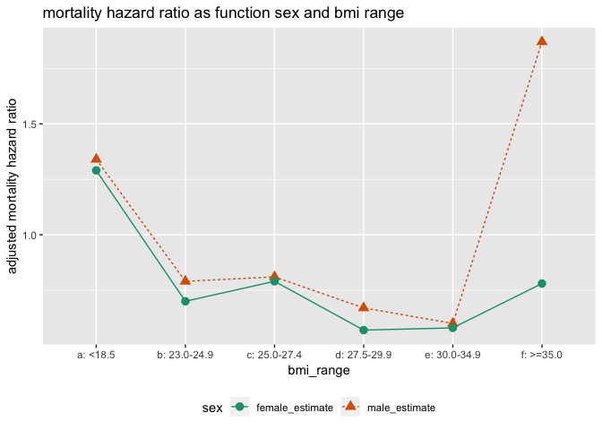

BMI
================

Results from ["Obesity and mortality among older Thais: a four year follow up study" Patama Vapattanawong, Wichai AekplakornEmail author, Uthaithip Rakchanyaban, Pramote Prasartkul and Yawarat Porapakkham; BMC Public Health, 201010:604](https://bmcpublichealth.biomedcentral.com/articles/10.1186/1471-2458-10-604) <https://doi.org/10.1186/1471-2458-10-604>.

<blockquote>
During a mean follow-up time of 3.8 years (60545.8 person-years), a total of 1575 older persons, (936 men and 639 women) had died. A U-shaped and reverse J-shaped of association between BMI and all-cause mortality were observed in men and women, respectively. However there was no significant increased risk in the higher BMI categories. Compared to those with BMI 18.5-22.9 kg/m2, the adjusted hazard ratios (HR) of all-cause mortality for those with BMI &lt;18.5, 23.0-24.9, 25.0-27.4, 27.5-29.9, 30.0-34.9, and ≥35.0 were 1.34 (95% CI, 1.14-1.58), 0.79 (95% CI, 0.65-0.97), 0.81 (95% CI, 0.65-1.00), 0.67 (95% CI, 0.48-0.94), 0.60 (95% CI, 0.35-1.03), and 1.87 (95% CI, 0.77-4.56), respectively, for men, and were 1.29 (95% CI,1.04-1.60), 0.70 (95% CI, 0.55-0.90), 0.79 (95% CI, 0.62-1.01), 0.57 (95% CI, 0.41-0.81), 0.58 (95% CI, 0.39-0.87), and 0.78 (95% CI, 0.38-1.59), respectively, for women.
</blockquote>
``` r
# data prep no reason to show this
library("cdata")

knitr::opts_chunk$set(echo = TRUE)

bmi_data <- data.frame(
  bmi_range = c(
    "a: <18.5", "b: 23.0-24.9", "c: 25.0-27.4", "d: 27.5-29.9", "e: 30.0-34.9", "f: >=35.0"),
  male_estimate = c(1.34 , 0.79 , 0.81 , 0.67 , 0.60 , 1.87 ),
  female_estimate = c(1.29 , 0.70, 0.79 , 0.57 , 0.58 ,0.78 ),
  stringsAsFactors = FALSE)

bmi_data <- unpivot_to_blocks(bmi_data, 
                              nameForNewKeyColumn = "sex",
                              nameForNewValueColumn = "mortality_rate",
                              columnsToTakeFrom = qc(male_estimate, female_estimate))
                                    
saveRDS(bmi_data, "bmi_data.RDS")
```

``` r
library("ggplot2")

bmi_data <- readRDS("bmi_data.RDS")
bmi_data$bmi_range <- factor(bmi_data$bmi_range, levels = sort(unique(bmi_data$bmi_range)))

ggplot(data = bmi_data, aes(x = bmi_range, y = mortality_rate, 
                            color = sex, group = sex, 
                            linetype = sex, shape = sex)) + 
  geom_line() + 
  geom_point(size = 3) + 
  facet_wrap(~sex, ncol = 1, scale = 'free_y') +
  ylab("adjusted mortality hazard ratio") + 
  ggtitle("mortality hazard ratio as function sex and bmi range") +
  theme(legend.position = "bottom") +
  scale_color_brewer(palette = "Dark2")
```


``` r
ggplot(data = bmi_data, aes(x = bmi_range, y = mortality_rate, 
                            color = sex, group = sex, 
                            linetype = sex, shape = sex)) + 
  geom_line() + 
  geom_point(size = 3) + 
  ylab("adjusted mortality hazard ratio") + 
  ggtitle("mortality hazard ratio as function sex and bmi range") +
  theme(legend.position = "bottom") +
  scale_color_brewer(palette = "Dark2")
```


