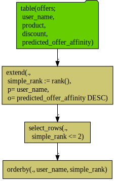

BestOffers
================

[This note](https://github.com/WinVector/PDSwR2/blob/master/BestOffers/BestOffers.md) will work an example an example using a [relational](https://en.wikipedia.org/wiki/Relational_database) or [Codd-style](https://en.wikipedia.org/wiki/Relational_model) of data manipulation.

Our example scenario is: find the best two product offers for each of our customers.

If we were working in [R](https://www.r-project.org) in memory, we would use [`data.table`](https://CRAN.R-project.org/package=data.table) to solve the problem. However if our data is in a remote database, and we don't want to copy it over to R, we would want to use [SQL](https://en.wikipedia.org/wiki/SQL) queries. Or even better a SQL query generator, which is what we will demonstrate here.

First we connect to a simple in-memory database, but the techniques shown would work on large databases such as Postgres.

``` r
library("rquery")
```

    ## Warning: package 'rquery' was built under R version 3.5.2

``` r
# Use DBI to connect to a database
# In this case it creates a new in-memory MonetDBLite
raw_connection <- DBI::dbConnect(MonetDBLite::MonetDBLite())

# build an rquery wrapper of the connection
dbopts <- rq_connection_tests(raw_connection)
db <- rquery_db_info(
  connection = raw_connection,
  is_dbi = TRUE,
  connection_options = dbopts)
```

Now we set up our example data. In real applications the data is usually already in the database, which is why you go connect to the database.

``` r
# copy example data into the database
data_handle <- rq_copy_to(
  db, 
  'offers',
  wrapr::build_frame(
   "user_name"  , "product"                       , "discount", "predicted_offer_affinity" |
     "John"     , "Pandemic Board Game"           , 0.1       , 0.8596                     |
     "Nina"     , "Pandemic Board Game"           , 0.2       , 0.1336                     |
     "John"     , "Dell XPS Laptop"               , 0.1       , 0.2402                     |
     "Nina"     , "Dell XPS Laptop"               , 0.05      , 0.3179                     |
     "John"     , "Čapek's Tales from Two Pockets", 0.05      , 0.2439                     |
     "Nina"     , "Čapek's Tales from Two Pockets", 0.05      , 0.06909                    |
     "John"     , "Pelikan M200 Fountain Pen"     , 0.2       , 0.6706                     |
     "Nina"     , "Pelikan M200 Fountain Pen"     , 0.1       , 0.616                      ),
  temporary = TRUE, 
  overwrite = TRUE)
```

Now we take a look at the data handle and the remote data. Remote data is often quite large, so we take care to only look at a prefix (which may not be a representative sample).

``` r
cat(format(data_handle))
```

    ## table("offers"; 
    ##   user_name,
    ##   product,
    ##   discount,
    ##   predicted_offer_affinity)

``` r
# take a look at the head of the data
execute(db, data_handle, source_limit = 6) %.>%
  knitr::kable(.)
```

| user\_name | product                        |  discount|  predicted\_offer\_affinity|
|:-----------|:-------------------------------|---------:|---------------------------:|
| John       | Pandemic Board Game            |      0.10|                     0.85960|
| Nina       | Pandemic Board Game            |      0.20|                     0.13360|
| John       | Dell XPS Laptop                |      0.10|                     0.24020|
| Nina       | Dell XPS Laptop                |      0.05|                     0.31790|
| John       | Čapek's Tales from Two Pockets |      0.05|                     0.24390|
| Nina       | Čapek's Tales from Two Pockets |      0.05|                     0.06909|

``` r
# take a look at remote structure
rquery::rstr(db, data_handle$table_name)
```

    ## table "offers" rquery_db_info 
    ##  nrow: 8 
    ## 'data.frame':    8 obs. of  4 variables:
    ##  $ user_name               : chr  "John" "Nina" "John" "Nina" ...
    ##  $ product                 : chr  "Pandemic Board Game" "Pandemic Board Game" "Dell XPS Laptop" "Dell XPS Laptop" ...
    ##  $ discount                : num  0.1 0.2 0.1 0.05 0.05 0.05 0.2 0.1
    ##  $ predicted_offer_affinity: num  0.86 0.134 0.24 0.318 0.244 ...

``` r
# get a remote summary
rquery::rsummary(db, data_handle$table_name)
```

    ##                     column index     class nrows nna nunique     min
    ## 1                user_name     1 character     8   0       2      NA
    ## 2                  product     2 character     8   0       4      NA
    ## 3                 discount     3   numeric     8   0      NA 0.05000
    ## 4 predicted_offer_affinity     4   numeric     8   0      NA 0.06909
    ##      max      mean         sd          lexmin
    ## 1     NA        NA         NA            John
    ## 2     NA        NA         NA Dell XPS Laptop
    ## 3 0.2000 0.1062500 0.06232117            <NA>
    ## 4 0.8596 0.3938612 0.28483707            <NA>
    ##                           lexmax
    ## 1                           Nina
    ## 2 Čapek's Tales from Two Pockets
    ## 3                           <NA>
    ## 4                           <NA>

Since we know the data is in fact small, let's take a look at the whole thing.

``` r
DBI::dbReadTable(db$connection, data_handle$table_name) %.>%
  knitr::kable(.)
```

| user\_name | product                        |  discount|  predicted\_offer\_affinity|
|:-----------|:-------------------------------|---------:|---------------------------:|
| John       | Pandemic Board Game            |      0.10|                     0.85960|
| Nina       | Pandemic Board Game            |      0.20|                     0.13360|
| John       | Dell XPS Laptop                |      0.10|                     0.24020|
| Nina       | Dell XPS Laptop                |      0.05|                     0.31790|
| John       | Čapek's Tales from Two Pockets |      0.05|                     0.24390|
| Nina       | Čapek's Tales from Two Pockets |      0.05|                     0.06909|
| John       | Pelikan M200 Fountain Pen      |      0.20|                     0.67060|
| Nina       | Pelikan M200 Fountain Pen      |      0.10|                     0.61600|

We are assuming we have a database table as above, with product offers which are triplets of who the product is being offered to, the product, and the price-discount. For each of these triplets we have the predicted offer affinity, which is the modeled probability of the offer being interesting to the subject. Likely the varying discount was also generated using a model of the affinity of each subject to each product.

Now let's solve the problem of finding the two best offers for each user using database relational or Codd-style operators.

The core of the work is done by what is called a "window function": `rank()`.

``` r
data_handle %.>%
  extend(.,
         simple_rank = rank(),
         partitionby = "user_name",
         orderby = "predicted_offer_affinity",
         reverse = "predicted_offer_affinity") %.>%
  execute(db, .) %.>%
  knitr::kable(.)
```

| user\_name | product                        |  discount|  predicted\_offer\_affinity|  simple\_rank|
|:-----------|:-------------------------------|---------:|---------------------------:|-------------:|
| Nina       | Pelikan M200 Fountain Pen      |      0.10|                     0.61600|             1|
| Nina       | Dell XPS Laptop                |      0.05|                     0.31790|             2|
| Nina       | Pandemic Board Game            |      0.20|                     0.13360|             3|
| Nina       | Čapek's Tales from Two Pockets |      0.05|                     0.06909|             4|
| John       | Pandemic Board Game            |      0.10|                     0.85960|             1|
| John       | Pelikan M200 Fountain Pen      |      0.20|                     0.67060|             2|
| John       | Čapek's Tales from Two Pockets |      0.05|                     0.24390|             3|
| John       | Dell XPS Laptop                |      0.10|                     0.24020|             4|

Notice how for each user the rank shows the order of the `predicted_offer_affinity`. By adding this rank column and then selecting all the rows with `simple_rank <= 2` we can solve our problem and get the top 2 offers for each user. The solution involves known which relational operators to use (`extend()` to add columns, `select_rows()` to pick rows, and `orderby()` to sort rows, the list of common operator can be found [here](https://github.com/WinVector/rquery)) and how to combine them into a solution (something one learns after a time, we suggest Celko, Joe. <emphasis>SQL for Smarties, Fourth Edition</emphasis>. Morgan Kauffman, 2011 for an excellent study of thinking relationally).

``` r
# define our sequence of operations 
ops <- data_handle %.>%
  # mark each row with its simple per-user rank
  extend(.,
         simple_rank = rank(),
         partitionby = "user_name",
         orderby = "predicted_offer_affinity",
         reverse = "predicted_offer_affinity") %.>%
  # select the two rows with highest rank for each user
  select_rows(.,
              simple_rank <= 2) %.>%
  # order the rows by user and product rank
  orderby(., c("user_name", "simple_rank"))


# run the result in the database,
# instantiating a new result table.
result_table <- materialize(db, ops)

# copy the data from the database to R
# and print it.
DBI::dbReadTable(db$connection, result_table$table_name) %.>%
  knitr::kable(.)
```

| user\_name | product                   |  discount|  predicted\_offer\_affinity|  simple\_rank|
|:-----------|:--------------------------|---------:|---------------------------:|-------------:|
| John       | Pandemic Board Game       |      0.10|                      0.8596|             1|
| John       | Pelikan M200 Fountain Pen |      0.20|                      0.6706|             2|
| Nina       | Pelikan M200 Fountain Pen |      0.10|                      0.6160|             1|
| Nina       | Dell XPS Laptop           |      0.05|                      0.3179|             2|

In addition to using the execution plan, we can save it, print it, and even share it as a diagram.

``` r
# print out the solution plan
cat(format(ops))
```

    ## table("offers"; 
    ##   user_name,
    ##   product,
    ##   discount,
    ##   predicted_offer_affinity) %.>%
    ##  extend(.,
    ##   simple_rank := rank(),
    ##   p= user_name,
    ##   o= "predicted_offer_affinity" DESC) %.>%
    ##  select_rows(.,
    ##    simple_rank <= 2) %.>%
    ##  orderby(., user_name, simple_rank)

``` r
# diagram of the query plan
ops %.>%
  op_diagram(.) %.>% 
  DiagrammeR::grViz(.) %.>%
  DiagrammeRsvg::export_svg(.) %.>%
  write(., file="MonetDBLite_diagram.svg")
```



And we can show the SQL that is actually sent to the database.

``` r
ops %.>% 
  to_sql(., db) %.>% 
  cat(.)
```

    ## SELECT * FROM (
    ##  SELECT * FROM (
    ##   SELECT
    ##    "user_name",
    ##    "product",
    ##    "discount",
    ##    "predicted_offer_affinity",
    ##    rank ( ) OVER (  PARTITION BY "user_name" ORDER BY "predicted_offer_affinity" DESC ) AS "simple_rank"
    ##   FROM (
    ##    SELECT
    ##     "user_name",
    ##     "product",
    ##     "discount",
    ##     "predicted_offer_affinity"
    ##    FROM
    ##     "offers"
    ##    ) tsql_65637679513721707606_0000000000
    ##  ) tsql_65637679513721707606_0000000001
    ##  WHERE "simple_rank" <= 2
    ## ) tsql_65637679513721707606_0000000002 ORDER BY "user_name", "simple_rank"

The SQL is long, and sequencing or composition is expressed by inner nesting (so hard for humans to read or to create).

And we have documentation of what columns and tables are used, and what columns are produced.

``` r
# columns produced
colnames(ops)
```

    ## [1] "user_name"                "product"                 
    ## [3] "discount"                 "predicted_offer_affinity"
    ## [5] "simple_rank"

``` r
# tables and columns needed
columns_used(ops)
```

    ## $offers
    ## [1] "user_name"                "product"                 
    ## [3] "discount"                 "predicted_offer_affinity"

This task can also be done by [`dbplyr`](https://CRAN.R-project.org/package=dbplyr), but we feel [`rquery`](https://CRAN.R-project.org/package=rquery) provides a very complete and flexible solution.

And with the `rqdatatable` package the same operations can be performed in R in memory (using `data.table`!). This allows one to rehearse remote operations in memory, and tends to be quite fast (faster than base R and faster than `dplyr`) due to `data.table` (but not as fast as `data.table` itself due to some translation overhead).

``` r
library("rqdatatable") # register rqdatatable as an executor

local_data <- DBI::dbReadTable(db$connection, data_handle$table_name)

knitr::kable(local_data)
```

| user\_name | product                        |  discount|  predicted\_offer\_affinity|
|:-----------|:-------------------------------|---------:|---------------------------:|
| John       | Pandemic Board Game            |      0.10|                     0.85960|
| Nina       | Pandemic Board Game            |      0.20|                     0.13360|
| John       | Dell XPS Laptop                |      0.10|                     0.24020|
| Nina       | Dell XPS Laptop                |      0.05|                     0.31790|
| John       | Čapek's Tales from Two Pockets |      0.05|                     0.24390|
| Nina       | Čapek's Tales from Two Pockets |      0.05|                     0.06909|
| John       | Pelikan M200 Fountain Pen      |      0.20|                     0.67060|
| Nina       | Pelikan M200 Fountain Pen      |      0.10|                     0.61600|

``` r
# run on local data
local_data %.>% 
  ops %.>%
  knitr::kable(.)
```

| user\_name | product                   |  discount|  predicted\_offer\_affinity|  simple\_rank|
|:-----------|:--------------------------|---------:|---------------------------:|-------------:|
| John       | Pandemic Board Game       |      0.10|                      0.8596|             1|
| John       | Pelikan M200 Fountain Pen |      0.20|                      0.6706|             2|
| Nina       | Pelikan M200 Fountain Pen |      0.10|                      0.6160|             1|
| Nina       | Dell XPS Laptop           |      0.05|                      0.3179|             2|

We also have a number of examples of using `rquery` with different databases [here](https://github.com/WinVector/rquery/tree/master/db_examples). `rquery` data handles or table representations and operation representations deliberately do not hold a reference to the database, this makes them very easy to re-use (as we just did here).

`R` also has a package called [`sqldf`](https://CRAN.R-project.org/package=sqldf) that allows the execution of `SQL` on `R` `data.frames` (by copying them to a database). This can allow more powerful relation queries than `dbplyr` or `rquery` allow (as we get fully general joins) and can in fact be faster that using `R` or local (not-database) `dplyr` for complex queries (as the faster database execution time eventually pays back for the transfer time). (One note in using `sqldf`, be sure to set `options(gsubfn.engine = "R")` to prevent `sqldf` needlessly triggering the `X11` window server). Note: for sheer in-memory speed (and expressiveness of notation) `data.table` tends to be, by far, the winner.

``` r
DBI::dbDisconnect(raw_connection)
rm(list = c("raw_connection", "db"))
```
