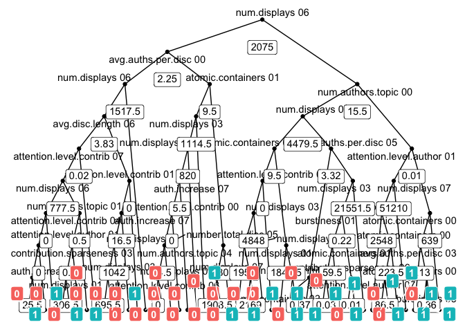

model\_export
================

First attach the `randomForest` package and load the model and test data.

``` r
suppressPackageStartupMessages(library("randomForest"))

lst <- readRDS("thRS500.RDS")
varslist <- lst$varslist
fmodel <- lst$fmodel
buzztest <- lst$buzztest
rm(list = "lst")
```

Now covert the model to `SQL`.

``` r
sql <- tidypredict::tidypredict_sql(
  fmodel,
  dbplyr::simulate_mssql())

length(sql)
```

    ## [1] 500

``` r
substr(sql[[1]], 1, 500)
```

    ## <SQL> CASE
    ## WHEN (`num.displays_06` >= 1517.5 AND `avg.auths.per.disc_00` < 2.25 AND `num.displays_06` < 2075.0) THEN ('0')
    ## WHEN (`num.displays_03` >= 1114.5 AND `atomic.containers_01` < 9.5 AND `avg.auths.per.disc_00` >= 2.25 AND `num.displays_06` < 2075.0) THEN ('0')
    ## WHEN (`num.authors.topic_04` >= 30.0 AND `atomic.containers_01` >= 9.5 AND `avg.auths.per.disc_00` >= 2.25 AND `num.displays_06` < 2075.0) THEN ('1')
    ## WHEN (`num.displays_07` >= 51210.0 AND `attention.level.author_01` < 0.0136155 AND `num

``` r
substr(sql[[2]], 1, 200)
```

    ## <SQL> CASE
    ## WHEN (`number.total.disc_07` >= 3.5 AND `attention.level.author_00` < 0.0004155 AND `num.displays_06` < 2110.5) THEN ('0')
    ## WHEN (`attention.level.author_04` < 0.0035865 AND `attention.level.autho

``` r
# From: https://shiring.github.io/machine_learning/2017/03/16/rf_plot_ggraph

library(dplyr)
```

    ## Warning: package 'dplyr' was built under R version 3.5.2

    ## 
    ## Attaching package: 'dplyr'

    ## The following object is masked from 'package:randomForest':
    ## 
    ##     combine

    ## The following objects are masked from 'package:stats':
    ## 
    ##     filter, lag

    ## The following objects are masked from 'package:base':
    ## 
    ##     intersect, setdiff, setequal, union

``` r
library(ggraph)
```

    ## Loading required package: ggplot2

    ## Warning: package 'ggplot2' was built under R version 3.5.2

    ## 
    ## Attaching package: 'ggplot2'

    ## The following object is masked from 'package:randomForest':
    ## 
    ##     margin

``` r
library(igraph)
```

    ## Warning: package 'igraph' was built under R version 3.5.2

    ## 
    ## Attaching package: 'igraph'

    ## The following objects are masked from 'package:dplyr':
    ## 
    ##     as_data_frame, groups, union

    ## The following objects are masked from 'package:stats':
    ## 
    ##     decompose, spectrum

    ## The following object is masked from 'package:base':
    ## 
    ##     union

``` r
tree_func <- function(final_model, 
                      tree_num) {
  
  # get tree by index
  tree <- randomForest::getTree(final_model, 
                                k = tree_num, 
                                labelVar = TRUE) %>%
    tibble::rownames_to_column() %>%
    # make leaf split points to NA, so the 0s won't get plotted
    mutate(`split point` = ifelse(is.na(prediction), `split point`, NA))
  
  # prepare data frame for graph
  graph_frame <- data.frame(from = rep(tree$rowname, 2),
                            to = c(tree$`left daughter`, tree$`right daughter`))
  
  # convert to graph and delete the last node that we don't want to plot
  graph <- graph_from_data_frame(graph_frame) %>%
    delete_vertices("0")
  
  # set node labels
  V(graph)$node_label <- gsub("_", " ", as.character(tree$`split var`))
  V(graph)$leaf_label <- as.character(tree$prediction)
  V(graph)$split <- as.character(round(tree$`split point`, digits = 2))
  
  # plot
  plot <- ggraph(graph, 'dendrogram') + 
    theme_bw() +
    geom_edge_link() +
    geom_node_point() +
    geom_node_text(aes(label = node_label), na.rm = TRUE, repel = TRUE) +
    geom_node_label(aes(label = split), vjust = 2.5, na.rm = TRUE, fill = "white") +
    geom_node_label(aes(label = leaf_label, fill = leaf_label), na.rm = TRUE, 
                    repel = TRUE, colour = "white", fontface = "bold", show.legend = FALSE) +
    theme(panel.grid.minor = element_blank(),
          panel.grid.major = element_blank(),
          panel.background = element_blank(),
          plot.background = element_rect(fill = "white"),
          panel.border = element_blank(),
          axis.line = element_blank(),
          axis.text.x = element_blank(),
          axis.text.y = element_blank(),
          axis.ticks = element_blank(),
          axis.title.x = element_blank(),
          axis.title.y = element_blank(),
          plot.title = element_text(size = 18))
  
  print(plot)
}
```

``` r
tree_func(fmodel, 1)
```

    ## Warning: Duplicated aesthetics after name standardisation: na.rm

    ## Warning: Duplicated aesthetics after name standardisation: na.rm

    ## Warning: Duplicated aesthetics after name standardisation: na.rm

    ## Warning: Removed 50 rows containing missing values (geom_text_repel).

    ## Warning: Removed 50 rows containing missing values (geom_label).

    ## Warning: Removed 49 rows containing missing values (geom_label_repel).


