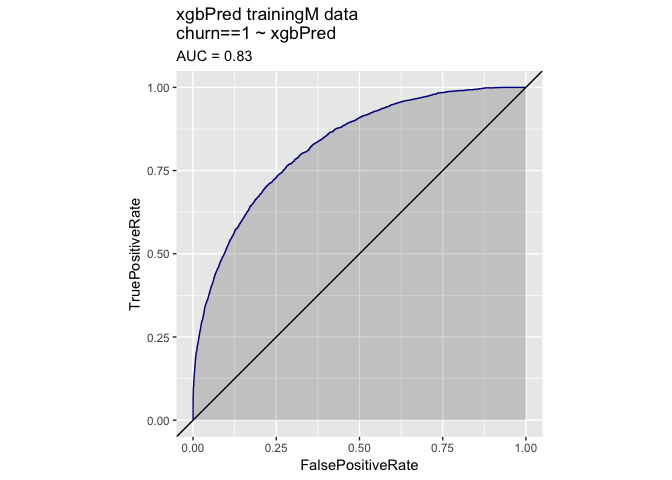
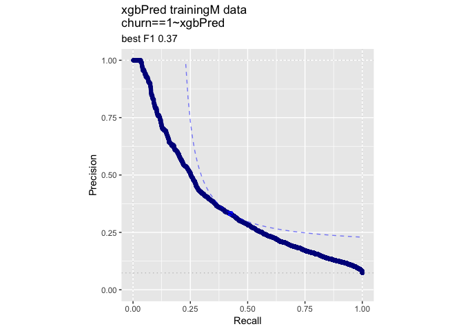
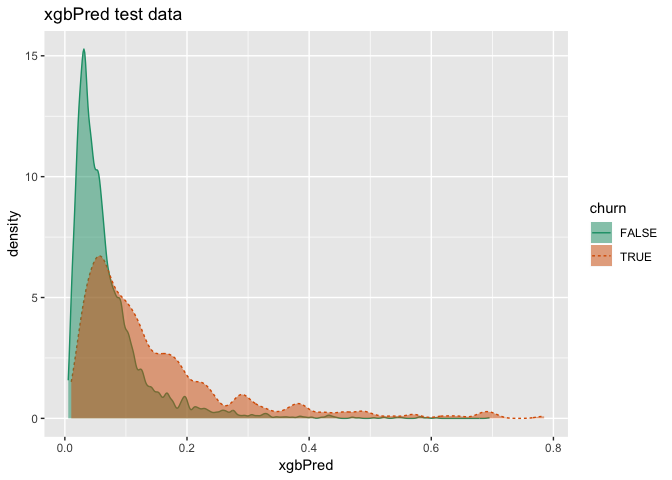
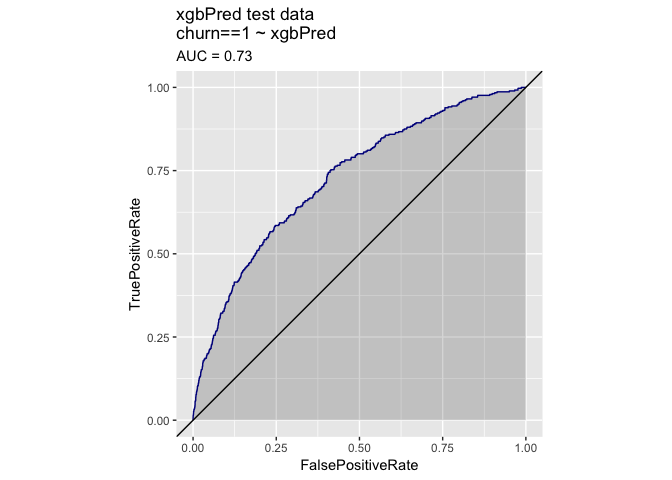
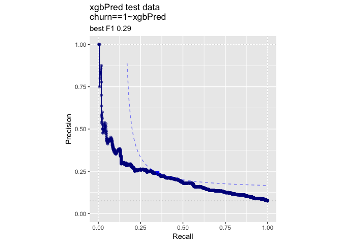

KDD2009vtreat
================
John Mount

KDD2009 example using the `vtreat` `R` package.

``` r
date()
```

    ## [1] "Sat Apr 13 17:26:47 2019"

``` r
#load some libraries
library('vtreat')
library('WVPlots') 
library('sigr')
library('parallel')
library('xgboost')


# generated/code/CodeExamples/c08_Advanced_Data_Preparation/00327_example_8.1_of_section_8.2.1.R 
# example 8.1 of section 8.2.1 
# (example 8.1 of section 8.2.1)  : Advanced Data Preparation : KDD and KDD Cup 2009 : Getting started with KDD Cup 2009 data 
# Title: Preparing the KDD data for analysis 

d <- read.table('orange_small_train.data.gz',   # Note: 1 
   header = TRUE,
   sep = '\t',
   na.strings = c('NA', ''))    # Note: 2 
                                                
churn <- read.table('orange_small_train_churn.labels.txt',
   header = FALSE, sep = '\t')  # Note: 3 
d$churn <- churn$V1     # Note: 4 

set.seed(729375)    # Note: 5 
rgroup <- base::sample(c('train', 'test'),  # Note: 6 
   nrow(d), 
   prob = c(0.9, 0.1),
   replace = TRUE)
dTrain <- d[rgroup=='train', , drop = FALSE]
dTest <- d[rgroup == 'test', , drop = FALSE]
                                                
outcome <- 'churn' 
vars <- setdiff(colnames(dTrain), outcome)

                                                
rm(list=c('d', 'churn', 'rgroup'))  # Note: 9

# Note 1: 
#   Read the file of independent variables. All 
#   data from 
#   https://github.com/WinVector/PDSwR2/tree/master/KDD2009. 

# Note 2: 
#   Treat both NA and the empty string as missing 
#   data. 

# Note 3: 
#   Read churn dependent variable. 

# Note 4: 
#   Add churn as a new column. 

# Note 5: 
#   By setting the seed to the pseudo-random 
#   number generator, we make our work reproducible: 
#   someone redoing it will see the exact same 
#   results. 

# Note 6: 
#   Split data into train, calibration, and test sets. 
#   We took extra care and wrote base::sample() even if 
#   the popular dplyr package is attached, which also  
#   has a function with this name. 

# Note 9: 
#   Remove unneeded objects from workspace. 

# Note 10: 
#   Further split training data into training and 
#   calibration. 

set.seed(239525)

ncore <- parallel::detectCores()
(cl = parallel::makeCluster(ncore))
```

    ## socket cluster with 8 nodes on host 'localhost'

``` r
yName <- "churn"
yTarget <- 1

date()
```

    ## [1] "Sat Apr 13 17:26:53 2019"

``` r
date()
```

    ## [1] "Sat Apr 13 17:26:53 2019"

``` r
var_values <- vtreat::value_variables_C(dTrain,
    vars,yName,yTarget,
    smFactor=2.0, 
    parallelCluster=cl
    )


summary(var_values$sig < 1/nrow(var_values))
```

    ##    Mode   FALSE    TRUE 
    ## logical      59     153

``` r
length(vars)
```

    ## [1] 230

``` r
vars <- var_values$var[var_values$sig < 1/nrow(var_values)]
length(vars)
```

    ## [1] 153

``` r
date()
```

    ## [1] "Sat Apr 13 17:28:40 2019"

``` r
date()
```

    ## [1] "Sat Apr 13 17:28:40 2019"

``` r
# Run other models (with proper coding/training separation).
#
# This gets us back to AUC 0.74 range

customCoders = list('c.PiecewiseV.num' = vtreat::solve_piecewise,
                    'n.PiecewiseV.num' = vtreat::solve_piecewise,
                    'c.knearest.num' = vtreat::square_window,
                    'n.knearest.num' = vtreat::square_window)
cfe = mkCrossFrameCExperiment(dTrain,
                              vars,yName,yTarget,
                              customCoders=customCoders,
                              smFactor=2.0, 
                              parallelCluster=cl)
```

    ## [1] "vtreat 1.4.0 start initial treatment design Sat Apr 13 17:28:40 2019"
    ## [1] " start cross frame work Sat Apr 13 17:30:45 2019"
    ## [1] " vtreat::mkCrossFrameCExperiment done Sat Apr 13 17:31:48 2019"

``` r
treatmentsC = cfe$treatments
scoreFrame = treatmentsC$scoreFrame
table(scoreFrame$code)
```

    ## 
    ##       catB       catP      clean      isBAD   knearest        lev 
    ##         28         28        122        120          2        121 
    ## PiecewiseV 
    ##        118

``` r
selvars <- scoreFrame$varName
treatedTrainM <- cfe$crossFrame[,c(yName,selvars),drop=FALSE]
treatedTrainM[[yName]] = treatedTrainM[[yName]]==yTarget

treatedTest = prepare(treatmentsC,
                      dTest,
                      pruneSig=NULL, 
                      varRestriction = selvars,
                      parallelCluster=cl)
treatedTest[[yName]] = treatedTest[[yName]]==yTarget

# prepare plotting frames
treatedTrainP = treatedTrainM[, yName, drop=FALSE]
treatedTestP = treatedTest[, yName, drop=FALSE]
date()
```

    ## [1] "Sat Apr 13 17:31:48 2019"

``` r
date()
```

    ## [1] "Sat Apr 13 17:31:48 2019"

``` r
mname = 'xgbPred'
print(paste(mname,length(selvars)))
```

    ## [1] "xgbPred 539"

``` r
params <- list(max_depth = 5, 
              objective = "binary:logistic",
              nthread = ncore)
model <- xgb.cv(data = as.matrix(treatedTrainM[, selvars, drop = FALSE]),
                label = treatedTrainM[[yName]],
                nrounds = 400,
                params = params,
                nfold = 5,
                early_stopping_rounds = 10,
                eval_metric = "logloss")
```

    ## [1]  train-logloss:0.502792+0.000226 test-logloss:0.504057+0.000867 
    ## Multiple eval metrics are present. Will use test_logloss for early stopping.
    ## Will train until test_logloss hasn't improved in 10 rounds.
    ## 
    ## [2]  train-logloss:0.399595+0.000488 test-logloss:0.401994+0.001359 
    ## [3]  train-logloss:0.337456+0.000571 test-logloss:0.341207+0.001757 
    ## [4]  train-logloss:0.298337+0.000656 test-logloss:0.303398+0.002080 
    ## [5]  train-logloss:0.272956+0.000677 test-logloss:0.279112+0.002278 
    ## [6]  train-logloss:0.256373+0.000694 test-logloss:0.263927+0.002555 
    ## [7]  train-logloss:0.245287+0.000777 test-logloss:0.254327+0.002677 
    ## [8]  train-logloss:0.237529+0.000880 test-logloss:0.248296+0.002718 
    ## [9]  train-logloss:0.231967+0.000891 test-logloss:0.244110+0.002734 
    ## [10] train-logloss:0.227680+0.000893 test-logloss:0.241524+0.002771 
    ## [11] train-logloss:0.224344+0.000859 test-logloss:0.239923+0.002875 
    ## [12] train-logloss:0.221657+0.000933 test-logloss:0.238698+0.002837 
    ## [13] train-logloss:0.219178+0.000850 test-logloss:0.237760+0.002852 
    ## [14] train-logloss:0.217106+0.000938 test-logloss:0.237472+0.002791 
    ## [15] train-logloss:0.215249+0.000760 test-logloss:0.237273+0.002725 
    ## [16] train-logloss:0.213454+0.000999 test-logloss:0.237242+0.002828 
    ## [17] train-logloss:0.211690+0.000952 test-logloss:0.236920+0.002734 
    ## [18] train-logloss:0.209999+0.000965 test-logloss:0.236938+0.002481 
    ## [19] train-logloss:0.208636+0.001060 test-logloss:0.236892+0.002505 
    ## [20] train-logloss:0.207261+0.001175 test-logloss:0.236946+0.002540 
    ## [21] train-logloss:0.205853+0.001033 test-logloss:0.236887+0.002422 
    ## [22] train-logloss:0.204758+0.000970 test-logloss:0.236847+0.002501 
    ## [23] train-logloss:0.203592+0.001255 test-logloss:0.236827+0.002563 
    ## [24] train-logloss:0.202589+0.001270 test-logloss:0.236840+0.002598 
    ## [25] train-logloss:0.201475+0.001271 test-logloss:0.237002+0.002571 
    ## [26] train-logloss:0.200270+0.001653 test-logloss:0.237112+0.002539 
    ## [27] train-logloss:0.199319+0.001467 test-logloss:0.237258+0.002647 
    ## [28] train-logloss:0.198378+0.001551 test-logloss:0.237295+0.002847 
    ## [29] train-logloss:0.197118+0.001529 test-logloss:0.237555+0.002926 
    ## [30] train-logloss:0.195832+0.001674 test-logloss:0.237822+0.003019 
    ## [31] train-logloss:0.194794+0.001843 test-logloss:0.238111+0.002954 
    ## [32] train-logloss:0.193886+0.002094 test-logloss:0.238262+0.002975 
    ## [33] train-logloss:0.192749+0.002086 test-logloss:0.238376+0.002917 
    ## Stopping. Best iteration:
    ## [23] train-logloss:0.203592+0.001255 test-logloss:0.236827+0.002563

``` r
nrounds <- model$best_iteration
print(paste("nrounds", nrounds))
```

    ## [1] "nrounds 23"

``` r
model <- xgboost(data = as.matrix(treatedTrainM[, selvars, drop = FALSE]),
                 label = treatedTrainM[[yName]],
                 nrounds = nrounds,
                 params = params)
```

    ## [1]  train-error:0.072022 
    ## [2]  train-error:0.072355 
    ## [3]  train-error:0.072244 
    ## [4]  train-error:0.072266 
    ## [5]  train-error:0.072311 
    ## [6]  train-error:0.072244 
    ## [7]  train-error:0.072266 
    ## [8]  train-error:0.072422 
    ## [9]  train-error:0.072266 
    ## [10] train-error:0.072066 
    ## [11] train-error:0.071844 
    ## [12] train-error:0.071733 
    ## [13] train-error:0.071489 
    ## [14] train-error:0.071111 
    ## [15] train-error:0.070823 
    ## [16] train-error:0.070667 
    ## [17] train-error:0.070623 
    ## [18] train-error:0.070467 
    ## [19] train-error:0.070290 
    ## [20] train-error:0.070179 
    ## [21] train-error:0.070134 
    ## [22] train-error:0.069845 
    ## [23] train-error:0.069490

``` r
treatedTrainP[[mname]] = predict(
  model, 
  newdata = as.matrix(treatedTrainM[, selvars, drop = FALSE]), 
  n.trees = nTrees,
  type = 'response')
treatedTestP[[mname]] = predict(
  model,
  newdata = as.matrix(treatedTest[, selvars, drop = FALSE]), 
  n.trees = nTrees,
  type = "response")
date()
```

    ## [1] "Sat Apr 13 17:32:22 2019"

``` r
calcAUC(treatedTestP[[mname]], treatedTestP[[yName]]==yTarget)
```

    ## [1] 0.7411161

``` r
permTestAUC(treatedTestP, mname, yName, yTarget = yTarget)
```

    ## [1] "AUC test alt. hyp. AUC>AUC(permuted): (AUC=0.7411, s.d.=0.01483, p<1e-05)."

``` r
wrapChiSqTest(treatedTestP, mname, yName, yTarget = yTarget)
```

    ## [1] "Chi-Square Test summary: pseudo-R2=0.1098 (X2(1,N=4972)=279.8, p<1e-05)."

``` r
date()
```

    ## [1] "Sat Apr 13 17:32:22 2019"

``` r
t1 = paste(mname,'trainingM data')
print(DoubleDensityPlot(treatedTrainP, mname, yName, 
                        title=t1))
```


``` r
print(ROCPlot(treatedTrainP, mname, yName, yTarget,
              title=t1))
```



``` r
print(WVPlots::PRPlot(treatedTrainP, mname, yName, yTarget,
              title=t1))
```



``` r
t2 = paste(mname,'test data')
print(DoubleDensityPlot(treatedTestP, mname, yName, 
                        title=t2))
```



``` r
print(ROCPlot(treatedTestP, mname, yName, yTarget,
              title=t2))
```



``` r
print(WVPlots::PRPlot(treatedTestP, mname, yName, yTarget,
              title=t2))
```



``` r
print(date())
```

    ## [1] "Sat Apr 13 17:32:24 2019"

``` r
print("*****************************")
```

    ## [1] "*****************************"

``` r
date()
```

    ## [1] "Sat Apr 13 17:32:24 2019"

``` r
if(!is.null(cl)) {
    parallel::stopCluster(cl)
    cl = NULL
}
```
