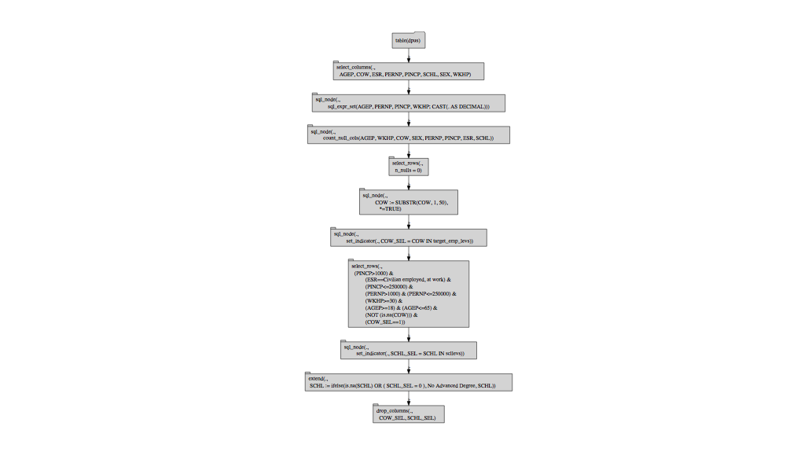

PUMS1\_rquery
================
Win-Vector LLC
4/24/2018

``` r
library("DBI")
library("rquery")
```

    ## Loading required package: wrapr

``` r
db <- dbConnect(RSQLite::SQLite(), ":memory:")  
dbWriteTable(db, "dpus", readRDS("ss16pus.RDS"))
dbWriteTable(db, "dhus", readRDS("ss16hus.RDS"))

dbGetQuery(db, "SELECT * FROM dpus LIMIT 5")    
```

    ##   RT  SERIALNO SPORDER  PUMA         ST  ADJINC AGEP              CIT
    ## 1  P 000000338      03 02701 Alabama/AL 1007588   06 Born in the U.S.
    ## 2  P 000000338      05 02701 Alabama/AL 1007588   08 Born in the U.S.
    ## 3  P 000000343      03 01400 Alabama/AL 1007588   12 Born in the U.S.
    ## 4  P 000000539      04 01400 Alabama/AL 1007588   11 Born in the U.S.
    ## 5  P 000002284      02 00600 Alabama/AL 1007588   08 Born in the U.S.
    ##   CITWP  COW DDRS DEAR DEYE DOUT DPHY DRAT DRATX DREM  ENG  FER  GCL  GCM
    ## 1  <NA> <NA>   No   No   No <NA>   No <NA>  <NA>   No <NA> <NA> <NA> <NA>
    ## 2  <NA> <NA>   No   No   No <NA>   No <NA>  <NA>   No <NA> <NA> <NA> <NA>
    ## 3  <NA> <NA>   No   No   No <NA>   No <NA>  <NA>  Yes <NA> <NA> <NA> <NA>
    ## 4  <NA> <NA>   No   No   No <NA>   No <NA>  <NA>  Yes <NA> <NA> <NA> <NA>
    ## 5  <NA> <NA>   No   No   No <NA>   No <NA>  <NA>   No <NA> <NA> <NA> <NA>
    ##    GCR HINS1 HINS2 HINS3 HINS4 HINS5 HINS6 HINS7 INTP JWMNP JWRIP JWTR
    ## 1 <NA>    No    No    No   Yes    No    No    No <NA>  <NA>  <NA> <NA>
    ## 2 <NA>    No    No    No   Yes    No    No    No <NA>  <NA>  <NA> <NA>
    ## 3 <NA>    No    No    No   Yes    No    No    No <NA>  <NA>  <NA> <NA>
    ## 4 <NA>    No    No    No   Yes    No    No    No <NA>  <NA>  <NA> <NA>
    ## 5 <NA>   Yes    No    No    No    No    No    No <NA>  <NA>  <NA> <NA>
    ##   LANP                    LANX                                 MAR MARHD
    ## 1 <NA> No, speaks only English Never married or under 15 years old  <NA>
    ## 2 <NA> No, speaks only English Never married or under 15 years old  <NA>
    ## 3 <NA> No, speaks only English Never married or under 15 years old  <NA>
    ## 4 <NA> No, speaks only English Never married or under 15 years old  <NA>
    ## 5 <NA> No, speaks only English Never married or under 15 years old  <NA>
    ##   MARHM MARHT MARHW MARHYP                         MIG  MIL MLPA MLPB
    ## 1  <NA>  <NA>  <NA>   <NA> Yes, same house (nonmovers) <NA> <NA> <NA>
    ## 2  <NA>  <NA>  <NA>   <NA> Yes, same house (nonmovers) <NA> <NA> <NA>
    ## 3  <NA>  <NA>  <NA>   <NA> Yes, same house (nonmovers) <NA> <NA> <NA>
    ## 4  <NA>  <NA>  <NA>   <NA> Yes, same house (nonmovers) <NA> <NA> <NA>
    ## 5  <NA>  <NA>  <NA>   <NA> Yes, same house (nonmovers) <NA> <NA> <NA>
    ##   MLPCD MLPE MLPFG MLPH MLPI MLPJ MLPK NWAB NWAV NWLA NWLK NWRE  OIP  PAP
    ## 1  <NA> <NA>  <NA> <NA> <NA> <NA> <NA> <NA> <NA> <NA> <NA> <NA> <NA> <NA>
    ## 2  <NA> <NA>  <NA> <NA> <NA> <NA> <NA> <NA> <NA> <NA> <NA> <NA> <NA> <NA>
    ## 3  <NA> <NA>  <NA> <NA> <NA> <NA> <NA> <NA> <NA> <NA> <NA> <NA> <NA> <NA>
    ## 4  <NA> <NA>  <NA> <NA> <NA> <NA> <NA> <NA> <NA> <NA> <NA> <NA> <NA> <NA>
    ## 5  <NA> <NA>  <NA> <NA> <NA> <NA> <NA> <NA> <NA> <NA> <NA> <NA> <NA> <NA>
    ##                         RELP RETP                                  SCH
    ## 1 Biological son or daughter <NA> Yes, public school or public college
    ## 2    Stepson or stepdaughter <NA> Yes, public school or public college
    ## 3 Biological son or daughter <NA> Yes, public school or public college
    ## 4 Biological son or daughter <NA> Yes, public school or public college
    ## 5             Other relative <NA> Yes, public school or public college
    ##      SCHG         SCHL SEMP    SEX SSIP  SSP WAGP WKHP  WKL  WKW  WRK YOEP
    ## 1 Grade 1 Kindergarten <NA> Female <NA> <NA> <NA> <NA> <NA> <NA> <NA> <NA>
    ## 2 Grade 2      Grade 1 <NA> Female <NA> <NA> <NA> <NA> <NA> <NA> <NA> <NA>
    ## 3 Grade 6      Grade 5 <NA> Female <NA> <NA> <NA> <NA> <NA> <NA> <NA> <NA>
    ## 4 Grade 4      Grade 4 <NA>   Male <NA> <NA> <NA> <NA> <NA> <NA> <NA> <NA>
    ## 5 Grade 1 Kindergarten <NA>   Male <NA> <NA> <NA> <NA> <NA> <NA> <NA> <NA>
    ##            ANC            ANC1P        ANC2P DECADE                  DIS
    ## 1       Single African American Not reported   <NA> Without a disability
    ## 2       Single African American Not reported   <NA> Without a disability
    ## 3     Multiple African American        Irish   <NA>    With a disability
    ## 4 Not reported     Not reported Not reported   <NA>    With a disability
    ## 5 Not reported     Not reported Not reported   <NA> Without a disability
    ##   DRIVESP                         ESP  ESR FHICOVP FOD1P FOD2P
    ## 1    <NA> Both parents in labor force <NA>      No  <NA>  <NA>
    ## 2    <NA> Both parents in labor force <NA>      No  <NA>  <NA>
    ## 3    <NA>   Mother in the labor force <NA>      No  <NA>  <NA>
    ## 4    <NA> Both parents in labor force <NA>      No  <NA>  <NA>
    ## 5    <NA>                        <NA> <NA>     Yes  <NA>  <NA>
    ##                            HICOV                        HISP INDP JWAP
    ## 1 With health insurance coverage Not Spanish/Hispanic/Latino <NA> <NA>
    ## 2 With health insurance coverage Not Spanish/Hispanic/Latino <NA> <NA>
    ## 3 With health insurance coverage Not Spanish/Hispanic/Latino <NA> <NA>
    ## 4 With health insurance coverage Not Spanish/Hispanic/Latino <NA> <NA>
    ## 5 With health insurance coverage Not Spanish/Hispanic/Latino <NA> <NA>
    ##   JWDP MIGPUMA MIGSP  MSP NAICSP NATIVITY
    ## 1 <NA>    <NA>  <NA> <NA>   <NA>   Native
    ## 2 <NA>    <NA>  <NA> <NA>   <NA>   Native
    ## 3 <NA>    <NA>  <NA> <NA>   <NA>   Native
    ## 4 <NA>    <NA>  <NA> <NA>   <NA>   Native
    ## 5 <NA>    <NA>  <NA> <NA>   <NA>   Native
    ##                                            NOP               OC OCCP PAOC
    ## 1 Living with two parents: Both parents NATIVE              Yes <NA> <NA>
    ## 2 Living with two parents: Both parents NATIVE              Yes <NA> <NA>
    ## 3       Living with mother only: Mother NATIVE              Yes <NA> <NA>
    ## 4 Living with two parents: Both parents NATIVE              Yes <NA> <NA>
    ## 5                                         <NA> No (includes GQ) <NA> <NA>
    ##   PERNP PINCP       POBP POVPIP POWPUMA POWSP
    ## 1  <NA>  <NA> Alabama/AL    158    <NA>  <NA>
    ## 2  <NA>  <NA> Alabama/AL    158    <NA>  <NA>
    ## 3  <NA>  <NA> Alabama/AL    072    <NA>  <NA>
    ## 4  <NA>  <NA> Alabama/AL    003    <NA>  <NA>
    ## 5  <NA>  <NA> Alabama/AL    079    <NA>  <NA>
    ##                                     PRIVCOV                         PUBCOV
    ## 1 Without private health insurance coverage    With public health coverage
    ## 2 Without private health insurance coverage    With public health coverage
    ## 3 Without private health insurance coverage    With public health coverage
    ## 4 Without private health insurance coverage    With public health coverage
    ## 5    With private health insurance coverage Without public health coverage
    ##                  QTRBIR                           RAC1P
    ## 1    April through June Black or African American alone
    ## 2 January through March Black or African American alone
    ## 3    April through June               Two or More Races
    ## 4 January through March                     White alone
    ## 5    April through June                     White alone
    ##                             RAC2P                            RAC3P RACAIAN
    ## 1 Black or African American alone  Black or African American alone      No
    ## 2 Black or African American alone  Black or African American alone      No
    ## 3               Two or More Races White; Black or African American      No
    ## 4                     White alone                      White alone      No
    ## 5                     White alone                      White alone      No
    ##   RACASN RACBLK RACNH RACNUM RACPI RACSOR RACWHT  RC SCIENGP SCIENGRLP
    ## 1     No    Yes    No      1    No     No     No Yes    <NA>      <NA>
    ## 2     No    Yes    No      1    No     No     No Yes    <NA>      <NA>
    ## 3     No    Yes    No      2    No     No    Yes Yes    <NA>      <NA>
    ## 4     No     No    No      1    No     No    Yes Yes    <NA>      <NA>
    ## 5     No     No    No      1    No     No    Yes Yes    <NA>      <NA>
    ##    SFN  SFR SOCP  VPS                     WAOB FAGEP FANCP FCITP FCITWP
    ## 1 <NA> <NA> <NA> <NA> US state (POB = 001-059)    No    No    No     No
    ## 2 <NA> <NA> <NA> <NA> US state (POB = 001-059)    No    No    No     No
    ## 3 <NA> <NA> <NA> <NA> US state (POB = 001-059)    No    No    No     No
    ## 4 <NA> <NA> <NA> <NA> US state (POB = 001-059)    No    No    No     No
    ## 5 <NA> <NA> <NA> <NA> US state (POB = 001-059)    No    No    No     No
    ##   FCOWP FDDRSP FDEARP FDEYEP FDISP FDOUTP FDPHYP FDRATP FDRATXP FDREMP
    ## 1    No     No     No     No    No     No     No     No      No     No
    ## 2    No     No     No     No    No     No     No     No      No     No
    ## 3    No     No     No     No    No     No     No     No      No     No
    ## 4    No     No     No     No    No     No     No     No      No     No
    ## 5    No    Yes    Yes    Yes   Yes     No    Yes     No      No    Yes
    ##   FENGP FESRP FFERP FFODP FGCLP FGCMP FGCRP FHINS1P FHINS2P FHINS3C
    ## 1    No    No    No    No    No    No    No      No      No    <NA>
    ## 2    No    No    No    No    No    No    No      No      No    <NA>
    ## 3    No    No    No    No    No    No    No      No      No    <NA>
    ## 4    No    No    No    No    No    No    No      No      No    <NA>
    ## 5    No    No    No    No    No    No    No     Yes     Yes    <NA>
    ##   FHINS3P FHINS4C FHINS4P FHINS5C FHINS5P FHINS6P FHINS7P FHISP FINDP
    ## 1      No      No      No    <NA>      No      No      No    No    No
    ## 2      No      No      No    <NA>      No      No      No    No    No
    ## 3      No      No      No    <NA>      No      No      No    No    No
    ## 4      No      No      No    <NA>      No      No      No    No    No
    ## 5     Yes    <NA>     Yes    <NA>     Yes     Yes     Yes    No    No
    ##   FINTP FJWDP FJWMNP FJWRIP FJWTRP FLANP FLANXP FMARHDP FMARHMP FMARHTP
    ## 1    No    No     No     No     No    No     No      No      No      No
    ## 2    No    No     No     No     No    No     No      No      No      No
    ## 3    No    No     No     No     No    No     No      No      No      No
    ## 4    No    No     No     No     No    No     No      No      No      No
    ## 5    No    No     No     No     No    No     No      No      No      No
    ##   FMARHWP FMARHYP FMARP FMIGP FMIGSP FMILPP FMILSP FOCCP FOIP FPAP FPERNP
    ## 1      No      No    No    No     No     No     No    No   No   No     No
    ## 2      No      No    No    No     No     No     No    No   No   No     No
    ## 3      No      No    No    No     No     No     No    No   No   No     No
    ## 4      No      No    No    No     No     No     No    No   No   No     No
    ## 5      No      No    No    No     No     No     No    No   No   No     No
    ##   FPINCP FPOBP FPOWSP FPRIVCOVP FPUBCOVP FRACP FRELP FRETP FSCHGP FSCHLP
    ## 1     No    No     No        No       No    No    No    No     No     No
    ## 2     No    No     No        No       No    No    No    No     No     No
    ## 3     No    No     No        No       No    No    No    No     No     No
    ## 4     No    No     No        No       No    No    No    No     No     No
    ## 5     No    No     No       Yes      Yes    No    No    No     No     No
    ##   FSCHP FSEMP FSEXP FSSIP FSSP FWAGP FWKHP FWKLP FWKWP FWRKP FYOEP
    ## 1    No    No    No    No   No    No    No    No    No    No    No
    ## 2    No    No    No    No   No    No    No    No    No    No    No
    ## 3    No    No    No    No   No    No    No    No    No    No    No
    ## 4    No    No    No    No   No    No    No    No    No    No    No
    ## 5    No    No    No    No   No    No    No    No    No    No    No

``` r
dpus <- dbi_table(db, "dpus") 
dhus <- dbi_table(db, "dhus")

# cdata::qlook(db, dpus$table_name)

# view(rsummary(db, dpus$table_name))   


target_emp_levs <- c(
  "Employee of a private for-profit company or busine",
  "Employee of a private not-for-profit, tax-exempt, ",
  "Federal government employee",                    
  "Local government employee (city, county, etc.)",   
  "Self-employed in own incorporated business, profes",
  "Self-employed in own not incorporated business, pr",
  "State government employee")

scllevs <- c(
  "Associate's degree",
  "Bachelor's degree",
  "Doctorate degree",
  "Master's degree",
  "Professional degree beyond a bachelor's degree")

optree <- dpus %.>%
  select_columns(., qc(AGEP, COW, ESR,  PERNP, 
                       PINCP, SCHL, SEX, WKHP)) %.>%
  sql_expr_set(., qc(AGEP, PERNP, PINCP, WKHP),
            "CAST(. AS DECIMAL)") %.>%
  count_null_cols(., NULL, "n_nulls") %.>%
  select_rows_nse(., n_nulls==0) %.>%
  sql_node(., "COW" := "SUBSTR(COW, 1, 50)") %.>%
  set_indicator(., "COW_SEL", "COW", target_emp_levs) %.>%
  select_rows_se(., "(PINCP>1000) & 
           (ESR==\"Civilian employed, at work\") & 
           (PINCP<=250000) & 
           (PERNP>1000) & (PERNP<=250000) & 
           (WKHP>=30) & 
           (AGEP>=18) & (AGEP<=65) & 
           (NOT (is.na(COW))) &
           (COW_SEL==1)") %.>%
  set_indicator(., "SCHL_SEL", "SCHL", scllevs) %.>%
  extend_se(., "SCHL" := "ifelse(is.na(SCHL) | (SCHL_SEL==0), \"No Advanced Degree\", SCHL)") %.>%
  drop_columns(., qc(COW_SEL, SCHL_SEL))

cat(format(optree))
```

    ## table('dpus') %.>%
    ##  select_columns(.,
    ##    AGEP, COW, ESR, PERNP, PINCP, SCHL, SEX, WKHP) %.>%
    ##  sql_node(.,
    ##           sql_expr_set(AGEP, PERNP, PINCP, WKHP; CAST(. AS DECIMAL))) %.>%
    ##  sql_node(.,
    ##           count_null_cols(AGEP, WKHP, COW, SEX, PERNP, PINCP, ESR, SCHL)) %.>%
    ##  select_rows(.,
    ##    n_nulls = 0) %.>%
    ##  sql_node(.,
    ##           COW := SUBSTR(COW, 1, 50),
    ##              *=TRUE) %.>%
    ##  sql_node(.,
    ##           set_indicator(., COW_SEL = COW IN target_emp_levs)) %.>%
    ##  select_rows(.,
    ##    (PINCP>1000) & 
    ##            (ESR=="Civilian employed, at work") & 
    ##            (PINCP<=250000) & 
    ##            (PERNP>1000) & (PERNP<=250000) & 
    ##            (WKHP>=30) & 
    ##            (AGEP>=18) & (AGEP<=65) & 
    ##            (NOT (is.na(COW))) &
    ##            (COW_SEL==1)) %.>%
    ##  sql_node(.,
    ##           set_indicator(., SCHL_SEL = SCHL IN scllevs)) %.>%
    ##  extend(.,
    ##   SCHL := ifelse(is.na(SCHL) OR ( SCHL_SEL = 0 ), "No Advanced Degree", SCHL)) %.>%
    ##  drop_columns(.,
    ##    COW_SEL, SCHL_SEL)

``` r
optree %.>%
  op_diagram(.) %.>% 
  DiagrammeR::grViz(.)
```



``` r
d <- materialize(db, optree)
dL <- execute(db, optree)

cdata::qlook(db, d$table_name)
```

    ## table `rquery_mat_40044665884866187429_0000000000` SQLiteConnection 
    ##  nrow: 37167 
    ##  NOTE: "obs" below is count of sample, not number of rows of data.
    ## 'data.frame':    10 obs. of  9 variables:
    ##  $ AGEP   : int  24 31 26 27 54 64 27 47 24 58
    ##  $ COW    : chr  "Employee of a private for-profit company or busine" "Employee of a private not-for-profit, tax-exempt, " "Employee of a private for-profit company or busine" "Employee of a private for-profit company or busine" ...
    ##  $ ESR    : chr  "Civilian employed, at work" "Civilian employed, at work" "Civilian employed, at work" "Civilian employed, at work" ...
    ##  $ n_nulls: int  0 0 0 0 0 0 0 0 0 0
    ##  $ PERNP  : int  22000 21000 21000 25000 31200 40000 13000 36000 20000 120000
    ##  $ PINCP  : int  22000 21000 25800 25000 31200 40000 20200 36000 20000 120000
    ##  $ SCHL   : chr  "No Advanced Degree" "No Advanced Degree" "No Advanced Degree" "Bachelor's degree" ...
    ##  $ SEX    : chr  "Male" "Female" "Female" "Female" ...
    ##  $ WKHP   : int  40 40 40 40 40 40 40 50 40 40

``` r
stree <- d %.>%
  project_nse(., 
             mean_income = AVG(PINCP), 
             groupby = qc(SCHL, SEX)) %.>%
  orderby(., qc(SCHL, SEX))
execute(db, stree)
```

    ##                                              SCHL    SEX mean_income
    ## 1                              Associate's degree Female    40989.69
    ## 2                              Associate's degree   Male    56543.70
    ## 3                               Bachelor's degree Female    56568.63
    ## 4                               Bachelor's degree   Male    76132.36
    ## 5                                Doctorate degree Female    84251.07
    ## 6                                Doctorate degree   Male    96943.95
    ## 7                                 Master's degree Female    69107.16
    ## 8                                 Master's degree   Male    94053.97
    ## 9                              No Advanced Degree Female    32048.32
    ## 10                             No Advanced Degree   Male    43292.38
    ## 11 Professional degree beyond a bachelor's degree Female    95863.28
    ## 12 Professional degree beyond a bachelor's degree   Male   107535.80

``` r
# bring data from database to R
dpus <- execute(db, optree)

dpus$SCHL <- relevel(factor(dpus$SCHL), 
                     "No Advanced Degree")
dpus$COW <- relevel(factor(dpus$COW), 
                    target_emp_levs[[1]])
dpus$SEX <- relevel(factor(dpus$SEX), 
                    "Male")

set.seed(2019)
is_train <- runif(nrow(dpus))>=0.2
dpus_train <- dpus[is_train, , drop = FALSE]
dpus_test <- dpus[!is_train, , drop = FALSE]

model <- lm(PINCP ~ AGEP + COW + SCHL + SEX, 
            data = dpus_train)
summary(model)
```

    ## 
    ## Call:
    ## lm(formula = PINCP ~ AGEP + COW + SCHL + SEX, data = dpus_train)
    ## 
    ## Residuals:
    ##     Min      1Q  Median      3Q     Max 
    ## -114164  -19792   -5197   12793  204368 
    ## 
    ## Coefficients:
    ##                                                        Estimate Std. Error
    ## (Intercept)                                            12569.62     709.23
    ## AGEP                                                     809.17      15.79
    ## COWEmployee of a private not-for-profit, tax-exempt,   -6657.41     747.20
    ## COWFederal government employee                         10390.29    1217.75
    ## COWLocal government employee (city, county, etc.)      -6077.28     777.66
    ## COWSelf-employed in own incorporated business, profes   5599.18    1120.97
    ## COWSelf-employed in own not incorporated business, pr -13944.71     953.94
    ## COWState government employee                           -9268.98     937.10
    ## SCHLAssociate's degree                                 10009.64     668.87
    ## SCHLBachelor's degree                                  29608.35     487.56
    ## SCHLDoctorate degree                                   50375.03    1782.52
    ## SCHLMaster's degree                                    43505.87     709.90
    ## SCHLProfessional degree beyond a bachelor's degree     62155.63    1428.10
    ## SEXFemale                                             -13869.17     395.48
    ##                                                       t value Pr(>|t|)    
    ## (Intercept)                                            17.723  < 2e-16 ***
    ## AGEP                                                   51.249  < 2e-16 ***
    ## COWEmployee of a private not-for-profit, tax-exempt,   -8.910  < 2e-16 ***
    ## COWFederal government employee                          8.532  < 2e-16 ***
    ## COWLocal government employee (city, county, etc.)      -7.815 5.68e-15 ***
    ## COWSelf-employed in own incorporated business, profes   4.995 5.92e-07 ***
    ## COWSelf-employed in own not incorporated business, pr -14.618  < 2e-16 ***
    ## COWState government employee                           -9.891  < 2e-16 ***
    ## SCHLAssociate's degree                                 14.965  < 2e-16 ***
    ## SCHLBachelor's degree                                  60.728  < 2e-16 ***
    ## SCHLDoctorate degree                                   28.261  < 2e-16 ***
    ## SCHLMaster's degree                                    61.285  < 2e-16 ***
    ## SCHLProfessional degree beyond a bachelor's degree     43.523  < 2e-16 ***
    ## SEXFemale                                             -35.069  < 2e-16 ***
    ## ---
    ## Signif. codes:  0 '***' 0.001 '**' 0.01 '*' 0.05 '.' 0.1 ' ' 1
    ## 
    ## Residual standard error: 33260 on 29522 degrees of freedom
    ## Multiple R-squared:  0.2922, Adjusted R-squared:  0.2919 
    ## F-statistic: 937.6 on 13 and 29522 DF,  p-value: < 2.2e-16

``` r
dpus_test$predicted_income <- predict(model,
                                      newdata = dpus_test)
WVPlots::ScatterHist(dpus_test, "predicted_income", "PINCP",
                     "PINCP as function of predicted income on held-out data",
                     smoothmethod = "identity",
                     contour = TRUE)
```


``` r
DBI::dbDisconnect(db)
```
