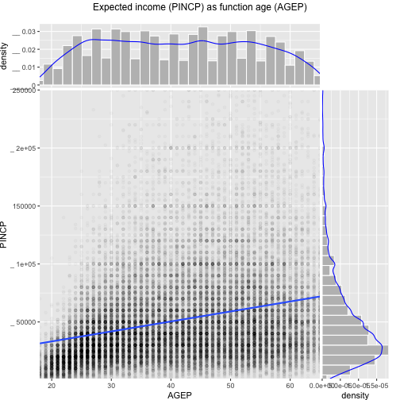

00003_informalexample_2.1_of_section_2.1.2.R


```r
# informalexample 2.1 of section 2.1.2 
# (informalexample 2.1 of section 2.1.2)  : Starting with R and data : Starting with R : R programming 

print(seq_len(25))
```

```
##  [1]  1  2  3  4  5  6  7  8  9 10 11 12 13 14 15 16 17 18 19 20 21 22 23
## [24] 24 25
```

```r
# [1]  1  2  3  4  5  6  7  8  9 10 11 12
# [13] 13 14 15 16 17 18 19 20 21 22 23 24
# [25] 25
```


00004_informalexample_2.2_of_section_2.1.2.R


```r
# informalexample 2.2 of section 2.1.2 
# (informalexample 2.2 of section 2.1.2)  : Starting with R and data : Starting with R : R programming 

example_vector <- c(10, 20, 30)                 	# Note: 1 
example_list <- list(a = 10, b = 20, c = 30)    	# Note: 2 

example_vector[1]                               	# Note: 3 
```

```
## [1] 10
```

```r
## [1] 10
example_list[1]
```

```
## $a
## [1] 10
```

```r
## $a
## [1] 10

example_vector[[2]]                             	# Note: 4 
```

```
## [1] 20
```

```r
## [1] 20
example_list[[2]]
```

```
## [1] 20
```

```r
## [1] 20

example_vector[c(FALSE, TRUE, TRUE)]            	# Note: 5 
```

```
## [1] 20 30
```

```r
## [1] 20 30
example_list[c(FALSE, TRUE, TRUE)]
```

```
## $b
## [1] 20
## 
## $c
## [1] 30
```

```r
## $b
## [1] 20
## 
## $c
## [1] 30

example_list$b                                  	# Note: 6 
```

```
## [1] 20
```

```r
## [1] 20

example_list[["b"]]
```

```
## [1] 20
```

```r
## [1] 20

# Note 1: 
#   Build an example vector. c() is R’s concatenate operator—it builds longer vectors and lists 
#   from shorter ones without nesting. For example 
#   c(1) is just the number 1, and c(1, c(2, 3)) is 
#   equivalent to c(1, 2, 3), which in turn is the 
#   integers 1 through 3 (though stored in a floating 
#   point format). 

# Note 2: 
#   Build an example list. 

# Note 3: 
#   Demonstrate vector and list use of []. Notice for the list [] returns a new short list, not the item. 

# Note 4: 
#   Demonstrate vector and list use of [[]]. In common cases [[]] forces a single item to be returned, though for nested lists of complex type this item itself could be a list. 

# Note 5: 
#   Vectors and lists be indexed by vectors of logicals, integers, and (if the vector or list has names) characters. 

# Note 6: 
#   For named examples, the syntax example_list$b is essentially a short-hand for 
#   example_list[["b"]] (the same is true for named 
#   vectors). 
```


00005_informalexample_2.3_of_section_2.1.2.R


```r
# informalexample 2.3 of section 2.1.2 
# (informalexample 2.3 of section 2.1.2)  : Starting with R and data : Starting with R : R programming 

x <- 1:5
print(x)                                  	# Note: 1 
```

```
## [1] 1 2 3 4 5
```

```r
# [1] 1 2 3 4 5

# x <- cumsumMISSPELLED(x)                  	# Note: 2 
# Error in cumsumMISSPELLED(x) : could not find function "cumsumMISSPELLED"

print(x)                                  	# Note: 3 
```

```
## [1] 1 2 3 4 5
```

```r
# [1] 1 2 3 4 5

x <- cumsum(x)                            	# Note: 4 
print(x)
```

```
## [1]  1  3  6 10 15
```

```r
# [1]  1  3  6 10 15

# Note 1: 
#   Define a value we are interested in and store it in the variable x. 

# Note 2: 
#   Attempt, and fail, to assign a new result to x. 

# Note 3: 
#   Notice in addition to supply a useful error message, R preserved the original value of x. 

# Note 4: 
#   Try the operation again, using the correct spelling of cumsum(). cumsum(), short for cumulative sum, is a useful function that computes running totals quickly. 
```


00006_informalexample_2.4_of_section_2.1.2.R


```r
# informalexample 2.4 of section 2.1.2 
# (informalexample 2.4 of section 2.1.2)  : Starting with R and data : Starting with R : R programming 

nchar("a string")
```

```
## [1] 8
```

```r
# [1] 8

nchar(c("a", "aa", "aaa", "aaaa"))
```

```
## [1] 1 2 3 4
```

```r
# [1] 1 2 3 4
```


00007_informalexample_2.5_of_section_2.1.2.R


```r
# informalexample 2.5 of section 2.1.2 
# (informalexample 2.5 of section 2.1.2)  : Starting with R and data : Starting with R : R programming 

1 +
  2
```

```
## [1] 3
```


00008_informalexample_2.6_of_section_2.1.2.R


```r
# informalexample 2.6 of section 2.1.2 
# (informalexample 2.6 of section 2.1.2)  : Starting with R and data : Starting with R : R programming 

1
```

```
## [1] 1
```

```r
  + 2
```

```
## [1] 2
```


00009_informalexample_2.7_of_section_2.1.2.R


```r
# informalexample 2.7 of section 2.1.2 
# (informalexample 2.7 of section 2.1.2)  : Starting with R and data : Starting with R : R programming 

d <- data.frame(x = c(1, NA, 3))       	# Note: 1 
print(d)
```

```
##    x
## 1  1
## 2 NA
## 3  3
```

```r
#    x
# 1  1
# 2 NA
# 3  3                                 	# Note: 2 

d$x[is.na(d$x)] <- 0                   	# Note: 3 
print(d)
```

```
##   x
## 1 1
## 2 0
## 3 3
```

```r
#   x
# 1 1
# 2 0
# 3 3

# Note 1: 
#   “data.frame” is R’s tabular data type, and the most important data type in R. A data.frame 
#   holds data organized in rows and columns. 

# Note 2: 
#   When printing data.frames, row numbers are shown in the fist (unnamed) column, and column 
#   values are shown under their matching column 
#   names. 

# Note 3: 
#   We can place a slice or selection of the x column of d on the left-hand side of an assignment to easily replace all NA values with zero. 
```


00010_informalexample_2.8_of_section_2.1.2.R


```r
# informalexample 2.8 of section 2.1.2 
# (informalexample 2.8 of section 2.1.2)  : Starting with R and data : Starting with R : R programming 

d <- data.frame(x = 1, y = 2)      	# Note: 1 
d2 <- d                            	# Note: 2 
d$x <- 5                           	# Note: 3 
        
print(d)
```

```
##   x y
## 1 5 2
```

```r
#   x y
# 1 5 2

print(d2)
```

```
##   x y
## 1 1 2
```

```r
#   x y
# 1 1 2

# Note 1: 
#   Create some example data and refer to it by the name d. 

# Note 2: 
#   Create an additional reference d2 to the same data. 

# Note 3: 
#   Alter the value referred to by d. 
```


00011_informalexample_2.9_of_section_2.1.2.R


```r
# informalexample 2.9 of section 2.1.2 
# (informalexample 2.9 of section 2.1.2)  : Starting with R and data : Starting with R : R programming 

data <- data.frame(revenue = c(2, 1, 2),    	# Note: 1 
                   sort_key = c("b", "c", "a"), 
                   stringsAsFactors = FALSE)
print(data)
```

```
##   revenue sort_key
## 1       2        b
## 2       1        c
## 3       2        a
```

```r
#   revenue sort_key
# 1       2        b
# 2       1        c
# 3       2        a

. <- data                                     	# Note: 2 
. <- .[order(.$sort_key), , drop = FALSE]     	# Note: 3 
.$ordered_sum_revenue <- cumsum(.$revenue)
.$fraction_revenue_seen <- .$ordered_sum_revenue/sum(.$revenue)
result <- .                                   	# Note: 4 

print(result)
```

```
##   revenue sort_key ordered_sum_revenue fraction_revenue_seen
## 3       2        a                   2                   0.4
## 1       2        b                   4                   0.8
## 2       1        c                   5                   1.0
```

```r
#   revenue sort_key ordered_sum_revenue fraction_revenue_seen
# 3       2        a                   2                   0.4
# 1       2        b                   4                   0.8
# 2       1        c                   5                   1.0

# Note 1: 
#   Our notional, or example data. 

# Note 2: 
#   Assign our data to a temporary variable named “.”. The original values will remain available 
#   in the “data” variable, making it easy to re-start 
#   the calculation from the beginning if 
#   necessary. 

# Note 3: 
#   Use the order command to sort the rows. The “drop = FALSE” is not strictly needed, but it is 
#   good to get in the habit of including it. For 
#   single column data.frames without the “drop = 
#   FALSE” argument, the “[,]” indexing operator will 
#   convert the result to a vector, which is almost 
#   never the R user's true intent. The “drop = FALSE” 
#   argument turns off this conversion, and it is a 
#   good idea to include it “just in case” and a 
#   definite requirement when either the data.frame 
#   has a single column or when we don’t know if the 
#   data.frame has more than one column (as the 
#   data.frame comes from somewhere else). 

# Note 4: 
#   Assign the result away from “.” to a more memorable variable name. 
```


00012_informalexample_2.10_of_section_2.1.2.R


```r
# informalexample 2.10 of section 2.1.2 
# (informalexample 2.10 of section 2.1.2)  : Starting with R and data : Starting with R : R programming 

library("dplyr")
```

```
## 
## Attaching package: 'dplyr'
```

```
## The following objects are masked from 'package:stats':
## 
##     filter, lag
```

```
## The following objects are masked from 'package:base':
## 
##     intersect, setdiff, setequal, union
```

```r
result <- data %>%
  arrange(., sort_key) %>%
  mutate(., ordered_sum_revenue = cumsum(revenue)) %>%
  mutate(., fraction_revenue_seen = ordered_sum_revenue/sum(revenue))
```


00013_informalexample_2.11_of_section_2.1.2.R


```r
# informalexample 2.11 of section 2.1.2 
# (informalexample 2.11 of section 2.1.2)  : Starting with R and data : Starting with R : R programming 

d <- data.frame(col1 = c(1, 2, 3), col2 = c(-1, 0, 1))
d$col3 <- d$col1 + d$col2
print(d)
```

```
##   col1 col2 col3
## 1    1   -1    0
## 2    2    0    2
## 3    3    1    4
```

```r
#   col1 col2 col3
# 1    1   -1    0
# 2    2    0    2
# 3    3    1    4
```


00015_example_2.1_of_section_2.2.1.R


```r
# example 2.1 of section 2.2.1 
# (example 2.1 of section 2.2.1)  : Starting with R and data : Working with data from files : Working with well-structured data from files or URLs 
# Title: Reading the UCI car data 

uciCar <- read.table(               	# Note: 1 
   '../UCICar/car.data.csv',                  	# Note: 2 
   sep = ',',                       	# Note: 3 
   header = TRUE,                   	# Note: 4 
   stringsAsFactor = TRUE           	# Note: 5 
   )
                                        
View(uciCar)                        	# Note: 6

# Note 1: 
#   Command to read from a file or URL and store the result in a new data frame object 
#   called 
#   uciCar. 

# Note 2: 
#   Filename or URL to get the data from. 

# Note 3: 
#   Specify the column or field separator as a 
#   comma. 

# Note 4: 
#   Tell R to expect a header line that defines 
#   the data column names. 

# Note 5: 
#   Tell R to convert string values to factors. This is the default behavior, so we are just using this argument to document intent. 

# Note 6: 
#   Examine the data with R’s built-in 
#   table viewer. 
```


00016_example_2.2_of_section_2.2.1.R


```r
# example 2.2 of section 2.2.1 
# (example 2.2 of section 2.2.1)  : Starting with R and data : Working with data from files : Working with well-structured data from files or URLs 
# Title: Exploring the car data 

class(uciCar)
```

```
## [1] "data.frame"
```

```r
## [1] "data.frame"                     	# Note: 1 
summary(uciCar)
```

```
##    buying      maint       doors     persons     lug_boot    safety   
##  high :432   high :432   2    :432   2   :576   big  :576   high:576  
##  low  :432   low  :432   3    :432   4   :576   med  :576   low :576  
##  med  :432   med  :432   4    :432   more:576   small:576   med :576  
##  vhigh:432   vhigh:432   5more:432                                    
##    rating    
##  acc  : 384  
##  good :  69  
##  unacc:1210  
##  vgood:  65
```

```r
##    buying      maint       doors
##  high :432   high :432   2    :432
##  low  :432   low  :432   3    :432
##  med  :432   med  :432   4    :432
##  vhigh:432   vhigh:432   5more:432
##
##  persons     lug_boot    safety
##  2   :576   big  :576   high:576
##  4   :576   med  :576   low :576
##  more:576   small:576   med :576
##
##    rating
##  acc  : 384
##  good :  69
##  unacc:1210
##  vgood:  65

dim(uciCar)
```

```
## [1] 1728    7
```

```r
## [1] 1728    7                       	# Note: 2

# Note 1: 
#   The loaded object uciCar is of type data.frame. 

# Note 2: 
#   The “[1]” is just an output sequence 
#   marker. The actual information is this: uciCar has 
#   1728 rows and 7 columns. Always try to confirm you 
#   got a good parse by at least checking that the 
#   number of rows is exactly one fewer than the 
#   number of lines of text in the original file. The 
#   difference of one is because the column header 
#   counts as a line of text, but not as a data row. 
```


00018_example_2.3_of_section_2.2.2.R


```r
# example 2.3 of section 2.2.2 
# (example 2.3 of section 2.2.2)  : Starting with R and data : Working with data from files : Using R with less-structured data 
# Title: Loading the credit dataset 

setwd("../../PDSwR2/Statlog")                 	# Note: 1 
d <- read.table('../Statlog/german.data', sep=' ',
   stringsAsFactors = FALSE, header = FALSE)

# Note 1: 
#   Replace this path with the actual path where you have saved PDSwR2. 
```


00019_example_2.4_of_section_2.2.2.R


```r
# example 2.4 of section 2.2.2 
# (example 2.4 of section 2.2.2)  : Starting with R and data : Working with data from files : Using R with less-structured data 
# Title: Setting column names 

d <- read.table('../Statlog/german.data',
                sep  =  " ",
                stringsAsFactors  =  FALSE, header  =  FALSE)

colnames(d) <- c('Status_of_existing_checking_account', 'Duration_in_month',
                 'Credit_history', 'Purpose', 'Credit_amount', 'Savings_account_bonds', 
                 'Present_employment_since',
                 'Installment_rate_in_percentage_of_disposable_income',
                 'Personal_status_and_sex', 'Other_debtors_guarantors',
                 'Present_residence_since', 'Property', 'Age_in_years',
                 'Other_installment_plans', 'Housing',
                 'Number_of_existing_credits_at_this_bank', 'Job',
                 'Number_of_people_being_liable_to_provide_maintenance_for',
                 'Telephone', 'foreign_worker', 'Good_Loan')
str(d)
```

```
## 'data.frame':	1000 obs. of  21 variables:
##  $ Status_of_existing_checking_account                     : chr  "A11" "A12" "A14" "A11" ...
##  $ Duration_in_month                                       : int  6 48 12 42 24 36 24 36 12 30 ...
##  $ Credit_history                                          : chr  "A34" "A32" "A34" "A32" ...
##  $ Purpose                                                 : chr  "A43" "A43" "A46" "A42" ...
##  $ Credit_amount                                           : int  1169 5951 2096 7882 4870 9055 2835 6948 3059 5234 ...
##  $ Savings_account_bonds                                   : chr  "A65" "A61" "A61" "A61" ...
##  $ Present_employment_since                                : chr  "A75" "A73" "A74" "A74" ...
##  $ Installment_rate_in_percentage_of_disposable_income     : int  4 2 2 2 3 2 3 2 2 4 ...
##  $ Personal_status_and_sex                                 : chr  "A93" "A92" "A93" "A93" ...
##  $ Other_debtors_guarantors                                : chr  "A101" "A101" "A101" "A103" ...
##  $ Present_residence_since                                 : int  4 2 3 4 4 4 4 2 4 2 ...
##  $ Property                                                : chr  "A121" "A121" "A121" "A122" ...
##  $ Age_in_years                                            : int  67 22 49 45 53 35 53 35 61 28 ...
##  $ Other_installment_plans                                 : chr  "A143" "A143" "A143" "A143" ...
##  $ Housing                                                 : chr  "A152" "A152" "A152" "A153" ...
##  $ Number_of_existing_credits_at_this_bank                 : int  2 1 1 1 2 1 1 1 1 2 ...
##  $ Job                                                     : chr  "A173" "A173" "A172" "A173" ...
##  $ Number_of_people_being_liable_to_provide_maintenance_for: int  1 1 2 2 2 2 1 1 1 1 ...
##  $ Telephone                                               : chr  "A192" "A191" "A191" "A191" ...
##  $ foreign_worker                                          : chr  "A201" "A201" "A201" "A201" ...
##  $ Good_Loan                                               : int  1 2 1 1 2 1 1 1 1 2 ...
```

```r
## 'data.frame':    1000 obs. of  21 variables:
##  $ Status_of_existing_checking_account                     : chr  "A11" "A12" "A14" "A11" ...
##  $ Duration_in_month                                       : int  6 48 12 42 24 36 24 36 12 30 ...
##  $ Credit_history                                          : chr  "A34" "A32" "A34" "A32" ...
##  $ Purpose                                                 : chr  "A43" "A43" "A46" "A42" ...
##  $ Credit_amount                                           : int  1169 5951 2096 7882 4870 9055 2835 6948 3059 5234 ...
##  $ Savings_account_bonds                                   : chr  "A65" "A61" "A61" "A61" ...
##  $ Present_employment_since                                : chr  "A75" "A73" "A74" "A74" ...
##  $ Installment_rate_in_percentage_of_disposable_income     : int  4 2 2 2 3 2 3 2 2 4 ...
##  $ Personal_status_and_sex                                 : chr  "A93" "A92" "A93" "A93" ...
##  $ Other_debtors_guarantors                                : chr  "A101" "A101" "A101" "A103" ...
##  $ Present_residence_since                                 : int  4 2 3 4 4 4 4 2 4 2 ...
##  $ Property                                                : chr  "A121" "A121" "A121" "A122" ...
##  $ Age_in_years                                            : int  67 22 49 45 53 35 53 35 61 28 ...
##  $ Other_installment_plans                                 : chr  "A143" "A143" "A143" "A143" ...
##  $ Housing                                                 : chr  "A152" "A152" "A152" "A153" ...
##  $ Number_of_existing_credits_at_this_bank                 : int  2 1 1 1 2 1 1 1 1 2 ...
##  $ Job                                                     : chr  "A173" "A173" "A172" "A173" ...
##  $ Number_of_people_being_liable_to_provide_maintenance_for: int  1 1 2 2 2 2 1 1 1 1 ...
##  $ Telephone                                               : chr  "A192" "A191" "A191" "A191" ...
##  $ foreign_worker                                          : chr  "A201" "A201" "A201" "A201" ...
##  $ Good_Loan                                               : int  1 2 1 1 2 1 1 1 1 2 ...
```


00021_example_2.5_of_section_2.2.2.R


```r
# example 2.5 of section 2.2.2 
# (example 2.5 of section 2.2.2)  : Starting with R and data : Working with data from files : Using R with less-structured data 
# Title: Transforming the car data 

source("../Statlog/mapping.R")                      	# Note: 1 
for(ci in colnames(d)) {                     	# Note: 2 
   if(is.character(d[[ci]])) {
      d[[ci]] <- as.factor(mapping[d[[ci]]])  	# Note: 3 
   }
}

# Note 1: 
#   This file can be found at https://github.com/WinVector/PDSwR2/blob/master/Statlog/../Statlog/mapping.R . 

# Note 2: 
#   Prefer using column names to column indices. 

# Note 3: 
#   The [[]] notation is using the fact 
#   that data.frames are named lists of columns. So we 
#   are working on each column in turn. Notice the 
#   mapping lookup is vectorized: i.e. it is applied 
#   to all elements in the column in one step. 
```


00022_example_2.6_of_section_2.2.2.R


```r
# example 2.6 of section 2.2.2 
# (example 2.6 of section 2.2.2)  : Starting with R and data : Working with data from files : Using R with less-structured data 
# Title: Summary of Good_Loan and Purpose 

setwd("../../PDSwR2/Statlog")               	# Note: 1 
d <- readRDS("creditdata.RDS")        	# Note: 2 

table(d$Purpose, d$Good_Loan) 
```

```
##                      
##                       BadLoan GoodLoan
##   business                 34       63
##   car (new)                89      145
##   car (used)               17       86
##   domestic appliances       4        8
##   education                22       28
##   furniture/equipment      58      123
##   others                    5        7
##   radio/television         62      218
##   repairs                   8       14
##   retraining                1        8
```

```r
##                       BadLoan GoodLoan
##   business                 34       63
##   car (new)                89      145
##   car (used)               17       86
##   domestic appliances       4        8
##   education                22       28
##   furniture/equipment      58      123
##   others                    5        7
##   radio/television         62      218
##   repairs                   8       14
##   retraining                1        8

# Note 1: 
#   Set the working directory. You will have to replace ../../PDSwR2/Statlog with the actual full path to Statlog on your machine. 

# Note 2: 
#   Read the prepared statlog data. 
```


00024_example_2.8_of_section_2.3.1.R


```r
# example 2.8 of section 2.3.1 
# (example 2.8 of section 2.3.1)  : Starting with R and data : Working with relational databases : A production-size example 
# Title: Loading data into R from a relational database 

library("DBI")
library("dplyr")                                    	# Note: 1 
library("rquery")

dlist <- readRDS("../PUMS/PUMSsample.RDS")                   	# Note: 2 
db <- dbConnect(RSQLite::SQLite(), ":memory:")      	# Note: 3 
dbWriteTable(db, "dpus", as.data.frame(dlist$ss16pus)) 	# Note: 4 
dbWriteTable(db, "dhus", as.data.frame(dlist$ss16hus))
rm(list = "dlist")                                  	# Note: 5 

dbGetQuery(db, "SELECT * FROM dpus LIMIT 5")            	# Note: 6 
```

```
##   RT  SERIALNO SPORDER  PUMA         ST  ADJINC AGEP              CIT
## 1  P 000000338      03 02701 Alabama/AL 1007588   06 Born in the U.S.
## 2  P 000000338      05 02701 Alabama/AL 1007588   08 Born in the U.S.
## 3  P 000000343      03 01400 Alabama/AL 1007588   12 Born in the U.S.
## 4  P 000000539      04 01400 Alabama/AL 1007588   11 Born in the U.S.
## 5  P 000002284      02 00600 Alabama/AL 1007588   08 Born in the U.S.
##   CITWP  COW DDRS DEAR DEYE DOUT DPHY DRAT DRATX DREM  ENG  FER  GCL  GCM
## 1  <NA> <NA>   No   No   No <NA>   No <NA>  <NA>   No <NA> <NA> <NA> <NA>
## 2  <NA> <NA>   No   No   No <NA>   No <NA>  <NA>   No <NA> <NA> <NA> <NA>
## 3  <NA> <NA>   No   No   No <NA>   No <NA>  <NA>  Yes <NA> <NA> <NA> <NA>
## 4  <NA> <NA>   No   No   No <NA>   No <NA>  <NA>  Yes <NA> <NA> <NA> <NA>
## 5  <NA> <NA>   No   No   No <NA>   No <NA>  <NA>   No <NA> <NA> <NA> <NA>
##    GCR HINS1 HINS2 HINS3 HINS4 HINS5 HINS6 HINS7 INTP JWMNP JWRIP JWTR
## 1 <NA>    No    No    No   Yes    No    No    No <NA>  <NA>  <NA> <NA>
## 2 <NA>    No    No    No   Yes    No    No    No <NA>  <NA>  <NA> <NA>
## 3 <NA>    No    No    No   Yes    No    No    No <NA>  <NA>  <NA> <NA>
## 4 <NA>    No    No    No   Yes    No    No    No <NA>  <NA>  <NA> <NA>
## 5 <NA>   Yes    No    No    No    No    No    No <NA>  <NA>  <NA> <NA>
##   LANP                    LANX                                 MAR MARHD
## 1 <NA> No, speaks only English Never married or under 15 years old  <NA>
## 2 <NA> No, speaks only English Never married or under 15 years old  <NA>
## 3 <NA> No, speaks only English Never married or under 15 years old  <NA>
## 4 <NA> No, speaks only English Never married or under 15 years old  <NA>
## 5 <NA> No, speaks only English Never married or under 15 years old  <NA>
##   MARHM MARHT MARHW MARHYP                         MIG  MIL MLPA MLPB
## 1  <NA>  <NA>  <NA>   <NA> Yes, same house (nonmovers) <NA> <NA> <NA>
## 2  <NA>  <NA>  <NA>   <NA> Yes, same house (nonmovers) <NA> <NA> <NA>
## 3  <NA>  <NA>  <NA>   <NA> Yes, same house (nonmovers) <NA> <NA> <NA>
## 4  <NA>  <NA>  <NA>   <NA> Yes, same house (nonmovers) <NA> <NA> <NA>
## 5  <NA>  <NA>  <NA>   <NA> Yes, same house (nonmovers) <NA> <NA> <NA>
##   MLPCD MLPE MLPFG MLPH MLPI MLPJ MLPK NWAB NWAV NWLA NWLK NWRE  OIP  PAP
## 1  <NA> <NA>  <NA> <NA> <NA> <NA> <NA> <NA> <NA> <NA> <NA> <NA> <NA> <NA>
## 2  <NA> <NA>  <NA> <NA> <NA> <NA> <NA> <NA> <NA> <NA> <NA> <NA> <NA> <NA>
## 3  <NA> <NA>  <NA> <NA> <NA> <NA> <NA> <NA> <NA> <NA> <NA> <NA> <NA> <NA>
## 4  <NA> <NA>  <NA> <NA> <NA> <NA> <NA> <NA> <NA> <NA> <NA> <NA> <NA> <NA>
## 5  <NA> <NA>  <NA> <NA> <NA> <NA> <NA> <NA> <NA> <NA> <NA> <NA> <NA> <NA>
##                         RELP RETP                                  SCH
## 1 Biological son or daughter <NA> Yes, public school or public college
## 2    Stepson or stepdaughter <NA> Yes, public school or public college
## 3 Biological son or daughter <NA> Yes, public school or public college
## 4 Biological son or daughter <NA> Yes, public school or public college
## 5             Other relative <NA> Yes, public school or public college
##      SCHG         SCHL SEMP    SEX SSIP  SSP WAGP WKHP  WKL  WKW  WRK YOEP
## 1 Grade 1 Kindergarten <NA> Female <NA> <NA> <NA> <NA> <NA> <NA> <NA> <NA>
## 2 Grade 2      Grade 1 <NA> Female <NA> <NA> <NA> <NA> <NA> <NA> <NA> <NA>
## 3 Grade 6      Grade 5 <NA> Female <NA> <NA> <NA> <NA> <NA> <NA> <NA> <NA>
## 4 Grade 4      Grade 4 <NA>   Male <NA> <NA> <NA> <NA> <NA> <NA> <NA> <NA>
## 5 Grade 1 Kindergarten <NA>   Male <NA> <NA> <NA> <NA> <NA> <NA> <NA> <NA>
##            ANC            ANC1P        ANC2P DECADE                  DIS
## 1       Single African American Not reported   <NA> Without a disability
## 2       Single African American Not reported   <NA> Without a disability
## 3     Multiple African American        Irish   <NA>    With a disability
## 4 Not reported     Not reported Not reported   <NA>    With a disability
## 5 Not reported     Not reported Not reported   <NA> Without a disability
##   DRIVESP                         ESP  ESR FHICOVP FOD1P FOD2P
## 1    <NA> Both parents in labor force <NA>      No  <NA>  <NA>
## 2    <NA> Both parents in labor force <NA>      No  <NA>  <NA>
## 3    <NA>   Mother in the labor force <NA>      No  <NA>  <NA>
## 4    <NA> Both parents in labor force <NA>      No  <NA>  <NA>
## 5    <NA>                        <NA> <NA>     Yes  <NA>  <NA>
##                            HICOV                        HISP INDP JWAP
## 1 With health insurance coverage Not Spanish/Hispanic/Latino <NA> <NA>
## 2 With health insurance coverage Not Spanish/Hispanic/Latino <NA> <NA>
## 3 With health insurance coverage Not Spanish/Hispanic/Latino <NA> <NA>
## 4 With health insurance coverage Not Spanish/Hispanic/Latino <NA> <NA>
## 5 With health insurance coverage Not Spanish/Hispanic/Latino <NA> <NA>
##   JWDP MIGPUMA MIGSP  MSP NAICSP NATIVITY
## 1 <NA>    <NA>  <NA> <NA>   <NA>   Native
## 2 <NA>    <NA>  <NA> <NA>   <NA>   Native
## 3 <NA>    <NA>  <NA> <NA>   <NA>   Native
## 4 <NA>    <NA>  <NA> <NA>   <NA>   Native
## 5 <NA>    <NA>  <NA> <NA>   <NA>   Native
##                                            NOP               OC OCCP PAOC
## 1 Living with two parents: Both parents NATIVE              Yes <NA> <NA>
## 2 Living with two parents: Both parents NATIVE              Yes <NA> <NA>
## 3       Living with mother only: Mother NATIVE              Yes <NA> <NA>
## 4 Living with two parents: Both parents NATIVE              Yes <NA> <NA>
## 5                                         <NA> No (includes GQ) <NA> <NA>
##   PERNP PINCP       POBP POVPIP POWPUMA POWSP
## 1  <NA>  <NA> Alabama/AL    158    <NA>  <NA>
## 2  <NA>  <NA> Alabama/AL    158    <NA>  <NA>
## 3  <NA>  <NA> Alabama/AL    072    <NA>  <NA>
## 4  <NA>  <NA> Alabama/AL    003    <NA>  <NA>
## 5  <NA>  <NA> Alabama/AL    079    <NA>  <NA>
##                                     PRIVCOV                         PUBCOV
## 1 Without private health insurance coverage    With public health coverage
## 2 Without private health insurance coverage    With public health coverage
## 3 Without private health insurance coverage    With public health coverage
## 4 Without private health insurance coverage    With public health coverage
## 5    With private health insurance coverage Without public health coverage
##                  QTRBIR                           RAC1P
## 1    April through June Black or African American alone
## 2 January through March Black or African American alone
## 3    April through June               Two or More Races
## 4 January through March                     White alone
## 5    April through June                     White alone
##                             RAC2P                            RAC3P RACAIAN
## 1 Black or African American alone  Black or African American alone      No
## 2 Black or African American alone  Black or African American alone      No
## 3               Two or More Races White; Black or African American      No
## 4                     White alone                      White alone      No
## 5                     White alone                      White alone      No
##   RACASN RACBLK RACNH RACNUM RACPI RACSOR RACWHT  RC SCIENGP SCIENGRLP
## 1     No    Yes    No      1    No     No     No Yes    <NA>      <NA>
## 2     No    Yes    No      1    No     No     No Yes    <NA>      <NA>
## 3     No    Yes    No      2    No     No    Yes Yes    <NA>      <NA>
## 4     No     No    No      1    No     No    Yes Yes    <NA>      <NA>
## 5     No     No    No      1    No     No    Yes Yes    <NA>      <NA>
##    SFN  SFR SOCP  VPS                     WAOB FAGEP FANCP FCITP FCITWP
## 1 <NA> <NA> <NA> <NA> US state (POB = 001-059)    No    No    No     No
## 2 <NA> <NA> <NA> <NA> US state (POB = 001-059)    No    No    No     No
## 3 <NA> <NA> <NA> <NA> US state (POB = 001-059)    No    No    No     No
## 4 <NA> <NA> <NA> <NA> US state (POB = 001-059)    No    No    No     No
## 5 <NA> <NA> <NA> <NA> US state (POB = 001-059)    No    No    No     No
##   FCOWP FDDRSP FDEARP FDEYEP FDISP FDOUTP FDPHYP FDRATP FDRATXP FDREMP
## 1    No     No     No     No    No     No     No     No      No     No
## 2    No     No     No     No    No     No     No     No      No     No
## 3    No     No     No     No    No     No     No     No      No     No
## 4    No     No     No     No    No     No     No     No      No     No
## 5    No    Yes    Yes    Yes   Yes     No    Yes     No      No    Yes
##   FENGP FESRP FFERP FFODP FGCLP FGCMP FGCRP FHINS1P FHINS2P FHINS3C
## 1    No    No    No    No    No    No    No      No      No    <NA>
## 2    No    No    No    No    No    No    No      No      No    <NA>
## 3    No    No    No    No    No    No    No      No      No    <NA>
## 4    No    No    No    No    No    No    No      No      No    <NA>
## 5    No    No    No    No    No    No    No     Yes     Yes    <NA>
##   FHINS3P FHINS4C FHINS4P FHINS5C FHINS5P FHINS6P FHINS7P FHISP FINDP
## 1      No      No      No    <NA>      No      No      No    No    No
## 2      No      No      No    <NA>      No      No      No    No    No
## 3      No      No      No    <NA>      No      No      No    No    No
## 4      No      No      No    <NA>      No      No      No    No    No
## 5     Yes    <NA>     Yes    <NA>     Yes     Yes     Yes    No    No
##   FINTP FJWDP FJWMNP FJWRIP FJWTRP FLANP FLANXP FMARHDP FMARHMP FMARHTP
## 1    No    No     No     No     No    No     No      No      No      No
## 2    No    No     No     No     No    No     No      No      No      No
## 3    No    No     No     No     No    No     No      No      No      No
## 4    No    No     No     No     No    No     No      No      No      No
## 5    No    No     No     No     No    No     No      No      No      No
##   FMARHWP FMARHYP FMARP FMIGP FMIGSP FMILPP FMILSP FOCCP FOIP FPAP FPERNP
## 1      No      No    No    No     No     No     No    No   No   No     No
## 2      No      No    No    No     No     No     No    No   No   No     No
## 3      No      No    No    No     No     No     No    No   No   No     No
## 4      No      No    No    No     No     No     No    No   No   No     No
## 5      No      No    No    No     No     No     No    No   No   No     No
##   FPINCP FPOBP FPOWSP FPRIVCOVP FPUBCOVP FRACP FRELP FRETP FSCHGP FSCHLP
## 1     No    No     No        No       No    No    No    No     No     No
## 2     No    No     No        No       No    No    No    No     No     No
## 3     No    No     No        No       No    No    No    No     No     No
## 4     No    No     No        No       No    No    No    No     No     No
## 5     No    No     No       Yes      Yes    No    No    No     No     No
##   FSCHP FSEMP FSEXP FSSIP FSSP FWAGP FWKHP FWKLP FWKWP FWRKP FYOEP
## 1    No    No    No    No   No    No    No    No    No    No    No
## 2    No    No    No    No   No    No    No    No    No    No    No
## 3    No    No    No    No   No    No    No    No    No    No    No
## 4    No    No    No    No   No    No    No    No    No    No    No
## 5    No    No    No    No   No    No    No    No    No    No    No
```

```r
dpus <- tbl(db, "dpus")                         	# Note: 7 
dhus <- tbl(db, "dhus")

print(dpus)                                              	# Note: 8 
```

```
## # Source:   table<dpus> [?? x 203]
## # Database: sqlite 3.29.0 [:memory:]
##    RT    SERIALNO SPORDER PUMA  ST    ADJINC AGEP  CIT   CITWP COW   DDRS 
##    <chr> <chr>    <chr>   <chr> <chr> <chr>  <chr> <chr> <chr> <chr> <chr>
##  1 P     0000003… 03      02701 Alab… 10075… 06    Born… <NA>  <NA>  No   
##  2 P     0000003… 05      02701 Alab… 10075… 08    Born… <NA>  <NA>  No   
##  3 P     0000003… 03      01400 Alab… 10075… 12    Born… <NA>  <NA>  No   
##  4 P     0000005… 04      01400 Alab… 10075… 11    Born… <NA>  <NA>  No   
##  5 P     0000022… 02      00600 Alab… 10075… 08    Born… <NA>  <NA>  No   
##  6 P     0000062… 03      02500 Alab… 10075… Unde… Born… <NA>  <NA>  <NA> 
##  7 P     0000066… 03      02400 Alab… 10075… 24    Born… <NA>  Empl… No   
##  8 P     0000078… 01      00302 Alab… 10075… 82    Born… <NA>  <NA>  No   
##  9 P     0000083… 04      02702 Alab… 10075… 31    Born… <NA>  Empl… No   
## 10 P     0000085… 01      02701 Alab… 10075… 93    Born… <NA>  <NA>  No   
## # … with more rows, and 192 more variables: DEAR <chr>, DEYE <chr>,
## #   DOUT <chr>, DPHY <chr>, DRAT <chr>, DRATX <chr>, DREM <chr>,
## #   ENG <chr>, FER <chr>, GCL <chr>, GCM <chr>, GCR <chr>, HINS1 <chr>,
## #   HINS2 <chr>, HINS3 <chr>, HINS4 <chr>, HINS5 <chr>, HINS6 <chr>,
## #   HINS7 <chr>, INTP <chr>, JWMNP <chr>, JWRIP <chr>, JWTR <chr>,
## #   LANP <chr>, LANX <chr>, MAR <chr>, MARHD <chr>, MARHM <chr>,
## #   MARHT <chr>, MARHW <chr>, MARHYP <chr>, MIG <chr>, MIL <chr>,
## #   MLPA <chr>, MLPB <chr>, MLPCD <chr>, MLPE <chr>, MLPFG <chr>,
## #   MLPH <chr>, MLPI <chr>, MLPJ <chr>, MLPK <chr>, NWAB <chr>,
## #   NWAV <chr>, NWLA <chr>, NWLK <chr>, NWRE <chr>, OIP <chr>, PAP <chr>,
## #   RELP <chr>, RETP <chr>, SCH <chr>, SCHG <chr>, SCHL <chr>, SEMP <chr>,
## #   SEX <chr>, SSIP <chr>, SSP <chr>, WAGP <chr>, WKHP <chr>, WKL <chr>,
## #   WKW <chr>, WRK <chr>, YOEP <chr>, ANC <chr>, ANC1P <chr>, ANC2P <chr>,
## #   DECADE <chr>, DIS <chr>, DRIVESP <chr>, ESP <chr>, ESR <chr>,
## #   FHICOVP <chr>, FOD1P <chr>, FOD2P <chr>, HICOV <chr>, HISP <chr>,
## #   INDP <chr>, JWAP <chr>, JWDP <chr>, MIGPUMA <chr>, MIGSP <chr>,
## #   MSP <chr>, NAICSP <chr>, NATIVITY <chr>, NOP <chr>, OC <chr>,
## #   OCCP <chr>, PAOC <chr>, PERNP <chr>, PINCP <chr>, POBP <chr>,
## #   POVPIP <chr>, POWPUMA <chr>, POWSP <chr>, PRIVCOV <chr>, PUBCOV <chr>,
## #   QTRBIR <chr>, RAC1P <chr>, RAC2P <chr>, …
```

```r
glimpse(dpus)
```

```
## Observations: ??
## Variables: 203
## Database: sqlite 3.29.0 [:memory:]
## $ RT        <chr> "P", "P", "P", "P", "P", "P", "P", "P", "P", "P", "P",…
## $ SERIALNO  <chr> "000000338", "000000338", "000000343", "000000539", "0…
## $ SPORDER   <chr> "03", "05", "03", "04", "02", "03", "03", "01", "04", …
## $ PUMA      <chr> "02701", "02701", "01400", "01400", "00600", "02500", …
## $ ST        <chr> "Alabama/AL", "Alabama/AL", "Alabama/AL", "Alabama/AL"…
## $ ADJINC    <chr> "1007588", "1007588", "1007588", "1007588", "1007588",…
## $ AGEP      <chr> "06", "08", "12", "11", "08", "Under 1 year", "24", "8…
## $ CIT       <chr> "Born in the U.S.", "Born in the U.S.", "Born in the U…
## $ CITWP     <chr> NA, NA, NA, NA, NA, NA, NA, NA, NA, NA, NA, NA, NA, NA…
## $ COW       <chr> NA, NA, NA, NA, NA, NA, "Employee of a private for-pro…
## $ DDRS      <chr> "No", "No", "No", "No", "No", NA, "No", "No", "No", "N…
## $ DEAR      <chr> "No", "No", "No", "No", "No", "No", "No", "No", "No", …
## $ DEYE      <chr> "No", "No", "No", "No", "No", "No", "No", "No", "No", …
## $ DOUT      <chr> NA, NA, NA, NA, NA, NA, "No", "No", "No", "Yes", "No",…
## $ DPHY      <chr> "No", "No", "No", "No", "No", NA, "No", "Yes", "No", "…
## $ DRAT      <chr> NA, NA, NA, NA, NA, NA, NA, NA, NA, NA, NA, NA, NA, NA…
## $ DRATX     <chr> NA, NA, NA, NA, NA, NA, NA, NA, NA, "No", NA, NA, NA, …
## $ DREM      <chr> "No", "No", "Yes", "Yes", "No", NA, "No", "No", "No", …
## $ ENG       <chr> NA, NA, NA, NA, NA, NA, NA, NA, NA, NA, NA, NA, NA, NA…
## $ FER       <chr> NA, NA, NA, NA, NA, NA, NA, NA, "No", NA, NA, NA, NA, …
## $ GCL       <chr> NA, NA, NA, NA, NA, NA, NA, "No", "No", "No", "No", NA…
## $ GCM       <chr> NA, NA, NA, NA, NA, NA, NA, NA, NA, NA, NA, NA, NA, NA…
## $ GCR       <chr> NA, NA, NA, NA, NA, NA, NA, NA, NA, NA, NA, NA, NA, NA…
## $ HINS1     <chr> "No", "No", "No", "No", "Yes", "No", "Yes", "No", "Yes…
## $ HINS2     <chr> "No", "No", "No", "No", "No", "No", "No", "Yes", "No",…
## $ HINS3     <chr> "No", "No", "No", "No", "No", "No", "No", "Yes", "No",…
## $ HINS4     <chr> "Yes", "Yes", "Yes", "Yes", "No", "Yes", "No", "No", "…
## $ HINS5     <chr> "No", "No", "No", "No", "No", "No", "No", "No", "No", …
## $ HINS6     <chr> "No", "No", "No", "No", "No", "No", "No", "No", "No", …
## $ HINS7     <chr> "No", "No", "No", "No", "No", "No", "No", "No", "No", …
## $ INTP      <chr> NA, NA, NA, NA, NA, NA, "0000000", "0000900", "0000000…
## $ JWMNP     <chr> NA, NA, NA, NA, NA, NA, "005", NA, "030", NA, "005", N…
## $ JWRIP     <chr> NA, NA, NA, NA, NA, NA, "Drove alone", NA, "Drove alon…
## $ JWTR      <chr> NA, NA, NA, NA, NA, NA, "Car, truck, or van", NA, "Car…
## $ LANP      <chr> NA, NA, NA, NA, NA, NA, NA, NA, NA, NA, NA, NA, NA, NA…
## $ LANX      <chr> "No, speaks only English", "No, speaks only English", …
## $ MAR       <chr> "Never married or under 15 years old", "Never married …
## $ MARHD     <chr> NA, NA, NA, NA, NA, NA, NA, "No", NA, "No", "No", NA, …
## $ MARHM     <chr> NA, NA, NA, NA, NA, NA, NA, "No", NA, "No", "No", NA, …
## $ MARHT     <chr> NA, NA, NA, NA, NA, NA, NA, "One time", NA, "One time"…
## $ MARHW     <chr> NA, NA, NA, NA, NA, NA, NA, "No", NA, "No", "No", NA, …
## $ MARHYP    <chr> NA, NA, NA, NA, NA, NA, NA, "1952", NA, "1952", "2009"…
## $ MIG       <chr> "Yes, same house (nonmovers)", "Yes, same house (nonmo…
## $ MIL       <chr> NA, NA, NA, NA, NA, NA, "Never served in the military"…
## $ MLPA      <chr> NA, NA, NA, NA, NA, NA, NA, NA, NA, "Did not serve thi…
## $ MLPB      <chr> NA, NA, NA, NA, NA, NA, NA, NA, NA, "Did not serve thi…
## $ MLPCD     <chr> NA, NA, NA, NA, NA, NA, NA, NA, NA, "Did not serve thi…
## $ MLPE      <chr> NA, NA, NA, NA, NA, NA, NA, NA, NA, "Did not serve thi…
## $ MLPFG     <chr> NA, NA, NA, NA, NA, NA, NA, NA, NA, "Did not serve thi…
## $ MLPH      <chr> NA, NA, NA, NA, NA, NA, NA, NA, NA, "Did not serve thi…
## $ MLPI      <chr> NA, NA, NA, NA, NA, NA, NA, NA, NA, "Did not serve thi…
## $ MLPJ      <chr> NA, NA, NA, NA, NA, NA, NA, NA, NA, "Served this perio…
## $ MLPK      <chr> NA, NA, NA, NA, NA, NA, NA, NA, NA, "Did not serve thi…
## $ NWAB      <chr> NA, NA, NA, NA, NA, NA, "Did not report", "No", "Did n…
## $ NWAV      <chr> NA, NA, NA, NA, NA, NA, "Did not report", "Did not rep…
## $ NWLA      <chr> NA, NA, NA, NA, NA, NA, "Did not report", "No", "Did n…
## $ NWLK      <chr> NA, NA, NA, NA, NA, NA, "Did not report", "No", "Did n…
## $ NWRE      <chr> NA, NA, NA, NA, NA, NA, "Did not report", "Did not rep…
## $ OIP       <chr> NA, NA, NA, NA, NA, NA, "None", "None", "None", "None"…
## $ PAP       <chr> NA, NA, NA, NA, NA, NA, "None", "None", "None", "None"…
## $ RELP      <chr> "Biological son or daughter", "Stepson or stepdaughter…
## $ RETP      <chr> NA, NA, NA, NA, NA, NA, "None", "005800", "None", "024…
## $ SCH       <chr> "Yes, public school or public college", "Yes, public s…
## $ SCHG      <chr> "Grade 1", "Grade 2", "Grade 6", "Grade 4", "Grade 1",…
## $ SCHL      <chr> "Kindergarten", "Grade 1", "Grade 5", "Grade 4", "Kind…
## $ SEMP      <chr> NA, NA, NA, NA, NA, NA, "0000000", "0000000", "0000000…
## $ SEX       <chr> "Female", "Female", "Female", "Male", "Male", "Female"…
## $ SSIP      <chr> NA, NA, NA, NA, NA, NA, "None", "None", "None", "None"…
## $ SSP       <chr> NA, NA, NA, NA, NA, NA, "None", "16500", "None", "1350…
## $ WAGP      <chr> NA, NA, NA, NA, NA, NA, "0022000", "0000000", "0021000…
## $ WKHP      <chr> NA, NA, NA, NA, NA, NA, "40", NA, "40", NA, "40", NA, …
## $ WKL       <chr> NA, NA, NA, NA, NA, NA, "Within the past 12 months", "…
## $ WKW       <chr> NA, NA, NA, NA, NA, NA, "50 to 52 weeks worked during …
## $ WRK       <chr> NA, NA, NA, NA, NA, NA, NA, "Did not work", "Worked", …
## $ YOEP      <chr> NA, NA, NA, NA, NA, NA, NA, NA, NA, NA, NA, NA, NA, NA…
## $ ANC       <chr> "Single", "Single", "Multiple", "Not reported", "Not r…
## $ ANC1P     <chr> "African American", "African American", "African Ameri…
## $ ANC2P     <chr> "Not reported", "Not reported", "Irish", "Not reported…
## $ DECADE    <chr> NA, NA, NA, NA, NA, NA, NA, NA, NA, NA, NA, NA, NA, NA…
## $ DIS       <chr> "Without a disability", "Without a disability", "With …
## $ DRIVESP   <chr> NA, NA, NA, NA, NA, NA, "1.000 vehicles (Drove alone)"…
## $ ESP       <chr> "Both parents in labor force", "Both parents in labor …
## $ ESR       <chr> NA, NA, NA, NA, NA, NA, "Civilian employed, at work", …
## $ FHICOVP   <chr> "No", "No", "No", "No", "Yes", "No", "Yes", "No", "No"…
## $ FOD1P     <chr> NA, NA, NA, NA, NA, NA, NA, NA, NA, "FINE ARTS", "ACCO…
## $ FOD2P     <chr> NA, NA, NA, NA, NA, NA, NA, NA, NA, NA, NA, NA, NA, NA…
## $ HICOV     <chr> "With health insurance coverage", "With health insuran…
## $ HISP      <chr> "Not Spanish/Hispanic/Latino", "Not Spanish/Hispanic/L…
## $ INDP      <chr> NA, NA, NA, NA, NA, NA, "TRN-TRUCK TRANSPORTATION", NA…
## $ JWAP      <chr> NA, NA, NA, NA, NA, NA, "6:35 a.m. to 6:39 a.m.", NA, …
## $ JWDP      <chr> NA, NA, NA, NA, NA, NA, "6:30 a.m. to 6:34 a.m.", NA, …
## $ MIGPUMA   <chr> NA, NA, NA, NA, NA, NA, NA, "00290", NA, NA, NA, NA, N…
## $ MIGSP     <chr> NA, NA, NA, NA, NA, NA, NA, "Alabama/AL", NA, NA, NA, …
## $ MSP       <chr> NA, NA, NA, NA, NA, NA, "Never married", "Divorced", "…
## $ NAICSP    <chr> NA, NA, NA, NA, NA, NA, "TRN-TRUCK TRANSPORTATION", NA…
## $ NATIVITY  <chr> "Native", "Native", "Native", "Native", "Native", "Nat…
## $ NOP       <chr> "Living with two parents: Both parents NATIVE", "Livin…
## $ OC        <chr> "Yes", "Yes", "Yes", "Yes", "No (includes GQ)", "Yes",…
## $ OCCP      <chr> NA, NA, NA, NA, NA, NA, "TRN-DRIVER/SALES WORKERS AND …
## $ PAOC      <chr> NA, NA, NA, NA, NA, NA, NA, "Females with no own child…
## $ PERNP     <chr> NA, NA, NA, NA, NA, NA, "000022000", "000000000", "000…
## $ PINCP     <chr> NA, NA, NA, NA, NA, NA, "000022000", "000023200", "000…
## $ POBP      <chr> "Alabama/AL", "Alabama/AL", "Alabama/AL", "Alabama/AL"…
## $ POVPIP    <chr> "158", "158", "072", "003", "079", "109", "346", "202"…
## $ POWPUMA   <chr> NA, NA, NA, NA, NA, NA, "02400", NA, "02700", NA, "007…
## $ POWSP     <chr> NA, NA, NA, NA, NA, NA, "Alabama/AL", NA, "Alabama/AL"…
## $ PRIVCOV   <chr> "Without private health insurance coverage", "Without …
## $ PUBCOV    <chr> "With public health coverage", "With public health cov…
## $ QTRBIR    <chr> "April through June", "January through March", "April …
## $ RAC1P     <chr> "Black or African American alone", "Black or African A…
## $ RAC2P     <chr> "Black or African American alone", "Black or African A…
## $ RAC3P     <chr> "Black or African American alone", "Black or African A…
## $ RACAIAN   <chr> "No", "No", "No", "No", "No", "No", "No", "No", "No", …
## $ RACASN    <chr> "No", "No", "No", "No", "No", "No", "No", "No", "No", …
## $ RACBLK    <chr> "Yes", "Yes", "Yes", "No", "No", "No", "Yes", "No", "Y…
## $ RACNH     <chr> "No", "No", "No", "No", "No", "No", "No", "No", "No", …
## $ RACNUM    <chr> "1", "1", "2", "1", "1", "1", "1", "1", "1", "1", "1",…
## $ RACPI     <chr> "No", "No", "No", "No", "No", "No", "No", "No", "No", …
## $ RACSOR    <chr> "No", "No", "No", "No", "No", "No", "No", "No", "No", …
## $ RACWHT    <chr> "No", "No", "Yes", "Yes", "Yes", "Yes", "No", "Yes", "…
## $ RC        <chr> "Yes", "Yes", "Yes", "Yes", "Yes", "Yes", "No (include…
## $ SCIENGP   <chr> NA, NA, NA, NA, NA, NA, NA, NA, NA, "No", "No", NA, NA…
## $ SCIENGRLP <chr> NA, NA, NA, NA, NA, NA, NA, NA, NA, "No", "No", NA, NA…
## $ SFN       <chr> NA, NA, NA, NA, NA, NA, NA, NA, NA, NA, NA, NA, NA, NA…
## $ SFR       <chr> NA, NA, NA, NA, NA, NA, NA, NA, NA, NA, NA, NA, NA, NA…
## $ SOCP      <chr> NA, NA, NA, NA, NA, NA, "TRN-DRIVER/SALES WORKERS AND …
## $ VPS       <chr> NA, NA, NA, NA, NA, NA, NA, NA, NA, "WWII", NA, NA, NA…
## $ WAOB      <chr> "US state (POB = 001-059)", "US state (POB = 001-059)"…
## $ FAGEP     <chr> "No", "No", "No", "No", "No", "No", "No", "No", "No", …
## $ FANCP     <chr> "No", "No", "No", "No", "No", "No", "No", "No", "No", …
## $ FCITP     <chr> "No", "No", "No", "No", "No", "No", "Yes", "No", "No",…
## $ FCITWP    <chr> "No", "No", "No", "No", "No", "No", "No", "No", "No", …
## $ FCOWP     <chr> "No", "No", "No", "No", "No", "No", "Yes", "No", "No",…
## $ FDDRSP    <chr> "No", "No", "No", "No", "Yes", "No", "Yes", "No", "No"…
## $ FDEARP    <chr> "No", "No", "No", "No", "Yes", "No", "Yes", "No", "No"…
## $ FDEYEP    <chr> "No", "No", "No", "No", "Yes", "No", "Yes", "No", "No"…
## $ FDISP     <chr> "No", "No", "No", "No", "Yes", "No", "Yes", "No", "No"…
## $ FDOUTP    <chr> "No", "No", "No", "No", "No", "No", "Yes", "No", "No",…
## $ FDPHYP    <chr> "No", "No", "No", "No", "Yes", "No", "Yes", "No", "No"…
## $ FDRATP    <chr> "No", "No", "No", "No", "No", "No", "No", "No", "No", …
## $ FDRATXP   <chr> "No", "No", "No", "No", "No", "No", "No", "No", "No", …
## $ FDREMP    <chr> "No", "No", "No", "No", "Yes", "No", "Yes", "No", "No"…
## $ FENGP     <chr> "No", "No", "No", "No", "No", "No", "No", "No", "No", …
## $ FESRP     <chr> "No", "No", "No", "No", "No", "No", "Yes", "No", "No",…
## $ FFERP     <chr> "No", "No", "No", "No", "No", "No", "No", "No", "No", …
## $ FFODP     <chr> "No", "No", "No", "No", "No", "No", "No", "No", "No", …
## $ FGCLP     <chr> "No", "No", "No", "No", "No", "No", "No", "No", "No", …
## $ FGCMP     <chr> "No", "No", "No", "No", "No", "No", "No", "No", "No", …
## $ FGCRP     <chr> "No", "No", "No", "No", "No", "No", "No", "No", "No", …
## $ FHINS1P   <chr> "No", "No", "No", "No", "Yes", "No", "Yes", "No", "No"…
## $ FHINS2P   <chr> "No", "No", "No", "No", "Yes", "No", "Yes", "No", "No"…
## $ FHINS3C   <chr> NA, NA, NA, NA, NA, NA, NA, "No", NA, "No", "No", NA, …
## $ FHINS3P   <chr> "No", "No", "No", "No", "Yes", "No", "Yes", "No", "No"…
## $ FHINS4C   <chr> "No", "No", "No", "No", NA, "No", NA, NA, NA, NA, NA, …
## $ FHINS4P   <chr> "No", "No", "No", "No", "Yes", "No", "Yes", "No", "No"…
## $ FHINS5C   <chr> NA, NA, NA, NA, NA, NA, NA, NA, NA, NA, NA, NA, NA, NA…
## $ FHINS5P   <chr> "No", "No", "No", "No", "Yes", "No", "Yes", "No", "No"…
## $ FHINS6P   <chr> "No", "No", "No", "No", "Yes", "No", "Yes", "No", "No"…
## $ FHINS7P   <chr> "No", "No", "No", "No", "Yes", "No", "Yes", "No", "No"…
## $ FHISP     <chr> "No", "No", "No", "No", "No", "No", "No", "No", "No", …
## $ FINDP     <chr> "No", "No", "No", "No", "No", "No", "Yes", "No", "No",…
## $ FINTP     <chr> "No", "No", "No", "No", "No", "No", "Yes", "Yes", "No"…
## $ FJWDP     <chr> "No", "No", "No", "No", "No", "No", "Yes", "No", "No",…
## $ FJWMNP    <chr> "No", "No", "No", "No", "No", "No", "Yes", "No", "No",…
## $ FJWRIP    <chr> "No", "No", "No", "No", "No", "No", "Yes", "No", "No",…
## $ FJWTRP    <chr> "No", "No", "No", "No", "No", "No", "Yes", "No", "No",…
## $ FLANP     <chr> "No", "No", "No", "No", "No", "No", "No", "No", "No", …
## $ FLANXP    <chr> "No", "No", "No", "No", "No", "No", "Yes", "No", "No",…
## $ FMARHDP   <chr> "No", "No", "No", "No", "No", "No", "No", "No", "No", …
## $ FMARHMP   <chr> "No", "No", "No", "No", "No", "No", "No", "No", "No", …
## $ FMARHTP   <chr> "No", "No", "No", "No", "No", "No", "No", "No", "No", …
## $ FMARHWP   <chr> "No", "No", "No", "No", "No", "No", "No", "No", "No", …
## $ FMARHYP   <chr> "No", "No", "No", "No", "No", "No", "No", "No", "No", …
## $ FMARP     <chr> "No", "No", "No", "No", "No", "No", "Yes", "No", "No",…
## $ FMIGP     <chr> "No", "No", "No", "No", "No", "No", "Yes", "No", "No",…
## $ FMIGSP    <chr> "No", "No", "No", "No", "No", "No", "No", "No", "No", …
## $ FMILPP    <chr> "No", "No", "No", "No", "No", "No", "No", "No", "No", …
## $ FMILSP    <chr> "No", "No", "No", "No", "No", "No", "Yes", "No", "No",…
## $ FOCCP     <chr> "No", "No", "No", "No", "No", "No", "Yes", "No", "No",…
## $ FOIP      <chr> "No", "No", "No", "No", "No", "No", "Yes", "No", "No",…
## $ FPAP      <chr> "No", "No", "No", "No", "No", "No", "Yes", "No", "No",…
## $ FPERNP    <chr> "No", "No", "No", "No", "No", "No", "Yes", "No", "Yes"…
## $ FPINCP    <chr> "No", "No", "No", "No", "No", "No", "Yes", "Yes", "Yes…
## $ FPOBP     <chr> "No", "No", "No", "No", "No", "No", "Yes", "No", "No",…
## $ FPOWSP    <chr> "No", "No", "No", "No", "No", "No", "Yes", "No", "No",…
## $ FPRIVCOVP <chr> "No", "No", "No", "No", "Yes", "No", "Yes", "No", "No"…
## $ FPUBCOVP  <chr> "No", "No", "No", "No", "Yes", "No", "Yes", "No", "No"…
## $ FRACP     <chr> "No", "No", "No", "No", "No", "No", "No", "No", "No", …
## $ FRELP     <chr> "No", "No", "No", "No", "No", "No", "No", "No", "No", …
## $ FRETP     <chr> "No", "No", "No", "No", "No", "No", "Yes", "No", "No",…
## $ FSCHGP    <chr> "No", "No", "No", "No", "No", "No", "No", "No", "No", …
## $ FSCHLP    <chr> "No", "No", "No", "No", "No", "No", "Yes", "No", "No",…
## $ FSCHP     <chr> "No", "No", "No", "No", "No", "No", "Yes", "No", "No",…
## $ FSEMP     <chr> "No", "No", "No", "No", "No", "No", "Yes", "No", "No",…
## $ FSEXP     <chr> "No", "No", "No", "No", "No", "No", "No", "No", "No", …
## $ FSSIP     <chr> "No", "No", "No", "No", "No", "No", "Yes", "No", "No",…
## $ FSSP      <chr> "No", "No", "No", "No", "No", "No", "Yes", "Yes", "No"…
## $ FWAGP     <chr> "No", "No", "No", "No", "No", "No", "Yes", "No", "Yes"…
## $ FWKHP     <chr> "No", "No", "No", "No", "No", "No", "Yes", "No", "No",…
## $ FWKLP     <chr> "No", "No", "No", "No", "No", "No", "Yes", "No", "No",…
## $ FWKWP     <chr> "No", "No", "No", "No", "No", "No", "Yes", "No", "No",…
## $ FWRKP     <chr> "No", "No", "No", "No", "No", "No", "No", "No", "No", …
## $ FYOEP     <chr> "No", "No", "No", "No", "No", "No", "No", "No", "No", …
```

```r
View(rsummary(db, "dpus"))                     	# Note: 9

# Note 1: 
#   Attach some packages we wish to use commands 
#   and functions from. 

# Note 2: 
#   Load the data from the compressed RDS disk 
#   format into R memory. Note: you will need to 
#   change the path PUMSsample to where you have saved 
#   the contents of PDSwR2/PUMS. 

# Note 3: 
#   Connect to a new RSQLite in-memory database. 
#   We are going to use RSQLite for our examples. In 
#   practice you would connect to a pre-existing 
#   database such as PostgreSQL or Spark with 
#   pre-existing tables. 

# Note 4: 
#   Copy the data from the in-memory structure 
#   dlist into the database. 

# Note 5: 
#   Remove our local copy of the data, as we are simulating having found the data in the database. 

# Note 6: 
#   Use the SQL query language for a quick look at up to 5 rows of our data. 

# Note 7: 
#   Build dplyr handles that refer to the remote database data. 

# Note 8: 
#   Use dplyr to examine and work with the remote data. 

# Note 9: 
#   Use the rquery package to get a summary of the remote data. 
```


00025_example_2.9_of_section_2.3.1.R


```r
# example 2.9 of section 2.3.1 
# (example 2.9 of section 2.3.1)  : Starting with R and data : Working with relational databases : A production-size example 
# Title: Loading data from a database 

dpus <- dbReadTable(db, "dpus")                                  	# Note: 1 

dpus <- dpus[, c("AGEP", "COW", "ESR",  "PERNP", 
                 "PINCP","SCHL", "SEX", "WKHP")]   	# Note: 2 
                 
for(ci in c("AGEP", "PERNP", "PINCP", "WKHP")) {   	# Note: 3 
  dpus[[ci]] <- as.numeric(dpus[[ci]])
}
```

```
## Warning: NAs introduced by coercion

## Warning: NAs introduced by coercion
```

```r
dpus$COW <- strtrim(dpus$COW, 50)                                  	# Note: 4 

str(dpus)                                                       	# Note: 5
```

```
## 'data.frame':	100000 obs. of  8 variables:
##  $ AGEP : num  6 8 12 11 8 NA 24 82 31 93 ...
##  $ COW  : chr  NA NA NA NA ...
##  $ ESR  : chr  NA NA NA NA ...
##  $ PERNP: num  NA NA NA NA NA NA 22000 0 21000 0 ...
##  $ PINCP: num  NA NA NA NA NA ...
##  $ SCHL : chr  "Kindergarten" "Grade 1" "Grade 5" "Grade 4" ...
##  $ SEX  : chr  "Female" "Female" "Female" "Male" ...
##  $ WKHP : num  NA NA NA NA NA NA 40 NA 40 NA ...
```

```r
# Note 1: 
#   Copy data from the database into R memory. This assumes we are continuing from the previous 
#   example, so the packages we have attached are 
#   still available and the database handle 
#   db is still valid. 

# Note 2: 
#   Select a subset of columns we want to work with. Restricting columns is not required, but 
#   improves legibility of later printing. 

# Note 3: 
#   All of the columns in this copy of PUMS data are stored as character type to preserve features such as leading zeros 
#   from the original data. Here we are converting columns we wish to treat as numeric to the numeric type. Non-numeric values, often missing entries, 
#   get coded with the symbol NA which stands for not available. 

# Note 4: 
#   The PUMS level names are very long (which is one of the reasons these columns are distributed 
#   as integers), so for this dataset that has level 
#   names instead of level codes we are shortening the 
#   employment codes to no more than 50 
#   characters. 

# Note 5: 
#   Look at the first few rows of data in a column orientation. 
```


00026_example_2.10_of_section_2.3.1.R


```r
# example 2.10 of section 2.3.1 
# (example 2.10 of section 2.3.1)  : Starting with R and data : Working with relational databases : A production-size example 
# Title: Re-mapping values and selecting rows from data 

target_emp_levs <- c(                                          	# Note: 1 
  "Employee of a private for-profit company or busine",
  "Employee of a private not-for-profit, tax-exempt, ",
  "Federal government employee",                    
  "Local government employee (city, county, etc.)",   
  "Self-employed in own incorporated business, profes",
  "Self-employed in own not incorporated business, pr",
  "State government employee")


complete <- complete.cases(dpus)                              	# Note: 2 

stdworker <- with(dpus,                                        	# Note: 3 
                  (PINCP>1000) & 
                    (ESR=="Civilian employed, at work") & 
                    (PINCP<=250000) & 
                    (PERNP>1000) & (PERNP<=250000) & 
                    (WKHP>=30) & 
                    (AGEP>=18) & (AGEP<=65) & 
                    (COW %in% target_emp_levs))
                    
dpus <- dpus[complete & stdworker, , drop = FALSE]              	# Note: 4 

no_advanced_degree <- is.na(dpus$SCHL) |                     	# Note: 5 
  (!(dpus$SCHL %in% c("Associate's degree",
                      "Bachelor's degree",
                      "Doctorate degree",
                      "Master's degree",
                      "Professional degree beyond a bachelor's degree")))
dpus$SCHL[no_advanced_degree] <- "No Advanced Degree"

dpus$SCHL <- relevel(factor(dpus$SCHL),                     	# Note: 6 
                     "No Advanced Degree")                
dpus$COW <- relevel(factor(dpus$COW), 
                    target_emp_levs[[1]])
dpus$ESR <- relevel(factor(dpus$ESR), 
                    "Civilian employed, at work")
dpus$SEX <- relevel(factor(dpus$SEX), 
                    "Male")
                    
saveRDS(dpus, "dpus_std_employee.RDS")                           	# Note: 7 
                    
summary(dpus)                                                  	# Note: 8
```

```
##       AGEP      
##  Min.   :18.00  
##  1st Qu.:31.00  
##  Median :41.00  
##  Mean   :41.34  
##  3rd Qu.:52.00  
##  Max.   :65.00  
##                 
##                                                  COW       
##  Employee of a private for-profit company or busine:26101  
##  Employee of a private not-for-profit, tax-exempt, : 2877  
##  Federal government employee                       :  978  
##  Local government employee (city, county, etc.)    : 2589  
##  Self-employed in own incorporated business, profes: 1180  
##  Self-employed in own not incorporated business, pr: 1643  
##  State government employee                         : 1743  
##                          ESR            PERNP            PINCP       
##  Civilian employed, at work:37111   Min.   :  1100   Min.   :  1100  
##                                     1st Qu.: 24000   1st Qu.: 25000  
##                                     Median : 40000   Median : 40000  
##                                     Mean   : 50268   Mean   : 51584  
##                                     3rd Qu.: 65000   3rd Qu.: 66000  
##                                     Max.   :250000   Max.   :250000  
##                                                                      
##                                              SCHL           SEX       
##  No Advanced Degree                            :20461   Male  :20125  
##  Associate's degree                            : 3670   Female:16986  
##  Bachelor's degree                             : 8407                 
##  Doctorate degree                              :  478                 
##  Master's degree                               : 3386                 
##  Professional degree beyond a bachelor's degree:  709                 
##                                                                       
##       WKHP      
##  Min.   :30.00  
##  1st Qu.:40.00  
##  Median :40.00  
##  Mean   :42.66  
##  3rd Qu.:45.00  
##  Max.   :98.00  
## 
```

```r
# Note 1: 
#   Define a vector of employment definitions we consider “standard.” 

# Note 2: 
#   Build a new logical vector indicating which rows have valid values in all of our columns of 
#   interest. In real applications, dealing with 
#   missing values is important and cannot always be 
#   handled by skipping incomplete rows. We will 
#   return to the issue of properly dealing with 
#   missing values when we discuss managing 
#   data. 

# Note 3: 
#   Build a new logical vector indicating which workers we consider typical full-time employees. 
#   Each of these column names are the ones we 
#   discussed earlier. The results of any analysis 
#   will be heavily influenced by this definition, so 
#   in a real task we would spend a lot of time 
#   researching the choices in this step. It literally 
#   controls who and what we are studying. Notice to 
#   keep things simple and homogeneous we restricted 
#   this study to civilians, which would be an 
#   unacceptable limitation in a complete work. 

# Note 4: 
#   Restrict only to rows or examples that meet or definition of typical worker. 

# Note 5: 
#   Re-code education, merging the less-than-bachelor’s-degree levels to the single level “No 
#   Advanced Degree”. 

# Note 6: 
#   Convert our string-valued columns to factors, picking the reference level with the re-level() 
#   function. 

# Note 7: 
#   Save this data to a file so we can use it in later examples. This file is also already 
#   available at the path 
#   PDSwR2/PUMS/dpus_std_employee.RDS 

# Note 8: 
#   Take a look at our data. One of the advantages of factors is summary() builds up useful counts 
#   for them. However, it was best to delay having 
#   string codes as factors until after we finished 
#   with re-mapping level codes. 
```


00027_informalexample_2.15_of_section_2.3.1.R


```r
# informalexample 2.15 of section 2.3.1 
# (informalexample 2.15 of section 2.3.1)  : Starting with R and data : Working with relational databases : A production-size example 

levels(dpus$SCHL)                                 	# Note: 1 
```

```
## [1] "No Advanced Degree"                            
## [2] "Associate's degree"                            
## [3] "Bachelor's degree"                             
## [4] "Doctorate degree"                              
## [5] "Master's degree"                               
## [6] "Professional degree beyond a bachelor's degree"
```

```r
## [1] "No Advanced Degree"                             "Associate's degree"                            
## [3] "Bachelor's degree"                              "Doctorate degree"                              
## [5] "Master's degree"                                "Professional degree beyond a bachelor's degree"

head(dpus$SCHL)                                  	# Note: 2 
```

```
## [1] No Advanced Degree No Advanced Degree No Advanced Degree
## [4] Bachelor's degree  Associate's degree Associate's degree
## 6 Levels: No Advanced Degree Associate's degree ... Professional degree beyond a bachelor's degree
```

```r
## [1] Associate's degree Associate's degree Associate's degree No Advanced Degree Doctorate degree   Associate's degree
##   6 Levels: No Advanced Degree Associate's degree Bachelor's degree Doctorate degree ... Professional degree beyond a bachelor's degree

str(dpus$SCHL)                                   	# Note: 3 
```

```
##  Factor w/ 6 levels "No Advanced Degree",..: 1 1 1 3 2 2 1 1 1 3 ...
```

```r
##  Factor w/ 6 levels "No Advanced Degree",..: 2 2 2 1 4 2 1 5 1 1 ...

# Note 1: 
#   Show the possible levels for SCHL. 

# Note 2: 
#   Show the first few string values for SCHL. 

# Note 3: 
#   Show how the first few levels are represented as codes. 
```


00028_informalexample_2.16_of_section_2.3.1.R


```r
# informalexample 2.16 of section 2.3.1 
# (informalexample 2.16 of section 2.3.1)  : Starting with R and data : Working with relational databases : A production-size example 

d <- cbind(                                                        	# Note: 1 
  data.frame(SCHL = as.character(dpus$SCHL),                       	# Note: 2 
             stringsAsFactors = FALSE),
  model.matrix(~SCHL, dpus)                                        	# Note: 3 
)
d$'(Intercept)' <- NULL                                        	# Note: 4 
str(d)                                                             	# Note: 5 
```

```
## 'data.frame':	37111 obs. of  6 variables:
##  $ SCHL                                              : chr  "No Advanced Degree" "No Advanced Degree" "No Advanced Degree" "Bachelor's degree" ...
##  $ SCHLAssociate's degree                            : num  0 0 0 0 1 1 0 0 0 0 ...
##  $ SCHLBachelor's degree                             : num  0 0 0 1 0 0 0 0 0 1 ...
##  $ SCHLDoctorate degree                              : num  0 0 0 0 0 0 0 0 0 0 ...
##  $ SCHLMaster's degree                               : num  0 0 0 0 0 0 0 0 0 0 ...
##  $ SCHLProfessional degree beyond a bachelor's degree: num  0 0 0 0 0 0 0 0 0 0 ...
```

```r
## 'data.frame':    41305 obs. of  6 variables:
##  $ SCHL                                              : chr  "Associate's degree" "Associate's degree" "Associate's degree" "No Advanced Degree" ...
##  $ SCHLAssociate's degree                            : num  1 1 1 0 0 1 0 0 0 0 ...
##  $ SCHLBachelor's degree                             : num  0 0 0 0 0 0 0 0 0 0 ...
##  $ SCHLDoctorate degree                              : num  0 0 0 0 1 0 0 0 0 0 ...
##  $ SCHLMaster's degree                               : num  0 0 0 0 0 0 0 1 0 0 ...
##  $ SCHLProfessional degree beyond a bachelor's degree: num  0 0 0 0 0 0 0 0 0 0 ...

# Note 1: 
#   The cbind operator combines two data frames by columns, or each row is built by matching columns from rows in each data frame. 

# Note 2: 
#   Build a data.frame with the SCHL column re-coded as character strings instead of as a factor. 

# Note 3: 
#   Build a matrix with dummy variables generated from the SCHL factor column. 

# Note 4: 
#   Remove a column named "(Intercept)" from the data.frame, as it is a side-effect of model.matrix we are not interested in at this time. 

# Note 5: 
#   Show the structure that presents the original SCHL string form along with the indicators. 
#   str() presents the first few rows in transpose format (flipped so rows are now up and down and columns are across). 
```


00029_informalexample_2.17_of_section_2.3.1.R


```r
# informalexample 2.17 of section 2.3.1 
# (informalexample 2.17 of section 2.3.1)  : Starting with R and data : Working with relational databases : A production-size example 

table(schooling = dpus$SCHL, sex = dpus$SEX)                 	# Note: 1 
```

```
##                                                 sex
## schooling                                         Male Female
##   No Advanced Degree                             12012   8449
##   Associate's degree                              1719   1951
##   Bachelor's degree                               4290   4117
##   Doctorate degree                                 267    211
##   Master's degree                                 1489   1897
##   Professional degree beyond a bachelor's degree   348    361
```

```r
##                                                 sex
## schooling                                         Male Female
##   No Advanced Degree                             13178   9350
##   Associate's degree                              1796   2088
##   Bachelor's degree                               4927   4519
##   Doctorate degree                                 361    269
##   Master's degree                                 1792   2225
##   Professional degree beyond a bachelor's degree   421    379

tapply(                                                   	# Note: 2 
   dpus$PINCP,                                       	# Note: 3 
   list(dpus$SCHL, dpus$SEX),                        	# Note: 4 
   FUN = mean                                        	# Note: 5 
   )
```

```
##                                                     Male   Female
## No Advanced Degree                              43273.61 32053.49
## Associate's degree                              56579.48 41005.83
## Bachelor's degree                               76160.76 56549.53
## Doctorate degree                                96943.95 84251.07
## Master's degree                                 94119.23 69048.59
## Professional degree beyond a bachelor's degree 107741.94 95951.54
```

```r
##                                                     Male   Female
## No Advanced Degree                              44304.21 33117.37
## Associate's degree                              56971.93 42002.06
## Bachelor's degree                               76111.84 57260.44
## Doctorate degree                               104943.33 89336.99
## Master's degree                                 94663.41 69104.54
## Professional degree beyond a bachelor's degree 111047.26 92071.56

# Note 1: 
#   Use the table command to count how even each pair of SCHL and SEX occurs. 

# Note 2: 
#   Use tapply to tally how often each pair of SCHL of SEX occurs 

# Note 3: 
#   This argument is the vector of data we are aggregating or summarizing in the tapply. 

# Note 4: 
#   This argument list specifies how we are grouping the data, in this case simultaneously by SCHL and SEX. 

# Note 5: 
#   The argument specifies how we are aggregating values, in this case we are taking the mean or average using the mean function. 
```


00030_informalexample_2.18_of_section_2.3.1.R


```r
# informalexample 2.18 of section 2.3.1 
# (informalexample 2.18 of section 2.3.1)  : Starting with R and data : Working with relational databases : A production-size example 

library("dplyr")

dpus %>%
  group_by(., SCHL, SEX)  %>%
  summarize(.,
            count = n(),
            mean_income = mean(PINCP)) %>%
  ungroup(.) %>%
  arrange(., SCHL, SEX)
```

```
## # A tibble: 12 x 4
##    SCHL                                           SEX    count mean_income
##    <fct>                                          <fct>  <int>       <dbl>
##  1 No Advanced Degree                             Male   12012      43274.
##  2 No Advanced Degree                             Female  8449      32053.
##  3 Associate's degree                             Male    1719      56579.
##  4 Associate's degree                             Female  1951      41006.
##  5 Bachelor's degree                              Male    4290      76161.
##  6 Bachelor's degree                              Female  4117      56550.
##  7 Doctorate degree                               Male     267      96944.
##  8 Doctorate degree                               Female   211      84251.
##  9 Master's degree                                Male    1489      94119.
## 10 Master's degree                                Female  1897      69049.
## 11 Professional degree beyond a bachelor's degree Male     348     107742.
## 12 Professional degree beyond a bachelor's degree Female   361      95952.
```

```r
## # A tibble: 12 x 4
##    SCHL                                           SEX    count mean_income
##    <fct>                                          <fct>  <int>       <dbl>
##  1 No Advanced Degree                             Male   13178      44304.
##  2 No Advanced Degree                             Female  9350      33117.
##  3 Associate's degree                             Male    1796      56972.
##  4 Associate's degree                             Female  2088      42002.
##  5 Bachelor's degree                              Male    4927      76112.
##  6 Bachelor's degree                              Female  4519      57260.
##  7 Doctorate degree                               Male     361     104943.
##  8 Doctorate degree                               Female   269      89337.
##  9 Master's degree                                Male    1792      94663.
## 10 Master's degree                                Female  2225      69105.
## 11 Professional degree beyond a bachelor's degree Male     421     111047.
## 12 Professional degree beyond a bachelor's degree Female   379      92072.
```


00031_example_2.11_of_section_2.3.1.R


```r
# example 2.11 of section 2.3.1 
# (example 2.11 of section 2.3.1)  : Starting with R and data : Working with relational databases : A production-size example 
# Title: Plotting the data 

WVPlots::ScatterHist(
  dpus, "AGEP", "PINCP",
  "Expected income (PINCP) as function age (AGEP)",
  smoothmethod = "lm",
  point_alpha = 0.025)
```




