00032_example_3.1_of_section_3.1.R


```r
# example 3.1 of section 3.1 
# (example 3.1 of section 3.1)  : Exploring data : Using summary statistics to spot problems 
# Title: The summary() command 

setwd("../../PDSwR2/Custdata")                                               	# Note: 1 
customer_data = readRDS("../Custdata/custdata.RDS")
summary(customer_data)
```

```
##     custid              sex        is_employed         income       
##  Length:73262       Female:37837   Mode :logical   Min.   :  -6900  
##  Class :character   Male  :35425   FALSE:2351      1st Qu.:  10700  
##  Mode  :character                  TRUE :45137     Median :  26200  
##                                    NA's :25774     Mean   :  41764  
##                                                    3rd Qu.:  51700  
##                                                    Max.   :1257000  
##                                                                     
##             marital_status  health_ins     
##  Divorced/Separated:10693   Mode :logical  
##  Married           :38400   FALSE:7307     
##  Never married     :19407   TRUE :65955    
##  Widowed           : 4762                  
##                                            
##                                            
##                                            
##                        housing_type   recent_move      num_vehicles  
##  Homeowner free and clear    :16763   Mode :logical   Min.   :0.000  
##  Homeowner with mortgage/loan:31387   FALSE:62418     1st Qu.:1.000  
##  Occupied with no rent       : 1138   TRUE :9123      Median :2.000  
##  Rented                      :22254   NA's :1721      Mean   :2.066  
##  NA's                        : 1720                   3rd Qu.:3.000  
##                                                       Max.   :6.000  
##                                                       NA's   :1720   
##       age               state_of_res     gas_usage     
##  Min.   :  0.00   California  : 8962   Min.   :  1.00  
##  1st Qu.: 34.00   Texas       : 6026   1st Qu.:  3.00  
##  Median : 48.00   Florida     : 4979   Median : 10.00  
##  Mean   : 49.16   New York    : 4431   Mean   : 41.17  
##  3rd Qu.: 62.00   Pennsylvania: 2997   3rd Qu.: 60.00  
##  Max.   :120.00   Illinois    : 2925   Max.   :570.00  
##                   (Other)     :42942   NA's   :1720
```

```r
##     custid              sex        is_employed       income       	# Note: 2 
##  Length:73262       Female:37837   FALSE: 2351   Min.   :  -6900  
##  Class :character   Male  :35425   TRUE :45137   1st Qu.:  10700  
##  Mode  :character                  NA's :25774   Median :  26200  
##                                                  Mean   :  41764  
##                                                  3rd Qu.:  51700  
##                                                  Max.   :1257000  
##                                                                   
##             marital_status  health_ins                                  	# Note: 3 
##  Divorced/Separated:10693   Mode :logical  
##  Married           :38400   FALSE:7307     
##  Never married     :19407   TRUE :65955    
##  Widowed           : 4762                  
##                                            
##                                            
##                                            
##                        housing_type   recent_move      num_vehicles         	# Note: 4 
##  Homeowner free and clear    :16763   Mode :logical   Min.   :0.000  
##  Homeowner with mortgage/loan:31387   FALSE:62418     1st Qu.:1.000  
##  Occupied with no rent       : 1138   TRUE :9123      Median :2.000  
##  Rented                      :22254   NA's :1721      Mean   :2.066  
##  NA's                        : 1720                   3rd Qu.:3.000  
##                                                       Max.   :6.000  
##                                                       NA's   :1720   
##       age               state_of_res     gas_usage                     	# Note: 5 
##  Min.   :  0.00   California  : 8962   Min.   :  1.00  
##  1st Qu.: 34.00   Texas       : 6026   1st Qu.:  3.00  
##  Median : 48.00   Florida     : 4979   Median : 10.00  
##  Mean   : 49.16   New York    : 4431   Mean   : 41.17  
##  3rd Qu.: 62.00   Pennsylvania: 2997   3rd Qu.: 60.00  
##  Max.   :120.00   Illinois    : 2925   Max.   :570.00  
##                   (Other)     :42942   NA's   :1720

# Note 1: 
#   Change this to your actual path to the directory where you unpacked PDSwR2 

# Note 2: 
#   The variable is_employed is missing for 
#   about a third of the data. The variable income has negative values, which are 
#   potentially invalid. 

# Note 3: 
#   About 90% of the customers have health 
#   insurance. 

# Note 4: 
#   The variables housing_type, recent_move,  
#   num_vehicles, and gas_usage are each missing 1720 or 1721 values. 

# Note 5: 
#   The average value of the variable age seems 
#   plausible, but the minimum and maximum values seem unlikely. The variable 
#   state_of_res is a categorical variable; summary() reports how many customers are in 
#   each state (for the first few states). 
```


00033_example_3.2_of_section_3.1.1.R


```r
# example 3.2 of section 3.1.1 
# (example 3.2 of section 3.1.1)  : Exploring data : Using summary statistics to spot problems : Typical problems revealed by data summaries 
# Title: Will the variable is.employed be useful for modeling? 

## is_employed                                         	# Note: 1 
## FALSE: 2321   
## TRUE :44887  
## NA's :24333  
               
##                       housing_type   recent_move     	# Note: 2 
## Homeowner free and clear    :16763   Mode :logical  
## Homeowner with mortgage/loan:31387   FALSE:62418    
## Occupied with no rent       : 1138   TRUE :9123     
## Rented                      :22254   NA's :1721     
## NA's                        : 1720                  
##                                                                    
##                                                                    
##   num_vehicles     gas_usage     
##  Min.   :0.000   Min.   :  1.00  
##  1st Qu.:1.000   1st Qu.:  3.00  
##  Median :2.000   Median : 10.00  
##  Mean   :2.066   Mean   : 41.17  
##  3rd Qu.:3.000   3rd Qu.: 60.00  
##  Max.   :6.000   Max.   :570.00  
##  NA's   :1720    NA's   :1720

# Note 1: 
#   The variable is_employed is missing for 
#   over a third of the data. Why? Is employment status unknown? Did the 
#   company start collecting employment data only recently? Does NA mean “not in 
#   the active workforce” (for example, students or stay-at-home 
#   parents)? 

# Note 2: 
#   The variables housing_type, recent_move, num_vehicles, and gas_usage are missing relatively 
#   few values—about 2% of the data. It’s probably safe to just drop the 
#   rows that are missing values, especially if the missing values are 
#   all in the same 1720 rows. 
```


00034_example_3.3_of_section_3.1.1.R


```r
# example 3.3 of section 3.1.1 
# (example 3.3 of section 3.1.1)  : Exploring data : Using summary statistics to spot problems : Typical problems revealed by data summaries 
# Title: Examples of invalid values and outliers 

summary(customer_data$income)
```

```
##    Min. 1st Qu.  Median    Mean 3rd Qu.    Max. 
##   -6900   10700   26200   41764   51700 1257000
```

```r
##    Min. 1st Qu.  Median    Mean 3rd Qu.    Max. 
##   -6900   11200   27300   42522   52000 1257000    	# Note: 1 
                        
summary(customer_data$age)
```

```
##    Min. 1st Qu.  Median    Mean 3rd Qu.    Max. 
##    0.00   34.00   48.00   49.16   62.00  120.00
```

```r
##    Min. 1st Qu.  Median    Mean 3rd Qu.    Max. 
##    0.00   34.00   48.00   49.17   62.00  120.00    	# Note: 2

# Note 1: 
#   Negative values for income could indicate 
#   bad data. They might also have a special meaning, like “amount of 
#   debt.” Either way, you should check how prevalent the issue is, 
#   and decide what to do: Do you drop the data with negative income? Do you 
#   convert negative values to zero? 

# Note 2: 
#   Customers of age zero, or customers of an age greater than about 110, are outliers. They fall 
#   out of the range of expected customer values. Outliers could be data input errors. 
#   They could be special sentinel values: zero might mean “age unknown” or 
#   “refuse to state.” And some of your customers might be especially 
#   long-lived. 
```


00035_example_3.4_of_section_3.1.1.R


```r
# example 3.4 of section 3.1.1 
# (example 3.4 of section 3.1.1)  : Exploring data : Using summary statistics to spot problems : Typical problems revealed by data summaries 
# Title: Looking at the data range of a variable 

summary(customer_data$income)
```

```
##    Min. 1st Qu.  Median    Mean 3rd Qu.    Max. 
##   -6900   10700   26200   41764   51700 1257000
```

```r
##    Min. 1st Qu.  Median    Mean 3rd Qu.    Max. 
##   -6900   10700   26200   41764   51700 1257000     	# Note: 1

# Note 1: 
#   Income ranges from zero to over a million 
#   dollars; a very wide range. 
```


00036_example_3.5_of_section_3.1.1.R


```r
# example 3.5 of section 3.1.1 
# (example 3.5 of section 3.1.1)  : Exploring data : Using summary statistics to spot problems : Typical problems revealed by data summaries 
# Title: Checking units sounds silly, but mistakes can lead to spectacular errors if not caught 

IncomeK = customer_data$income/1000
summary(IncomeK)                                            	# Note: 1 
```

```
##    Min. 1st Qu.  Median    Mean 3rd Qu.    Max. 
##   -6.90   10.70   26.20   41.76   51.70 1257.00
```

```r
##    Min. 1st Qu.  Median    Mean 3rd Qu.    Max. 
##   -6.90   10.70   26.20   41.76   51.70 1257.00

# Note 1: 
#   The variable IncomeK is defined as IncomeK = customer_data$income/1000. But suppose you didn’t know 
#   that. Looking only at the summary, the values could plausibly be 
#   interpreted to mean either “hourly wage” or “yearly income in units 
#   of $1000.” 
```


00037_example_3.6_of_section_3.2.1.R


```r
# example 3.6 of section 3.2.1 
# (example 3.6 of section 3.2.1)  : Exploring data : Spotting problems using graphics and visualization : Visually checking distributions for a single variable 
# Title: Plotting a histogram 

library(ggplot2)                                    	# Note: 1 
ggplot(customer_data, aes(x=gas_usage)) + 
  geom_histogram(binwidth=10, fill="gray")          	# Note: 2
```

```
## Warning: Removed 1720 rows containing non-finite values (stat_bin).
```

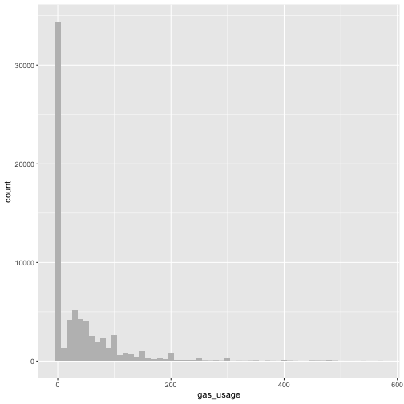

```r
# Note 1: 
#   Load the ggplot2 library, if you haven’t 
#   already done so. 

# Note 2: 
#   binwidth parameterThe binwidth parameter tells the 
#   geom_histogram call how to make bins of ten dollar intervals (default is 
#   datarange/30). The fill parameter specifies the color of the histogram 
#   bars (default: black). 
```


00038_example_3.7_of_section_3.2.1.R


```r
# example 3.7 of section 3.2.1 
# (example 3.7 of section 3.2.1)  : Exploring data : Spotting problems using graphics and visualization : Visually checking distributions for a single variable 
# Title: Producing a density plot 

library(scales)                                      	# Note: 1 
                       
ggplot(customer_data, aes(x=income)) + geom_density() + 
  scale_x_continuous(labels=dollar)                   	# Note: 2
```

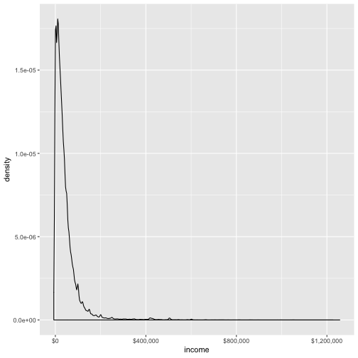

```r
# Note 1: 
#   The scales package brings in the dollar 
#   scale notation. 

# Note 2: 
#   Set the x-axis labels to 
#   dollars. 
```


00039_example_3.8_of_section_3.2.1.R


```r
# example 3.8 of section 3.2.1 
# (example 3.8 of section 3.2.1)  : Exploring data : Spotting problems using graphics and visualization : Visually checking distributions for a single variable 
# Title: Creating a log-scaled density plot 

ggplot(customer_data, aes(x=income)) + 
  geom_density() + 
  scale_x_log10(breaks = c(10, 100, 1000, 10000, 100000, 1000000), labels=dollar) +    	# Note: 1 
  annotation_logticks(sides="bt", color="gray")                                        	# Note: 2
```

```
## Warning in self$trans$transform(x): NaNs produced
```

```
## Warning: Transformation introduced infinite values in continuous x-axis
```

```
## Warning: Removed 6856 rows containing non-finite values (stat_density).
```

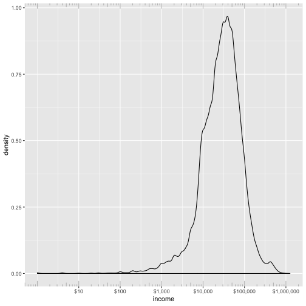

```r
# Note 1: 
#   Set the x-axis to be in log10 scale, with 
#   manually set tick points and labels as dollars. 

# Note 2: 
#   Add log-scaled tick marks to the top and 
#   bottom of the graph. 
```


00041_informalexample_3.2_of_section_3.2.1.R


```r
# informalexample 3.2 of section 3.2.1 
# (informalexample 3.2 of section 3.2.1)  : Exploring data : Spotting problems using graphics and visualization : Visually checking distributions for a single variable 

ggplot(customer_data, aes(x=marital_status)) + geom_bar(fill="gray")
```

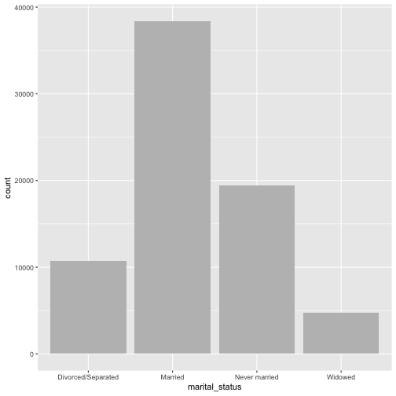


00042_example_3.9_of_section_3.2.1.R


```r
# example 3.9 of section 3.2.1 
# (example 3.9 of section 3.2.1)  : Exploring data : Spotting problems using graphics and visualization : Visually checking distributions for a single variable 
# Title: Producing a horizontal bar chart 

ggplot(customer_data, aes(x=state_of_res)) + 
  geom_bar(fill="gray") +                       	# Note: 1 
  coord_flip()                                  	# Note: 2
```

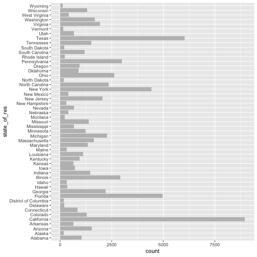

```r
# Note 1: 
#   Plot bar chart as before: state_of_res is on x-axis, count is on y-axis. 

# Note 2: 
#   Flip the x and y axes: state_of_res is 
#   now on the y-axis. 
```


00043_example_3.10_of_section_3.2.1.R


```r
# example 3.10 of section 3.2.1 
# (example 3.10 of section 3.2.1)  : Exploring data : Spotting problems using graphics and visualization : Visually checking distributions for a single variable 
# Title: Producing a dot plot with sorted categories 

library(WVPlots)                                              	# Note: 1 
ClevelandDotPlot(customer_data, "state_of_res",               	# Note: 2 
    sort = 1, title="Customers by state") +                   	# Note: 3 
coord_flip()                                                  	# Note: 4
```

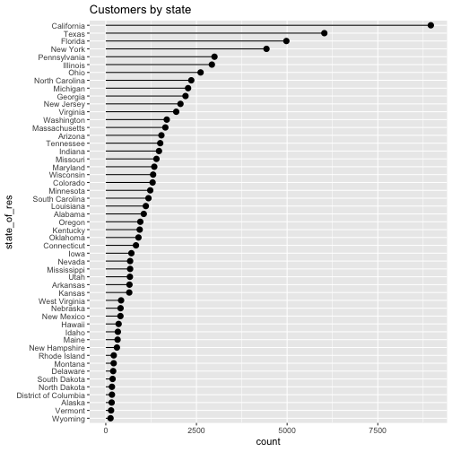

```r
# Note 1: 
#   Load the WVPlots library. 

# Note 2: 
#   Plot the state_of_res column of the customer_data data frame. 

# Note 3: 
#   “sort = 1” sorts the categories in increasing order (most frequent last). 

# Note 4: 
#   Flip the axes as before. 
```


00044_example_3.11_of_section_3.2.2.R


```r
# example 3.11 of section 3.2.2 
# (example 3.11 of section 3.2.2)  : Exploring data : Spotting problems using graphics and visualization : Visually checking relationships between two variables 
# Title: Producing a line plot 

x <- runif(100)                                           	# Note: 1 
y <- x^2 + 0.2*x                                          	# Note: 2 
ggplot(data.frame(x=x,y=y), aes(x=x,y=y)) + geom_line()  	# Note: 3
```

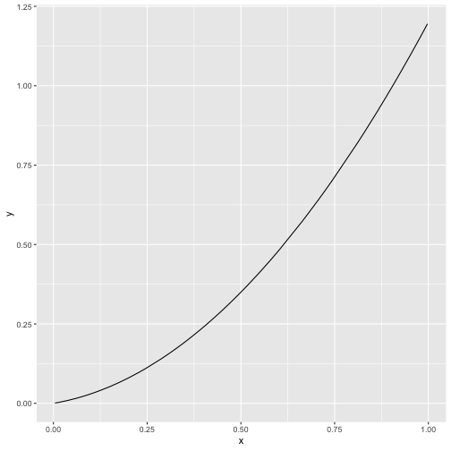

```r
# Note 1: 
#   First, generate the data for this example. 
#   The x variable is uniformly randomly distributed 
#   between 0 and 1. 

# Note 2: 
#   The y variable is a 
#   quadratic function of x. 

# Note 3: 
#   Plot the line plot. 
```


00045_example_3.12_of_section_3.2.2.R


```r
# example 3.12 of section 3.2.2 
# (example 3.12 of section 3.2.2)  : Exploring data : Spotting problems using graphics and visualization : Visually checking relationships between two variables 
# Title: Examining the correlation between age and income 

customer_data2 <- subset(customer_data,
                   0 < age & age < 100 & 
                    0 < income & income < 200000)      	# Note: 1 
                    
cor(customer_data2$age, customer_data2$income)          	# Note: 2 
```

```
## [1] 0.005766697
```

```r
## [1] 0.005766697                                     	# Note: 3

# Note 1: 
#   Only consider a subset of data with 
#   reasonable age and income values. 

# Note 2: 
#   Get correlation of age and income. 

# Note 3: 
#   Resulting correlation is positive but nearly zero. 
```


00046_example_3.13_of_section_3.2.2.R


```r
# example 3.13 of section 3.2.2 
# (example 3.13 of section 3.2.2)  : Exploring data : Spotting problems using graphics and visualization : Visually checking relationships between two variables 
# Title: Creating a scatterplot of age and income 

set.seed(245566)                                                                   	# Note: 1 
customer_data_samp <- dplyr::sample_frac(customer_data2, size=0.1, replace=FALSE)   	# Note: 2 
                    
ggplot(customer_data_samp, aes(x=age, y=income)) +                                  	# Note: 3 
       geom_point() +
       ggtitle("Income as a function of age")
```

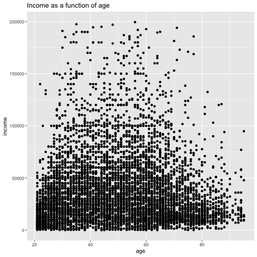

```r
# Note 1: 
#   Make the random sampling reproducible by setting the random seed. 

# Note 2: 
#   For legibility, only plot a 10% sample of the data. We will show how to plot all the data in a following section. 

# Note 3: 
#   Create the scatterplot. 
```


00047_informalexample_3.3_of_section_3.2.2.R


```r
# informalexample 3.3 of section 3.2.2 
# (informalexample 3.3 of section 3.2.2)  : Exploring data : Spotting problems using graphics and visualization : Visually checking relationships between two variables 

ggplot(customer_data_samp, aes(x=age, y=income)) + 
  geom_point() + geom_smooth() +
  ggtitle("Income as a function of age")
```

```
## `geom_smooth()` using method = 'gam' and formula 'y ~ s(x, bs = "cs")'
```

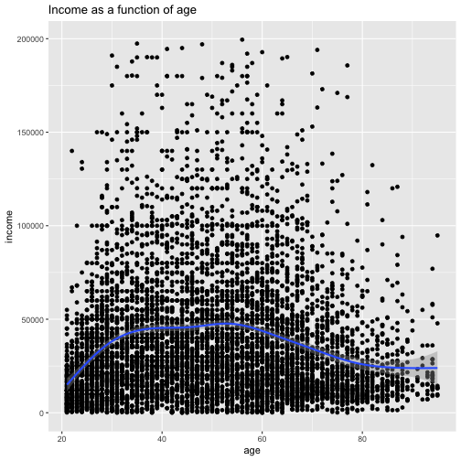


00048_informalexample_3.4_of_section_3.2.2.R


```r
# informalexample 3.4 of section 3.2.2 
# (informalexample 3.4 of section 3.2.2)  : Exploring data : Spotting problems using graphics and visualization : Visually checking relationships between two variables 

BinaryYScatterPlot(customer_data_samp, "age", "health_ins",
                   title = "Probability of health insurance by age")
```

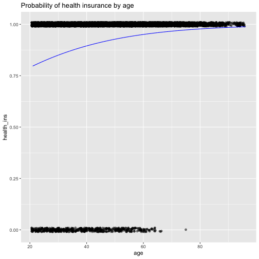


00049_example_3.14_of_section_3.2.2.R


```r
# example 3.14 of section 3.2.2 
# (example 3.14 of section 3.2.2)  : Exploring data : Spotting problems using graphics and visualization : Visually checking relationships between two variables 
# Title: Producing a hexbin plot 

library(WVPlots)                                                             	# Note: 1 
                        
HexBinPlot(customer_data2, "age", "income", "Income as a function of age") +  	# Note: 2 
  geom_smooth(color="black", se=FALSE)                                        	# Note: 3
```

```
## `geom_smooth()` using method = 'gam' and formula 'y ~ s(x, bs = "cs")'
```

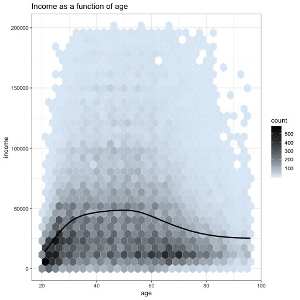

```r
# Note 1: 
#   Load the WVPlots library 

# Note 2: 
#   Plot the hexbin of income as a function of age 

# Note 3: 
#   Add the smoothing line in black; suppress 
#   standard error ribbon (se=FALSE). 
```


00050_example_3.15_of_section_3.2.2.R


```r
# example 3.15 of section 3.2.2 
# (example 3.15 of section 3.2.2)  : Exploring data : Spotting problems using graphics and visualization : Visually checking relationships between two variables 
# Title: Specifying different styles of bar chart 

ggplot(customer_data, aes(x=marital_status, fill=health_ins)) + 
                        geom_bar()                                             	# Note: 1 
```

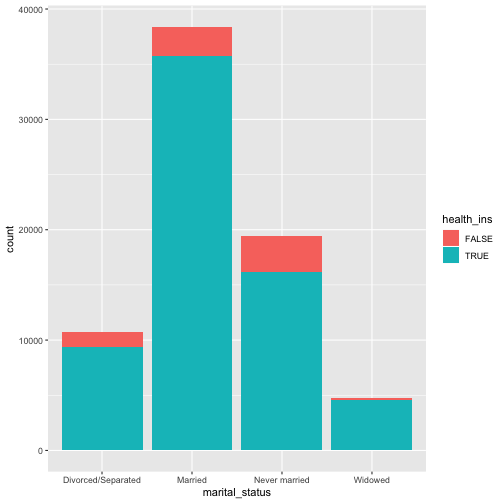

```r
ggplot(customer_data, aes(x=marital_status, fill=health_ins)) + 
                     geom_bar(position = "dodge")                               	# Note: 2 
```

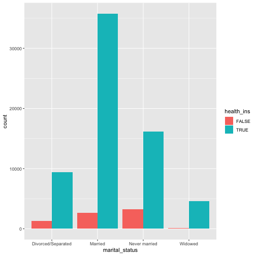

```r
ShadowPlot(customer_data, "marital_status", "health_ins",
                         title = "Health insurance status by marital status")   	# Note: 3 
```

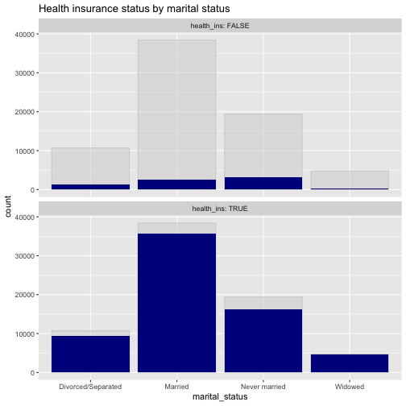

```r
ggplot(customer_data, aes(x=marital_status, fill=health_ins)) + 
                     geom_bar(position = "fill")                                	# Note: 4
```

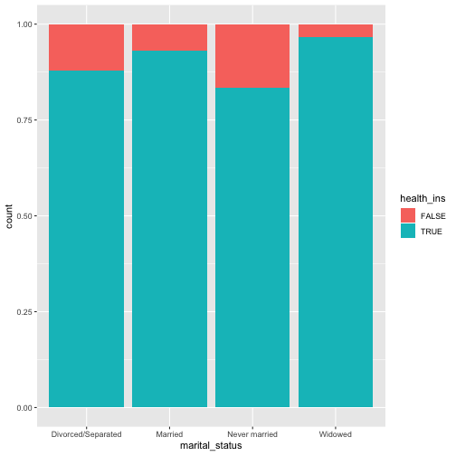

```r
# Note 1: 
#   Stacked bar chart, the 
#   default 

# Note 2: 
#   Side-by-side bar chart 

# Note 3: 
#   Use the ShadowPlot command from the WVPlots package for the shadow plot 

# Note 4: 
#   Filled bar chart 
```


00051_example_3.16_of_section_3.2.2.R


```r
# example 3.16 of section 3.2.2 
# (example 3.16 of section 3.2.2)  : Exploring data : Spotting problems using graphics and visualization : Visually checking relationships between two variables 
# Title: Plotting a bar chart with and without facets 

cdata <- subset(customer_data, !is.na(housing_type))            	# Note: 1 

ggplot(cdata, aes(x=housing_type, fill=marital_status)) + 	# Note: 2 
  geom_bar(position = "dodge") + 
  scale_fill_brewer(palette = "Dark2") + 
  coord_flip()                                            	# Note: 3 
```

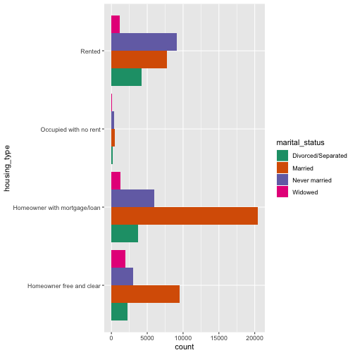

```r
ggplot(cdata, aes(x=marital_status)) +                    	# Note: 4 
  geom_bar(fill="darkgray") + 
  facet_wrap(~housing_type, scale="free_x") +             	# Note: 5 
  coord_flip()                                            	# Note: 6
```

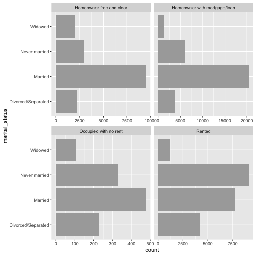

```r
# Note 1: 
#   Restrict to the data where housing_type is known. 

# Note 2: 
#   Side-by-side bar chart. 

# Note 3: 
#   Use coord_flip() to rotate the graph so that marital_status is legible. 

# Note 4: 
#   The faceted bar chart. 

# Note 5: 
#   Facet the graph by housing.type. The scales="free_x" argument specifies that each facet has 
#   an independently scaled x-axis; the default is that all facets have 
#   the same scales on both axes. The argument "free_y" would free the 
#   y-axis scaling, and the argument "free" frees both axes. 

# Note 6: 
#   Use coord_flip() to rotate the graph. 
```


00052_example_3.17_of_section_3.2.2.R


```r
# example 3.17 of section 3.2.2 
# (example 3.17 of section 3.2.2)  : Exploring data : Spotting problems using graphics and visualization : Visually checking relationships between two variables 
# Title: Comparing population densities across categories 

customer_data3 = subset(customer_data2, marital_status %in% c("Never married", "Widowed"))    	# Note: 1 
ggplot(customer_data3, aes(x=age, color=marital_status, linetype=marital_status)) +          	# Note: 2 
  geom_density() + scale_color_brewer(palette="Dark2")
```

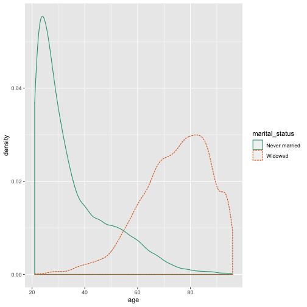

```r
# Note 1: 
#   Restrict to the data for widowed or never married people. 

# Note 2: 
#   Differentiate the color and line style of the plots by marital_status 
```


00053_example_3.18_of_section_3.2.2.R


```r
# example 3.18 of section 3.2.2 
# (example 3.18 of section 3.2.2)  : Exploring data : Spotting problems using graphics and visualization : Visually checking relationships between two variables 
# Title: Comparing population densities across categories with ShadowHist() 

ShadowHist(customer_data3, "age", "marital_status", 
"Age distribution for never married vs. widowed populations",
           binwidth=5)                                    	# Note: 1
```

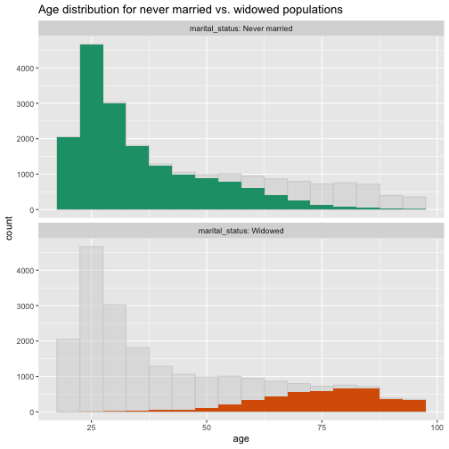

```r
# Note 1: 
#   Set the bin widths of the histogram to 5. 
```


00054_informalexample_3.5_of_section_3.2.2.R


```r
# informalexample 3.5 of section 3.2.2 
# (informalexample 3.5 of section 3.2.2)  : Exploring data : Spotting problems using graphics and visualization : Visually checking relationships between two variables 

ggplot(customer_data2, aes(x=age)) + 
  geom_density() + facet_wrap(~marital_status)
```

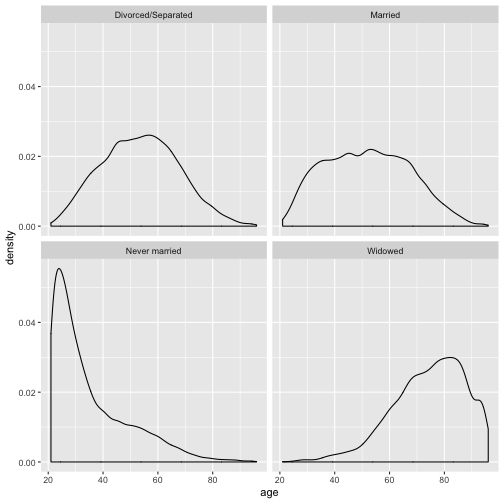


