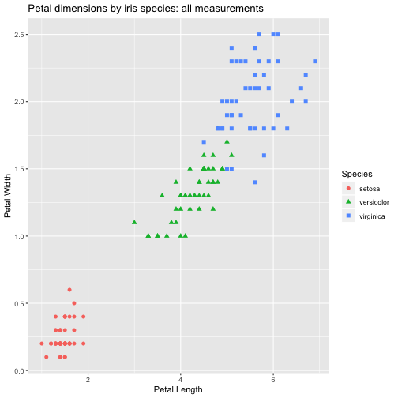
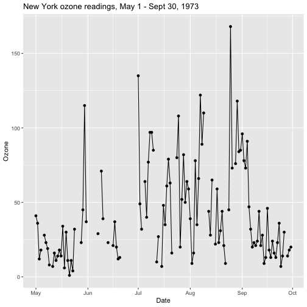
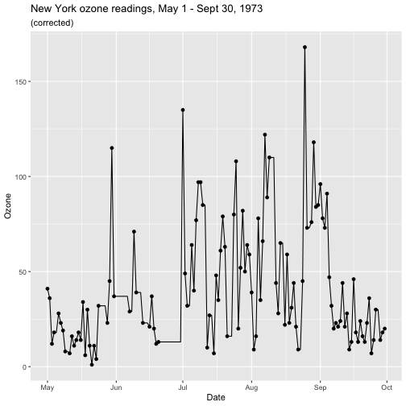
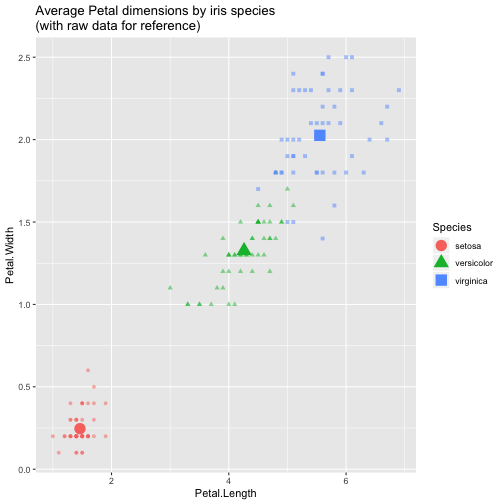
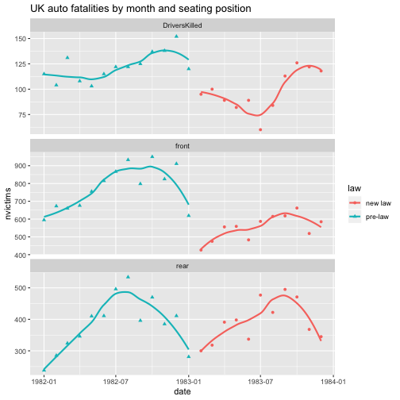
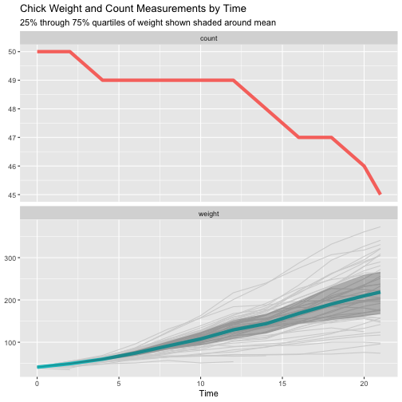

00070_informalexample_5.1_of_section_5.1.1.R


```r
# informalexample 5.1 of section 5.1.1 
# (informalexample 5.1 of section 5.1.1)  : Data engineering and data shaping : Data selection : Sub-setting rows and columns 

library("ggplot2") 	# Note: 1 

summary(iris) 	# Note: 2 
```

```
##   Sepal.Length    Sepal.Width     Petal.Length    Petal.Width   
##  Min.   :4.300   Min.   :2.000   Min.   :1.000   Min.   :0.100  
##  1st Qu.:5.100   1st Qu.:2.800   1st Qu.:1.600   1st Qu.:0.300  
##  Median :5.800   Median :3.000   Median :4.350   Median :1.300  
##  Mean   :5.843   Mean   :3.057   Mean   :3.758   Mean   :1.199  
##  3rd Qu.:6.400   3rd Qu.:3.300   3rd Qu.:5.100   3rd Qu.:1.800  
##  Max.   :7.900   Max.   :4.400   Max.   :6.900   Max.   :2.500  
##        Species  
##  setosa    :50  
##  versicolor:50  
##  virginica :50  
##                 
##                 
## 
```

```r
##   Sepal.Length    Sepal.Width     Petal.Length    Petal.Width   
##  Min.   :4.300   Min.   :2.000   Min.   :1.000   Min.   :0.100  
##  1st Qu.:5.100   1st Qu.:2.800   1st Qu.:1.600   1st Qu.:0.300  
##  Median :5.800   Median :3.000   Median :4.350   Median :1.300  
##  Mean   :5.843   Mean   :3.057   Mean   :3.758   Mean   :1.199  
##  3rd Qu.:6.400   3rd Qu.:3.300   3rd Qu.:5.100   3rd Qu.:1.800  
##  Max.   :7.900   Max.   :4.400   Max.   :6.900   Max.   :2.500  
##
##        Species  
##  setosa    :50  
##  versicolor:50  
##  virginica :50

# Note 1: 
#   Attach the ggplot2 package for later plotting. 

# Note 2: 
#   Take a look at the built-in iris data. 
```


00071_informalexample_5.2_of_section_5.1.1.R


```r
# informalexample 5.2 of section 5.1.1 
# (informalexample 5.2 of section 5.1.1)  : Data engineering and data shaping : Data selection : Sub-setting rows and columns 

head(iris)
```

```
##   Sepal.Length Sepal.Width Petal.Length Petal.Width Species
## 1          5.1         3.5          1.4         0.2  setosa
## 2          4.9         3.0          1.4         0.2  setosa
## 3          4.7         3.2          1.3         0.2  setosa
## 4          4.6         3.1          1.5         0.2  setosa
## 5          5.0         3.6          1.4         0.2  setosa
## 6          5.4         3.9          1.7         0.4  setosa
```

```r
##   Sepal.Length Sepal.Width Petal.Length Petal.Width Species
## 1          5.1         3.5          1.4         0.2  setosa
## 2          4.9         3.0          1.4         0.2  setosa
## 3          4.7         3.2          1.3         0.2  setosa
## 4          4.6         3.1          1.5         0.2  setosa
## 5          5.0         3.6          1.4         0.2  setosa
## 6          5.4         3.9          1.7         0.4  setosa

ggplot(iris, 
       aes(x = Petal.Length, y = Petal.Width, 
           shape = Species, color = Species)) + 
  geom_point(size =2 ) + 
  ggtitle("Petal dimensions by iris species: all measurements")
```




00072_informalexample_5.3_of_section_5.1.1.R


```r
# informalexample 5.3 of section 5.1.1 
# (informalexample 5.3 of section 5.1.1)  : Data engineering and data shaping : Data selection : Sub-setting rows and columns 

columns_we_want <- c("Petal.Length", "Petal.Width", "Species")
rows_we_want <- iris$Petal.Length > 2

# before
head(iris)
```

```
##   Sepal.Length Sepal.Width Petal.Length Petal.Width Species
## 1          5.1         3.5          1.4         0.2  setosa
## 2          4.9         3.0          1.4         0.2  setosa
## 3          4.7         3.2          1.3         0.2  setosa
## 4          4.6         3.1          1.5         0.2  setosa
## 5          5.0         3.6          1.4         0.2  setosa
## 6          5.4         3.9          1.7         0.4  setosa
```

```r
##   Sepal.Length Sepal.Width Petal.Length Petal.Width Species
## 1          5.1         3.5          1.4         0.2  setosa
## 2          4.9         3.0          1.4         0.2  setosa
## 3          4.7         3.2          1.3         0.2  setosa
## 4          4.6         3.1          1.5         0.2  setosa
## 5          5.0         3.6          1.4         0.2  setosa
## 6          5.4         3.9          1.7         0.4  setosa

iris_base <- iris[rows_we_want, columns_we_want, drop = FALSE]

# after
head(iris_base)
```

```
##    Petal.Length Petal.Width    Species
## 51          4.7         1.4 versicolor
## 52          4.5         1.5 versicolor
## 53          4.9         1.5 versicolor
## 54          4.0         1.3 versicolor
## 55          4.6         1.5 versicolor
## 56          4.5         1.3 versicolor
```

```r
##    Petal.Length Petal.Width    Species
## 51          4.7         1.4 versicolor
## 52          4.5         1.5 versicolor
## 53          4.9         1.5 versicolor
## 54          4.0         1.3 versicolor
## 55          4.6         1.5 versicolor
## 56          4.5         1.3 versicolor
```


00073_informalexample_5.4_of_section_5.1.1.R


```r
# informalexample 5.4 of section 5.1.1 
# (informalexample 5.4 of section 5.1.1)  : Data engineering and data shaping : Data selection : Sub-setting rows and columns 

library("data.table")

iris_data.table <- as.data.table(iris)                                	# Note: 1 

columns_we_want <- c("Petal.Length", "Petal.Width", "Species")
rows_we_want <- iris_data.table$Petal.Length > 2

iris_data.table <- iris_data.table[rows_we_want , ..columns_we_want]  	# Note: 2 

head(iris_data.table)
```

```
##    Petal.Length Petal.Width    Species
## 1:          4.7         1.4 versicolor
## 2:          4.5         1.5 versicolor
## 3:          4.9         1.5 versicolor
## 4:          4.0         1.3 versicolor
## 5:          4.6         1.5 versicolor
## 6:          4.5         1.3 versicolor
```

```r
##    Petal.Length Petal.Width    Species
## 1:          4.7         1.4 versicolor
## 2:          4.5         1.5 versicolor
## 3:          4.9         1.5 versicolor
## 4:          4.0         1.3 versicolor
## 5:          4.6         1.5 versicolor
## 6:          4.5         1.3 versicolor

# Note 1: 
#   Convert to data.table class to get data.table semantics. 

# Note 2: 
#   The “..” notation tells data.table that “columns_we_want” isn’t itself the name of a column 
#   but a variable referring to names of columns. 
```


00074_informalexample_5.5_of_section_5.1.1.R


```r
# informalexample 5.5 of section 5.1.1 
# (informalexample 5.5 of section 5.1.1)  : Data engineering and data shaping : Data selection : Sub-setting rows and columns 

library("data.table")

df <- data.frame(x = 1:2, y = 3:4)          	# Note: 1 

df[, x]                                     	# Note: 2 
```

```
## Error in `[.data.frame`(df, , x): object 'x' not found
```

```r
## Error in `[.data.frame`(df, , x) : object 'x' not found

x <- "y"                                	# Note: 3 
dt <- data.table(df)

dt[, x]                                     	# Note: 4 
```

```
## [1] 1 2
```

```r
## [1] 1 2

dt[, ..x]                                   	# Note: 5 
```

```
##    y
## 1: 3
## 2: 4
```

```r
##    y
## 1: 3
## 2: 4

# Note 1: 
#   Example data.frame. 

# Note 2: 
#   Notice writing df[, x] instead of df[, "x"] is an error (assuming x is not bound to a value in 
#   our environment). 

# Note 3: 
#   Set up data.table example. 

# Note 4: 
#   Notice this returns the column x much like d$x would. 

# Note 5: 
#   This uses data.table’s “look up” idiom to get a data.table of columns referred to by the 
#   variable x. 
```


00075_informalexample_5.6_of_section_5.1.1.R


```r
# informalexample 5.6 of section 5.1.1 
# (informalexample 5.6 of section 5.1.1)  : Data engineering and data shaping : Data selection : Sub-setting rows and columns 

library("dplyr")
```

```
## 
## Attaching package: 'dplyr'
```

```
## The following objects are masked from 'package:data.table':
## 
##     between, first, last
```

```
## The following objects are masked from 'package:stats':
## 
##     filter, lag
```

```
## The following objects are masked from 'package:base':
## 
##     intersect, setdiff, setequal, union
```

```r
iris_dplyr <- iris %>% 
  select(.,
         Petal.Length, Petal.Width, Species) %>%
  filter(.,
         Petal.Length > 2)

head(iris_dplyr)
```

```
##   Petal.Length Petal.Width    Species
## 1          4.7         1.4 versicolor
## 2          4.5         1.5 versicolor
## 3          4.9         1.5 versicolor
## 4          4.0         1.3 versicolor
## 5          4.6         1.5 versicolor
## 6          4.5         1.3 versicolor
```

```r
##   Petal.Length Petal.Width    Species
## 1          4.7         1.4 versicolor
## 2          4.5         1.5 versicolor
## 3          4.9         1.5 versicolor
## 4          4.0         1.3 versicolor
## 5          4.6         1.5 versicolor
## 6          4.5         1.3 versicolor
```


00076_informalexample_5.7_of_section_5.1.2.R


```r
# informalexample 5.7 of section 5.1.2 
# (informalexample 5.7 of section 5.1.2)  : Data engineering and data shaping : Data selection : Removing records with incomplete data 

library("ggplot2")
data(msleep)                         	# Note: 1 

str(msleep)
```

```
## Classes 'tbl_df', 'tbl' and 'data.frame':	83 obs. of  11 variables:
##  $ name        : chr  "Cheetah" "Owl monkey" "Mountain beaver" "Greater short-tailed shrew" ...
##  $ genus       : chr  "Acinonyx" "Aotus" "Aplodontia" "Blarina" ...
##  $ vore        : chr  "carni" "omni" "herbi" "omni" ...
##  $ order       : chr  "Carnivora" "Primates" "Rodentia" "Soricomorpha" ...
##  $ conservation: chr  "lc" NA "nt" "lc" ...
##  $ sleep_total : num  12.1 17 14.4 14.9 4 14.4 8.7 7 10.1 3 ...
##  $ sleep_rem   : num  NA 1.8 2.4 2.3 0.7 2.2 1.4 NA 2.9 NA ...
##  $ sleep_cycle : num  NA NA NA 0.133 0.667 ...
##  $ awake       : num  11.9 7 9.6 9.1 20 9.6 15.3 17 13.9 21 ...
##  $ brainwt     : num  NA 0.0155 NA 0.00029 0.423 NA NA NA 0.07 0.0982 ...
##  $ bodywt      : num  50 0.48 1.35 0.019 600 ...
```

```r
## Classes 'tbl_df', 'tbl' and 'data.frame':    83 obs. of  11 variables:
##  $ name        : chr  "Cheetah" "Owl monkey" "Mountain beaver" "Greater short-tailed shrew" ...
##  $ genus       : chr  "Acinonyx" "Aotus" "Aplodontia" "Blarina" ...
##  $ vore        : chr  "carni" "omni" "herbi" "omni" ...
##  $ order       : chr  "Carnivora" "Primates" "Rodentia" "Soricomorpha" ...
##  $ conservation: chr  "lc" NA "nt" "lc" ...
##  $ sleep_total : num  12.1 17 14.4 14.9 4 14.4 8.7 7 10.1 3 ...
##  $ sleep_rem   : num  NA 1.8 2.4 2.3 0.7 2.2 1.4 NA 2.9 NA ...
##  $ sleep_cycle : num  NA NA NA 0.133 0.667 ...
##  $ awake       : num  11.9 7 9.6 9.1 20 9.6 15.3 17 13.9 21 ...
##  $ brainwt     : num  NA 0.0155 NA 0.00029 0.423 NA NA NA 0.07 0.0982 ...
##  $ bodywt      : num  50 0.48 1.35 0.019 600 ...

# Note 1: 
#   Copy the msleep from the ggplot2 package into our workspace. 
```


00077_informalexample_5.8_of_section_5.1.2.R


```r
# informalexample 5.8 of section 5.1.2 
# (informalexample 5.8 of section 5.1.2)  : Data engineering and data shaping : Data selection : Removing records with incomplete data 

summary(msleep)
```

```
##      name              genus               vore          
##  Length:83          Length:83          Length:83         
##  Class :character   Class :character   Class :character  
##  Mode  :character   Mode  :character   Mode  :character  
##                                                          
##                                                          
##                                                          
##                                                          
##     order           conservation        sleep_total      sleep_rem    
##  Length:83          Length:83          Min.   : 1.90   Min.   :0.100  
##  Class :character   Class :character   1st Qu.: 7.85   1st Qu.:0.900  
##  Mode  :character   Mode  :character   Median :10.10   Median :1.500  
##                                        Mean   :10.43   Mean   :1.875  
##                                        3rd Qu.:13.75   3rd Qu.:2.400  
##                                        Max.   :19.90   Max.   :6.600  
##                                                        NA's   :22     
##   sleep_cycle         awake          brainwt            bodywt        
##  Min.   :0.1167   Min.   : 4.10   Min.   :0.00014   Min.   :   0.005  
##  1st Qu.:0.1833   1st Qu.:10.25   1st Qu.:0.00290   1st Qu.:   0.174  
##  Median :0.3333   Median :13.90   Median :0.01240   Median :   1.670  
##  Mean   :0.4396   Mean   :13.57   Mean   :0.28158   Mean   : 166.136  
##  3rd Qu.:0.5792   3rd Qu.:16.15   3rd Qu.:0.12550   3rd Qu.:  41.750  
##  Max.   :1.5000   Max.   :22.10   Max.   :5.71200   Max.   :6654.000  
##  NA's   :51                       NA's   :27
```

```r
##      name              genus               vore          
##  Length:83          Length:83          Length:83         
##  Class :character   Class :character   Class :character  
##  Mode  :character   Mode  :character   Mode  :character  
##                                                          
##                                                          
##                                                          
##                                                          
##     order           conservation        sleep_total      sleep_rem    
##  Length:83          Length:83          Min.   : 1.90   Min.   :0.100  
##  Class :character   Class :character   1st Qu.: 7.85   1st Qu.:0.900  
##  Mode  :character   Mode  :character   Median :10.10   Median :1.500  
##                                        Mean   :10.43   Mean   :1.875  
##                                        3rd Qu.:13.75   3rd Qu.:2.400  
##                                        Max.   :19.90   Max.   :6.600  
##                                                        NA's   :22     
##   sleep_cycle         awake          brainwt            bodywt        
##  Min.   :0.1167   Min.   : 4.10   Min.   :0.00014   Min.   :   0.005  
##  1st Qu.:0.1833   1st Qu.:10.25   1st Qu.:0.00290   1st Qu.:   0.174  
##  Median :0.3333   Median :13.90   Median :0.01240   Median :   1.670  
##  Mean   :0.4396   Mean   :13.57   Mean   :0.28158   Mean   : 166.136  
##  3rd Qu.:0.5792   3rd Qu.:16.15   3rd Qu.:0.12550   3rd Qu.:  41.750  
##  Max.   :1.5000   Max.   :22.10   Max.   :5.71200   Max.   :6654.000  
##  NA's   :51                       NA's   :27
```


00078_informalexample_5.9_of_section_5.1.2.R


```r
# informalexample 5.9 of section 5.1.2 
# (informalexample 5.9 of section 5.1.2)  : Data engineering and data shaping : Data selection : Removing records with incomplete data 

clean_base_1 <- msleep[complete.cases(msleep), , drop = FALSE]

summary(clean_base_1)
```

```
##      name              genus               vore          
##  Length:20          Length:20          Length:20         
##  Class :character   Class :character   Class :character  
##  Mode  :character   Mode  :character   Mode  :character  
##                                                          
##                                                          
##                                                          
##     order           conservation        sleep_total       sleep_rem    
##  Length:20          Length:20          Min.   : 2.900   Min.   :0.600  
##  Class :character   Class :character   1st Qu.: 8.925   1st Qu.:1.300  
##  Mode  :character   Mode  :character   Median :11.300   Median :2.350  
##                                        Mean   :11.225   Mean   :2.275  
##                                        3rd Qu.:13.925   3rd Qu.:3.125  
##                                        Max.   :19.700   Max.   :4.900  
##   sleep_cycle         awake          brainwt            bodywt        
##  Min.   :0.1167   Min.   : 4.30   Min.   :0.00014   Min.   :  0.0050  
##  1st Qu.:0.1792   1st Qu.:10.07   1st Qu.:0.00115   1st Qu.:  0.0945  
##  Median :0.2500   Median :12.70   Median :0.00590   Median :  0.7490  
##  Mean   :0.3458   Mean   :12.78   Mean   :0.07882   Mean   : 72.1177  
##  3rd Qu.:0.4167   3rd Qu.:15.07   3rd Qu.:0.03670   3rd Qu.:  6.1250  
##  Max.   :1.0000   Max.   :21.10   Max.   :0.65500   Max.   :600.0000
```

```r
##      name              genus               vore          
##  Length:20          Length:20          Length:20         
##  Class :character   Class :character   Class :character  
##  Mode  :character   Mode  :character   Mode  :character  
##                                                          
##                                                          
##                                                          
##     order           conservation        sleep_total       sleep_rem    
##  Length:20          Length:20          Min.   : 2.900   Min.   :0.600  
##  Class :character   Class :character   1st Qu.: 8.925   1st Qu.:1.300  
##  Mode  :character   Mode  :character   Median :11.300   Median :2.350  
##                                        Mean   :11.225   Mean   :2.275  
##                                        3rd Qu.:13.925   3rd Qu.:3.125  
##                                        Max.   :19.700   Max.   :4.900  
##   sleep_cycle         awake          brainwt            bodywt        
##  Min.   :0.1167   Min.   : 4.30   Min.   :0.00014   Min.   :  0.0050  
##  1st Qu.:0.1792   1st Qu.:10.07   1st Qu.:0.00115   1st Qu.:  0.0945  
##  Median :0.2500   Median :12.70   Median :0.00590   Median :  0.7490  
##  Mean   :0.3458   Mean   :12.78   Mean   :0.07882   Mean   : 72.1177  
##  3rd Qu.:0.4167   3rd Qu.:15.07   3rd Qu.:0.03670   3rd Qu.:  6.1250  
##  Max.   :1.0000   Max.   :21.10   Max.   :0.65500   Max.   :600.0000

nrow(clean_base_1)
```

```
## [1] 20
```

```r
## [1] 20

clean_base_2 = na.omit(msleep)
nrow(clean_base_2)
```

```
## [1] 20
```

```r
## [1] 20
```


00079_informalexample_5.10_of_section_5.1.2.R


```r
# informalexample 5.10 of section 5.1.2 
# (informalexample 5.10 of section 5.1.2)  : Data engineering and data shaping : Data selection : Removing records with incomplete data 

library("data.table")

msleep_data.table <- as.data.table(msleep)

clean_data.table = msleep_data.table[complete.cases(msleep_data.table), ]

nrow(clean_data.table)
```

```
## [1] 20
```

```r
## [1] 20
```


00080_informalexample_5.11_of_section_5.1.2.R


```r
# informalexample 5.11 of section 5.1.2 
# (informalexample 5.11 of section 5.1.2)  : Data engineering and data shaping : Data selection : Removing records with incomplete data 

library("dplyr")

clean_dplyr <- msleep %>% 
  filter(., complete.cases(.))

nrow(clean_dplyr)
```

```
## [1] 20
```

```r
## [1] 20
```


00081_informalexample_5.12_of_section_5.1.3.R


```r
# informalexample 5.12 of section 5.1.3 
# (informalexample 5.12 of section 5.1.3)  : Data engineering and data shaping : Data selection : Ordering rows 

purchases <- wrapr::build_frame(                 	# Note: 1 
   "day", "hour", "n_purchase" |
   1    , 9     , 5            |
   2    , 9     , 3            |
   2    , 11    , 5            |
   1    , 13    , 1            |
   2    , 13    , 3            |
   1    , 14    , 1            )

# Note 1: 
#   Use wrapr::build_frame to type data in directly in legible column order. 
```


00082_informalexample_5.13_of_section_5.1.3.R


```r
# informalexample 5.13 of section 5.1.3 
# (informalexample 5.13 of section 5.1.3)  : Data engineering and data shaping : Data selection : Ordering rows 

order_index <- with(purchases, order(day, hour))                        	# Note: 1 
  
purchases_ordered <- purchases[order_index, , drop = FALSE]
purchases_ordered$running_total <- cumsum(purchases_ordered$n_purchase) 	# Note: 2 

purchases_ordered
```

```
##   day hour n_purchase running_total
## 1   1    9          5             5
## 4   1   13          1             6
## 6   1   14          1             7
## 2   2    9          3            10
## 3   2   11          5            15
## 5   2   13          3            18
```

```r
##   day hour n_purchase running_total
## 1   1    9          5             5
## 4   1   13          1             6
## 6   1   14          1             7
## 2   2    9          3            10
## 3   2   11          5            15
## 5   2   13          3            18

# Note 1: 
#   with() executes the code in its second argument as if the columns of the first argument were 
#   variables. This lets us write “x” instead of “order$x”. 

# Note 2: 
#   Compute the running sum. 
```


00083_informalexample_5.14_of_section_5.1.3.R


```r
# informalexample 5.14 of section 5.1.3 
# (informalexample 5.14 of section 5.1.3)  : Data engineering and data shaping : Data selection : Ordering rows 

library("data.table")

DT_purchases <- as.data.table(purchases)

order_cols <- c("day", "hour")            	# Note: 1 
setorderv(DT_purchases, order_cols)

DT_purchases[ , running_total := cumsum(n_purchase)]

# print(DT_purchases)

# Note 1: 
#   Re-order data 
```


00084_informalexample_5.15_of_section_5.1.3.R


```r
# informalexample 5.15 of section 5.1.3 
# (informalexample 5.15 of section 5.1.3)  : Data engineering and data shaping : Data selection : Ordering rows 

library("dplyr")

res <- purchases %>%
  arrange(., day, hour) %>%
  mutate(., running_total = cumsum(n_purchase))
  
# print(res)
```


00085_informalexample_5.16_of_section_5.1.3.R


```r
# informalexample 5.16 of section 5.1.3 
# (informalexample 5.16 of section 5.1.3)  : Data engineering and data shaping : Data selection : Ordering rows 

order_index <- with(purchases, order(day, hour))                	# Note: 1 
purchases_ordered <- purchases[order_index, , drop = FALSE]

data_list <- split(purchases_ordered, purchases_ordered$day)    	# Note: 2 

data_list <- lapply(                                            	# Note: 3 
  data_list,
  function(di) {
    di$running_total <- cumsum(di$n_purchase)
    di
  })

purchases_ordered <- do.call(base::rbind, data_list)            	# Note: 4 
rownames(purchases_ordered) <- NULL                             	# Note: 5 

purchases_ordered
```

```
##   day hour n_purchase running_total
## 1   1    9          5             5
## 2   1   13          1             6
## 3   1   14          1             7
## 4   2    9          3             3
## 5   2   11          5             8
## 6   2   13          3            11
```

```r
##   day hour n_purchase running_total
## 1   1    9          5             5
## 2   1   13          1             6
## 3   1   14          1             7
## 4   2    9          3             3
## 5   2   11          5             8
## 6   2   13          3            11

# Note 1: 
#   First: sort the data. 

# Note 2: 
#   Now split data into a list of groups. 

# Note 3: 
#   Apply the cumsum to each group. 

# Note 4: 
#   Put the results back to together into a single data.frame. 

# Note 5: 
#   R often keeps annotations in the rownames(). In this case it is storing the original row 
#   numbers of the pieces we are assembling. This can confuse users when printing, so 
#   it is good practice to remove these annotations as we do here. 
```


00086_informalexample_5.17_of_section_5.1.3.R


```r
# informalexample 5.17 of section 5.1.3 
# (informalexample 5.17 of section 5.1.3)  : Data engineering and data shaping : Data selection : Ordering rows 

library("data.table")

# new copy for result solution
DT_purchases <- as.data.table(purchases)[order(day, hour), 
             .(hour = hour,
               n_purchase = n_purchase, 
               running_total = cumsum(n_purchase)),
             by = "day"]                      	# Note: 1 
# print(DT_purchases)                             	# Note: 2 

# in-place solution
DT_purchases <- as.data.table(purchases)
order_cols <- c("day", "hour")
setorderv(DT_purchases, order_cols)
DT_purchases[ , running_total := cumsum(n_purchase), by = day]
# print(DT_purchases)                              	# Note: 3 

# don't reorder the actual data variation!
DT_purchases <- as.data.table(purchases)
DT_purchases[order(day, hour), 
             `:=`(hour = hour,
               n_purchase = n_purchase, 
               running_total = cumsum(n_purchase)),
             by = "day"]
# print(DT_purchases)                               	# Note: 4

# Note 1: 
#   Adding the “by” keyword converts the calculation into a per-group calculation.. 

# Note 2: 
#   First solution: result is a second copy of the data .(=) notation. Only columns used in the 
#   calculation (such as “day”) and those explicitly assigned to are in the 
#   result. 

# Note 3: 
#   Second solution: result is computed in-place by ordering the table before the grouped 
#   calculation. 

# Note 4: 
#   Third solution: result is in same order as the original table, but the cumulative some is 
#   computed as if we sorted the table, computed the grouped 
#   running sum, and then returned the table to the original order. 
```


00087_informalexample_5.18_of_section_5.1.3.R


```r
# informalexample 5.18 of section 5.1.3 
# (informalexample 5.18 of section 5.1.3)  : Data engineering and data shaping : Data selection : Ordering rows 

library("dplyr")

res <- purchases %>%
  arrange(., day, hour) %>%
  group_by(., day) %>%
  mutate(., running_total = cumsum(n_purchase)) %>%
  ungroup(.)

# print(res)
```


00088_informalexample_5.19_of_section_5.2.1.R


```r
# informalexample 5.19 of section 5.2.1 
# (informalexample 5.19 of section 5.2.1)  : Data engineering and data shaping : Basic data transforms : Add new columns 

library("datasets")
library("ggplot2")

summary(airquality)
```

```
##      Ozone           Solar.R           Wind             Temp      
##  Min.   :  1.00   Min.   :  7.0   Min.   : 1.700   Min.   :56.00  
##  1st Qu.: 18.00   1st Qu.:115.8   1st Qu.: 7.400   1st Qu.:72.00  
##  Median : 31.50   Median :205.0   Median : 9.700   Median :79.00  
##  Mean   : 42.13   Mean   :185.9   Mean   : 9.958   Mean   :77.88  
##  3rd Qu.: 63.25   3rd Qu.:258.8   3rd Qu.:11.500   3rd Qu.:85.00  
##  Max.   :168.00   Max.   :334.0   Max.   :20.700   Max.   :97.00  
##  NA's   :37       NA's   :7                                       
##      Month            Day      
##  Min.   :5.000   Min.   : 1.0  
##  1st Qu.:6.000   1st Qu.: 8.0  
##  Median :7.000   Median :16.0  
##  Mean   :6.993   Mean   :15.8  
##  3rd Qu.:8.000   3rd Qu.:23.0  
##  Max.   :9.000   Max.   :31.0  
## 
```

```r
##      Ozone           Solar.R           Wind             Temp      
##  Min.   :  1.00   Min.   :  7.0   Min.   : 1.700   Min.   :56.00  
##  1st Qu.: 18.00   1st Qu.:115.8   1st Qu.: 7.400   1st Qu.:72.00  
##  Median : 31.50   Median :205.0   Median : 9.700   Median :79.00  
##  Mean   : 42.13   Mean   :185.9   Mean   : 9.958   Mean   :77.88  
##  3rd Qu.: 63.25   3rd Qu.:258.8   3rd Qu.:11.500   3rd Qu.:85.00  
##  Max.   :168.00   Max.   :334.0   Max.   :20.700   Max.   :97.00  
##  NA's   :37       NA's   :7                                       
##      Month            Day      
##  Min.   :5.000   Min.   : 1.0  
##  1st Qu.:6.000   1st Qu.: 8.0  
##  Median :7.000   Median :16.0  
##  Mean   :6.993   Mean   :15.8  
##  3rd Qu.:8.000   3rd Qu.:23.0  
##  Max.   :9.000   Max.   :31.0  
##
```


00089_informalexample_5.20_of_section_5.2.1.R


```r
# informalexample 5.20 of section 5.2.1 
# (informalexample 5.20 of section 5.2.1)  : Data engineering and data shaping : Basic data transforms : Add new columns 

library("lubridate")
```

```
## 
## Attaching package: 'lubridate'
```

```
## The following objects are masked from 'package:data.table':
## 
##     hour, isoweek, mday, minute, month, quarter, second, wday,
##     week, yday, year
```

```
## The following object is masked from 'package:base':
## 
##     date
```

```r
library("ggplot2")

# create a function to make the date string.
datestr = function(day, month, year) {
  paste(day, month, year, sep="-")
}
```


00090_informalexample_5.21_of_section_5.2.1.R


```r
# informalexample 5.21 of section 5.2.1 
# (informalexample 5.21 of section 5.2.1)  : Data engineering and data shaping : Basic data transforms : Add new columns 

airquality_with_date <- airquality                              	# Note: 1 

airquality_with_date$date <- with(airquality_with_date,         	# Note: 2 
                                  dmy(datestr(Day, Month, 1973)))

airquality_with_date <- airquality_with_date[,                 	# Note: 3 
                                             c("Ozone", "date"),
                                             drop = FALSE]

head(airquality_with_date)                                      	# Note: 4 
```

```
##   Ozone       date
## 1    41 1973-05-01
## 2    36 1973-05-02
## 3    12 1973-05-03
## 4    18 1973-05-04
## 5    NA 1973-05-05
## 6    28 1973-05-06
```

```r
##   Ozone       date
## 1    41 1973-05-01
## 2    36 1973-05-02
## 3    12 1973-05-03
## 4    18 1973-05-04
## 5    NA 1973-05-05
## 6    28 1973-05-06        

ggplot(airquality_with_date, aes(x = date, y = Ozone)) +        	# Note: 5 
  geom_point() + 
  geom_line() + 
  xlab("Date") +
  ggtitle("New York ozone readings, May 1 - Sept 30, 1973")
```

```
## Warning: Removed 37 rows containing missing values (geom_point).
```



```r
# Note 1: 
#   Build a copy of the data. 

# Note 2: 
#   Add the date column, with “with()” to refer to columns without needing the table name. 

# Note 3: 
#   Limit down to columns of interest. 

# Note 4: 
#   Show the results. 

# Note 5: 
#   Plot the results. 
```


00091_informalexample_5.22_of_section_5.2.1.R


```r
# informalexample 5.22 of section 5.2.1 
# (informalexample 5.22 of section 5.2.1)  : Data engineering and data shaping : Basic data transforms : Add new columns 

library("wrapr")                                 	# Note: 1 
```

```
## 
## Attaching package: 'wrapr'
```

```
## The following object is masked from 'package:dplyr':
## 
##     coalesce
```

```
## The following object is masked from 'package:data.table':
## 
##     :=
```

```r
airquality %.>%                                    	# Note: 2 
  transform(., date = dmy(datestr(Day, Month, 1973))) %.>%
  subset(., !is.na(Ozone), select =  c("Ozone", "date")) %.>%
  head(.)
```

```
##   Ozone       date
## 1    41 1973-05-01
## 2    36 1973-05-02
## 3    12 1973-05-03
## 4    18 1973-05-04
## 6    28 1973-05-06
## 7    23 1973-05-07
```

```r
##   Ozone       date
## 1    41 1973-05-01
## 2    36 1973-05-02
## 3    12 1973-05-03
## 4    18 1973-05-04
## 6    28 1973-05-06
## 7    23 1973-05-07

# Note 1: 
#   Attach the wrapr package to define the wrapr dot arrow pipe: %.>%. The dot arrow pipe is 
#   another R pipe and is described in the R Journal at 
#   https://journal.r-project.org/archive/2018/RJ-2018-042/index.html 

# Note 2: 
#   Run all the steps as before using transform() and subset(), adding an extra step of filtering 
#   down to rows that do not have missing Ozone values. 
```


00092_informalexample_5.23_of_section_5.2.1.R


```r
# informalexample 5.23 of section 5.2.1 
# (informalexample 5.23 of section 5.2.1)  : Data engineering and data shaping : Basic data transforms : Add new columns 

library("data.table")

DT_airquality <- 
  as.data.table(airquality)[                        	# Note: 1 
    , date := dmy(datestr(Day, Month, 1973)) ][     	# Note: 2 
      , c("Ozone", "date")]                 	# Note: 3 

head(DT_airquality)
```

```
##    Ozone       date
## 1:    41 1973-05-01
## 2:    36 1973-05-02
## 3:    12 1973-05-03
## 4:    18 1973-05-04
## 5:    NA 1973-05-05
## 6:    28 1973-05-06
```

```r
##    Ozone       date
## 1:    41 1973-05-01
## 2:    36 1973-05-02
## 3:    12 1973-05-03
## 4:    18 1973-05-04
## 5:    NA 1973-05-05
## 6:    28 1973-05-06

# Note 1: 
#   Build a data.table copy of the data. 

# Note 2: 
#   Add the date column. 

# Note 3: 
#   Limit down to columns of interest. 
```


00093_informalexample_5.24_of_section_5.2.1.R


```r
# informalexample 5.24 of section 5.2.1 
# (informalexample 5.24 of section 5.2.1)  : Data engineering and data shaping : Basic data transforms : Add new columns 

library("dplyr")

airquality_with_date2 <- airquality %>%
  mutate(., date = dmy(datestr(Day, Month, 1973))) %>%
  select(., Ozone, date)

head(airquality_with_date2)
```

```
##   Ozone       date
## 1    41 1973-05-01
## 2    36 1973-05-02
## 3    12 1973-05-03
## 4    18 1973-05-04
## 5    NA 1973-05-05
## 6    28 1973-05-06
```

```r
##   Ozone       date
## 1    41 1973-05-01
## 2    36 1973-05-02
## 3    12 1973-05-03
## 4    18 1973-05-04
## 5    NA 1973-05-05
## 6    28 1973-05-06
```


00094_informalexample_5.25_of_section_5.2.1.R


```r
# informalexample 5.25 of section 5.2.1 
# (informalexample 5.25 of section 5.2.1)  : Data engineering and data shaping : Basic data transforms : Add new columns 

library("zoo")
```

```
## 
## Attaching package: 'zoo'
```

```
## The following objects are masked from 'package:base':
## 
##     as.Date, as.Date.numeric
```

```r
airquality_corrected <- airquality_with_date
airquality_corrected$OzoneCorrected <-
  na.locf(airquality_corrected$Ozone, na.rm = FALSE)

summary(airquality_corrected)
```

```
##      Ozone             date            OzoneCorrected  
##  Min.   :  1.00   Min.   :1973-05-01   Min.   :  1.00  
##  1st Qu.: 18.00   1st Qu.:1973-06-08   1st Qu.: 16.00  
##  Median : 31.50   Median :1973-07-16   Median : 30.00  
##  Mean   : 42.13   Mean   :1973-07-16   Mean   : 39.78  
##  3rd Qu.: 63.25   3rd Qu.:1973-08-23   3rd Qu.: 52.00  
##  Max.   :168.00   Max.   :1973-09-30   Max.   :168.00  
##  NA's   :37
```

```r
##      Ozone             date            OzoneCorrected  
##  Min.   :  1.00   Min.   :1973-05-01   Min.   :  1.00  
##  1st Qu.: 18.00   1st Qu.:1973-06-08   1st Qu.: 16.00  
##  Median : 31.50   Median :1973-07-16   Median : 30.00  
##  Mean   : 42.13   Mean   :1973-07-16   Mean   : 39.78  
##  3rd Qu.: 63.25   3rd Qu.:1973-08-23   3rd Qu.: 52.00  
##  Max.   :168.00   Max.   :1973-09-30   Max.   :168.00  
##  NA's   :37

ggplot(airquality_corrected, aes(x = date, y = Ozone)) + 
  geom_point(aes(y=Ozone)) + 
  geom_line(aes(y=OzoneCorrected)) + 
  ggtitle("New York ozone readings, May 1 - Sept 30, 1973",
          subtitle = "(corrected)") +
  xlab("Date")
```

```
## Warning: Removed 37 rows containing missing values (geom_point).
```




00095_informalexample_5.26_of_section_5.2.1.R


```r
# informalexample 5.26 of section 5.2.1 
# (informalexample 5.26 of section 5.2.1)  : Data engineering and data shaping : Basic data transforms : Add new columns 

library("data.table")
library("zoo")

DT_airquality[, OzoneCorrected := na.locf(Ozone, na.rm=FALSE)]

summary(DT_airquality)
```

```
##      Ozone             date            OzoneCorrected  
##  Min.   :  1.00   Min.   :1973-05-01   Min.   :  1.00  
##  1st Qu.: 18.00   1st Qu.:1973-06-08   1st Qu.: 16.00  
##  Median : 31.50   Median :1973-07-16   Median : 30.00  
##  Mean   : 42.13   Mean   :1973-07-16   Mean   : 39.78  
##  3rd Qu.: 63.25   3rd Qu.:1973-08-23   3rd Qu.: 52.00  
##  Max.   :168.00   Max.   :1973-09-30   Max.   :168.00  
##  NA's   :37
```

```r
##      Ozone             date            OzoneCorrected  
##  Min.   :  1.00   Min.   :1973-05-01   Min.   :  1.00  
##  1st Qu.: 18.00   1st Qu.:1973-06-08   1st Qu.: 16.00  
##  Median : 31.50   Median :1973-07-16   Median : 30.00  
##  Mean   : 42.13   Mean   :1973-07-16   Mean   : 39.78  
##  3rd Qu.: 63.25   3rd Qu.:1973-08-23   3rd Qu.: 52.00  
##  Max.   :168.00   Max.   :1973-09-30   Max.   :168.00  
##  NA's   :37
```


00096_informalexample_5.27_of_section_5.2.1.R


```r
# informalexample 5.27 of section 5.2.1 
# (informalexample 5.27 of section 5.2.1)  : Data engineering and data shaping : Basic data transforms : Add new columns 

library("dplyr")
library("zoo")

airquality_with_date %>% 
  mutate(.,
         OzoneCorrected = na.locf(Ozone, na.rm = FALSE)) %>% 
  summary(.)
```

```
##      Ozone             date            OzoneCorrected  
##  Min.   :  1.00   Min.   :1973-05-01   Min.   :  1.00  
##  1st Qu.: 18.00   1st Qu.:1973-06-08   1st Qu.: 16.00  
##  Median : 31.50   Median :1973-07-16   Median : 30.00  
##  Mean   : 42.13   Mean   :1973-07-16   Mean   : 39.78  
##  3rd Qu.: 63.25   3rd Qu.:1973-08-23   3rd Qu.: 52.00  
##  Max.   :168.00   Max.   :1973-09-30   Max.   :168.00  
##  NA's   :37
```

```r
##      Ozone             date            OzoneCorrected  
##  Min.   :  1.00   Min.   :1973-05-01   Min.   :  1.00  
##  1st Qu.: 18.00   1st Qu.:1973-06-08   1st Qu.: 16.00  
##  Median : 31.50   Median :1973-07-16   Median : 30.00  
##  Mean   : 42.13   Mean   :1973-07-16   Mean   : 39.78  
##  3rd Qu.: 63.25   3rd Qu.:1973-08-23   3rd Qu.: 52.00  
##  Max.   :168.00   Max.   :1973-09-30   Max.   :168.00  
##  NA's   :37
```


00097_informalexample_5.28_of_section_5.2.2.R


```r
# informalexample 5.28 of section 5.2.2 
# (informalexample 5.28 of section 5.2.2)  : Data engineering and data shaping : Basic data transforms : Other simple operations 

d <- data.frame(x = 1:2, y = 3:4)
print(d)
```

```
##   x y
## 1 1 3
## 2 2 4
```

```r
#>   x y
#> 1 1 3
#> 2 2 4

colnames(d) <- c("BIGX", "BIGY")
print(d)
```

```
##   BIGX BIGY
## 1    1    3
## 2    2    4
```

```r
#>   BIGX BIGY
#> 1    1    3
#> 2    2    4

d$BIGX <- NULL
print(d)
```

```
##   BIGY
## 1    3
## 2    4
```

```r
#>   BIGY
#> 1    3
#> 2    4
```


00098_informalexample_5.29_of_section_5.3.1.R


```r
# informalexample 5.29 of section 5.3.1 
# (informalexample 5.29 of section 5.3.1)  : Data engineering and data shaping : Aggregating transforms : Combining many rows into summary rows 

library("datasets")
library("ggplot2")

head(iris)
```

```
##   Sepal.Length Sepal.Width Petal.Length Petal.Width Species
## 1          5.1         3.5          1.4         0.2  setosa
## 2          4.9         3.0          1.4         0.2  setosa
## 3          4.7         3.2          1.3         0.2  setosa
## 4          4.6         3.1          1.5         0.2  setosa
## 5          5.0         3.6          1.4         0.2  setosa
## 6          5.4         3.9          1.7         0.4  setosa
```

```r
##   Sepal.Length Sepal.Width Petal.Length Petal.Width Species
## 1          5.1         3.5          1.4         0.2  setosa
## 2          4.9         3.0          1.4         0.2  setosa
## 3          4.7         3.2          1.3         0.2  setosa
## 4          4.6         3.1          1.5         0.2  setosa
## 5          5.0         3.6          1.4         0.2  setosa
## 6          5.4         3.9          1.7         0.4  setosa
```


00099_informalexample_5.30_of_section_5.3.1.R


```r
# informalexample 5.30 of section 5.3.1 
# (informalexample 5.30 of section 5.3.1)  : Data engineering and data shaping : Aggregating transforms : Combining many rows into summary rows 

iris_summary <- aggregate(
  cbind(Petal.Length, Petal.Width) ~ Species, 
  data = iris, 
  FUN = mean)

print(iris_summary)
```

```
##      Species Petal.Length Petal.Width
## 1     setosa        1.462       0.246
## 2 versicolor        4.260       1.326
## 3  virginica        5.552       2.026
```

```r
#      Species Petal.Length Petal.Width
# 1     setosa        1.462       0.246
# 2 versicolor        4.260       1.326
# 3  virginica        5.552       2.026

library(ggplot2)
ggplot(mapping = aes(x = Petal.Length, y = Petal.Width, 
                     shape = Species, color = Species)) + 
  geom_point(data = iris, # raw data
             alpha = 0.5) + 
  geom_point(data = iris_summary, # per-group summaries
             size = 5) +
  ggtitle("Average Petal dimensions by iris species\n(with raw data for reference)")
```




00100_informalexample_5.31_of_section_5.3.1.R


```r
# informalexample 5.31 of section 5.3.1 
# (informalexample 5.31 of section 5.3.1)  : Data engineering and data shaping : Aggregating transforms : Combining many rows into summary rows 

library("data.table")

iris_data.table <- as.data.table(iris)
iris_data.table <- iris_data.table[, 
                                   .(Petal.Length = mean(Petal.Length),
                                     Petal.Width = mean(Petal.Width)), 
                                   by = .(Species)]

# print(iris_data.table)
```


00101_informalexample_5.32_of_section_5.3.1.R


```r
# informalexample 5.32 of section 5.3.1 
# (informalexample 5.32 of section 5.3.1)  : Data engineering and data shaping : Aggregating transforms : Combining many rows into summary rows 

library("dplyr")

iris_summary <- iris %>% group_by(., Species) %>% 
  summarize(.,
            Petal.Length = mean(Petal.Length),
            Petal.Width = mean(Petal.Width)) %>%
  ungroup(.) 

# print(iris_summary)
```


00102_informalexample_5.33_of_section_5.3.1.R


```r
# informalexample 5.33 of section 5.3.1 
# (informalexample 5.33 of section 5.3.1)  : Data engineering and data shaping : Aggregating transforms : Combining many rows into summary rows 

iris_copy <- iris
iris_copy$mean_Petal.Length <- ave(iris$Petal.Length, iris$Species, FUN = mean)
iris_copy$mean_Petal.Width <- ave(iris$Petal.Width, iris$Species, FUN = mean)

# head(iris_copy)
# tail(iris_copy)
```


00103_informalexample_5.34_of_section_5.3.1.R


```r
# informalexample 5.34 of section 5.3.1 
# (informalexample 5.34 of section 5.3.1)  : Data engineering and data shaping : Aggregating transforms : Combining many rows into summary rows 

library("data.table")

iris_data.table <- as.data.table(iris)

iris_data.table[ , 
                 `:=`(mean_Petal.Length = mean(Petal.Length),
                      mean_Petal.Width = mean(Petal.Width)), 
                 by = "Species"]

# print(iris_data.table)
```


00104_informalexample_5.35_of_section_5.3.1.R


```r
# informalexample 5.35 of section 5.3.1 
# (informalexample 5.35 of section 5.3.1)  : Data engineering and data shaping : Aggregating transforms : Combining many rows into summary rows 

library("dplyr")

iris_dplyr <- iris %>% 
  group_by(., Species) %>% 
  mutate(.,
         mean_Petal.Length = mean(Petal.Length),
         mean_Petal.Width = mean(Petal.Width)) %>%
  ungroup(.)

# head(iris_dplyr)
```


00105_informalexample_5.36_of_section_5.4.1.R


```r
# informalexample 5.36 of section 5.4.1 
# (informalexample 5.36 of section 5.4.1)  : Data engineering and data shaping : Multi-table data transforms : Combining two or more ordered data frames quickly 

productTable <- wrapr::build_frame(
   "productID", "price" |
   "p1"       , 9.99    |
   "p2"       , 16.29   |
   "p3"       , 19.99   |
   "p4"       , 5.49    |
   "p5"       , 24.49   )


salesTable <- wrapr::build_frame(
   "productID", "sold_store", "sold_online" |
   "p1"       , 6           , 64            |
   "p2"       , 31          , 1             |
   "p3"       , 30          , 23            |
   "p4"       , 31          , 67            |
   "p5"       , 43          , 51            )

productTable2 <- wrapr::build_frame(
   "productID", "price" |
   "n1"       , 25.49   |
   "n2"       , 33.99   |
   "n3"       , 17.99   )

productTable$productID <- factor(productTable$productID)
productTable2$productID <- factor(productTable2$productID)
```


00106_informalexample_5.37_of_section_5.4.1.R


```r
# informalexample 5.37 of section 5.4.1 
# (informalexample 5.37 of section 5.4.1)  : Data engineering and data shaping : Multi-table data transforms : Combining two or more ordered data frames quickly 

rbind_base = rbind(productTable, 
                   productTable2)
```


00107_informalexample_5.38_of_section_5.4.1.R


```r
# informalexample 5.38 of section 5.4.1 
# (informalexample 5.38 of section 5.4.1)  : Data engineering and data shaping : Multi-table data transforms : Combining two or more ordered data frames quickly 

str(rbind_base)
```

```
## 'data.frame':	8 obs. of  2 variables:
##  $ productID: Factor w/ 8 levels "p1","p2","p3",..: 1 2 3 4 5 6 7 8
##  $ price    : num  9.99 16.29 19.99 5.49 24.49 ...
```

```r
## 'data.frame':    8 obs. of  2 variables:
##  $ productID: Factor w/ 8 levels "p1","p2","p3",..: 1 2 3 4 5 6 7 8
##  $ price    : num  9.99 16.29 19.99 5.49 24.49 ...
```


00108_informalexample_5.39_of_section_5.4.1.R


```r
# informalexample 5.39 of section 5.4.1 
# (informalexample 5.39 of section 5.4.1)  : Data engineering and data shaping : Multi-table data transforms : Combining two or more ordered data frames quickly 

library("data.table")

rbindlist(list(productTable, 
               productTable2))
```

```
##    productID price
## 1:        p1  9.99
## 2:        p2 16.29
## 3:        p3 19.99
## 4:        p4  5.49
## 5:        p5 24.49
## 6:        n1 25.49
## 7:        n2 33.99
## 8:        n3 17.99
```

```r
##    productID price
## 1:        p1  9.99
## 2:        p2 16.29
## 3:        p3 19.99
## 4:        p4  5.49
## 5:        p5 24.49
## 6:        n1 25.49
## 7:        n2 33.99
## 8:        n3 17.99
```


00109_informalexample_5.40_of_section_5.4.1.R


```r
# informalexample 5.40 of section 5.4.1 
# (informalexample 5.40 of section 5.4.1)  : Data engineering and data shaping : Multi-table data transforms : Combining two or more ordered data frames quickly 

library("dplyr")

bind_rows(list(productTable, 
               productTable2))
```

```
## Warning in bind_rows_(x, .id): Unequal factor levels: coercing to character
```

```
## Warning in bind_rows_(x, .id): binding character and factor vector,
## coercing into character vector

## Warning in bind_rows_(x, .id): binding character and factor vector,
## coercing into character vector
```

```
##   productID price
## 1        p1  9.99
## 2        p2 16.29
## 3        p3 19.99
## 4        p4  5.49
## 5        p5 24.49
## 6        n1 25.49
## 7        n2 33.99
## 8        n3 17.99
```

```r
## Warning in bind_rows_(x, .id): Unequal factor levels: coercing to character

## Warning in bind_rows_(x, .id): binding character and factor vector,
## coercing into character vector

## Warning in bind_rows_(x, .id): binding character and factor vector,
## coercing into character vector

##   productID price
## 1        p1  9.99
## 2        p2 16.29
## 3        p3 19.99
## 4        p4  5.49
## 5        p5 24.49
## 6        n1 25.49
## 7        n2 33.99
## 8        n3 17.99
```


00110_informalexample_5.41_of_section_5.4.1.R


```r
# informalexample 5.41 of section 5.4.1 
# (informalexample 5.41 of section 5.4.1)  : Data engineering and data shaping : Multi-table data transforms : Combining two or more ordered data frames quickly 

# add an extra column telling us which table
# each row comes from
productTable_marked <- productTable
productTable_marked$table <- "productTable"
productTable2_marked <- productTable2
productTable2_marked$table <- "productTable2"

# combine the tables
rbind_base <- rbind(productTable_marked, 
                    productTable2_marked)
rbind_base
```

```
##   productID price         table
## 1        p1  9.99  productTable
## 2        p2 16.29  productTable
## 3        p3 19.99  productTable
## 4        p4  5.49  productTable
## 5        p5 24.49  productTable
## 6        n1 25.49 productTable2
## 7        n2 33.99 productTable2
## 8        n3 17.99 productTable2
```

```r
##   productID price         table
## 1        p1  9.99  productTable
## 2        p2 16.29  productTable
## 3        p3 19.99  productTable
## 4        p4  5.49  productTable
## 5        p5 24.49  productTable
## 6        n1 25.49 productTable2
## 7        n2 33.99 productTable2
## 8        n3 17.99 productTable2

# split them apart
tables <- split(rbind_base, rbind_base$table)
tables
```

```
## $productTable
##   productID price        table
## 1        p1  9.99 productTable
## 2        p2 16.29 productTable
## 3        p3 19.99 productTable
## 4        p4  5.49 productTable
## 5        p5 24.49 productTable
## 
## $productTable2
##   productID price         table
## 6        n1 25.49 productTable2
## 7        n2 33.99 productTable2
## 8        n3 17.99 productTable2
```

```r
## $productTable
##   productID price        table
## 1        p1  9.99 productTable
## 2        p2 16.29 productTable
## 3        p3 19.99 productTable
## 4        p4  5.49 productTable
## 5        p5 24.49 productTable
## 
## $productTable2
##   productID price         table
## 6        n1 25.49 productTable2
## 7        n2 33.99 productTable2
## 8        n3 17.99 productTable2
```


00111_informalexample_5.42_of_section_5.4.1.R


```r
# informalexample 5.42 of section 5.4.1 
# (informalexample 5.42 of section 5.4.1)  : Data engineering and data shaping : Multi-table data transforms : Combining two or more ordered data frames quickly 

library("data.table")

# convert to data.table
dt <- as.data.table(rbind_base)

# arbitrary user defined function
f <- function(.BY, .SD) {
  max(.SD$price)
}

# apply the function to each group
# and collect results
dt[ , max_price := f(.BY, .SD), by = table]

print(dt)
```

```
##    productID price         table max_price
## 1:        p1  9.99  productTable     24.49
## 2:        p2 16.29  productTable     24.49
## 3:        p3 19.99  productTable     24.49
## 4:        p4  5.49  productTable     24.49
## 5:        p5 24.49  productTable     24.49
## 6:        n1 25.49 productTable2     33.99
## 7:        n2 33.99 productTable2     33.99
## 8:        n3 17.99 productTable2     33.99
```

```r
##    productID price         table max_price
## 1:        p1  9.99  productTable     24.49
## 2:        p2 16.29  productTable     24.49
## 3:        p3 19.99  productTable     24.49
## 4:        p4  5.49  productTable     24.49
## 5:        p5 24.49  productTable     24.49
## 6:        n1 25.49 productTable2     33.99
## 7:        n2 33.99 productTable2     33.99
## 8:        n3 17.99 productTable2     33.99
```


00112_informalexample_5.43_of_section_5.4.1.R


```r
# informalexample 5.43 of section 5.4.1 
# (informalexample 5.43 of section 5.4.1)  : Data engineering and data shaping : Multi-table data transforms : Combining two or more ordered data frames quickly 

library("data.table")

dt <- as.data.table(rbind_base)
grouping_column <- "table"
dt[ , max_price := max(price), by = eval(grouping_column)]

print(dt)
```

```
##    productID price         table max_price
## 1:        p1  9.99  productTable     24.49
## 2:        p2 16.29  productTable     24.49
## 3:        p3 19.99  productTable     24.49
## 4:        p4  5.49  productTable     24.49
## 5:        p5 24.49  productTable     24.49
## 6:        n1 25.49 productTable2     33.99
## 7:        n2 33.99 productTable2     33.99
## 8:        n3 17.99 productTable2     33.99
```

```r
##    productID price         table max_price
## 1:        p1  9.99  productTable     24.49
## 2:        p2 16.29  productTable     24.49
## 3:        p3 19.99  productTable     24.49
## 4:        p4  5.49  productTable     24.49
## 5:        p5 24.49  productTable     24.49
## 6:        n1 25.49 productTable2     33.99
## 7:        n2 33.99 productTable2     33.99
## 8:        n3 17.99 productTable2     33.99
```


00113_informalexample_5.44_of_section_5.4.1.R


```r
# informalexample 5.44 of section 5.4.1 
# (informalexample 5.44 of section 5.4.1)  : Data engineering and data shaping : Multi-table data transforms : Combining two or more ordered data frames quickly 

rbind_base %>%
  group_by(., table) %>%
  mutate(., max_price = max(price)) %>%
  ungroup(.)
```

```
## # A tibble: 8 x 4
##   productID price table         max_price
##   <fct>     <dbl> <chr>             <dbl>
## 1 p1         9.99 productTable       24.5
## 2 p2        16.3  productTable       24.5
## 3 p3        20.0  productTable       24.5
## 4 p4         5.49 productTable       24.5
## 5 p5        24.5  productTable       24.5
## 6 n1        25.5  productTable2      34.0
## 7 n2        34.0  productTable2      34.0
## 8 n3        18.0  productTable2      34.0
```

```r
## # A tibble: 8 x 4
##   productID price table         max_price
##   <fct>     <dbl> <chr>             <dbl>
## 1 p1         9.99 productTable       24.5
## 2 p2        16.3  productTable       24.5
## 3 p3        20.0  productTable       24.5
## 4 p4         5.49 productTable       24.5
## 5 p5        24.5  productTable       24.5
## 6 n1        25.5  productTable2      34.0
## 7 n2        34.0  productTable2      34.0
## 8 n3        18.0  productTable2      34.0
```


00114_informalexample_5.45_of_section_5.4.1.R


```r
# informalexample 5.45 of section 5.4.1 
# (informalexample 5.45 of section 5.4.1)  : Data engineering and data shaping : Multi-table data transforms : Combining two or more ordered data frames quickly 

cbind(productTable, salesTable[, -1])
```

```
##   productID price sold_store sold_online
## 1        p1  9.99          6          64
## 2        p2 16.29         31           1
## 3        p3 19.99         30          23
## 4        p4  5.49         31          67
## 5        p5 24.49         43          51
```

```r
##   productID price sold_store sold_online
## 1        p1  9.99          6          64
## 2        p2 16.29         31           1
## 3        p3 19.99         30          23
## 4        p4  5.49         31          67
## 5        p5 24.49         43          51
```


00115_informalexample_5.46_of_section_5.4.1.R


```r
# informalexample 5.46 of section 5.4.1 
# (informalexample 5.46 of section 5.4.1)  : Data engineering and data shaping : Multi-table data transforms : Combining two or more ordered data frames quickly 

library("data.table")

cbind(as.data.table(productTable), 
      as.data.table(salesTable[, -1]))
```

```
##    productID price sold_store sold_online
## 1:        p1  9.99          6          64
## 2:        p2 16.29         31           1
## 3:        p3 19.99         30          23
## 4:        p4  5.49         31          67
## 5:        p5 24.49         43          51
```

```r
##    productID price sold_store sold_online
## 1:        p1  9.99          6          64
## 2:        p2 16.29         31           1
## 3:        p3 19.99         30          23
## 4:        p4  5.49         31          67
## 5:        p5 24.49         43          51
```


00116_informalexample_5.47_of_section_5.4.1.R


```r
# informalexample 5.47 of section 5.4.1 
# (informalexample 5.47 of section 5.4.1)  : Data engineering and data shaping : Multi-table data transforms : Combining two or more ordered data frames quickly 

library("dplyr")

# list of data frames calling convention
dplyr::bind_cols(list(productTable, salesTable[, -1]))
```

```
##   productID price sold_store sold_online
## 1        p1  9.99          6          64
## 2        p2 16.29         31           1
## 3        p3 19.99         30          23
## 4        p4  5.49         31          67
## 5        p5 24.49         43          51
```

```r
##   productID price sold_store sold_online
## 1        p1  9.99          6          64
## 2        p2 16.29         31           1
## 3        p3 19.99         30          23
## 4        p4  5.49         31          67
## 5        p5 24.49         43          51
```


00117_informalexample_5.48_of_section_5.4.2.R


```r
# informalexample 5.48 of section 5.4.2 
# (informalexample 5.48 of section 5.4.2)  : Data engineering and data shaping : Multi-table data transforms : Principled methods to combine data from multiple tables 

productTable <- wrapr::build_frame(
   "productID", "price" |
   "p1"       , 9.99    |
   "p3"       , 19.99   |
   "p4"       , 5.49    |
   "p5"       , 24.49   )

salesTable <- wrapr::build_frame(
   "productID", "unitsSold" |
   "p1"       , 10          |
   "p2"       , 43          |
   "p3"       , 55          |
   "p4"       , 8           )
```


00118_informalexample_5.49_of_section_5.4.2.R


```r
# informalexample 5.49 of section 5.4.2 
# (informalexample 5.49 of section 5.4.2)  : Data engineering and data shaping : Multi-table data transforms : Principled methods to combine data from multiple tables 

merge(productTable, salesTable, by = "productID", all.x = TRUE)
```

```
##   productID price unitsSold
## 1        p1  9.99        10
## 2        p3 19.99        55
## 3        p4  5.49         8
## 4        p5 24.49        NA
```

```r
##   productID price unitsSold
## 1        p1  9.99        10
## 2        p3 19.99        55
## 3        p4  5.49         8
## 4        p5 24.49        NA
```


00119_informalexample_5.50_of_section_5.4.2.R


```r
# informalexample 5.50 of section 5.4.2 
# (informalexample 5.50 of section 5.4.2)  : Data engineering and data shaping : Multi-table data transforms : Principled methods to combine data from multiple tables 

library("data.table")

productTable_data.table <- as.data.table(productTable)
salesTable_data.table <- as.data.table(salesTable)

# index notation for join
# idea is rows are produced for each row inside the []
salesTable_data.table[productTable_data.table, on = "productID"]
```

```
##    productID unitsSold price
## 1:        p1        10  9.99
## 2:        p3        55 19.99
## 3:        p4         8  5.49
## 4:        p5        NA 24.49
```

```r
##    productID unitsSold price
## 1:        p1        10  9.99
## 2:        p3        55 19.99
## 3:        p4         8  5.49
## 4:        p5        NA 24.49

# data.table also overrides merge()
merge(productTable, salesTable, by = "productID", all.x = TRUE)
```

```
##   productID price unitsSold
## 1        p1  9.99        10
## 2        p3 19.99        55
## 3        p4  5.49         8
## 4        p5 24.49        NA
```

```r
##   productID price unitsSold
## 1        p1  9.99        10
## 2        p3 19.99        55
## 3        p4  5.49         8
## 4        p5 24.49        NA
```


00120_informalexample_5.51_of_section_5.4.2.R


```r
# informalexample 5.51 of section 5.4.2 
# (informalexample 5.51 of section 5.4.2)  : Data engineering and data shaping : Multi-table data transforms : Principled methods to combine data from multiple tables 

library("data.table")

joined_table <- productTable
joined_table$unitsSold <- salesTable$unitsSold[match(joined_table$productID, 
                                                    salesTable$productID)]
print(joined_table)
```

```
##   productID price unitsSold
## 1        p1  9.99        10
## 2        p3 19.99        55
## 3        p4  5.49         8
## 4        p5 24.49        NA
```

```r
##   productID price unitsSold
## 1        p1  9.99        10
## 2        p3 19.99        55
## 3        p4  5.49         8
## 4        p5 24.49        NA
```


00121_informalexample_5.52_of_section_5.4.2.R


```r
# informalexample 5.52 of section 5.4.2 
# (informalexample 5.52 of section 5.4.2)  : Data engineering and data shaping : Multi-table data transforms : Principled methods to combine data from multiple tables 

library("dplyr")

left_join(productTable, salesTable, by = "productID")
```

```
##   productID price unitsSold
## 1        p1  9.99        10
## 2        p3 19.99        55
## 3        p4  5.49         8
## 4        p5 24.49        NA
```

```r
##   productID price unitsSold
## 1        p1  9.99        10
## 2        p3 19.99        55
## 3        p4  5.49         8
## 4        p5 24.49        NA
```


00122_informalexample_5.53_of_section_5.4.2.R


```r
# informalexample 5.53 of section 5.4.2 
# (informalexample 5.53 of section 5.4.2)  : Data engineering and data shaping : Multi-table data transforms : Principled methods to combine data from multiple tables 

merge(productTable, salesTable, by = "productID")
```

```
##   productID price unitsSold
## 1        p1  9.99        10
## 2        p3 19.99        55
## 3        p4  5.49         8
```

```r
##   productID price unitsSold
## 1        p1  9.99        10
## 2        p3 19.99        55
## 3        p4  5.49         8
```


00123_informalexample_5.54_of_section_5.4.2.R


```r
# informalexample 5.54 of section 5.4.2 
# (informalexample 5.54 of section 5.4.2)  : Data engineering and data shaping : Multi-table data transforms : Principled methods to combine data from multiple tables 

library("data.table")

productTable_data.table <- as.data.table(productTable)
salesTable_data.table <- as.data.table(salesTable)

merge(productTable, salesTable, by = "productID")
```

```
##   productID price unitsSold
## 1        p1  9.99        10
## 2        p3 19.99        55
## 3        p4  5.49         8
```

```r
##   productID price unitsSold
## 1        p1  9.99        10
## 2        p3 19.99        55
## 3        p4  5.49         8
```


00124_informalexample_5.55_of_section_5.4.2.R


```r
# informalexample 5.55 of section 5.4.2 
# (informalexample 5.55 of section 5.4.2)  : Data engineering and data shaping : Multi-table data transforms : Principled methods to combine data from multiple tables 

library("dplyr")

inner_join(productTable, salesTable, by = "productID")
```

```
##   productID price unitsSold
## 1        p1  9.99        10
## 2        p3 19.99        55
## 3        p4  5.49         8
```

```r
##   productID price unitsSold
## 1        p1  9.99        10
## 2        p3 19.99        55
## 3        p4  5.49         8
```


00125_informalexample_5.56_of_section_5.4.2.R


```r
# informalexample 5.56 of section 5.4.2 
# (informalexample 5.56 of section 5.4.2)  : Data engineering and data shaping : Multi-table data transforms : Principled methods to combine data from multiple tables 

# note that merge orders the result by key column by default
# use sort=FALSE to skip the sorting
merge(productTable, salesTable, by = "productID", all=TRUE)
```

```
##   productID price unitsSold
## 1        p1  9.99        10
## 2        p2    NA        43
## 3        p3 19.99        55
## 4        p4  5.49         8
## 5        p5 24.49        NA
```

```r
##   productID price unitsSold
## 1        p1  9.99        10
## 2        p2    NA        43
## 3        p3 19.99        55
## 4        p4  5.49         8
## 5        p5 24.49        NA
```


00126_informalexample_5.57_of_section_5.4.2.R


```r
# informalexample 5.57 of section 5.4.2 
# (informalexample 5.57 of section 5.4.2)  : Data engineering and data shaping : Multi-table data transforms : Principled methods to combine data from multiple tables 

library("data.table")

productTable_data.table <- as.data.table(productTable)
salesTable_data.table <- as.data.table(salesTable)

merge(productTable_data.table, salesTable_data.table, 
      by = "productID", all = TRUE)
```

```
##    productID price unitsSold
## 1:        p1  9.99        10
## 2:        p2    NA        43
## 3:        p3 19.99        55
## 4:        p4  5.49         8
## 5:        p5 24.49        NA
```

```r
##    productID price unitsSold
## 1:        p1  9.99        10
## 2:        p2    NA        43
## 3:        p3 19.99        55
## 4:        p4  5.49         8
## 5:        p5 24.49        NA
```


00127_informalexample_5.58_of_section_5.4.2.R


```r
# informalexample 5.58 of section 5.4.2 
# (informalexample 5.58 of section 5.4.2)  : Data engineering and data shaping : Multi-table data transforms : Principled methods to combine data from multiple tables 

library("dplyr")

full_join(productTable, salesTable, by = "productID")
```

```
##   productID price unitsSold
## 1        p1  9.99        10
## 2        p3 19.99        55
## 3        p4  5.49         8
## 4        p5 24.49        NA
## 5        p2    NA        43
```

```r
##   productID price unitsSold
## 1        p1  9.99        10
## 2        p3 19.99        55
## 3        p4  5.49         8
## 4        p5 24.49        NA
## 5        p2    NA        43
```


00128_informalexample_5.59_of_section_5.4.2.R


```r
# informalexample 5.59 of section 5.4.2 
# (informalexample 5.59 of section 5.4.2)  : Data engineering and data shaping : Multi-table data transforms : Principled methods to combine data from multiple tables 

library("data.table")

quotes <- data.table(
  bid = c(5, 5, 7, 8),
  ask = c(6, 6, 8, 10),
  bid_quantity = c(100, 100, 100, 100),
  ask_quantity = c(100, 100, 100, 100),
  when = as.POSIXct(strptime(
    c("2018-10-18 1:03:17", 
      "2018-10-18 2:12:23", 
      "2018-10-18 2:15:00", 
      "2018-10-18 2:17:51"), 
    "%Y-%m-%d %H:%M:%S")))

print(quotes)
```

```
##    bid ask bid_quantity ask_quantity                when
## 1:   5   6          100          100 2018-10-18 01:03:17
## 2:   5   6          100          100 2018-10-18 02:12:23
## 3:   7   8          100          100 2018-10-18 02:15:00
## 4:   8  10          100          100 2018-10-18 02:17:51
```

```r
##    bid ask bid_quantity ask_quantity                when
## 1:   5   6          100          100 2018-10-18 01:03:17
## 2:   5   6          100          100 2018-10-18 02:12:23
## 3:   7   8          100          100 2018-10-18 02:15:00
## 4:   8  10          100          100 2018-10-18 02:17:51
```


00129_informalexample_5.60_of_section_5.4.2.R


```r
# informalexample 5.60 of section 5.4.2 
# (informalexample 5.60 of section 5.4.2)  : Data engineering and data shaping : Multi-table data transforms : Principled methods to combine data from multiple tables 

trades <- data.table(
  trade_id = c(32525, 32526),
  price = c(5.5, 9),
  quantity = c(100, 200),
  when = as.POSIXct(strptime(
    c("2018-10-18 2:13:42", 
      "2018-10-18 2:19:20"), 
    "%Y-%m-%d %H:%M:%S")))

print(trades)
```

```
##    trade_id price quantity                when
## 1:    32525   5.5      100 2018-10-18 02:13:42
## 2:    32526   9.0      200 2018-10-18 02:19:20
```

```r
##    trade_id price quantity                when
## 1:    32525   5.5      100 2018-10-18 02:13:42
## 2:    32526   9.0      200 2018-10-18 02:19:20
```


00130_informalexample_5.61_of_section_5.4.2.R


```r
# informalexample 5.61 of section 5.4.2 
# (informalexample 5.61 of section 5.4.2)  : Data engineering and data shaping : Multi-table data transforms : Principled methods to combine data from multiple tables 

quotes[, quote_time := when]
trades[ , trade_time := when ]
quotes[ trades, on = "when", roll = TRUE ][
  , .(quote_time, bid, price, ask, trade_id, trade_time) ]
```

```
##             quote_time bid price ask trade_id          trade_time
## 1: 2018-10-18 02:12:23   5   5.5   6    32525 2018-10-18 02:13:42
## 2: 2018-10-18 02:17:51   8   9.0  10    32526 2018-10-18 02:19:20
```

```r
##             quote_time bid price ask trade_id          trade_time
## 1: 2018-10-18 02:12:23   5   5.5   6    32525 2018-10-18 02:13:42
## 2: 2018-10-18 02:17:51   8   9.0  10    32526 2018-10-18 02:19:20
```


00131_informalexample_5.62_of_section_5.5.1.R


```r
# informalexample 5.62 of section 5.5.1 
# (informalexample 5.62 of section 5.5.1)  : Data engineering and data shaping : Reshaping transforms : Moving data from wide to tall form 

library("datasets")
library("xts")
```

```
## Registered S3 method overwritten by 'xts':
##   method     from
##   as.zoo.xts zoo
```

```
## 
## Attaching package: 'xts'
```

```
## The following objects are masked from 'package:dplyr':
## 
##     first, last
```

```
## The following objects are masked from 'package:data.table':
## 
##     first, last
```

```r
# move the date index into a column
dates <- index(as.xts(time(Seatbelts)))
Seatbelts <- data.frame(Seatbelts) 
Seatbelts$date <- dates
  
# restrict down to 1982 and 1983
Seatbelts <- Seatbelts[ (Seatbelts$date >= as.yearmon("Jan 1982")) &
                          (Seatbelts$date <= as.yearmon("Dec 1983")),
                           , drop = FALSE]
Seatbelts$date <- as.Date(Seatbelts$date)
# mark if the seatbelt law was in effect
Seatbelts$law <- ifelse(Seatbelts$law==1, "new law", "pre-law")
# limit down to the columns we want
Seatbelts <- Seatbelts[, c("date", "DriversKilled", "front", "rear", "law")]

head(Seatbelts)
```

```
##           date DriversKilled front rear     law
## 157 1982-01-01           115   595  238 pre-law
## 158 1982-02-01           104   673  285 pre-law
## 159 1982-03-01           131   660  324 pre-law
## 160 1982-04-01           108   676  346 pre-law
## 161 1982-05-01           103   755  410 pre-law
## 162 1982-06-01           115   815  411 pre-law
```

```r
##           date DriversKilled front rear     law
## 157 1982-01-01           115   595  238 pre-law
## 158 1982-02-01           104   673  285 pre-law
## 159 1982-03-01           131   660  324 pre-law
## 160 1982-04-01           108   676  346 pre-law
## 161 1982-05-01           103   755  410 pre-law
## 162 1982-06-01           115   815  411 pre-law
```


00132_informalexample_5.63_of_section_5.5.1.R


```r
# informalexample 5.63 of section 5.5.1 
# (informalexample 5.63 of section 5.5.1)  : Data engineering and data shaping : Reshaping transforms : Moving data from wide to tall form 

# let's give an example of the kind of graph we have in mind, using just driver deaths
library("ggplot2")

ggplot(Seatbelts, 
       aes(x = date, y = DriversKilled, color = law, shape = law)) + 
  geom_point() + 
  geom_smooth(se=FALSE) + 
  ggtitle("UK car driver deaths by month")
```

```
## `geom_smooth()` using method = 'loess' and formula 'y ~ x'
```


00133_informalexample_5.64_of_section_5.5.1.R


```r
# informalexample 5.64 of section 5.5.1 
# (informalexample 5.64 of section 5.5.1)  : Data engineering and data shaping : Reshaping transforms : Moving data from wide to tall form 

library("data.table")

seatbelts_long2 <- 
  melt.data.table(as.data.table(Seatbelts),
                  id.vars = NULL,
                  measure.vars = c("DriversKilled", "front", "rear"),
                  variable.name = "victim_type", 
                  value.name = "nvictims")
```


00134_informalexample_5.65_of_section_5.5.1.R


```r
# informalexample 5.65 of section 5.5.1 
# (informalexample 5.65 of section 5.5.1)  : Data engineering and data shaping : Reshaping transforms : Moving data from wide to tall form 

library("cdata")

seatbelts_long3 <- unpivot_to_blocks(
  Seatbelts, 
  nameForNewKeyColumn = "victim_type", 
  nameForNewValueColumn = "nvictims", 
  columnsToTakeFrom = c("DriversKilled", "front", "rear"))
```


00135_informalexample_5.66_of_section_5.5.1.R


```r
# informalexample 5.66 of section 5.5.1 
# (informalexample 5.66 of section 5.5.1)  : Data engineering and data shaping : Reshaping transforms : Moving data from wide to tall form 

library("tidyr")

seatbelts_long1 <- gather(
  Seatbelts, 
  key = victim_type, 
  value = nvictims, 
  DriversKilled, front, rear)

head(seatbelts_long1)
```

```
##         date     law   victim_type nvictims
## 1 1982-01-01 pre-law DriversKilled      115
## 2 1982-02-01 pre-law DriversKilled      104
## 3 1982-03-01 pre-law DriversKilled      131
## 4 1982-04-01 pre-law DriversKilled      108
## 5 1982-05-01 pre-law DriversKilled      103
## 6 1982-06-01 pre-law DriversKilled      115
```

```r
##         date     law   victim_type nvictims
## 1 1982-01-01 pre-law DriversKilled      115
## 2 1982-02-01 pre-law DriversKilled      104
## 3 1982-03-01 pre-law DriversKilled      131
## 4 1982-04-01 pre-law DriversKilled      108
## 5 1982-05-01 pre-law DriversKilled      103
## 6 1982-06-01 pre-law DriversKilled      115

ggplot(seatbelts_long1, 
       aes(x = date, y = nvictims, color = law, shape = law)) + 
  geom_point() + 
  geom_smooth(se=FALSE) + 
  facet_wrap(~victim_type, ncol=1, scale="free_y") +  
  ggtitle("UK auto fatalities by month and seating position")
```

```
## `geom_smooth()` using method = 'loess' and formula 'y ~ x'
```




00136_informalexample_5.67_of_section_5.5.2.R


```r
# informalexample 5.67 of section 5.5.2 
# (informalexample 5.67 of section 5.5.2)  : Data engineering and data shaping : Reshaping transforms : Moving data from tall to wide form 

library("datasets")
library("data.table")
library("ggplot2")

ChickWeight <- data.frame(ChickWeight) # get rid of attributes
ChickWeight$Diet <- NULL # remove the diet label
# pad names with zeros
padz <- function(x, n=max(nchar(x))) gsub(" ", "0", formatC(x, width=n)) 
# append "Chick" to the chick ids
ChickWeight$Chick <- paste0("Chick", padz(as.character(ChickWeight$Chick)))

head(ChickWeight)
```

```
##   weight Time   Chick
## 1     42    0 Chick01
## 2     51    2 Chick01
## 3     59    4 Chick01
## 4     64    6 Chick01
## 5     76    8 Chick01
## 6     93   10 Chick01
```

```r
##   weight Time   Chick
## 1     42    0 Chick01
## 2     51    2 Chick01
## 3     59    4 Chick01
## 4     64    6 Chick01
## 5     76    8 Chick01
## 6     93   10 Chick01
```


00137_informalexample_5.68_of_section_5.5.2.R


```r
# informalexample 5.68 of section 5.5.2 
# (informalexample 5.68 of section 5.5.2)  : Data engineering and data shaping : Reshaping transforms : Moving data from tall to wide form 

# aggregate count and mean weight by time
ChickSummary <- as.data.table(ChickWeight)
ChickSummary <- ChickSummary[, 
             .(count = .N, 
               weight = mean(weight),
               q1_weight = quantile(weight, probs = 0.25),
               q2_weight = quantile(weight, probs = 0.75)), 
             by = Time]
head(ChickSummary)
```

```
##    Time count    weight q1_weight q2_weight
## 1:    0    50  41.06000        41        42
## 2:    2    50  49.22000        48        51
## 3:    4    49  59.95918        57        63
## 4:    6    49  74.30612        68        80
## 5:    8    49  91.24490        83       102
## 6:   10    49 107.83673        93       124
```

```r
##    Time count    weight q1_weight q2_weight
## 1:    0    50  41.06000        41        42
## 2:    2    50  49.22000        48        51
## 3:    4    49  59.95918        57        63
## 4:    6    49  74.30612        68        80
## 5:    8    49  91.24490        83       102
## 6:   10    49 107.83673        93       124
```


00138_informalexample_5.69_of_section_5.5.2.R


```r
# informalexample 5.69 of section 5.5.2 
# (informalexample 5.69 of section 5.5.2)  : Data engineering and data shaping : Reshaping transforms : Moving data from tall to wide form 

library("ggplot2")

ChickSummary <- cdata::unpivot_to_blocks(                              	# Note: 1 
  ChickSummary,
  nameForNewKeyColumn = "measurement",
  nameForNewValueColumn = "value",
  columnsToTakeFrom = c("count", "weight"))
```

```
## Warning in data.table::melt.data.table(data = data, id.vars =
## columnsToCopy, : 'measure.vars' [count, weight] are not all of the same
## type. By order of hierarchy, the molten data value column will be of type
## 'double'. All measure variables not of type 'double' will be coerced too.
## Check DETAILS in ?melt.data.table for more on coercion.
```

```r
ChickSummary$q1_weight[ChickSummary$measurement=="count"] <- NA    	# Note: 2 
ChickSummary$q2_weight[ChickSummary$measurement=="count"] <- NA
CW <- ChickWeight
CW$measurement <- "weight"

ggplot(ChickSummary, aes(x = Time, y = value, color = measurement)) +   	# Note: 3 
  geom_line(data = CW, aes(x = Time, y = weight, group = Chick),
            color="LightGray") +
  geom_line(size=2) + 
  geom_ribbon(aes(ymin = q1_weight, ymax = q2_weight), 
              alpha = 0.3, colour = NA) +
  facet_wrap(~measurement, ncol=1, scales = "free_y") +
  theme(legend.position = "none") +
  ylab(NULL) +
  ggtitle("Chick Weight and Count Measurements by Time",
          subtitle = "25% through 75% quartiles of weight shown shaded around mean")
```



```r
# Note 1: 
#   Unpivot into tall form for plotting. 

# Note 2: 
#   Make sure we have the exact set of columns needed for plotting. 

# Note 3: 
#   Make the plot. 
```


00139_informalexample_5.70_of_section_5.5.2.R


```r
# informalexample 5.70 of section 5.5.2 
# (informalexample 5.70 of section 5.5.2)  : Data engineering and data shaping : Reshaping transforms : Moving data from tall to wide form 

library("data.table")

ChickWeight_wide2 <- dcast.data.table(
  as.data.table(ChickWeight), 
  Chick ~ Time,
  value.var = "weight")
```


00140_informalexample_5.71_of_section_5.5.2.R


```r
# informalexample 5.71 of section 5.5.2 
# (informalexample 5.71 of section 5.5.2)  : Data engineering and data shaping : Reshaping transforms : Moving data from tall to wide form 

library("cdata")

ChickWeight_wide3 <- pivot_to_rowrecs(
  ChickWeight, 
  columnToTakeKeysFrom = "Time", 
  columnToTakeValuesFrom = "weight",
  rowKeyColumns = "Chick")
```


00141_informalexample_5.72_of_section_5.5.2.R


```r
# informalexample 5.72 of section 5.5.2 
# (informalexample 5.72 of section 5.5.2)  : Data engineering and data shaping : Reshaping transforms : Moving data from tall to wide form 

library("tidyr")

ChickWeight_wide1 <- spread(ChickWeight, 
                            key = Time, 
                            value = weight)

head(ChickWeight_wide1)
```

```
##     Chick  0  2  4  6  8  10  12  14  16  18  20  21
## 1 Chick01 42 51 59 64 76  93 106 125 149 171 199 205
## 2 Chick02 40 49 58 72 84 103 122 138 162 187 209 215
## 3 Chick03 43 39 55 67 84  99 115 138 163 187 198 202
## 4 Chick04 42 49 56 67 74  87 102 108 136 154 160 157
## 5 Chick05 41 42 48 60 79 106 141 164 197 199 220 223
## 6 Chick06 41 49 59 74 97 124 141 148 155 160 160 157
```

```r
##     Chick  0  2  4  6  8  10  12  14  16  18  20  21
## 1 Chick01 42 51 59 64 76  93 106 125 149 171 199 205
## 2 Chick02 40 49 58 72 84 103 122 138 162 187 209 215
## 3 Chick03 43 39 55 67 84  99 115 138 163 187 198 202
## 4 Chick04 42 49 56 67 74  87 102 108 136 154 160 157
## 5 Chick05 41 42 48 60 79 106 141 164 197 199 220 223
## 6 Chick06 41 49 59 74 97 124 141 148 155 160 160 157
```


