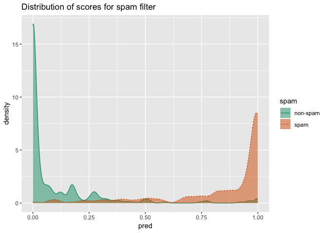
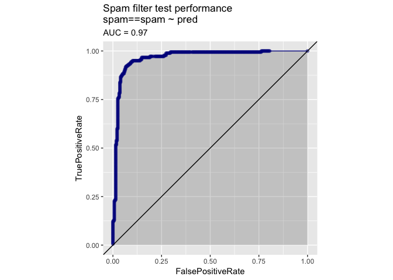
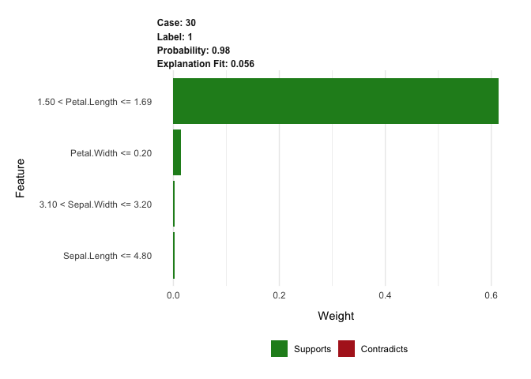
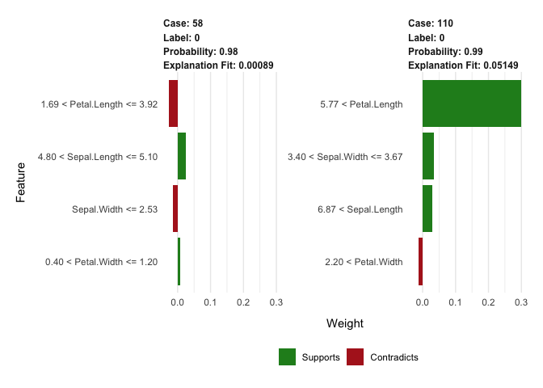
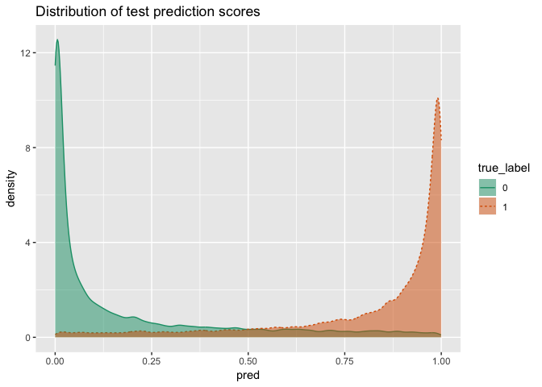
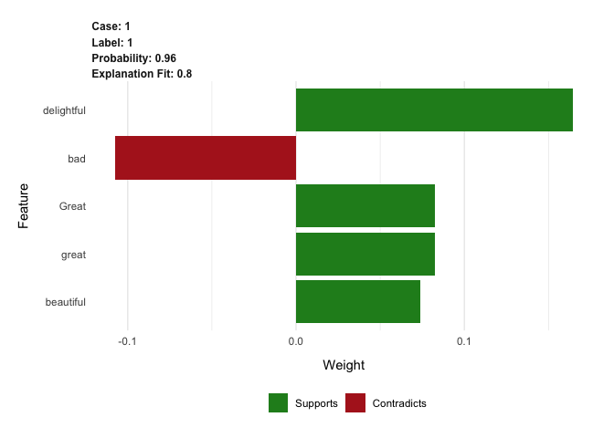
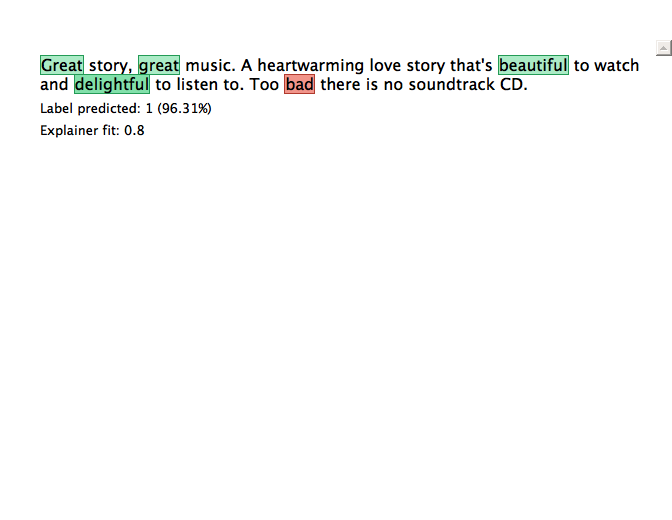
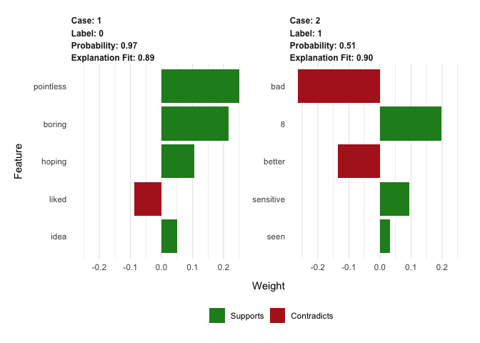
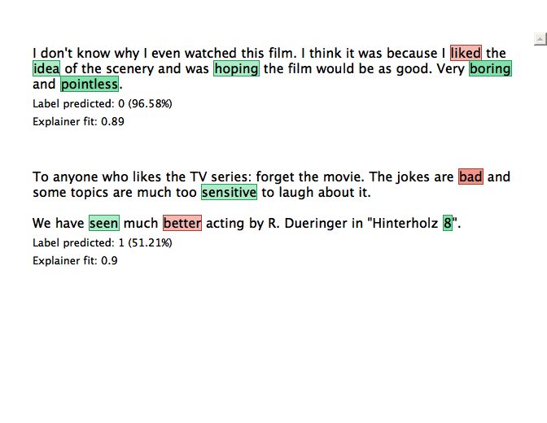

00220\_example\_6.1\_of\_section\_6.2.3.R

``` r
# example 6.1 of section 6.2.3 
# (example 6.1 of section 6.2.3)  : Choosing and evaluating models : Evaluating models : Evaluating classification models 
# Title: Building and applying a logistic regression spam model 

spamD <- read.table('../Spambase/spamD.tsv',header=T,sep='\t')  # Note: 1 

spamTrain <- subset(spamD,spamD$rgroup  >= 10)      # Note: 2 
spamTest <- subset(spamD,spamD$rgroup < 10)

spamVars <- setdiff(colnames(spamD), list('rgroup','spam'))     # Note: 3 
spamFormula <- as.formula(paste('spam == "spam"',
paste(spamVars, collapse = ' + '),sep = ' ~ '))

spamModel <- glm(spamFormula,family = binomial(link = 'logit'),         # Note: 4 
                                 data = spamTrain)
```

    ## Warning: glm.fit: fitted probabilities numerically 0 or 1 occurred

``` r
spamTrain$pred <- predict(spamModel,newdata = spamTrain,    # Note: 5 
                             type = 'response')
spamTest$pred <- predict(spamModel,newdata = spamTest,
                            type = 'response')

# Note 1: 
#   Read in the data 

# Note 2: 
#   Split the data into training and test sets 

# Note 3: 
#   Create a formula that describes the model 

# Note 4: 
#   Fit the logistic regression model 

# Note 5: 
#   Make predictions on the training and test sets 
```

00221\_example\_6.2\_of\_section\_6.2.3.R

``` r
# example 6.2 of section 6.2.3 
# (example 6.2 of section 6.2.3)  : Choosing and evaluating models : Evaluating models : Evaluating classification models 
# Title: Spam classifications 

sample <- spamTest[c(7,35,224,327), c('spam','pred')]
print(sample)
```

    ##          spam         pred
    ## 115      spam 0.9903246227
    ## 361      spam 0.4800498077
    ## 2300 non-spam 0.0006846551
    ## 3428 non-spam 0.0001434345

``` r
##          spam         pred   # Note: 1 
## 115      spam 0.9903246227
## 361      spam 0.4800498077
## 2300 non-spam 0.0006846551
## 3428 non-spam 0.0001434345

# Note 1: 
#   The first column gives the predicted class label (spam or non-spam). The 
#   second column gives the predicted probability that an email is spam. If the  
#   probability > 0.5 the email is labeled "spam," otherwise it is "non-spam". 
```

00222\_example\_6.3\_of\_section\_6.2.3.R

``` r
# example 6.3 of section 6.2.3 
# (example 6.3 of section 6.2.3)  : Choosing and evaluating models : Evaluating models : Evaluating classification models 
# Title: Spam confusion matrix 

confmat_spam <- table(truth = spamTest$spam,
                         prediction = ifelse(spamTest$pred > 0.5, 
                         "spam", "non-spam"))
print(confmat_spam)
```

    ##           prediction
    ## truth      non-spam spam
    ##   non-spam      264   14
    ##   spam           22  158

``` r
##          prediction
## truth   non-spam spam
##   non-spam   264   14
##   spam        22  158
```

00223\_informalexample\_6.1\_of\_section\_6.2.3.R

``` r
# informalexample 6.1 of section 6.2.3 
# (informalexample 6.1 of section 6.2.3)  : Choosing and evaluating models : Evaluating models : Evaluating classification models 

(confmat_spam[1,1] + confmat_spam[2,2]) / sum(confmat_spam)
```

    ## [1] 0.9213974

``` r
## [1] 0.9213974
```

00224\_example\_6.4\_of\_section\_6.2.3.R

``` r
# example 6.4 of section 6.2.3 
# (example 6.4 of section 6.2.3)  : Choosing and evaluating models : Evaluating models : Evaluating classification models 
# Title: Entering the Akismet confusion matrix by hand 

confmat_akismet <- as.table(matrix(data=c(288-1,17,1,13882-17),nrow=2,ncol=2))
rownames(confmat_akismet) <- rownames(confmat_spam)
colnames(confmat_akismet) <- colnames(confmat_spam)
print(confmat_akismet)
```

    ##          non-spam  spam
    ## non-spam      287     1
    ## spam           17 13865

``` r
##       non-spam  spam
## non-spam   287     1
## spam        17 13865
```

00225\_informalexample\_6.2\_of\_section\_6.2.3.R

``` r
# informalexample 6.2 of section 6.2.3 
# (informalexample 6.2 of section 6.2.3)  : Choosing and evaluating models : Evaluating models : Evaluating classification models 

(confmat_akismet[1,1] + confmat_akismet[2,2]) / sum(confmat_akismet)   
```

    ## [1] 0.9987297

``` r
## [1] 0.9987297
```

00226\_informalexample\_6.3\_of\_section\_6.2.3.R

``` r
# informalexample 6.3 of section 6.2.3 
# (informalexample 6.3 of section 6.2.3)  : Choosing and evaluating models : Evaluating models : Evaluating classification models 

confmat_spam[2,2] / (confmat_spam[2,2]+ confmat_spam[1,2])
```

    ## [1] 0.9186047

``` r
## [1] 0.9186047
```

00227\_informalexample\_6.4\_of\_section\_6.2.3.R

``` r
# informalexample 6.4 of section 6.2.3 
# (informalexample 6.4 of section 6.2.3)  : Choosing and evaluating models : Evaluating models : Evaluating classification models 

confmat_akismet[2,2] / (confmat_akismet[2,2] + confmat_akismet[1,2])
```

    ## [1] 0.9999279

``` r
## [1] 0.9999279
```

00228\_informalexample\_6.5\_of\_section\_6.2.3.R

``` r
# informalexample 6.5 of section 6.2.3 
# (informalexample 6.5 of section 6.2.3)  : Choosing and evaluating models : Evaluating models : Evaluating classification models 

confmat_spam[2,2] / (confmat_spam[2,2] + confmat_spam[2,1])
```

    ## [1] 0.8777778

``` r
## [1] 0.8777778

confmat_akismet[2,2] / (confmat_akismet[2,2] + confmat_akismet[2,1])
```

    ## [1] 0.9987754

``` r
## [1] 0.9987754
```

00229\_informalexample\_6.6\_of\_section\_6.2.3.R

``` r
# informalexample 6.6 of section 6.2.3 
# (informalexample 6.6 of section 6.2.3)  : Choosing and evaluating models : Evaluating models : Evaluating classification models 

precision <- confmat_spam[2,2] / (confmat_spam[2,2]+ confmat_spam[1,2])
recall <- confmat_spam[2,2] / (confmat_spam[2,2] + confmat_spam[2,1])

(F1 <- 2 * precision * recall / (precision + recall) )
```

    ## [1] 0.8977273

``` r
## [1] 0.8977273
```

00230\_example\_6.5\_of\_section\_6.2.3.R

``` r
# example 6.5 of section 6.2.3 
# (example 6.5 of section 6.2.3)  : Choosing and evaluating models : Evaluating models : Evaluating classification models 
# Title: Comparing spam filter performance on data with different proportions of spam 

set.seed(234641)

N <- nrow(spamTest)
pull_out_ix <- sample.int(N, 100, replace=FALSE)
removed = spamTest[pull_out_ix,]                            # Note: 1 


get_performance <- function(sTest) {                        # Note: 2 
  proportion <- mean(sTest$spam == "spam")
  confmat_spam <- table(truth = sTest$spam,
                        prediction = ifelse(sTest$pred>0.5, 
                                            "spam",
                                            "non-spam"))
  
  precision <- confmat_spam[2,2]/sum(confmat_spam[,2])
  recall <- confmat_spam[2,2]/sum(confmat_spam[2,])
  list(spam_proportion = proportion,
       confmat_spam = confmat_spam,
       precision = precision, recall = recall)
}

                 
sTest <- spamTest[-pull_out_ix,]                    # Note: 3 
get_performance(sTest)
```

    ## $spam_proportion
    ## [1] 0.3994413
    ## 
    ## $confmat_spam
    ##           prediction
    ## truth      non-spam spam
    ##   non-spam      204   11
    ##   spam           17  126
    ## 
    ## $precision
    ## [1] 0.919708
    ## 
    ## $recall
    ## [1] 0.8811189

``` r
## $spam_proportion
## [1] 0.3994413
## 
## $confmat_spam
##           prediction
## truth      non-spam spam
##   non-spam      204   11
##   spam           17  126
## 
## $precision
## [1] 0.919708
## 
## $recall
## [1] 0.8811189

get_performance(rbind(sTest, subset(removed, spam=="spam")))    # Note: 4 
```

    ## $spam_proportion
    ## [1] 0.4556962
    ## 
    ## $confmat_spam
    ##           prediction
    ## truth      non-spam spam
    ##   non-spam      204   11
    ##   spam           22  158
    ## 
    ## $precision
    ## [1] 0.9349112
    ## 
    ## $recall
    ## [1] 0.8777778

``` r
## $spam_proportion
## [1] 0.4556962
## 
## $confmat_spam
##           prediction
## truth      non-spam spam
##   non-spam      204   11
##   spam           22  158
## 
## $precision
## [1] 0.9349112
## 
## $recall
## [1] 0.8777778

get_performance(rbind(sTest, subset(removed, spam=="non-spam")))    # Note: 5 
```

    ## $spam_proportion
    ## [1] 0.3396675
    ## 
    ## $confmat_spam
    ##           prediction
    ## truth      non-spam spam
    ##   non-spam      264   14
    ##   spam           17  126
    ## 
    ## $precision
    ## [1] 0.9
    ## 
    ## $recall
    ## [1] 0.8811189

``` r
## $spam_proportion
## [1] 0.3396675
## 
## $confmat_spam
##           prediction
## truth      non-spam spam
##   non-spam      264   14
##   spam           17  126
## 
## $precision
## [1] 0.9
## 
## $recall
## [1] 0.8811189

# Note 1: 
#   Pull 100 emails out of the test set at random. 

# Note 2: 
#   A convenience function to print out the confusion matrix, precision, and recall of the filter on a test set. 

# Note 3: 
#   Look at performance on a test set with the same proportion of spam as the training data 

# Note 4: 
#   Add back only additional spam, so the test set has a higher proportion of spam than the training set 

# Note 5: 
#   Add back only non-spam, so the test set has a lower proportion of spam than the training set. 
```

00231\_informalexample\_6.7\_of\_section\_6.2.3.R

``` r
# informalexample 6.7 of section 6.2.3 
# (informalexample 6.7 of section 6.2.3)  : Choosing and evaluating models : Evaluating models : Evaluating classification models 

confmat_spam[1,1] / (confmat_spam[1,1] + confmat_spam[1,2])
```

    ## [1] 0.9496403

``` r
## [1] 0.9496403
```

00232\_example\_6.6\_of\_section\_6.2.4.R

``` r
# example 6.6 of section 6.2.4 
# (example 6.6 of section 6.2.4)  : Choosing and evaluating models : Evaluating models : Evaluating scoring models 
# Title: Fit the cricket model and make predictions 

crickets <- read.csv("../cricketchirps/crickets.csv") 

cricket_model <- lm(temperatureF ~ chirp_rate, data=crickets) 
crickets$temp_pred <- predict(cricket_model, newdata=crickets)
```

00233\_example\_6.7\_of\_section\_6.2.4.R

``` r
# example 6.7 of section 6.2.4 
# (example 6.7 of section 6.2.4)  : Choosing and evaluating models : Evaluating models : Evaluating scoring models 
# Title: Calculating RMSE 

error_sq <- (crickets$temp_pred - crickets$temperatureF)^2 
( RMSE <- sqrt(mean(error_sq)) )
```

    ## [1] 3.564149

``` r
## [1] 3.564149
```

00234\_example\_6.8\_of\_section\_6.2.4.R

``` r
# example 6.8 of section 6.2.4 
# (example 6.8 of section 6.2.4)  : Choosing and evaluating models : Evaluating models : Evaluating scoring models 
# Title: Calculating R-squared 

error_sq <- (crickets$temp_pred - crickets$temperatureF)^2          # Note: 1 
numerator <- sum(error_sq)                                          # Note: 2 
 
delta_sq <- (mean(crickets$temperatureF) - crickets$temperatureF)^2         # Note: 3 
denominator = sum(delta_sq)                                                     # Note: 4 
 
(R2 <- 1 - numerator/denominator)                                   # Note: 5 
```

    ## [1] 0.6974651

``` r
## [1] 0.6974651

# Note 1: 
#   Calculate the squared error terms. 

# Note 2: 
#   Sum them to get the model's sum squared error, or variance. 

# Note 3: 
#   Calculate the squared error terms from the null model. 

# Note 4: 
#   Calculate the data's total variance. 

# Note 5: 
#   Calculate R-squared. 
```

00235\_example\_6.9\_of\_section\_6.2.5.R

``` r
# example 6.9 of section 6.2.5 
# (example 6.9 of section 6.2.5)  : Choosing and evaluating models : Evaluating models : Evaluating probability models 
# Title: Making a double density plot 

library(WVPlots)
```

    ## Warning: package 'WVPlots' was built under R version 3.5.2

``` r
DoubleDensityPlot(spamTest, 
                  xvar = "pred",
                  truthVar = "spam",
                  title = "Distribution of scores for spam filter")
```



00236\_example\_6.10\_of\_section\_6.2.5.R

``` r
# example 6.10 of section 6.2.5 
# (example 6.10 of section 6.2.5)  : Choosing and evaluating models : Evaluating models : Evaluating probability models 
# Title: Plotting the receiver operating characteristic curve 

library(WVPlots)
ROCPlot(spamTest,                       # Note: 1 
        xvar = 'pred', 
        truthVar = 'spam', 
        truthTarget = 'spam', 
        title = 'Spam filter test performance')
```



``` r
library(sigr)
```

    ## Warning: package 'sigr' was built under R version 3.5.2

``` r
calcAUC(spamTest$pred, spamTest$spam=='spam')       # Note: 2 
```

    ## [1] 0.9660072

``` r
## [1] 0.9660072

# Note 1: 
#   Plot the receiver operating characteristic (ROC) curve. 

# Note 2: 
#   Calculate the area under the ROC curve explicitly. 
```

00237\_example\_6.11\_of\_section\_6.2.5.R

``` r
# example 6.11 of section 6.2.5 
# (example 6.11 of section 6.2.5)  : Choosing and evaluating models : Evaluating models : Evaluating probability models 
# Title: Calculating log likelihood 

ylogpy <- function(y, py) {             # Note: 1 
  logpy = ifelse(py > 0, log(py), 0)
  y*logpy
}

y <- spamTest$spam == 'spam'    # Note: 2 

sum(ylogpy(y, spamTest$pred) +              # Note: 3 
      ylogpy(1-y, 1-spamTest$pred))
```

    ## [1] -134.9478

``` r
## [1] -134.9478

# Note 1: 
#   A function to calculate y * log(py), with the convention that 0 * log(0) = 0. 

# Note 2: 
#   Get the class labels of the test set as TRUE/FALSE, which R treats as 1/0 in arithmetic operations. 

# Note 3: 
#   Calculate the log likelihood of the model's predictions on the test set. 
```

00238\_example\_6.12\_of\_section\_6.2.5.R

``` r
# example 6.12 of section 6.2.5 
# (example 6.12 of section 6.2.5)  : Choosing and evaluating models : Evaluating models : Evaluating probability models 
# Title: Computing the null model’s log likelihood 

(pNull <- mean(spamTrain$spam == 'spam'))
```

    ## [1] 0.3941588

``` r
## [1] 0.3941588

sum(ylogpy(y, pNull) + ylogpy(1-y, 1-pNull))
```

    ## [1] -306.8964

``` r
## [1] -306.8964
```

00239\_example\_6.13\_of\_section\_6.2.5.R

``` r
# example 6.13 of section 6.2.5 
# (example 6.13 of section 6.2.5)  : Choosing and evaluating models : Evaluating models : Evaluating probability models 
# Title: Computing the deviance and pseudo R-squared 

library(sigr)

(deviance <- calcDeviance(spamTest$pred, spamTest$spam == 'spam'))
```

    ## [1] 253.8598

``` r
## [1] 253.8598
(nullDeviance <- calcDeviance(pNull, spamTest$spam == 'spam'))
```

    ## [1] 613.7929

``` r
## [1] 613.7929

(pseudoR2 <- 1 - deviance/nullDeviance)
```

    ## [1] 0.586408

``` r
## [1] 0.586408
```

00240\_example\_6.14\_of\_section\_6.3.2.R

``` r
# example 6.14 of section 6.3.2 
# (example 6.14 of section 6.3.2)  : Choosing and evaluating models : Local Interpretable Model-Agnostic Explanations (LIME) for explaining model predictions : Walking through LIME: a small example 
# Title: Load the iris dataset 

iris <- iris
                                        
iris$class <- as.numeric(iris$Species == "setosa")      # Note: 1 
                                        
set.seed(2345)  
intrain <- runif(nrow(iris)) < 0.75     # Note: 2  
train <- iris[intrain,]
test <- iris[!intrain,]
                                        
head(train)
```

    ##   Sepal.Length Sepal.Width Petal.Length Petal.Width Species class
    ## 1          5.1         3.5          1.4         0.2  setosa     1
    ## 2          4.9         3.0          1.4         0.2  setosa     1
    ## 3          4.7         3.2          1.3         0.2  setosa     1
    ## 4          4.6         3.1          1.5         0.2  setosa     1
    ## 5          5.0         3.6          1.4         0.2  setosa     1
    ## 6          5.4         3.9          1.7         0.4  setosa     1

``` r
##   Sepal.Length Sepal.Width Petal.Length Petal.Width Species class
## 1          5.1         3.5          1.4         0.2  setosa     1
## 2          4.9         3.0          1.4         0.2  setosa     1
## 3          4.7         3.2          1.3         0.2  setosa     1
## 4          4.6         3.1          1.5         0.2  setosa     1
## 5          5.0         3.6          1.4         0.2  setosa     1
## 6          5.4         3.9          1.7         0.4  setosa     1

# Note 1: 
#   Setosa is the positive class. 

# Note 2: 
#   Use 75% of the data for training, the remainder as holdout (i.e. test data). 
```

00241\_example\_6.15\_of\_section\_6.3.2.R

``` r
# example 6.15 of section 6.3.2 
# (example 6.15 of section 6.3.2)  : Choosing and evaluating models : Local Interpretable Model-Agnostic Explanations (LIME) for explaining model predictions : Walking through LIME: a small example 
# Title: Fit a model to the iris training data 

source("../LIME_iris/lime_iris_example.R")  # Note: 1  
```

    ## Warning: package 'xgboost' was built under R version 3.5.2

``` r
input <- as.matrix(train[, 1:4])                # Note: 2                  
model <- fit_iris_example(input, train$class)
```

    ## [1]  train-logloss:0.454780+0.000078 test-logloss:0.455058+0.001638 
    ## [11] train-logloss:0.032152+0.000071 test-logloss:0.032379+0.001328 
    ## [21] train-logloss:0.021108+0.000811 test-logloss:0.021593+0.001433 
    ## [31] train-logloss:0.021096+0.000814 test-logloss:0.021629+0.001647 
    ## [41] train-logloss:0.021096+0.000814 test-logloss:0.021634+0.001673 
    ## [51] train-logloss:0.021096+0.000814 test-logloss:0.021635+0.001675 
    ## [61] train-logloss:0.021096+0.000814 test-logloss:0.021635+0.001676 
    ## [71] train-logloss:0.021096+0.000814 test-logloss:0.021635+0.001676 
    ## [81] train-logloss:0.021096+0.000814 test-logloss:0.021635+0.001676 
    ## [91] train-logloss:0.021096+0.000814 test-logloss:0.021635+0.001676 
    ## [100]    train-logloss:0.021096+0.000814 test-logloss:0.021635+0.001676

``` r
# Note 1: 
#   Load the convenience function. 

# Note 2: 
#   The input to the model is the first 4 columns of the training data,  
#   converted to a matrix. 
```

00242\_example\_6.16\_of\_section\_6.3.2.R

``` r
# example 6.16 of section 6.3.2 
# (example 6.16 of section 6.3.2)  : Choosing and evaluating models : Local Interpretable Model-Agnostic Explanations (LIME) for explaining model predictions : Walking through LIME: a small example 
# Title: Evaluate the iris model 

predictions <- predict(model, newdata=as.matrix(test[,1:4]))        # Note: 1 
                                        
teframe <- data.frame(isSetosa = ifelse(test$class == 1,    # Note: 2 
                                        "setosa",
                                        "not setosa"),
                      pred = ifelse(predictions > 0.5, 
                                "setosa",
                                "not setosa"))
with(teframe, table(truth=isSetosa, pred=pred))         # Note: 3 
```

    ##             pred
    ## truth        not setosa setosa
    ##   not setosa         25      0
    ##   setosa              0     11

``` r
##             pred
## truth        not setosa setosa
##   not setosa         25      0
##   setosa              0     11

# Note 1: 
#   Make predictions on the test data. The predictions are the  
#   probability that an iris is a setosa. 

# Note 2: 
#   A data frame of predictions and actual outcome. 

# Note 3: 
#   Examine the confusion matrix. 
```

00243\_example\_6.17\_of\_section\_6.3.2.R

``` r
# example 6.17 of section 6.3.2 
# (example 6.17 of section 6.3.2)  : Choosing and evaluating models : Local Interpretable Model-Agnostic Explanations (LIME) for explaining model predictions : Walking through LIME: a small example 
# Title: Build a LIME "explainer" from the model and training data 

library(lime)
explainer <- lime(train[,1:4],              # Note: 1 
                     model = model, 
                     bin_continuous = TRUE,     # Note: 2 
                     n_bins = 10)               # Note: 3

# Note 1: 
#   Build the explainer from the training data. 

# Note 2: 
#   Bin the continuous variables when making explanations. 

# Note 3: 
#   Use 10 bins. 
```

00244\_example\_6.18\_of\_section\_6.3.2.R

``` r
# example 6.18 of section 6.3.2 
# (example 6.18 of section 6.3.2)  : Choosing and evaluating models : Local Interpretable Model-Agnostic Explanations (LIME) for explaining model predictions : Walking through LIME: a small example 
# Title: An example iris datum 

(example <- test[5, 1:4, drop=FALSE])       # Note: 1 
```

    ##    Sepal.Length Sepal.Width Petal.Length Petal.Width
    ## 30          4.7         3.2          1.6         0.2

``` r
##    Sepal.Length Sepal.Width Petal.Length Petal.Width
## 30          4.7         3.2          1.6         0.2
                                        
test$class[5] 
```

    ## [1] 1

``` r
## [1] 1            # Note: 2 
                                        
round(predict(model, newdata = as.matrix(example))) 
```

    ## [1] 1

``` r
## [1] 1            # Note: 3

# Note 1: 
#   A single row dataframe. 

# Note 2: 
#   This example is a setosa. 

# Note 3: 
#   And the model predicts that it is setosa. 
```

00245\_example\_6.19\_of\_section\_6.3.2.R

``` r
# example 6.19 of section 6.3.2 
# (example 6.19 of section 6.3.2)  : Choosing and evaluating models : Local Interpretable Model-Agnostic Explanations (LIME) for explaining model predictions : Walking through LIME: a small example 
# Title: Explain the iris example 

explanation <- lime::explain(example, 
                                explainer, 
                                n_labels = 1,           # Note: 1 
                                n_features = 4)         # Note: 2

# Note 1: 
#   The number of labels to explain; use 1 for binary classification. 

# Note 2: 
#   The number of features to use when fitting the explanation. 
```

00246\_informalexample\_6.8\_of\_section\_6.3.2.R

``` r
# informalexample 6.8 of section 6.3.2 
# (informalexample 6.8 of section 6.3.2)  : Choosing and evaluating models : Local Interpretable Model-Agnostic Explanations (LIME) for explaining model predictions : Walking through LIME: a small example 

plot_features(explanation)
```



00249\_example\_6.20\_of\_section\_6.3.2.R

``` r
# example 6.20 of section 6.3.2 
# (example 6.20 of section 6.3.2)  : Choosing and evaluating models : Local Interpretable Model-Agnostic Explanations (LIME) for explaining model predictions : Walking through LIME: a small example 
# Title: More iris examples 

(example <- test[c(13, 24), 1:4]) 
```

    ##     Sepal.Length Sepal.Width Petal.Length Petal.Width
    ## 58           4.9         2.4          3.3         1.0
    ## 110          7.2         3.6          6.1         2.5

``` r
##     Sepal.Length Sepal.Width Petal.Length Petal.Width
## 58           4.9         2.4          3.3         1.0
## 110          7.2         3.6          6.1         2.5                                               
   
test$class[c(13,24)]    # Note: 1                                               
```

    ## [1] 0 0

``` r
## [1] 0 0                                              
   
round(predict(model, newdata=as.matrix(example)))   # Note: 2        
```

    ## [1] 0 0

``` r
## [1] 0 0  
  
explanation <- explain(example, 
                          explainer, 
                          n_labels = 1,
                          n_features = 4, 
                          kernel_width = 0.5)  
                          
plot_features(explanation)
```



``` r
# Note 1: 
#   Both examples are negative (not setosa). 

# Note 2: 
#   The model predicts that both examples are negative. 
```

00250\_example\_6.21\_of\_section\_6.3.3.R

``` r
# example 6.21 of section 6.3.3 
# (example 6.21 of section 6.3.3)  : Choosing and evaluating models : Local Interpretable Model-Agnostic Explanations (LIME) for explaining model predictions : LIME for Text Classification 
# Title: Loading the IMDB training data 

library(zeallot)    # Note: 1 
                                
c(texts, labels) %<-% readRDS("../IMDB/IMDBtrain.RDS")  # Note: 2

# Note 1: 
#   Load the zeallot library. Call install.packages("zeallot") if this fails. 

# Note 2: 
#   The command "read(../IMDB/IMDBtrain.RDS)" returns a list object. 
#   The zeallot assignment arrow %<-% unpacks the list into two elements: 
#   "texts" is a character vector of reviews and 
#   "labels" is a 0/1 vector of class labels.  
#   The label 1 designates a positive review. 
```

00252\_informalexample\_6.12\_of\_section\_6.3.3.R

``` r
# informalexample 6.12 of section 6.3.3 
# (informalexample 6.12 of section 6.3.3)  : Choosing and evaluating models : Local Interpretable Model-Agnostic Explanations (LIME) for explaining model predictions : LIME for Text Classification 

list(text = texts[12], label = labels[12])
```

    ## $text
    ##                                                                                                                                                                                                                                                                                                                                                                                                                                                                                                                                                               train_385 
    ## "Jameson Parker And Marilyn Hassett are the screen's most unbelievable couple since John Travolta and Lily Tomlin. Larry Peerce's direction wavers uncontrollably between black farce and Roman tragedy. Robert Klein certainly think it's the former and his self-centered performance in a minor role underscores the total lack of balance and chemistry between the players in the film. Normally, I don't like to let myself get so ascerbic, but The Bell Jar is one of my all-time favorite books, and to watch what they did with it makes me literally crazy." 
    ## 
    ## $label
    ## train_385 
    ##         0

``` r
## $text
## train_385 
##                                                                                                                                                                                                                                                                                                                                                                                                                                                                                                                                                               train_385 
## "Jameson Parker And Marilyn Hassett are the screen's most unbelievable couple since John 
## Travolta and Lily Tomlin. Larry Peerce's direction wavers uncontrollably between black farce 
## and Roman tragedy. Robert Klein certainly think it's the former and his self-centered 
## performance in a minor role underscores the total lack of balance and chemistry between the 
## players in the film. Normally, I don't like to let myself get so ascerbic, but The Bell Jar 
## is one of my all-time favorite books, and to watch what they did with it makes me literally 
## crazy." 
## 
## $label
## train_385 
##         0
```

00253\_example\_6.22\_of\_section\_6.3.4.R

``` r
# example 6.22 of section 6.3.4 
# (example 6.22 of section 6.3.4)  : Choosing and evaluating models : Local Interpretable Model-Agnostic Explanations (LIME) for explaining model predictions : Train the text classifier 
# Title: Convert the texts and fit the model 

source("../IMDB/lime_imdb_example.R")
```

    ## Warning: package 'wrapr' was built under R version 3.5.2

``` r
vocab <- create_pruned_vocabulary(texts)    # Note: 1                                
dtm_train <- make_matrix(texts, vocab)      # Note: 2 
model <- fit_imdb_model(dtm_train, labels)  # Note: 3

# Note 1: 
#   Create the vocabulary from the training data. 

# Note 2: 
#   Create the document-term matrix of the training corpus. 

# Note 3: 
#   Train the model. 
```

00254\_example\_6.23\_of\_section\_6.3.4.R

``` r
# example 6.23 of section 6.3.4 
# (example 6.23 of section 6.3.4)  : Choosing and evaluating models : Local Interpretable Model-Agnostic Explanations (LIME) for explaining model predictions : Train the text classifier 
# Title: Evaluate the review classifier 

c(test_txt, test_labels) %<-%  readRDS("../IMDB/IMDBtest.RDS")  # Note: 1 
dtm_test <- make_matrix(test_txt, vocab)    # Note: 2 
                                
predicted <- predict(model, newdata=dtm_test)   # Note: 3 
                                
teframe <- data.frame(true_label = test_labels, 
                         pred = predicted)                                      # Note: 4 
                                
(cmat <- with(teframe, table(truth=true_label, pred=pred > 0.5)))   # Note: 5 
```

    ##      pred
    ## truth FALSE  TRUE
    ##     0 10836  1664
    ##     1  1485 11015

``` r
##      pred
## truth FALSE  TRUE
##     0 10836  1664
##     1  1485 11015
                                
sum(diag(cmat))/sum(cmat)   # Note: 6                                  
```

    ## [1] 0.87404

``` r
## [1] 0.87404
                   
library(WVPlots)                   
DoubleDensityPlot(teframe, "pred", "true_label", 
                  "Distribution of test prediction scores")     # Note: 7
```



``` r
# Note 1: 
#   Read in the test corpus. 

# Note 2: 
#   Convert the corpus to a document-term matrix. 

# Note 3: 
#   Make predictions (probabilities) on the test corpus. 

# Note 4: 
#   Create a frame with true and predicted labels. 

# Note 5: 
#   Compute the confusion matrix. 

# Note 6: 
#   Compute the accuracy. 

# Note 7: 
#   Plot the distribution of predictions. 
```

00255\_example\_6.24\_of\_section\_6.3.5.R

``` r
# example 6.24 of section 6.3.5 
# (example 6.24 of section 6.3.5)  : Choosing and evaluating models : Local Interpretable Model-Agnostic Explanations (LIME) for explaining model predictions : Explaining the classifier's predictions 
# Title: Build an explainer for a text classifier 

explainer <- lime(texts, model = model, 
                  preprocess = function(x) make_matrix(x, vocab))
```

00256\_example\_6.25\_of\_section\_6.3.5.R

``` r
# example 6.25 of section 6.3.5 
# (example 6.25 of section 6.3.5)  : Choosing and evaluating models : Local Interpretable Model-Agnostic Explanations (LIME) for explaining model predictions : Explaining the classifier's predictions 
# Title: Explaining the model's prediction on a review 

casename <- "test_19552"; 
sample_case <- test_txt[casename]
pred_prob <- predict(model, make_matrix(sample_case, vocab))
list(text = sample_case,
     label = test_labels[casename],  
     prediction = round(pred_prob) ) 
```

    ## $text
    ##                                                                                                                                      test_19552 
    ## "Great story, great music. A heartwarming love story that's beautiful to watch and delightful to listen to. Too bad there is no soundtrack CD." 
    ## 
    ## $label
    ## test_19552 
    ##          1 
    ## 
    ## $prediction
    ## [1] 1

``` r
## $text
## test_19552 
## "Great story, great music. A heartwarming love story that's beautiful to watch 
## and delightful to listen to. Too bad there is no soundtrack CD." 
## 
## $label
## test_19552 
##          1 
## 
## $prediction
## [1] 1
```

00257\_example\_6.26\_of\_section\_6.3.5.R

``` r
# example 6.26 of section 6.3.5 
# (example 6.26 of section 6.3.5)  : Choosing and evaluating models : Local Interpretable Model-Agnostic Explanations (LIME) for explaining model predictions : Explaining the classifier's predictions 
# Title: Explain the model's prediction 

explanation <- lime::explain(sample_case, 
                       explainer, 
                       n_labels = 1, 
                       n_features = 5)

plot_features(explanation)
```



00258\_informalexample\_6.13\_of\_section\_6.3.5.R

``` r
# informalexample 6.13 of section 6.3.5 
# (informalexample 6.13 of section 6.3.5)  : Choosing and evaluating models : Local Interpretable Model-Agnostic Explanations (LIME) for explaining model predictions : Explaining the classifier's predictions 

plot_text_explanations(explanation)
```



00259\_example\_6.27\_of\_section\_6.3.5.R

``` r
# example 6.27 of section 6.3.5 
# (example 6.27 of section 6.3.5)  : Choosing and evaluating models : Local Interpretable Model-Agnostic Explanations (LIME) for explaining model predictions : Explaining the classifier's predictions 
# Title: Examining two more reviews 

casenames <-  c("test_12034", "test_10294")
sample_cases <- test_txt[casenames]
pred_probs <- predict(model, newdata=make_matrix(sample_cases, vocab))
list(texts = sample_cases,
     labels = test_labels[casenames],  
     predictions = round(pred_probs)) 
```

    ## $texts
    ##                                                                                                                                                                                                         test_12034 
    ##                                           "I don't know why I even watched this film. I think it was because I liked the idea of the scenery and was hoping the film would be as good. Very boring and pointless." 
    ##                                                                                                                                                                                                         test_10294 
    ## "To anyone who likes the TV series: forget the movie. The jokes are bad and some topics are much too sensitive to laugh about it.<br /><br />We have seen much better acting by R. Dueringer in \"Hinterholz 8\"." 
    ## 
    ## $labels
    ## test_12034 test_10294 
    ##          0          0 
    ## 
    ## $predictions
    ## [1] 0 1

``` r
## $texts
## test_12034 
## "I don't know why I even watched this film. I think it was because I liked the idea of 
## the scenery and was hoping the film would be as good. Very boring and pointless." 
##      
## test_10294 
## "To anyone who likes the TV series: forget the movie. The jokes are bad and some topics 
## are much too sensitive to laugh about it. <br /><br />We have seen 
## much better acting by R. Dueringer in \"Hinterholz 8\"".
## 
## $labels
## test_12034 test_10294        # Note: 1 
##          0          0 
## 
## $predictions                 # Note: 2 
## [1] 0 1
                       
explanation <- lime::explain(sample_cases, 
                                    explainer, 
                                    n_labels = 1, 
                                    n_features = 5)
                                
plot_features(explanation)
```



``` r
plot_text_explanations(explanation)
```



``` r
# Note 1: 
#   Both these reviews are negative. 

# Note 2: 
#   The model misclassified the second review. 
```

00260\_informalexample\_6.14\_of\_section\_6.3.5.R

``` r
# informalexample 6.14 of section 6.3.5 
# (informalexample 6.14 of section 6.3.5)  : Choosing and evaluating models : Local Interpretable Model-Agnostic Explanations (LIME) for explaining model predictions : Explaining the classifier's predictions 

predict(model, newdata=make_matrix(sample_cases[2], vocab))
```

    ## [1] 0.6052929

``` r
                                ## [1] 0.6052929
```
