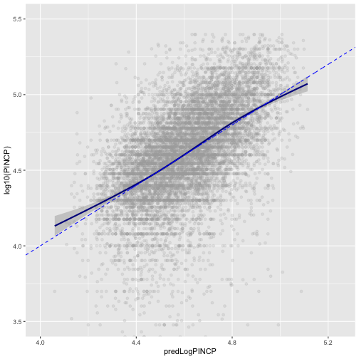
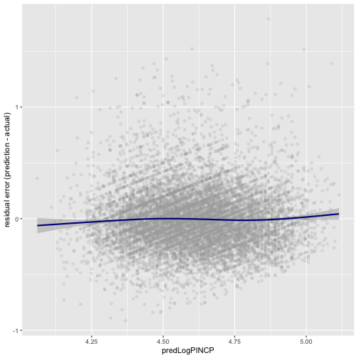
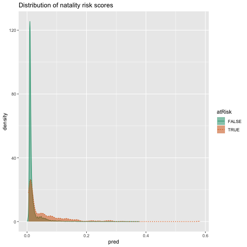
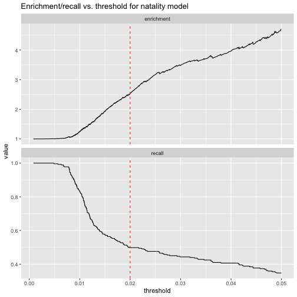
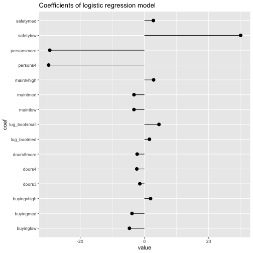
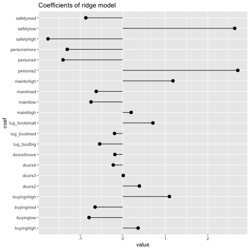
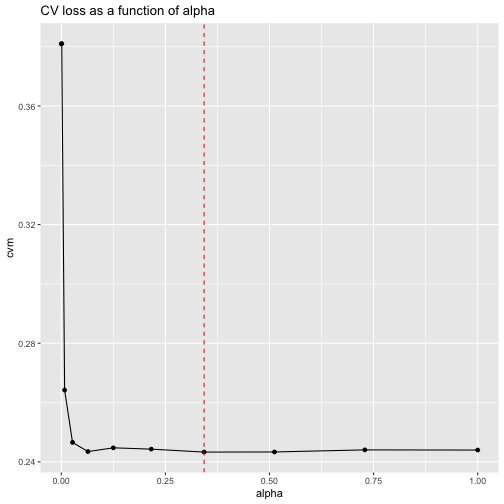

00188_example_7.1_of_section_7.1.1.R


```r
# example 7.1 of section 7.1.1 
# (example 7.1 of section 7.1.1)  : Linear and logistic regression : Using linear regression : Understanding linear regression 
# Title: Loading the PUMS data and fitting a model 

psub <- readRDS("../PUMS/psub.RDS")
                                                
set.seed(3454351)     
gp <- runif(nrow(psub))                                            	# Note: 1 
                                                
dtrain <- subset(psub, gp >= 0.5)                                	# Note: 2 
dtest <- subset(psub, gp < 0.5)
                                                
model <- lm(log10(PINCP) ~ AGEP + SEX + COW + SCHL, data = dtrain)  	# Note: 3 
dtest$predLogPINCP <- predict(model, newdata = dtest)              	# Note: 4 
dtrain$predLogPINCP <- predict(model, newdata = dtrain)

# Note 1: 
#   Make a random variable to group and partition the data 

# Note 2: 
#   Split 50-50 into training and test sets 

# Note 3: 
#   Fit a linear model to log(income). 

# Note 4: 
#   Get the predicted log(income) on the test and training sets. 
```


00189_example_7.2_of_section_7.1.3.R


```r
# example 7.2 of section 7.1.3 
# (example 7.2 of section 7.1.3)  : Linear and logistic regression : Using linear regression : Making predictions 
# Title: Plotting log income as a function of predicted log income 

library('ggplot2')
ggplot(data = dtest, aes(x = predLogPINCP, y = log10(PINCP))) +
   geom_point(alpha = 0.2, color = "darkgray") +
   geom_smooth(color = "darkblue") +
   geom_line(aes(x = log10(PINCP),                              	# Note: 1 
                 y = log10(PINCP)),
             color = "blue", linetype = 2) +
   coord_cartesian(xlim = c(4, 5.25),                           	# Note: 2 
                   ylim = c(3.5, 5.5))
```

```
## `geom_smooth()` using method = 'gam' and formula 'y ~ s(x, bs = "cs")'
```



```r
# Note 1: 
#   Plot the line x=y 

# Note 2: 
#   Limit the range of the graph for legibility 
```


00190_example_7.3_of_section_7.1.3.R


```r
# example 7.3 of section 7.1.3 
# (example 7.3 of section 7.1.3)  : Linear and logistic regression : Using linear regression : Making predictions 
# Title: Plotting residuals income as a function of predicted log income 

ggplot(data = dtest, aes(x = predLogPINCP,
                     y = predLogPINCP - log10(PINCP))) +
  geom_point(alpha = 0.2, color = "darkgray") +
  geom_smooth(color = "darkblue") + 
  ylab("residual error (prediction - actual)")
```

```
## `geom_smooth()` using method = 'gam' and formula 'y ~ s(x, bs = "cs")'
```




00191_example_7.4_of_section_7.1.3.R


```r
# example 7.4 of section 7.1.3 
# (example 7.4 of section 7.1.3)  : Linear and logistic regression : Using linear regression : Making predictions 
# Title: Computing R-squared 

rsq <- function(y, f) { 1 - sum((y - f)^2)/sum((y - mean(y))^2) }

rsq(log10(dtrain$PINCP), dtrain$predLogPINCP)           	# Note: 1 
```

```
## [1] 0.2976165
```

```r
## [1] 0.2976165

rsq(log10(dtest$PINCP), dtest$predLogPINCP)              	# Note: 2 
```

```
## [1] 0.2911965
```

```r
## [1] 0.2911965

# Note 1: 
#   R-squared of the model on the training data 

# Note 2: 
#   R-squared of the model on the test data 
```


00192_example_7.5_of_section_7.1.3.R


```r
# example 7.5 of section 7.1.3 
# (example 7.5 of section 7.1.3)  : Linear and logistic regression : Using linear regression : Making predictions 
# Title: Calculating root mean square error 

rmse <- function(y, f) { sqrt(mean( (y-f)^2 )) }
        
rmse(log10(dtrain$PINCP), dtrain$predLogPINCP)    	# Note: 1 
```

```
## [1] 0.2685855
```

```r
## [1] 0.2685855

rmse(log10(dtest$PINCP), dtest$predLogPINCP)       	# Note: 2 
```

```
## [1] 0.2675129
```

```r
## [1] 0.2675129

# Note 1: 
#   RMSE of the model on the training data 

# Note 2: 
#   RMSE of the model on the test data 
```


00197_example_7.6_of_section_7.1.5.R


```r
# example 7.6 of section 7.1.5 
# (example 7.6 of section 7.1.5)  : Linear and logistic regression : Using linear regression : Reading the model summary and characterizing coefficient quality 
# Title: Summarizing residuals 

( resids_train <- summary(log10(dtrain$PINCP) - predict(model, newdata = dtrain)) )
```

```
##    Min. 1st Qu.  Median    Mean 3rd Qu.    Max. 
## -1.5038 -0.1354  0.0187  0.0000  0.1710  0.9741
```

```r
##    Min. 1st Qu.  Median    Mean 3rd Qu.    Max. 
## -1.5038 -0.1354  0.0187  0.0000  0.1710  0.9741

( resids_test <- summary(log10(dtest$PINCP) - predict(model, newdata = dtest)) )
```

```
##      Min.   1st Qu.    Median      Mean   3rd Qu.      Max. 
## -1.789150 -0.130733  0.027413  0.006359  0.175847  0.912646
```

```r
##      Min.   1st Qu.    Median      Mean   3rd Qu.      Max. 
## -1.789150 -0.130733  0.027413  0.006359  0.175847  0.912646
```


00199_informalexample_7.10_of_section_7.1.5.R


```r
# informalexample 7.10 of section 7.1.5 
# (informalexample 7.10 of section 7.1.5)  : Linear and logistic regression : Using linear regression : Reading the model summary and characterizing coefficient quality 

(df <-  nrow(dtrain) - nrow(summary(model)$coefficients) )
```

```
## [1] 11186
```

```r
## [1] 11186
```


00200_informalexample_7.11_of_section_7.1.5.R


```r
# informalexample 7.11 of section 7.1.5 
# (informalexample 7.11 of section 7.1.5)  : Linear and logistic regression : Using linear regression : Reading the model summary and characterizing coefficient quality 

(modelResidualError <- sqrt(sum(residuals(model)^2) / df))
```

```
## [1] 0.2687895
```

```r
## [1] 0.2687895
```


00203_informalexample_7.14_of_section_7.2.1.R


```r
# informalexample 7.14 of section 7.2.1 
# (informalexample 7.14 of section 7.2.1)  : Linear and logistic regression : Using logistic regression : Understanding logistic regression 

logit <- function(p) { log(p/(1-p)) }
s <- function(x) { 1/(1 + exp(-x))}

s(logit(0.7))
```

```
## [1] 0.7
```

```r
# [1] 0.7

logit(s(-2))
```

```
## [1] -2
```

```r
# -2
```


00207_example_7.7_of_section_7.2.1.R


```r
# example 7.7 of section 7.2.1 
# (example 7.7 of section 7.2.1)  : Linear and logistic regression : Using logistic regression : Understanding logistic regression 
# Title: Loading the CDC data 

load("../CDC/NatalRiskData.rData")
train <- sdata[sdata$ORIGRANDGROUP <= 5 , ]
test <- sdata[sdata$ORIGRANDGROUP > 5, ]
```


00208_example_7.8_of_section_7.2.2.R


```r
# example 7.8 of section 7.2.2 
# (example 7.8 of section 7.2.2)  : Linear and logistic regression : Using logistic regression : Building a logistic regression model 
# Title: Building the model formula 

complications <- c("ULD_MECO","ULD_PRECIP","ULD_BREECH")
riskfactors <- c("URF_DIAB", "URF_CHYPER", "URF_PHYPER",
                  "URF_ECLAM")
y <- "atRisk"
x <- c("PWGT",
      "UPREVIS",
      "CIG_REC",
      "GESTREC3",
      "DPLURAL",
      complications,
      riskfactors)
library(wrapr)
fmla <- mk_formula(y, x)
```


00209_example_7.9_of_section_7.2.2.R


```r
# example 7.9 of section 7.2.2 
# (example 7.9 of section 7.2.2)  : Linear and logistic regression : Using logistic regression : Building a logistic regression model 
# Title: Fitting the logistic regression model 

print(fmla)
```

```
## atRisk ~ PWGT + UPREVIS + CIG_REC + GESTREC3 + DPLURAL + ULD_MECO + 
##     ULD_PRECIP + ULD_BREECH + URF_DIAB + URF_CHYPER + URF_PHYPER + 
##     URF_ECLAM
## <environment: base>
```

```r
## atRisk ~ PWGT + UPREVIS + CIG_REC + GESTREC3 + DPLURAL + ULD_MECO + 
##     ULD_PRECIP + ULD_BREECH + URF_DIAB + URF_CHYPER + URF_PHYPER + 
##     URF_ECLAM
## <environment: base>

model <- glm(fmla, data = train, family = binomial(link = "logit"))
```


00210_example_7.10_of_section_7.2.3.R


```r
# example 7.10 of section 7.2.3 
# (example 7.10 of section 7.2.3)  : Linear and logistic regression : Using logistic regression : Making predictions 
# Title: Applying the logistic regression model 

train$pred <- predict(model, newdata=train, type = "response")
test$pred <- predict(model, newdata=test, type="response")
```


00211_example_7.11_of_section_7.2.3.R


```r
# example 7.11 of section 7.2.3 
# (example 7.11 of section 7.2.3)  : Linear and logistic regression : Using logistic regression : Making predictions 
# Title: Logistic regression preserves marginal probabilities 

sum(train$atRisk == TRUE)  	# Note: 1 
```

```
## [1] 273
```

```r
## [1] 273

sum(train$pred)   	# Note: 2 
```

```
## [1] 273
```

```r
## [1] 273

premature <- subset(train, GESTREC3 == "< 37 weeks")   	# Note: 3 
sum(premature$atRisk == TRUE)
```

```
## [1] 112
```

```r
## [1] 112

sum(premature$pred)  	# Note: 4 
```

```
## [1] 112
```

```r
## [1] 112

# Note 1: 
#   Count the number of at-risk infants in the training set. 

# Note 2: 
#   Sum up all the predicted probabilities over the training set. See that it adds to the number of at-risk infants. 

# Note 3: 
#   Count the number of at-risk premature infants in the training set. 

# Note 4: 
#   Sum up all the predicted probabilities for premature infants in the training set. See that it adds 
#   to the number of at-risk premature infants. 
```


00212_example_7.12_of_section_7.2.3.R


```r
# example 7.12 of section 7.2.3 
# (example 7.12 of section 7.2.3)  : Linear and logistic regression : Using logistic regression : Making predictions 
# Title: Plotting distribution of prediction score grouped by known outcome 

library(WVPlots)
DoubleDensityPlot(train, "pred", "atRisk", 
                  title = "Distribution of natality risk scores")
```




00213_example_7.13_of_section_7.2.3.R


```r
# example 7.13 of section 7.2.3 
# (example 7.13 of section 7.2.3)  : Linear and logistic regression : Using logistic regression : Making predictions 
# Title: Exploring modeling trade-offs 

library("WVPlots")
library("ggplot2")
plt <- PRTPlot(train, "pred", "atRisk", TRUE,    	# Note: 1 
        plotvars = c("enrichment", "recall"),
        thresholdrange = c(0,0.05),                                       
        title = "Enrichment/recall vs. threshold for natality model")  
plt + geom_vline(xintercept = 0.02, color="red", linetype = 2)   	# Note: 2
```



```r
# Note 1: 
#   Call PRTPlot() where “pred” is the column 
#   of predictions, “atRisk” is the true outcome 
#   column, and TRUE is the class of interest. 

# Note 2: 
#   Add a line to mark threshold = 0.02. 
```


00214_example_7.14_of_section_7.2.3.R


```r
# example 7.14 of section 7.2.3 
# (example 7.14 of section 7.2.3)  : Linear and logistic regression : Using logistic regression : Making predictions 
# Title: Evaluating the chosen model 

( ctab.test <- table(pred = test$pred > 0.02, atRisk = test$atRisk)  )    	# Note: 1  
```

```
##        atRisk
## pred    FALSE TRUE
##   FALSE  9487   93
##   TRUE   2405  116
```

```r
##        atRisk
## pred    FALSE TRUE
##   FALSE  9487   93
##   TRUE   2405  116

( precision <- ctab.test[2,2] / sum(ctab.test[2,]) )
```

```
## [1] 0.04601349
```

```r
## [1] 0.04601349

( recall <- ctab.test[2,2] / sum(ctab.test[,2]) )
```

```
## [1] 0.5550239
```

```r
## [1] 0.5550239

( enrichment <- precision / mean(as.numeric(test$atRisk))  )
```

```
## [1] 2.664159
```

```r
## [1] 2.664159

# Note 1: 
#   Build the confusion matrix. The rows contain predicted negatives and 
#   positives; columns contain actual negatives and 
#   positives 
```


00215_example_7.15_of_section_7.2.4.R


```r
# example 7.15 of section 7.2.4 
# (example 7.15 of section 7.2.4)  : Linear and logistic regression : Using logistic regression : Finding relations and extracting advice from logistic models 
# Title: The model coefficients 

coefficients(model)
```

```
##              (Intercept)                     PWGT                  UPREVIS 
##              -4.41218940               0.00376166              -0.06328943 
##              CIG_RECTRUE       GESTREC3< 37 weeks DPLURALtriplet or higher 
##               0.31316930               1.54518311               1.39419294 
##              DPLURALtwin             ULD_MECOTRUE           ULD_PRECIPTRUE 
##               0.31231871               0.81842627               0.19172008 
##           ULD_BREECHTRUE             URF_DIABTRUE           URF_CHYPERTRUE 
##               0.74923672              -0.34646672               0.56002503 
##           URF_PHYPERTRUE            URF_ECLAMTRUE 
##               0.16159872               0.49806435
```

```r
##              (Intercept)                     PWGT
##              -4.41218940               0.00376166
##                  UPREVIS              CIG_RECTRUE
##              -0.06328943               0.31316930
##       GESTREC3< 37 weeks DPLURALtriplet or higher
##               1.54518311               1.39419294
##              DPLURALtwin             ULD_MECOTRUE
##               0.31231871               0.81842627
##           ULD_PRECIPTRUE           ULD_BREECHTRUE
##               0.19172008               0.74923672
##             URF_DIABTRUE           URF_CHYPERTRUE
##              -0.34646672               0.56002503
##           URF_PHYPERTRUE            URF_ECLAMTRUE
##               0.16159872               0.49806435
```


00217_example_7.16_of_section_7.2.5.R


```r
# example 7.16 of section 7.2.5 
# (example 7.16 of section 7.2.5)  : Linear and logistic regression : Using logistic regression : Reading the model summary and characterizing coefficients 
# Title: The model summary 

summary(model)
```

```
## 
## Call:
## glm(formula = fmla, family = binomial(link = "logit"), data = train)
## 
## Deviance Residuals: 
##     Min       1Q   Median       3Q      Max  
## -0.9732  -0.1818  -0.1511  -0.1358   3.2641  
## 
## Coefficients:
##                           Estimate Std. Error z value Pr(>|z|)    
## (Intercept)              -4.412189   0.289352 -15.249  < 2e-16 ***
## PWGT                      0.003762   0.001487   2.530 0.011417 *  
## UPREVIS                  -0.063289   0.015252  -4.150 3.33e-05 ***
## CIG_RECTRUE               0.313169   0.187230   1.673 0.094398 .  
## GESTREC3< 37 weeks        1.545183   0.140795  10.975  < 2e-16 ***
## DPLURALtriplet or higher  1.394193   0.498866   2.795 0.005194 ** 
## DPLURALtwin               0.312319   0.241088   1.295 0.195163    
## ULD_MECOTRUE              0.818426   0.235798   3.471 0.000519 ***
## ULD_PRECIPTRUE            0.191720   0.357680   0.536 0.591951    
## ULD_BREECHTRUE            0.749237   0.178129   4.206 2.60e-05 ***
## URF_DIABTRUE             -0.346467   0.287514  -1.205 0.228187    
## URF_CHYPERTRUE            0.560025   0.389678   1.437 0.150676    
## URF_PHYPERTRUE            0.161599   0.250003   0.646 0.518029    
## URF_ECLAMTRUE             0.498064   0.776948   0.641 0.521489    
## ---
## Signif. codes:  0 '***' 0.001 '**' 0.01 '*' 0.05 '.' 0.1 ' ' 1
## 
## (Dispersion parameter for binomial family taken to be 1)
## 
##     Null deviance: 2698.7  on 14211  degrees of freedom
## Residual deviance: 2463.0  on 14198  degrees of freedom
## AIC: 2491
## 
## Number of Fisher Scoring iterations: 7
```

```r
## Call:
## glm(formula = fmla, family = binomial(link = "logit"), data = train)
## 
## Deviance Residuals:
##     Min       1Q   Median       3Q      Max
## -0.9732  -0.1818  -0.1511  -0.1358   3.2641
## 
## Coefficients:
##                           Estimate Std. Error z value Pr(>|z|)
## (Intercept)              -4.412189   0.289352 -15.249  < 2e-16 ***
## PWGT                      0.003762   0.001487   2.530 0.011417 *
## UPREVIS                  -0.063289   0.015252  -4.150 3.33e-05 ***
## CIG_RECTRUE               0.313169   0.187230   1.673 0.094398 .
## GESTREC3< 37 weeks        1.545183   0.140795  10.975  < 2e-16 ***
## DPLURALtriplet or higher  1.394193   0.498866   2.795 0.005194 **
## DPLURALtwin               0.312319   0.241088   1.295 0.195163
## ULD_MECOTRUE              0.818426   0.235798   3.471 0.000519 ***
## ULD_PRECIPTRUE            0.191720   0.357680   0.536 0.591951
## ULD_BREECHTRUE            0.749237   0.178129   4.206 2.60e-05 ***
## URF_DIABTRUE             -0.346467   0.287514  -1.205 0.228187
## URF_CHYPERTRUE            0.560025   0.389678   1.437 0.150676
## URF_PHYPERTRUE            0.161599   0.250003   0.646 0.518029
## URF_ECLAMTRUE             0.498064   0.776948   0.641 0.521489
## ---
## Signif. codes:  0 ‘***’ 0.001 ‘**’ 0.01 ‘*’ 0.05 ‘.’ 0.1 ‘ ’ 1
## 
## (Dispersion parameter for binomial family taken to be 1)
## 
##    Null deviance: 2698.7  on 14211  degrees of freedom
## Residual deviance: 2463.0  on 14198  degrees of freedom
## AIC: 2491
## 
## Number of Fisher Scoring iterations: 7
```


00222_example_7.17_of_section_7.2.5.R


```r
# example 7.17 of section 7.2.5 
# (example 7.17 of section 7.2.5)  : Linear and logistic regression : Using logistic regression : Reading the model summary and characterizing coefficients 
# Title: Computing deviance 

loglikelihood <- function(y, py) {                                 	# Note: 1 
  sum(y * log(py) + (1-y)*log(1 - py))
}

(pnull <- mean(as.numeric(train$atRisk))  )                              	# Note: 2 
```

```
## [1] 0.01920912
```

```r
## [1] 0.01920912

(null.dev <- -2  *loglikelihood(as.numeric(train$atRisk), pnull) )        	# Note: 3 
```

```
## [1] 2698.716
```

```r
## [1] 2698.716

model$null.deviance                                                     	# Note: 4 
```

```
## [1] 2698.716
```

```r
## [1] 2698.716

pred <- predict(model, newdata = train, type = "response")      	# Note: 5 
(resid.dev <- -2 * loglikelihood(as.numeric(train$atRisk), pred) )         	# Note: 6 
```

```
## [1] 2462.992
```

```r
## [1] 2462.992

model$deviance                                                         	# Note: 7 
```

```
## [1] 2462.992
```

```r
## [1] 2462.992

testy <- as.numeric(test$atRisk)                                    	# Note: 8 
testpred <- predict(model, newdata = test,
                        type = "response")
( pnull.test <- mean(testy) )
```

```
## [1] 0.0172713
```

```r
## [1] 0.0172713

( null.dev.test <- -2 * loglikelihood(testy, pnull.test) )
```

```
## [1] 2110.91
```

```r
## [1] 2110.91

( resid.dev.test <- -2 * loglikelihood(testy, testpred) )
```

```
## [1] 1947.094
```

```r
## [1] 1947.094

# Note 1: 
#   Function to calculate the log likelihood of 
#   a dataset. Variable y is the outcome in numeric 
#   form (1 for positive examples, 0 for negative). 
#   Variable py is the predicted probability that 
#   y==1. 

# Note 2: 
#   Calculate rate of positive examples in 
#   dataset. 

# Note 3: 
#   Calculate null deviance. 

# Note 4: 
#   For training data, the null deviance is 
#   stored in the slot model$null.deviance. 

# Note 5: 
#   Predict probabilities for training 
#   data. 

# Note 6: 
#   Calculate deviance of model for training 
#   data. 

# Note 7: 
#   For training data, model deviance is stored 
#   in the slot model$deviance. 

# Note 8: 
#   Calculate null deviance and residual 
#   deviance for test data. 
```


00223_example_7.18_of_section_7.2.5.R


```r
# example 7.18 of section 7.2.5 
# (example 7.18 of section 7.2.5)  : Linear and logistic regression : Using logistic regression : Reading the model summary and characterizing coefficients 
# Title: Calculating the pseudo R-squared 

pr2 <- 1 - (resid.dev / null.dev)

print(pr2)
```

```
## [1] 0.08734674
```

```r
## [1] 0.08734674
pr2.test <- 1 - (resid.dev.test / null.dev.test)
print(pr2.test)
```

```
## [1] 0.07760427
```

```r
## [1] 0.07760427
```


00226_example_7.19_of_section_7.2.5.R


```r
# example 7.19 of section 7.2.5 
# (example 7.19 of section 7.2.5)  : Linear and logistic regression : Using logistic regression : Reading the model summary and characterizing coefficients 
# Title: Calculating the significance of the observed fit 

( df.null <- dim(train)[[1]] - 1  )                          	# Note: 1 
```

```
## [1] 14211
```

```r
## [1] 14211

( df.model <- dim(train)[[1]] - length(model$coefficients) ) 	# Note: 2 
```

```
## [1] 14198
```

```r
## [1] 14198

( delDev <- null.dev - resid.dev )                           	# Note: 3 
```

```
## [1] 235.724
```

```r
## [1] 235.724
( deldf <- df.null - df.model )
```

```
## [1] 13
```

```r
## [1] 13
( p <- pchisq(delDev, deldf, lower.tail = FALSE) )                 	# Note: 4 
```

```
## [1] 5.84896e-43
```

```r
## [1] 5.84896e-43

# Note 1: 
#   Null model has (number of data points - 1) 
#   degrees of freedom. 

# Note 2: 
#   Fitted model has (number of data points - 
#   number of coefficients) degrees of freedom. 

# Note 3: 
#   Compute difference in deviances and 
#   difference in degrees of freedom. 

# Note 4: 
#   Estimate probability of seeing the observed 
#   difference in deviances under null model (the 
#   p-value) using chi-squared distribution. 
```


00227_example_7.20_of_section_7.2.5.R


```r
# example 7.20 of section 7.2.5 
# (example 7.20 of section 7.2.5)  : Linear and logistic regression : Using logistic regression : Reading the model summary and characterizing coefficients 
# Title: Calculating the Akaike information criterion 

aic <- 2 * (length(model$coefficients) -
         loglikelihood(as.numeric(train$atRisk), pred))
aic
```

```
## [1] 2490.992
```

```r
## [1] 2490.992
```


00230_example_7.21_of_section_7.3.1.R


```r
# example 7.21 of section 7.3.1 
# (example 7.21 of section 7.3.1)  : Linear and logistic regression : Regularization : An example of quasi-separation 
# Title: Preparing the cars data 

cars <- read.table(
  '../UCICar/car.data.csv',
  sep = ',',
  header = TRUE,
  stringsAsFactor = TRUE
)


vars <- setdiff(colnames(cars), "rating")        	# Note: 1 

cars$fail <- cars$rating == "unacc"
outcome <- "fail"                                	# Note: 2 

set.seed(24351)
gp <- runif(nrow(cars))                              	# Note: 3 
                                
library("zeallot")
c(cars_test, cars_train) %<-% split(cars, gp < 0.7)  	# Note: 4 
                                    
nrow(cars_test)
```

```
## [1] 499
```

```r
## [1] 499
nrow(cars_train)
```

```
## [1] 1229
```

```r
## [1] 1229

# Note 1: 
#   Get the input variables. 

# Note 2: 
#   You want to predict whether the car gets an 
#   “unacceptable” rating 

# Note 3: 
#   Create the grouping variable for the test/train split (70% for training, 30% for test). 

# Note 4: 
#   The split() function returns a list of two groups with 
#   the group “gp < 0.7 == FALSE” first. The 
#   zeallot packages's %<-% multi-assignment takes 
#   this list of values and unpacks them into the 
#   variables named cars_test and cars_train. 
```


00231_example_7.22_of_section_7.3.1.R


```r
# example 7.22 of section 7.3.1 
# (example 7.22 of section 7.3.1)  : Linear and logistic regression : Regularization : An example of quasi-separation 
# Title: Fitting a logistic regression model 

library(wrapr)
(fmla <- mk_formula(outcome, vars) )
```

```
## fail ~ buying + maint + doors + persons + lug_boot + safety
## <environment: base>
```

```r
## fail ~ car_price + maint_price + doors + persons + lug_boot + 
##     safety
## <environment: base>

model_glm <- glm(fmla,
            data = cars_train,
            family = binomial)
```

```
## Warning: glm.fit: fitted probabilities numerically 0 or 1 occurred
```


00232_informalexample_7.26_of_section_7.3.1.R


```r
# informalexample 7.26 of section 7.3.1 
# (informalexample 7.26 of section 7.3.1)  : Linear and logistic regression : Regularization : An example of quasi-separation 

## Warning: glm.fit: fitted probabilities numerically 0 or 1 occurred
```


00233_example_7.23_of_section_7.3.1.R


```r
# example 7.23 of section 7.3.1 
# (example 7.23 of section 7.3.1)  : Linear and logistic regression : Regularization : An example of quasi-separation 
# Title: Looking at the model summary 

summary(model_glm)
```

```
## 
## Call:
## glm(formula = fmla, family = binomial, data = cars_train)
## 
## Deviance Residuals: 
##      Min        1Q    Median        3Q       Max  
## -2.35684  -0.02593   0.00000   0.00001   3.11185  
## 
## Coefficients:
##                Estimate Std. Error z value Pr(>|z|)    
## (Intercept)     28.0132  1506.0310   0.019 0.985160    
## buyinglow       -4.6616     0.6520  -7.150 8.67e-13 ***
## buyingmed       -3.8689     0.5945  -6.508 7.63e-11 ***
## buyingvhigh      1.9139     0.4318   4.433 9.30e-06 ***
## maintlow        -3.2542     0.5423  -6.001 1.96e-09 ***
## maintmed        -3.2458     0.5503  -5.899 3.66e-09 ***
## maintvhigh       2.8556     0.4865   5.869 4.38e-09 ***
## doors3          -1.4281     0.4638  -3.079 0.002077 ** 
## doors4          -2.3733     0.4973  -4.773 1.82e-06 ***
## doors5more      -2.2652     0.5090  -4.450 8.58e-06 ***
## persons4       -29.8240  1506.0310  -0.020 0.984201    
## personsmore    -29.4551  1506.0310  -0.020 0.984396    
## lug_bootmed      1.5608     0.4529   3.446 0.000568 ***
## lug_bootsmall    4.5238     0.5721   7.908 2.62e-15 ***
## safetylow       29.9415  1569.3789   0.019 0.984778    
## safetymed        2.7884     0.4134   6.745 1.53e-11 ***
## ---
## Signif. codes:  0 '***' 0.001 '**' 0.01 '*' 0.05 '.' 0.1 ' ' 1
## 
## (Dispersion parameter for binomial family taken to be 1)
## 
##     Null deviance: 1484.7  on 1228  degrees of freedom
## Residual deviance:  245.5  on 1213  degrees of freedom
## AIC: 277.5
## 
## Number of Fisher Scoring iterations: 21
```

```r
## 
## Call:
## glm(formula = fmla, family = binomial, data = cars_train)
## 
## Deviance Residuals: 
##      Min        1Q    Median        3Q       Max  
## -2.35684  -0.02593   0.00000   0.00001   3.11185  
## 
## Coefficients:
##                   Estimate Std. Error z value Pr(>|z|)    
## (Intercept)        28.0132  1506.0310   0.019 0.985160    
## car_pricelow       -4.6616     0.6520  -7.150 8.67e-13 ***
## car_pricemed       -3.8689     0.5945  -6.508 7.63e-11 ***
## car_pricevhigh      1.9139     0.4318   4.433 9.30e-06 ***
## maint_pricelow     -3.2542     0.5423  -6.001 1.96e-09 ***
## maint_pricemed     -3.2458     0.5503  -5.899 3.66e-09 ***
## maint_pricevhigh    2.8556     0.4865   5.869 4.38e-09 ***
## doors3             -1.4281     0.4638  -3.079 0.002077 ** 
## doors4             -2.3733     0.4973  -4.773 1.82e-06 ***
## doors5more         -2.2652     0.5090  -4.450 8.58e-06 ***
## persons4          -29.8240  1506.0310  -0.020 0.984201      	# Note: 1 
## personsmore       -29.4551  1506.0310  -0.020 0.984396    
## lug_bootmed         1.5608     0.4529   3.446 0.000568 ***
## lug_bootsmall       4.5238     0.5721   7.908 2.62e-15 ***
## safetylow          29.9415  1569.3789   0.019 0.984778      	# Note: 2 
## safetymed           2.7884     0.4134   6.745 1.53e-11 ***
## ---
## Signif. codes:  0 '***' 0.001 '**' 0.01 '*' 0.05 '.' 0.1 ' ' 1
## 
## (Dispersion parameter for binomial family taken to be 1)
## 
##     Null deviance: 1484.7  on 1228  degrees of freedom
## Residual deviance:  245.5  on 1213  degrees of freedom
## AIC: 277.5                                                
## 
## Number of Fisher Scoring iterations: 21                         	# Note: 3

# Note 1: 
#   The variables persons4 and personsmore have notably large negative magnitudes, 
#   and a giant standard error. 

# Note 2: 
#   The variable safetylow has a notably large positive magnitude, 
#   and a giant standard error. 

# Note 3: 
#   The algorithm ran for an unusually large number of Fisher scoring iterations.. 
```


00234_example_7.24_of_section_7.3.1.R


```r
# example 7.24 of section 7.3.1 
# (example 7.24 of section 7.3.1)  : Linear and logistic regression : Regularization : An example of quasi-separation 
# Title: Looking at the logistic model’s coefficients 

coefs <- coef(model_glm)[-1]                         	# Note: 1 
coef_frame <- data.frame(coef = names(coefs),
                        value = coefs)

library(ggplot2)
ggplot(coef_frame, aes(x = coef, y = value)) + 
  geom_pointrange(aes(ymin = 0, ymax = value)) + 
  ggtitle("Coefficients of logistic regression model") + 
  coord_flip()
```



```r
# Note 1: 
#   Get the coefficients (except the intercept) 
```


00235_example_7.25_of_section_7.3.1.R


```r
# example 7.25 of section 7.3.1 
# (example 7.25 of section 7.3.1)  : Linear and logistic regression : Regularization : An example of quasi-separation 
# Title: The logistic model's test performance 

cars_test$pred_glm <- predict(model_glm, 
                             newdata=cars_test,
                             type = "response")                 	# Note: 1 
                             
library(sigr)                                                       	# Note: 2  

confmat <- function(dframe, predvar) {                               	# Note: 3 
  cmat <- table(truth = ifelse(dframe$fail, "unacceptable", "passed"),
               prediction = ifelse(dframe[[predvar]] > 0.5, 
                                   "unacceptable", "passed"))
  accuracy <- sum(diag(cmat)) / sum(cmat)
  deviance <- calcDeviance(dframe[[predvar]], dframe$fail)
  
  list(confusion_matrix = cmat,
       accuracy = accuracy,
       deviance = deviance)
 
}

confmat(cars_test, "pred_glm")   
```

```
## $confusion_matrix
##               prediction
## truth          passed unacceptable
##   passed          150            9
##   unacceptable     17          323
## 
## $accuracy
## [1] 0.9478958
## 
## $deviance
## [1] 97.14902
```

```r
## $confusion_matrix
##               prediction
## truth          passed unacceptable
##   passed          150            9
##   unacceptable     17          323
## 
## $accuracy
## [1] 0.9478958
## 
## $deviance
## [1] 97.14902

# Note 1: 
#   Get the model’s predictions on the test 
#   set 

# Note 2: 
#   Attach the sigr package for deviance calculation (sigr includes a number of goodness of fit summaries and tests) 

# Note 3: 
#   Convenience function to print confusion matrix,  
#   accuracy, and deviance 
```


00240_example_7.26_of_section_7.3.3.R


```r
# example 7.26 of section 7.3.3 
# (example 7.26 of section 7.3.3)  : Linear and logistic regression : Regularization : Regularized regression with glmnet 
# Title: Fitting the ridge regression model 

library(glmnet)
```

```
## Loading required package: Matrix
```

```
## Loading required package: foreach
```

```
## Loaded glmnet 2.0-18
```

```r
library(glmnetUtils) 
```

```
## 
## Attaching package: 'glmnetUtils'
```

```
## The following objects are masked from 'package:glmnet':
## 
##     cv.glmnet, glmnet
```

```r
(model_ridge <- cv.glmnet(fmla,
                         cars_train,
                         alpha = 0,
                         family = "binomial"))    	# Note: 1 
```

```
## Call:
## cv.glmnet.formula(formula = fmla, data = cars_train, alpha = 0, 
##     family = "binomial")
## 
## Model fitting options:
##     Sparse model matrix: FALSE
##     Use model.frame: FALSE
##     Number of crossvalidation folds: 10
##     Alpha: 0
##     Deviance-minimizing lambda: 0.02070555  (+1 SE): 0.02272432
```

```r
## Call:
## cv.glmnet.formula(formula = fmla, data = cars_train, alpha = 0, 
##     family = "binomial")
## 
## Model fitting options:
##     Sparse model matrix: FALSE
##     Use model.frame: FALSE
##     Number of crossvalidation folds: 10
##     Alpha: 0
##     Deviance-minimizing lambda: 0.02272432  (+1 SE): 0.02493991

# Note 1: 
#   For logistic regression style models, 
#   use family = "binomial". For linear regression 
#   style models, use family = "gaussian". 
```


00241_example_7.27_of_section_7.3.3.R


```r
# example 7.27 of section 7.3.3 
# (example 7.27 of section 7.3.3)  : Linear and logistic regression : Regularization : Regularized regression with glmnet 
# Title: Looking at the ridge model’s coefficients 

(coefs <- coef(model_ridge)) 
```

```
## 22 x 1 sparse Matrix of class "dgCMatrix"
##                         1
## (Intercept)    2.07036883
## buyinghigh     0.36087302
## buyinglow     -0.79254703
## buyingmed     -0.65142106
## buyingvhigh    1.09666271
## mainthigh      0.19759816
## maintlow      -0.74515941
## maintmed      -0.62369242
## maintvhigh     1.17974674
## doors2         0.39060689
## doors3         0.01157841
## doors4        -0.22310921
## doors5more    -0.18460775
## persons2       2.70267398
## persons4      -1.40286590
## personsmore   -1.30448195
## lug_bootbig   -0.54140935
## lug_bootmed   -0.19315198
## lug_bootsmall  0.70910326
## safetyhigh    -1.75604427
## safetylow      2.63014095
## safetymed     -0.86745196
```

```r
## 22 x 1 sparse Matrix of class "dgCMatrix"
##                            1
## (Intercept)       2.01098708
## car_pricehigh     0.34564041
## car_pricelow     -0.76418240
## car_pricemed     -0.62791346
## car_pricevhigh    1.05949870
## maint_pricehigh   0.18896383
## maint_pricelow   -0.72148497
## maint_pricemed   -0.60000546
## maint_pricevhigh  1.14059599
## doors2            0.37594292
## doors3            0.01067978
## doors4           -0.21546650
## doors5more       -0.17649206
## persons2          2.61102897                     	# Note: 1 
## persons4         -1.35476871
## personsmore      -1.26074907
## lug_bootbig      -0.52193562
## lug_bootmed      -0.18681644
## lug_bootsmall     0.68419343
## safetyhigh       -1.70022006
## safetylow         2.54353980
## safetymed        -0.83688361

coef_frame <- data.frame(coef = rownames(coefs)[-1],
                        value = coefs[-1,1])

ggplot(coef_frame, aes(x = coef, y = value)) + 
  geom_pointrange(aes(ymin = 0, ymax = value)) + 
  ggtitle("Coefficients of ridge model") + 
  coord_flip()
```



```r
# Note 1: 
#   Note that all the levels of the 
#   categorical variable “persons” are present (no 
#   reference level). 
```


00242_example_7.28_of_section_7.3.3.R


```r
# example 7.28 of section 7.3.3 
# (example 7.28 of section 7.3.3)  : Linear and logistic regression : Regularization : Regularized regression with glmnet 
# Title: Looking at the ridge model’s test performance 

prediction <- predict(model_ridge,
                     newdata = cars_test,
                     type = "response")

cars_test$pred_ridge <- as.numeric(prediction)       	# Note: 1 

confmat(cars_test, "pred_ridge")
```

```
## $confusion_matrix
##               prediction
## truth          passed unacceptable
##   passed          148           11
##   unacceptable     16          324
## 
## $accuracy
## [1] 0.9458918
## 
## $deviance
## [1] 187.2484
```

```r
## $confusion_matrix
##               prediction
## truth          passed unacceptable
##   passed          147           12
##   unacceptable     16          324
## 
## $accuracy
## [1] 0.9438878
## 
## $deviance
## [1] 191.9248

# Note 1: 
#   The prediction variable is a 1-d matrix; convert it to a vector 
#   before adding it to the cars_test data frame. 
```


00243_informalexample_7.31_of_section_7.3.3.R


```r
# informalexample 7.31 of section 7.3.3 
# (informalexample 7.31 of section 7.3.3)  : Linear and logistic regression : Regularization : Regularized regression with glmnet 

prediction <- predict(model_ridge,
                      newdata = cars_test,
                      type="response",
                      s = model_ridge$lambda.min)
```


00244_example_7.29_of_section_7.3.3.R


```r
# example 7.29 of section 7.3.3 
# (example 7.29 of section 7.3.3)  : Linear and logistic regression : Regularization : Regularized regression with glmnet 
# Title: The lasso model’s coefficients 

## 22 x 1 sparse Matrix of class "dgCMatrix"
##                             1
## (Intercept)      -3.572506339
## car_pricehigh     2.199963497
## car_pricelow     -0.511577936
## car_pricemed     -0.075364079
## car_pricevhigh    3.558630135
## maint_pricehigh   1.854942910
## maint_pricelow   -0.101916375
## maint_pricemed   -0.009065081
## maint_pricevhigh  3.778594043
## doors2            0.919895270
## doors3            .          
## doors4           -0.374230464
## doors5more       -0.300181160
## persons2          9.299272641
## persons4         -0.180985786
## personsmore       .          
## lug_bootbig      -0.842393694
## lug_bootmed       .          
## lug_bootsmall     1.886157531
## safetyhigh       -1.757625171
## safetylow         7.942050790
## safetymed         .
```


00245_example_7.30_of_section_7.3.3.R


```r
# example 7.30 of section 7.3.3 
# (example 7.30 of section 7.3.3)  : Linear and logistic regression : Regularization : Regularized regression with glmnet 
# Title: The lasso model's test performance 

### $confusion_matrix
##               prediction
## truth          passed unacceptable
##   passed          150            9
##   unacceptable     17          323
## 
## $accuracy
## [1] 0.9478958
## 
## $deviance
## [1] 112.7308
```


00246_example_7.31_of_section_7.3.3.R


```r
# example 7.31 of section 7.3.3 
# (example 7.31 of section 7.3.3)  : Linear and logistic regression : Regularization : Regularized regression with glmnet 
# Title: Crossvalidating for both alpha and lambda 

(elastic_net <- cva.glmnet(fmla, 
                          cars_train,
                          family = "binomial"))
```

```
## Call:
## cva.glmnet.formula(formula = fmla, data = cars_train, family = "binomial")
## 
## Model fitting options:
##     Sparse model matrix: FALSE
##     Use model.frame: FALSE
##     Alpha values: 0 0.001 0.008 0.027 0.064 0.125 0.216 0.343 0.512 0.729 1
##     Number of crossvalidation folds for lambda: 10
```

```r
## Call:
## cva.glmnet.formula(formula = fmla, data = cars_train, family = "binomial")
## 
## Model fitting options:
##     Sparse model matrix: FALSE
##     Use model.frame: FALSE
##     Alpha values: 0 0.001 0.008 0.027 0.064 0.125 0.216 0.343 0.512 0.729 1
##     Number of crossvalidation folds for lambda: 10
```


00247_example_7.32_of_section_7.3.3.R


```r
# example 7.32 of section 7.3.3 
# (example 7.32 of section 7.3.3)  : Linear and logistic regression : Regularization : Regularized regression with glmnet 
# Title: Finding the minimum error alpha 

get_cvm <- function(model) {                                  	# Note: 1 
  index <- match(model$lambda.1se, model$lambda)
  model$cvm[index]
}

enet_performance <- data.frame(alpha = elastic_net$alpha)     	# Note: 2 
models <- elastic_net$modlist                                 	# Note: 3 
enet_performance$cvm <- vapply(models, get_cvm, numeric(1))  	# Note: 4 
                       
minix <- which.min(enet_performance$cvm)                     	# Note: 5 
(best_alpha <- elastic_net$alpha[minix])                     	# Note: 6 
```

```
## [1] 0.343
```

```r
## [1] 0.729

ggplot(enet_performance, aes(x = alpha, y = cvm)) +          	# Note: 7 
  geom_point() + 
  geom_line() + 
  geom_vline(xintercept = best_alpha, color = "red", linetype = 2) + 
  ggtitle("CV loss as a function of alpha")
```



```r
# Note 1: 
#   A function to get the mean cross-validation error of a cv.glmnet lambda.1se model. 

# Note 2: 
#   Get the alphas that the algorithm 
#   tried. 

# Note 3: 
#   Get the model objects produced. 

# Note 4: 
#   Get the errors of each best model. 

# Note 5: 
#   Find the minimum cross-validation error. 

# Note 6: 
#   Get the corresponding alpha. 

# Note 7: 
#   Plot the model performances as a function of alpha. 
```


00248_example_7.33_of_section_7.3.3.R


```r
# example 7.33 of section 7.3.3 
# (example 7.33 of section 7.3.3)  : Linear and logistic regression : Regularization : Regularized regression with glmnet 
# Title: Fitting and evaluating the elastic net model 

(model_enet <- cv.glmnet(fmla, 
                       cars_train,
                       alpha = best_alpha,
                       family = "binomial"))
```

```
## Call:
## cv.glmnet.formula(formula = fmla, data = cars_train, alpha = best_alpha, 
##     family = "binomial")
## 
## Model fitting options:
##     Sparse model matrix: FALSE
##     Use model.frame: FALSE
##     Number of crossvalidation folds: 10
##     Alpha: 0.343
##     Deviance-minimizing lambda: 0.0002220492  (+1 SE): 0.002737527
```

```r
## Call:
## cv.glmnet.formula(formula = fmla, data = cars_train, alpha = best_alpha, 
##     family = "binomial")
## 
## Model fitting options:
##     Sparse model matrix: FALSE
##     Use model.frame: FALSE
##     Number of crossvalidation folds: 10
##     Alpha: 0.729
##     Deviance-minimizing lambda: 0.0002907102  (+1 SE): 0.002975509

prediction <- predict(model_enet,
                      newdata = cars_test,
                      type = "response")

cars_test$pred_enet <- as.numeric(prediction)

confmat(cars_test, "pred_enet")
```

```
## $confusion_matrix
##               prediction
## truth          passed unacceptable
##   passed          150            9
##   unacceptable     17          323
## 
## $accuracy
## [1] 0.9478958
## 
## $deviance
## [1] 118.6336
```

```r
## $confusion_matrix
##               prediction
## truth          passed unacceptable
##   passed          150            9
##   unacceptable     17          323
## 
## $accuracy
## [1] 0.9478958
## 
## $deviance
## [1] 117.7701
```


