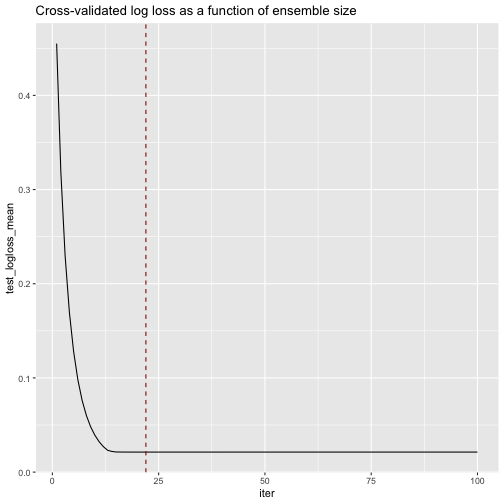
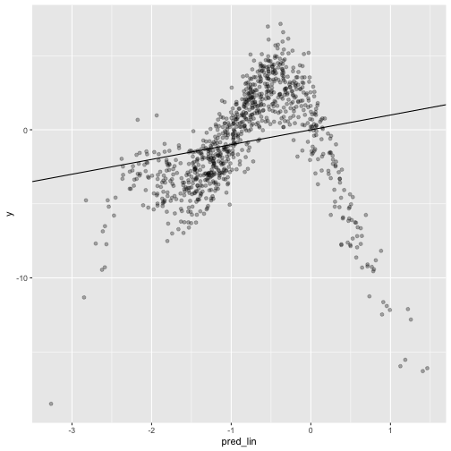
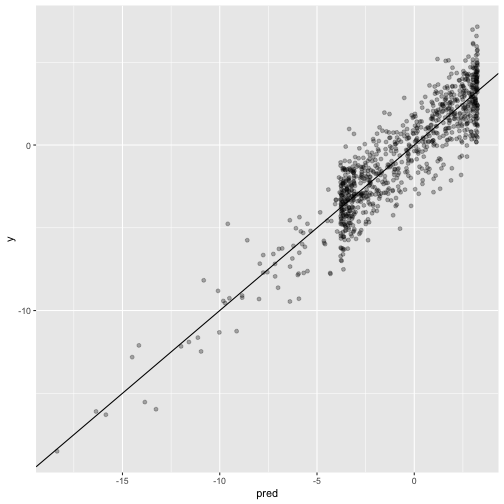
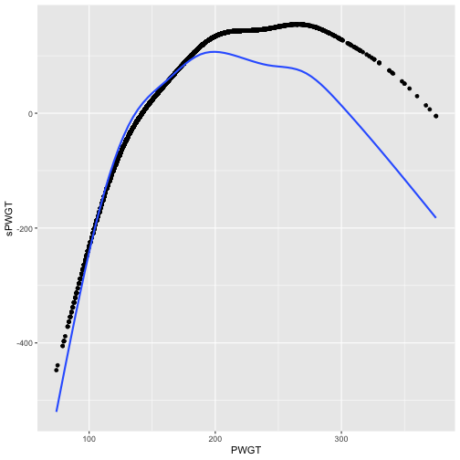
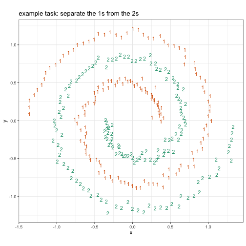
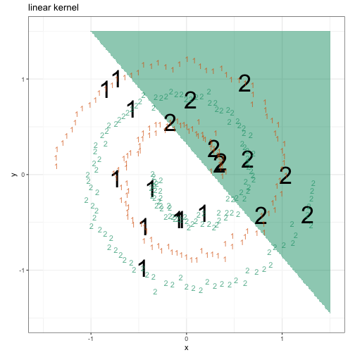
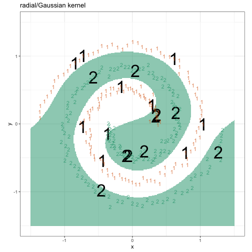

00324_example_10.1_of_section_10.1.1.R


```r
# example 10.1 of section 10.1.1 
# (example 10.1 of section 10.1.1)  : Exploring advanced methods : Tree-based methods : A basic decision tree 
# Title: Preparing Spambase data and evaluating a decision tree model 

spamD <- read.table('../Spambase/spamD.tsv', header = TRUE, sep = '\t')    		# Note: 1 
spamD$isSpam <- spamD$spam == 'spam'
spamTrain <- subset(spamD, spamD$rgroup >= 10)
spamTest <- subset(spamD, spamD$rgroup < 10)

spamVars <- setdiff(colnames(spamD), list('rgroup', 'spam', 'isSpam'))
library(wrapr)
spamFormula <- mk_formula("isSpam", spamVars)                        	# Note: 2 
                   
loglikelihood <- function(y, py) {                                     	# Note: 3 
  pysmooth <- ifelse(py == 0, 1e-12,
                  ifelse(py == 1, 1 - 1e-12, py))

  sum(y * log(pysmooth) + (1 - y) * log(1 - pysmooth))
}


accuracyMeasures <- function(pred, truth, name = "model") {            	# Note: 4 
  dev.norm <- -2 * loglikelihood(as.numeric(truth), pred) / length(pred)    	# Note: 5 
  ctable <- table(truth = truth,
                 pred = (pred > 0.5))                                       	# Note: 6 
  accuracy <- sum(diag(ctable)) / sum(ctable)
  precision <- ctable[2, 2] / sum(ctable[, 2])
  recall <- ctable[2, 2] / sum(ctable[2, ])
  f1 <- 2 * precision * recall / (precision + recall)
  data.frame(model = name, accuracy = accuracy, f1 = f1, dev.norm)
}


library(rpart)                                                              	# Note: 7 
treemodel <- rpart(spamFormula, spamTrain, method = "class")

library(rpart.plot)                                                     	# Note: 8 
rpart.plot(treemodel, type = 5, extra = 6)     
```


```r
predTrain <- predict(treemodel, newdata = spamTrain)[, 2]                	# Note: 9 

trainperf_tree <- accuracyMeasures(predTrain,                      		# Note: 10  
                 spamTrain$spam == "spam",
                 name = "tree, training")

predTest <- predict(treemodel, newdata = spamTest)[, 2]
testperf_tree <- accuracyMeasures(predTest,
                 spamTest$spam == "spam",
                 name = "tree, test")

# Note 1: 
#   Load the data and split into training (90% of data)  
#   and test (10% of data) sets. 

# Note 2: 
#   Use all the features and do binary classification,  
#   where TRUE corresponds to spam documents. 

# Note 3: 
#   A function to calculate log likelihood  
#   (for calculating deviance). 

# Note 4: 
#   A function to calculate and return various measures  
#   on the model: normalized deviance, prediction accuracy, and f1. 

# Note 5: 
#   Normalize the deviance by the number of data points  
#   so that we can compare the deviance across training and test sets. 

# Note 6: 
#   Convert the class probability estimator into a  
#   classifier by labeling documents that score greater than 0.5 as  
#   spam. 

# Note 7: 
#   Load the rpart library and fit a decision tree  
#   model. 

# Note 8: 
#   For plotting the tree. 

# Note 9: 
#   Get the predicted probabilities of the class 
#   "spam". 

# Note 10: 
#   Evaluate the decision tree model against the  
#   training and test sets. 
```


00325_informalexample_10.1_of_section_10.1.1.R


```r
# informalexample 10.1 of section 10.1.1 
# (informalexample 10.1 of section 10.1.1)  : Exploring advanced methods : Tree-based methods : A basic decision tree 

library(pander)                                                 	# Note: 1 
                        
panderOptions("plain.ascii", TRUE)                    	# Note: 2 
panderOptions("keep.trailing.zeros", TRUE)
panderOptions("table.style", "simple")
perf_justify <- "lrrr"
                            
perftable <- rbind(trainperf_tree, testperf_tree)
pandoc.table(perftable, justify = perf_justify)   
```

```
## 
## 
## model              accuracy       f1   dev.norm
## ---------------- ---------- -------- ----------
## tree, training       0.8996   0.8691     0.6304
## tree, test           0.8712   0.8280     0.7531
```

```r
## 
## 
## model              accuracy       f1   dev.norm
## ---------------- ---------- -------- ----------
## tree, training       0.8996   0.8691     0.6304
## tree, test           0.8712   0.8280     0.7531

# Note 1: 
#   A package to make nicely formatted ascii tables. 

# Note 2: 
#   Set some options globally so we don't have to keep setting them in every call. 
```


00326_example_10.2_of_section_10.1.2.R


```r
# example 10.2 of section 10.1.2 
# (example 10.2 of section 10.1.2)  : Exploring advanced methods : Tree-based methods : Using bagging to improve prediction 
# Title: Bagging decision trees 

ntrain <- dim(spamTrain)[1] 
n <- ntrain                                                	# Note: 1  
ntree <- 100

samples <- sapply(1:ntree,                                	# Note: 2  
                 FUN = function(iter)
                   { sample(1:ntrain, size = n, replace = TRUE) })

treelist <-lapply(1:ntree,                                 	# Note: 3  
                  FUN = function(iter) {
                    samp <- samples[, iter];
                    rpart(spamFormula, spamTrain[samp, ], method = "class") })

predict.bag <- function(treelist, newdata) {               	# Note: 4  
  preds <- sapply(1:length(treelist),
                 FUN = function(iter) {
                   predict(treelist[[iter]], newdata = newdata)[, 2] })
  predsums <- rowSums(preds)
  predsums / length(treelist)
}

pred <- predict.bag(treelist, newdata = spamTrain)
trainperf_bag <- accuracyMeasures(pred,                    	# Note: 5  
                 spamTrain$spam == "spam",
                 name = "bagging, training")

pred <- predict.bag(treelist, newdata = spamTest)
testperf_bag <- accuracyMeasures(pred,
                 spamTest$spam == "spam",
                 name = "bagging, test")

perftable <- rbind(trainperf_bag, testperf_bag)
pandoc.table(perftable, justify = perf_justify)
```

```
## 
## 
## model                 accuracy       f1   dev.norm
## ------------------- ---------- -------- ----------
## bagging, training       0.9158   0.8906     0.5124
## bagging, test           0.9105   0.8791     0.5809
```

```r
## 
## 
## model                 accuracy       f1   dev.norm
## ------------------- ---------- -------- ----------
## bagging, training       0.9167   0.8917     0.5080
## bagging, test           0.9127   0.8824     0.5793

# Note 1: 
#   Use bootstrap samples the same size as the training  
#   set, with 100 trees. 

# Note 2: 
#   Build the bootstrap samples by sampling the row indices of spamTrain with replacement. Each  
#   column of the matrix samples represents the row indices into spamTrain  
#   that comprise the bootstrap sample. 

# Note 3: 
#   Train the individual decision trees and return them  
#   in a list. Note: this step can take a few minutes. 

# Note 4: 
#   predict.bag assumes the underlying classifier returns decision probabilities, not  
#   decisions. predict.bag takes the mean of the predictions of all the individual trees 

# Note 5: 
#   Evaluate the bagged decision trees against the  
#   training and test sets. 
```


00327_example_10.3_of_section_10.1.3.R


```r
# example 10.3 of section 10.1.3 
# (example 10.3 of section 10.1.3)  : Exploring advanced methods : Tree-based methods : Using random forests to further improve prediction 
# Title: Using random forests 

library(randomForest)                                   	# Note: 1 
```

```
## randomForest 4.6-14
```

```
## Type rfNews() to see new features/changes/bug fixes.
```

```r
set.seed(5123512)                                     	# Note: 2 
fmodel <- randomForest(x = spamTrain[, spamVars],       	# Note: 3 
        y = spamTrain$spam,
        ntree = 100,                                   	# Note: 4 
        nodesize = 7,                                  	# Note: 5 
        importance = TRUE)                             	# Note: 6 
                    
pred <- predict(fmodel, 
                spamTrain[, spamVars], 
                type = 'prob')[, 'spam']
                
trainperf_rf <-  accuracyMeasures(predict(fmodel,      	# Note: 7 
   newdata = spamTrain[, spamVars], type = 'prob')[, 'spam'],
   spamTrain$spam == "spam", name = "random forest, train")

testperf_rf <-  accuracyMeasures(predict(fmodel,
   newdata = spamTest[, spamVars], type = 'prob')[, 'spam'],
   spamTest$spam == "spam", name = "random forest, test")
   
perftable <- rbind(trainperf_rf, testperf_rf)
pandoc.table(perftable, justify = perf_justify)
```

```
## 
## 
## model                    accuracy       f1   dev.norm
## ---------------------- ---------- -------- ----------
## random forest, train       0.9884   0.9852     0.1440
## random forest, test        0.9498   0.9341     0.3011
```

```r
## 
## 
## model                    accuracy       f1   dev.norm
## ---------------------- ---------- -------- ----------
## random forest, train       0.9884   0.9852     0.1440
## random forest, test        0.9498   0.9341     0.3011

# Note 1: 
#   Load the randomForest package. 

# Note 2: 
#   Set the pseudo-random seed to a known value to try to make the random forest run 
#   repeatable. 

# Note 3: 
#   Call the randomForest() function to build the model 
#   with explanatory variables as x and the category to be predicted as 
#   y. 

# Note 4: 
#   Use 100 trees to be compatible with our bagging 
#   example. The default is 500 trees. 

# Note 5: 
#   Specify that each node of a tree must have a minimum of 7 elements to be compatible with the 
#   default minimum node size that rpart() uses on this training set. 

# Note 6: 
#   Tell the algorithm to save information to be used for 
#   calculating variable importance (we’ll see this later). 

# Note 7: 
#   Report the model quality. 
```


00328_informalexample_10.2_of_section_10.1.3.R


```r
# informalexample 10.2 of section 10.1.3 
# (informalexample 10.2 of section 10.1.3)  : Exploring advanced methods : Tree-based methods : Using random forests to further improve prediction 

trainf <- rbind(trainperf_tree, trainperf_bag, trainperf_rf)
pandoc.table(trainf, justify = perf_justify)                    
```

```
## 
## 
## model                    accuracy       f1   dev.norm
## ---------------------- ---------- -------- ----------
## tree, training             0.8996   0.8691     0.6304
## bagging, training          0.9158   0.8906     0.5124
## random forest, train       0.9884   0.9852     0.1440
```

```r
## 
## 
## model                    accuracy       f1   dev.norm
## ---------------------- ---------- -------- ----------
## tree, training             0.8996   0.8691     0.6304
## bagging, training          0.9160   0.8906     0.5106
## random forest, train       0.9884   0.9852     0.1440
```


00329_informalexample_10.3_of_section_10.1.3.R


```r
# informalexample 10.3 of section 10.1.3 
# (informalexample 10.3 of section 10.1.3)  : Exploring advanced methods : Tree-based methods : Using random forests to further improve prediction 

testf <- rbind(testperf_tree, testperf_bag, testperf_rf)
pandoc.table(testf, justify = perf_justify)
```

```
## 
## 
## model                   accuracy       f1   dev.norm
## --------------------- ---------- -------- ----------
## tree, test                0.8712   0.8280     0.7531
## bagging, test             0.9105   0.8791     0.5809
## random forest, test       0.9498   0.9341     0.3011
```

```r
## 
## 
## model                   accuracy       f1   dev.norm
## --------------------- ---------- -------- ----------
## tree, test                0.8712   0.8280     0.7531
## bagging, test             0.9105   0.8791     0.5834
## random forest, test       0.9498   0.9341     0.3011
```


00330_informalexample_10.4_of_section_10.1.3.R


```r
# informalexample 10.4 of section 10.1.3 
# (informalexample 10.4 of section 10.1.3)  : Exploring advanced methods : Tree-based methods : Using random forests to further improve prediction 

difff <- data.frame(model = c("tree", "bagging", "random forest"),
                  accuracy = trainf$accuracy - testf$accuracy,
                  f1 = trainf$f1 - testf$f1,
                  dev.norm = trainf$dev.norm - testf$dev.norm)

pandoc.table(difff, justify=perf_justify)
```

```
## 
## 
## model             accuracy        f1   dev.norm
## --------------- ---------- --------- ----------
## tree              0.028411   0.04111   -0.12275
## bagging           0.005281   0.01151   -0.06846
## random forest     0.038633   0.05110   -0.15711
```

```r
## 
## 
## model             accuracy        f1   dev.norm
## --------------- ---------- --------- ----------
## tree              0.028411   0.04111   -0.12275
## bagging           0.005523   0.01158   -0.07284
## random forest     0.038633   0.05110   -0.15711
```


00331_example_10.4_of_section_10.1.3.R


```r
# example 10.4 of section 10.1.3 
# (example 10.4 of section 10.1.3)  : Exploring advanced methods : Tree-based methods : Using random forests to further improve prediction 
# Title: randomForest variable importances 

varImp <- importance(fmodel)                         	# Note: 1 

varImp[1:10, ]                                       	# Note: 2 
```

```
##                     non-spam      spam MeanDecreaseAccuracy
## word.freq.make      1.656795  3.432962             3.067899
## word.freq.address   2.631231  3.800668             3.632077
## word.freq.all       3.279517  6.235651             6.137927
## word.freq.3d        3.900232  1.286917             3.753238
## word.freq.our       9.966034 10.160010            12.039651
## word.freq.over      4.657285  4.183888             4.894526
## word.freq.remove   19.172764 14.020182            20.229958
## word.freq.internet  7.595305  5.246213             8.036892
## word.freq.order     3.167008  2.505777             3.065529
## word.freq.mail      3.820764  2.786041             4.869502
##                    MeanDecreaseGini
## word.freq.make             8.131240
## word.freq.address          9.971055
## word.freq.all             27.744061
## word.freq.3d               1.453879
## word.freq.our             59.215337
## word.freq.over            13.362416
## word.freq.remove         158.008043
## word.freq.internet        22.025964
## word.freq.order            8.062485
## word.freq.mail            11.605088
```

```r
##                     non-spam      spam MeanDecreaseAccuracy
## word.freq.make      1.656795  3.432962             3.067899
## word.freq.address   2.631231  3.800668             3.632077
## word.freq.all       3.279517  6.235651             6.137927
## word.freq.3d        3.900232  1.286917             3.753238
## word.freq.our       9.966034 10.160010            12.039651
## word.freq.over      4.657285  4.183888             4.894526
## word.freq.remove   19.172764 14.020182            20.229958
## word.freq.internet  7.595305  5.246213             8.036892
## word.freq.order     3.167008  2.505777             3.065529
## word.freq.mail      3.820764  2.786041             4.869502

varImpPlot(fmodel, type = 1)                       	# Note: 3
```


```r
# Note 1: 
#   Call importance() on the spam 
#   model. 

# Note 2: 
#   The importance() function returns a matrix of 
#   importance measures (larger values = more important). 

# Note 3: 
#   Plot the variable importance as measured by 
#   accuracy change. 
```


00332_example_10.5_of_section_10.1.3.R


```r
# example 10.5 of section 10.1.3 
# (example 10.5 of section 10.1.3)  : Exploring advanced methods : Tree-based methods : Using random forests to further improve prediction 
# Title: Fitting with fewer variables 

sorted <- sort(varImp[, "MeanDecreaseAccuracy"],       	# Note: 1 
               decreasing = TRUE)

selVars <- names(sorted)[1:30]
fsel <- randomForest(x = spamTrain[, selVars],             	# Note: 2 
                        y = spamTrain$spam, 
                        ntree = 100,
                        nodesize = 7,
                        importance = TRUE)
                           
trainperf_rf2 <- accuracyMeasures(predict(fsel,
   newdata = spamTrain[, selVars], type = 'prob')[, 'spam'],
   spamTrain$spam == "spam", name = "RF small, train")

testperf_rf2 <- accuracyMeasures(predict(fsel,
   newdata=spamTest[, selVars], type = 'prob')[, 'spam'],
   spamTest$spam == "spam", name = "RF small, test")

perftable <- rbind(testperf_rf, testperf_rf2)              	# Note: 3 
pandoc.table(perftable, justify = perf_justify)
```

```
## 
## 
## model                   accuracy       f1   dev.norm
## --------------------- ---------- -------- ----------
## random forest, test       0.9498   0.9341     0.3011
## RF small, test            0.9520   0.9368     0.4000
```

```r
##
##
## model                   accuracy       f1   dev.norm
## --------------------- ---------- -------- ----------
## random forest, test       0.9498   0.9341     0.3011
## RF small, test            0.9520   0.9368     0.4000

# Note 1: 
#   Sort the variables by their importance, as 
#   measured by accuracy change. 

# Note 2: 
#   Build a random forest model using only the 30 
#   most important variables. 

# Note 3: 
#   Compare the two random forest models on the test set. 
```


00333_example_10.6_of_section_10.1.4.R


```r
# example 10.6 of section 10.1.4 
# (example 10.6 of section 10.1.4)  : Exploring advanced methods : Tree-based methods : Gradient-boosted trees 
# Title: Load the iris data 

iris <- iris
iris$class <- as.numeric(iris$Species == "setosa")     	# Note: 1  
set.seed(2345)
intrain <- runif(nrow(iris)) < 0.75                        	# Note: 2 
train <- iris[intrain, ]
test <- iris[!intrain, ]
head(train)
```

```
##   Sepal.Length Sepal.Width Petal.Length Petal.Width Species class
## 1          5.1         3.5          1.4         0.2  setosa     1
## 2          4.9         3.0          1.4         0.2  setosa     1
## 3          4.7         3.2          1.3         0.2  setosa     1
## 4          4.6         3.1          1.5         0.2  setosa     1
## 5          5.0         3.6          1.4         0.2  setosa     1
## 6          5.4         3.9          1.7         0.4  setosa     1
```

```r
##   Sepal.Length Sepal.Width Petal.Length Petal.Width Species class
## 1          5.1         3.5          1.4         0.2  setosa     1
## 2          4.9         3.0          1.4         0.2  setosa     1
## 3          4.7         3.2          1.3         0.2  setosa     1
## 4          4.6         3.1          1.5         0.2  setosa     1
## 5          5.0         3.6          1.4         0.2  setosa     1
## 6          5.4         3.9          1.7         0.4  setosa     1

input <- as.matrix(train[, 1:4])                         	# Note: 3

# Note 1: 
#   setosa is the positive class. 

# Note 2: 
#   Split the data into training and test (75%/25%). 

# Note 3: 
#   Create the input matrix. 
```


00334_example_10.7_of_section_10.1.4.R


```r
# example 10.7 of section 10.1.4 
# (example 10.7 of section 10.1.4)  : Exploring advanced methods : Tree-based methods : Gradient-boosted trees 
# Title: Cross-validate to determine model size 

library(xgboost)

cv <- xgb.cv(input,                                        	# Note: 1  
            label = train$class,                           	# Note: 2  
              params = list(
                objective = "binary:logistic"             	# Note: 3 
              ),
              nfold = 5,                                    	# Note: 4 
              nrounds = 100,                                	# Note: 5 
              print_every_n = 10,                           	# Note: 6 
              metrics = "logloss")                      	# Note: 7  
```

```
## [1]	train-logloss:0.454781+0.000056	test-logloss:0.454951+0.001252 
## [11]	train-logloss:0.032154+0.000045	test-logloss:0.032292+0.001016 
## [21]	train-logloss:0.020894+0.000931	test-logloss:0.021263+0.001448 
## [31]	train-logloss:0.020881+0.000932	test-logloss:0.021271+0.001580 
## [41]	train-logloss:0.020881+0.000932	test-logloss:0.021274+0.001597 
## [51]	train-logloss:0.020881+0.000932	test-logloss:0.021274+0.001599 
## [61]	train-logloss:0.020881+0.000932	test-logloss:0.021274+0.001599 
## [71]	train-logloss:0.020881+0.000932	test-logloss:0.021274+0.001599 
## [81]	train-logloss:0.020881+0.000932	test-logloss:0.021274+0.001599 
## [91]	train-logloss:0.020881+0.000932	test-logloss:0.021274+0.001599 
## [100]	train-logloss:0.020881+0.000932	test-logloss:0.021274+0.001599
```

```r
evalframe <- as.data.frame(cv$evaluation_log)               	# Note: 8  
head(evalframe)                                              	# Note: 9  
```

```
##   iter train_logloss_mean train_logloss_std test_logloss_mean
## 1    1          0.4547814      5.593782e-05         0.4549512
## 2    2          0.3175814      7.121685e-05         0.3177942
## 3    3          0.2294228      7.447523e-05         0.2296446
## 4    4          0.1696256      7.299753e-05         0.1698442
## 5    5          0.1277404      6.963505e-05         0.1279494
## 6    6          0.0977664      6.520307e-05         0.0979644
##   test_logloss_std
## 1      0.001252187
## 2      0.001570859
## 3      0.001636491
## 4      0.001609531
## 5      0.001543457
## 6      0.001459891
```

```r
##   iter train_logloss_mean train_logloss_std test_logloss_mean
## 1    1          0.4547800      7.758350e-05         0.4550578
## 2    2          0.3175798      9.268527e-05         0.3179284
## 3    3          0.2294212      9.542411e-05         0.2297848
## 4    4          0.1696242      9.452492e-05         0.1699816
## 5    5          0.1277388      9.207258e-05         0.1280816
## 6    6          0.0977648      8.913899e-05         0.0980894
##   test_logloss_std
## 1      0.001638487
## 2      0.002056267
## 3      0.002142687
## 4      0.002107535
## 5      0.002020668
## 6      0.001911152

(NROUNDS <- which.min(evalframe$test_logloss_mean))        	# Note: 10 
```

```
## [1] 22
```

```r
## [1] 18

library(ggplot2)
```

```
## 
## Attaching package: 'ggplot2'
```

```
## The following object is masked from 'package:randomForest':
## 
##     margin
```

```r
ggplot(evalframe, aes(x = iter, y = test_logloss_mean)) + 
  geom_line() + 
  geom_vline(xintercept = NROUNDS, color = "darkred", linetype = 2) + 
  ggtitle("Cross-validated log loss as a function of ensemble size")
```



```r
# Note 1: 
#   The input matrix. 

# Note 2: 
#   The class labels, which must also be numeric  
#   (1 for setosa, 0 for not setosa). 

# Note 3: 
#   Use the objective "binary:logistic" for binary  
#   classification, "reg:linear" for regression. 

# Note 4: 
#   Use 5-fold cross-validation. 

# Note 5: 
#   Build an ensemble of 100 trees. 

# Note 6: 
#   Print a message every 10th iteration  
#   (use verbose = FALSE for no messages). 

# Note 7: 
#   Use minimum cross-validated logloss (related to deviance)  
#   to pick the optimum number of trees. for regression,  
#   use metrics = "rmse" 

# Note 8: 
#   Get the performance log. 

# Note 9: 
#   evalframe records the training and cross-validated  
#   logloss as a function of the number of trees. 

# Note 10: 
#   Find the number of trees that gave the minimum  
#   cross-validated logloss. 
```


00335_example_10.8_of_section_10.1.4.R


```r
# example 10.8 of section 10.1.4 
# (example 10.8 of section 10.1.4)  : Exploring advanced methods : Tree-based methods : Gradient-boosted trees 
# Title: Fit an xgboost model 

model <- xgboost(data = input, 
                 label = train$class,   
                  params = list(
                    objective = "binary:logistic" 
                  ),
                  nrounds = NROUNDS,
                  verbose = FALSE)

test_input <- as.matrix(test[, 1:4])               	# Note: 1 
pred <- predict(model,  test_input)                	# Note: 2 

accuracyMeasures(pred, test$class) 
```

```
##   model accuracy f1   dev.norm
## 1 model        1  1 0.03439622
```

```r
##   model accuracy f1   dev.norm
## 1 model        1  1 0.03458392

# Note 1: 
#   Create the input matrix for the test data. 

# Note 2: 
#   Make predictions 
```


00336_informalexample_10.5_of_section_10.1.4.R


```r
# informalexample 10.5 of section 10.1.4 
# (informalexample 10.5 of section 10.1.4)  : Exploring advanced methods : Tree-based methods : Gradient-boosted trees 

library(zeallot)
c(texts, labels) %<-% readRDS("../IMDB/IMDBtrain.RDS")
```


00337_informalexample_10.6_of_section_10.1.4.R


```r
# informalexample 10.6 of section 10.1.4 
# (informalexample 10.6 of section 10.1.4)  : Exploring advanced methods : Tree-based methods : Gradient-boosted trees 

source("../IMDB/lime_imdb_example.R")
vocab <- create_pruned_vocabulary(texts)  
dtm_train <- make_matrix(texts, vocab)
```


00338_informalexample_10.7_of_section_10.1.4.R


```r
# informalexample 10.7 of section 10.1.4 
# (informalexample 10.7 of section 10.1.4)  : Exploring advanced methods : Tree-based methods : Gradient-boosted trees 

cv <- xgb.cv(dtm_train, 
             label = labels,
             params = list(
               objective = "binary:logistic"
               ),
             nfold = 5,
             nrounds = 500,
             early_stopping_rounds = 20,             	# Note: 1 
             print_every_n = 10,
             metrics = "logloss")    
```

```
## [1]	train-logloss:0.631250+0.000443	test-logloss:0.636453+0.000733 
## Multiple eval metrics are present. Will use test_logloss for early stopping.
## Will train until test_logloss hasn't improved in 20 rounds.
## 
## [11]	train-logloss:0.449784+0.000786	test-logloss:0.486051+0.002957 
## [21]	train-logloss:0.376966+0.000947	test-logloss:0.435103+0.002819 
## [31]	train-logloss:0.328215+0.000420	test-logloss:0.403382+0.004930 
## [41]	train-logloss:0.293795+0.000890	test-logloss:0.382221+0.004650 
## [51]	train-logloss:0.267975+0.001346	test-logloss:0.368658+0.003987 
## [61]	train-logloss:0.246493+0.000557	test-logloss:0.358546+0.004636 
## [71]	train-logloss:0.228934+0.000576	test-logloss:0.349346+0.004171 
## [81]	train-logloss:0.213974+0.001132	test-logloss:0.342234+0.004249 
## [91]	train-logloss:0.200892+0.000981	test-logloss:0.336647+0.004005 
## [101]	train-logloss:0.188946+0.000474	test-logloss:0.332055+0.004003 
## [111]	train-logloss:0.178643+0.001170	test-logloss:0.327705+0.004737 
## [121]	train-logloss:0.169406+0.001105	test-logloss:0.324074+0.004915 
## [131]	train-logloss:0.161194+0.001291	test-logloss:0.321490+0.004933 
## [141]	train-logloss:0.153589+0.000865	test-logloss:0.319325+0.005278 
## [151]	train-logloss:0.146575+0.000535	test-logloss:0.316899+0.005087 
## [161]	train-logloss:0.140012+0.000421	test-logloss:0.314983+0.005053 
## [171]	train-logloss:0.134023+0.000523	test-logloss:0.313549+0.004718 
## [181]	train-logloss:0.127586+0.000728	test-logloss:0.311965+0.004534 
## [191]	train-logloss:0.122542+0.000505	test-logloss:0.310759+0.004493 
## [201]	train-logloss:0.117717+0.000799	test-logloss:0.309625+0.005186 
## [211]	train-logloss:0.113208+0.000836	test-logloss:0.308143+0.005235 
## [221]	train-logloss:0.108600+0.001178	test-logloss:0.306745+0.004626 
## [231]	train-logloss:0.104509+0.001440	test-logloss:0.306251+0.004893 
## [241]	train-logloss:0.100300+0.001238	test-logloss:0.305592+0.005267 
## [251]	train-logloss:0.096470+0.001406	test-logloss:0.304485+0.005634 
## [261]	train-logloss:0.092778+0.001332	test-logloss:0.304231+0.005759 
## [271]	train-logloss:0.088868+0.001611	test-logloss:0.303794+0.006308 
## [281]	train-logloss:0.086019+0.001661	test-logloss:0.303376+0.006233 
## [291]	train-logloss:0.082998+0.001077	test-logloss:0.302710+0.005701 
## [301]	train-logloss:0.080217+0.001242	test-logloss:0.302079+0.005886 
## [311]	train-logloss:0.077203+0.001095	test-logloss:0.302018+0.006373 
## [321]	train-logloss:0.074611+0.001112	test-logloss:0.301975+0.006427 
## [331]	train-logloss:0.072316+0.000978	test-logloss:0.302029+0.006482 
## [341]	train-logloss:0.070011+0.000922	test-logloss:0.301722+0.006897 
## [351]	train-logloss:0.067635+0.001054	test-logloss:0.301452+0.006784 
## [361]	train-logloss:0.065395+0.001261	test-logloss:0.301633+0.006793 
## [371]	train-logloss:0.063413+0.001349	test-logloss:0.301503+0.007015 
## Stopping. Best iteration:
## [352]	train-logloss:0.067377+0.001152	test-logloss:0.301444+0.006783
```

```r
evalframe <- as.data.frame(cv$evaluation_log)
(NROUNDS <- which.min(evalframe$test_logloss_mean))             
```

```
## [1] 352
```

```r
## [1] 319

# Note 1: 
#   Stop early if performance doesn’t improve for 
#   20 rounds. 
```


00339_informalexample_10.8_of_section_10.1.4.R


```r
# informalexample 10.8 of section 10.1.4 
# (informalexample 10.8 of section 10.1.4)  : Exploring advanced methods : Tree-based methods : Gradient-boosted trees 

model <- xgboost(data = dtm_train, label = labels,
                  params = list(
                    objective = "binary:logistic"
                  ),
                  nrounds = NROUNDS,
                  verbose = FALSE)

pred = predict(model, dtm_train)  
trainperf_xgb =  accuracyMeasures(pred, labels, "training")  

c(test_texts, test_labels) %<-% readRDS("../IMDB/IMDBtest.RDS")    	# Note: 1 
dtm_test = make_matrix(test_texts, vocab) 

pred = predict(model, dtm_test)
testperf_xgb = accuracyMeasures(pred, test_labels, "test")

perftable <- rbind(trainperf_xgb, testperf_xgb)
pandoc.table(perftable, justify = perf_justify)   
```

```
## 
## 
## model        accuracy       f1   dev.norm
## ---------- ---------- -------- ----------
## training       0.9912   0.9913     0.1563
## test           0.8728   0.8736     0.5945
```

```r
## 
## 
## model        accuracy       f1   dev.norm
## ---------- ---------- -------- ----------
## training       0.9891   0.9891     0.1723
## test           0.8725   0.8735     0.5955

# Note 1: 
#   Load the test data and convert it to a document-term matrix. 
```


00340_example_10.9_of_section_10.1.4.R


```r
# example 10.9 of section 10.1.4 
# (example 10.9 of section 10.1.4)  : Exploring advanced methods : Tree-based methods : Gradient-boosted trees 
# Title: Load the natality data 

load("../CDC/NatalBirthData.rData")
train <- sdata[sdata$ORIGRANDGROUP <= 5, ]                                   	# Note: 1  
test <- sdata[sdata$ORIGRANDGROUP >5 , ]

input_vars <- setdiff(colnames(train), c("DBWT", "ORIGRANDGROUP"))    	# Note: 2 
                   
str(train[, input_vars])
```

```
## 'data.frame':	14386 obs. of  11 variables:
##  $ PWGT      : int  155 140 151 160 135 180 200 135 112 98 ...
##  $ WTGAIN    : int  42 40 1 47 25 20 24 51 36 22 ...
##  $ MAGER     : int  30 32 34 32 24 25 26 26 20 22 ...
##  $ UPREVIS   : int  14 13 15 1 4 10 14 15 14 10 ...
##  $ CIG_REC   : logi  FALSE FALSE FALSE TRUE FALSE FALSE ...
##  $ GESTREC3  : Factor w/ 2 levels ">= 37 weeks",..: 1 1 1 2 1 1 1 1 1 1 ...
##  $ DPLURAL   : Factor w/ 3 levels "single","triplet or higher",..: 1 1 1 1 1 1 1 1 1 1 ...
##  $ URF_DIAB  : logi  FALSE FALSE FALSE FALSE FALSE FALSE ...
##  $ URF_CHYPER: logi  FALSE FALSE FALSE FALSE FALSE FALSE ...
##  $ URF_PHYPER: logi  FALSE FALSE FALSE FALSE FALSE FALSE ...
##  $ URF_ECLAM : logi  FALSE FALSE FALSE FALSE FALSE FALSE ...
```

```r
## 'data.frame':    14386 obs. of  11 variables:
##  $ PWGT      : int  155 140 151 160 135 180 200 135 112 98 ...
##  $ WTGAIN    : int  42 40 1 47 25 20 24 51 36 22 ...
##  $ MAGER     : int  30 32 34 32 24 25 26 26 20 22 ...
##  $ UPREVIS   : int  14 13 15 1 4 10 14 15 14 10 ...
##  $ CIG_REC   : logi  FALSE FALSE FALSE TRUE FALSE FALSE ...
##  $ GESTREC3  : Factor w/ 2 levels ">= 37 weeks",..: 1 1 1 2 1 1 1 1 1 1 ...
##  $ DPLURAL   : Factor w/ 3 levels "single","triplet or higher",..: 1 1 1 1 1 1 1 1 1 1 ...
##  $ URF_DIAB  : logi  FALSE FALSE FALSE FALSE FALSE FALSE ...
##  $ URF_CHYPER: logi  FALSE FALSE FALSE FALSE FALSE FALSE ...
##  $ URF_PHYPER: logi  FALSE FALSE FALSE FALSE FALSE FALSE ...
##  $ URF_ECLAM : logi  FALSE FALSE FALSE FALSE FALSE FALSE ...

# Note 1: 
#   Split the data into training and test sets. 

# Note 2: 
#   Use all the variables in the model.  
#   DBWT (baby's birth weight) is 
#   the value to be predicted, and ORIGRANDGROUP is the grouping variable. 
```


00341_example_10.10_of_section_10.1.4.R


```r
# example 10.10 of section 10.1.4 
# (example 10.10 of section 10.1.4)  : Exploring advanced methods : Tree-based methods : Gradient-boosted trees 
# Title: Use vtreat to prepare data for xgboost 

library(vtreat)

treatplan <- designTreatmentsZ(train,                                 	# Note: 1 
                               input_vars,
                               codeRestriction = c("clean", "isBAD", "lev" ),   	# Note: 2 
                               verbose = FALSE)

train_treated <- prepare(treatplan, train) 	# Note: 3 
str(train_treated)
```

```
## 'data.frame':	14386 obs. of  14 variables:
##  $ PWGT                           : num  155 140 151 160 135 180 200 135 112 98 ...
##  $ WTGAIN                         : num  42 40 1 47 25 20 24 51 36 22 ...
##  $ MAGER                          : num  30 32 34 32 24 25 26 26 20 22 ...
##  $ UPREVIS                        : num  14 13 15 1 4 10 14 15 14 10 ...
##  $ CIG_REC                        : num  0 0 0 1 0 0 0 0 0 0 ...
##  $ URF_DIAB                       : num  0 0 0 0 0 0 0 0 0 0 ...
##  $ URF_CHYPER                     : num  0 0 0 0 0 0 0 0 0 0 ...
##  $ URF_PHYPER                     : num  0 0 0 0 0 0 0 0 0 0 ...
##  $ URF_ECLAM                      : num  0 0 0 0 0 0 0 0 0 0 ...
##  $ GESTREC3_lev_x_lt_37_weeks     : num  0 0 0 1 0 0 0 0 0 0 ...
##  $ GESTREC3_lev_x_gt_eq_37_weeks  : num  1 1 1 0 1 1 1 1 1 1 ...
##  $ DPLURAL_lev_x_single           : num  1 1 1 1 1 1 1 1 1 1 ...
##  $ DPLURAL_lev_x_triplet_or_higher: num  0 0 0 0 0 0 0 0 0 0 ...
##  $ DPLURAL_lev_x_twin             : num  0 0 0 0 0 0 0 0 0 0 ...
```

```r
## 'data.frame':    14386 obs. of  14 variables:
##  $ PWGT                           : num  155 140 151 160 135 180 200 135 112 98 ...
##  $ WTGAIN                         : num  42 40 1 47 25 20 24 51 36 22 ...
##  $ MAGER                          : num  30 32 34 32 24 25 26 26 20 22 ...
##  $ UPREVIS                        : num  14 13 15 1 4 10 14 15 14 10 ...
##  $ CIG_REC                        : num  0 0 0 1 0 0 0 0 0 0 ...
##  $ URF_DIAB                       : num  0 0 0 0 0 0 0 0 0 0 ...
##  $ URF_CHYPER                     : num  0 0 0 0 0 0 0 0 0 0 ...
##  $ URF_PHYPER                     : num  0 0 0 0 0 0 0 0 0 0 ...
##  $ URF_ECLAM                      : num  0 0 0 0 0 0 0 0 0 0 ...
##  $ GESTREC3_lev_x_37_weeks        : num  0 0 0 1 0 0 0 0 0 0 ...
##  $ GESTREC3_lev_x_37_weeks_1      : num  1 1 1 0 1 1 1 1 1 1 ...
##  $ DPLURAL_lev_x_single           : num  1 1 1 1 1 1 1 1 1 1 ...
##  $ DPLURAL_lev_x_triplet_or_higher: num  0 0 0 0 0 0 0 0 0 0 ...
##  $ DPLURAL_lev_x_twin             : num  0 0 0 0 0 0 0 0 0 0 ...

# Note 1: 
#   Create the treatment plan. 

# Note 2: 
#   Create clean numeric variables ("clean"),  
#   missingness indicators ("isBad"),  
#   indicator variables ("lev"),  
#   but not catP (prevalence) variables. 

# Note 3: 
#   Prepare the training data. 
```


00342_example_10.11_of_section_10.1.4.R


```r
# example 10.11 of section 10.1.4 
# (example 10.11 of section 10.1.4)  : Exploring advanced methods : Tree-based methods : Gradient-boosted trees 
# Title: Fit and apply an xgboost model for birth weight 

birthwt_model <- xgboost(as.matrix(train_treated), 
                         train$DBWT,
                         params = list(
                           objective = "reg:linear",
                           base_score = mean(train$DBWT)
                         ),
                         nrounds = 50,
                         verbose = FALSE)

test_treated <- prepare(treatplan, test)
pred <- predict(birthwt_model, as.matrix(test_treated))
```


00345_example_10.12_of_section_10.2.2.R


```r
# example 10.12 of section 10.2.2 
# (example 10.12 of section 10.2.2)  : Exploring advanced methods : Using generalized additive models (GAMs) to learn non-monotone relationships : A one-dimensional regression example 
# Title: Preparing an artificial problem 

set.seed(602957)

x <- rnorm(1000)
noise <- rnorm(1000, sd = 1.5)

y <- 3 * sin(2 * x) + cos(0.75 * x) - 1.5 * (x^2) + noise

select <- runif(1000)
frame <- data.frame(y = y, x = x)

train <- frame[select > 0.1, ]
test <-frame[select <= 0.1, ]
```


00346_example_10.13_of_section_10.2.2.R


```r
# example 10.13 of section 10.2.2 
# (example 10.13 of section 10.2.2)  : Exploring advanced methods : Using generalized additive models (GAMs) to learn non-monotone relationships : A one-dimensional regression example 
# Title: Linear regression applied to the artificial example 

lin_model <- lm(y ~ x, data = train)
summary(lin_model)
```

```
## 
## Call:
## lm(formula = y ~ x, data = train)
## 
## Residuals:
##     Min      1Q  Median      3Q     Max 
## -17.698  -1.774   0.193   2.499   7.529 
## 
## Coefficients:
##             Estimate Std. Error t value Pr(>|t|)    
## (Intercept)  -0.8330     0.1161  -7.175 1.51e-12 ***
## x             0.7395     0.1197   6.180 9.74e-10 ***
## ---
## Signif. codes:  0 '***' 0.001 '**' 0.01 '*' 0.05 '.' 0.1 ' ' 1
## 
## Residual standard error: 3.485 on 899 degrees of freedom
## Multiple R-squared:  0.04075,	Adjusted R-squared:  0.03968 
## F-statistic: 38.19 on 1 and 899 DF,  p-value: 9.737e-10
```

```r
## 
## Call:
## lm(formula = y ~ x, data = train)
## 
## Residuals:
##     Min      1Q  Median      3Q     Max 
## -17.698  -1.774   0.193   2.499   7.529 
## 
## Coefficients:
##             Estimate Std. Error t value Pr(>|t|)    
## (Intercept)  -0.8330     0.1161  -7.175 1.51e-12 ***
## x             0.7395     0.1197   6.180 9.74e-10 ***
## ---
## Signif. codes:  0 '***' 0.001 '**' 0.01 '*' 0.05 '.' 0.1 ' ' 1
## 
## Residual standard error: 3.485 on 899 degrees of freedom
## Multiple R-squared:  0.04075,    Adjusted R-squared:  0.03968 
## F-statistic: 38.19 on 1 and 899 DF,  p-value: 9.737e-10

rmse <- function(residuals) {                    	# Note: 1 
  sqrt(mean(residuals^2))
}

train$pred_lin <- predict(lin_model, train)              	# Note: 2 
resid_lin <- with(train, y - pred_lin)
rmse(resid_lin)
```

```
## [1] 3.481091
```

```r
## [1] 3.481091

library(ggplot2)                                  	# Note: 3 

ggplot(train, aes(x = pred_lin, y = y)) + 
  geom_point(alpha = 0.3) + 
  geom_abline()
```



```r
# Note 1: 
#   A convenience function for calculating  
#   root mean squared error (RMSE) from a vector of residuals. 

# Note 2: 
#   Calculate the RMSE of this model on the training data. 

# Note 3: 
#   Plot y versus prediction. 
```


00347_example_10.14_of_section_10.2.2.R


```r
# example 10.14 of section 10.2.2 
# (example 10.14 of section 10.2.2)  : Exploring advanced methods : Using generalized additive models (GAMs) to learn non-monotone relationships : A one-dimensional regression example 
# Title: GAM applied to the artificial example 

library(mgcv)                                   	# Note: 1 
```

```
## Loading required package: nlme
```

```
## This is mgcv 1.8-28. For overview type 'help("mgcv-package")'.
```

```r
gam_model <- gam(y ~ s(x), data = train)        	# Note: 2 
gam_model$converged                             	# Note: 3 
```

```
## [1] TRUE
```

```r
## [1] TRUE

summary(gam_model)
```

```
## 
## Family: gaussian 
## Link function: identity 
## 
## Formula:
## y ~ s(x)
## 
## Parametric coefficients:
##             Estimate Std. Error t value Pr(>|t|)    
## (Intercept) -0.83467    0.04852   -17.2   <2e-16 ***
## ---
## Signif. codes:  0 '***' 0.001 '**' 0.01 '*' 0.05 '.' 0.1 ' ' 1
## 
## Approximate significance of smooth terms:
##        edf Ref.df     F p-value    
## s(x) 8.685  8.972 497.4  <2e-16 ***
## ---
## Signif. codes:  0 '***' 0.001 '**' 0.01 '*' 0.05 '.' 0.1 ' ' 1
## 
## R-sq.(adj) =  0.832   Deviance explained = 83.4%
## GCV =  2.144  Scale est. = 2.121     n = 901
```

```r
## Family: gaussian                                	# Note: 4 
## Link function: identity
##
## Formula:
## y ~ s(x)
##
## Parametric coefficients:                       	# Note: 5 
##             Estimate Std. Error t value Pr(>|t|)
## (Intercept) -0.83467    0.04852   -17.2   <2e-16 ***
## ---
## Signif. codes:  0 ‘***’ 0.001 ‘**’ 0.01 ‘*’ 0.05 ‘.’ 0.1 ‘ ’ 1
##
## Approximate significance of smooth terms:            	# Note: 6 
##        edf Ref.df     F p-value
## s(x) 8.685  8.972 497.8  <2e-16 ***
## ---
## Signif. codes:  0 ‘***’ 0.001 ‘**’ 0.01 ‘*’ 0.05 ‘.’ 0.1 ‘ ’ 1
##
## R-sq.(adj) =  0.832   Deviance explained = 83.4%          	# Note: 7 
## GCV score =  2.144  Scale est. = 2.121     n = 901

train$pred <- predict(gam_model, train)                	# Note: 8 
resid_gam <- with(train, y - pred)
rmse(resid_gam)
```

```
## [1] 1.448514
```

```r
## [1] 1.448514

ggplot(train, aes(x = pred, y = y)) +                   	# Note: 9 
  geom_point(alpha = 0.3) + 
  geom_abline()
```



```r
# Note 1: 
#   Load the mgcv package. 

# Note 2: 
#   Build the model, specifying that x should be 
#   treated as a non-linear variable. 

# Note 3: 
#   The converged parameter tells you if the algorithm 
#   converged. You should only trust the output if this is TRUE. 

# Note 4: 
#   Setting family = gaussian and link = identity tells you that  
#   the model was treated with the same 
#   distributions assumptions as a standard linear regression. 

# Note 5: 
#   The parametric coefficients are the linear terms  
#   (in this example, only the constant term). 
#   This section of the summary tells you which linear terms were 
#   significantly different from 0. 

# Note 6: 
#   The smooth terms are the non-linear terms.  
#   This section of the summary tells you which 
#   non-linear terms were significantly different from 0. It also tells you 
#   the effective degrees of freedom (edf) used up to build each smooth 
#   term. An edf near 1 indicates that the variable has an approximately 
#   linear relationship to the output. 

# Note 7: 
#   “R-sq (adj)” is the adjusted R-squared. “Deviance 
#   explained” is the raw R-squared (0.834). 

# Note 8: 
#   Calculate the RMSE of this model on the training data. 

# Note 9: 
#   Plot y versus prediction. 
```


00348_example_10.15_of_section_10.2.2.R


```r
# example 10.15 of section 10.2.2 
# (example 10.15 of section 10.2.2)  : Exploring advanced methods : Using generalized additive models (GAMs) to learn non-monotone relationships : A one-dimensional regression example 
# Title: Comparing linear regression and GAM performance 

test <- transform(test,                                   	# Note: 1 
                 pred_lin = predict(lin_model, test),
                 pred_gam = predict(gam_model, test) )


test <- transform(test,                                   	# Note: 2 
                 resid_lin = y - pred_lin,
                 resid_gam = y - pred_gam)


rmse(test$resid_lin)                                      	# Note: 3 
```

```
## [1] 2.792653
```

```r
## [1] 2.792653

rmse(test$resid_gam)
```

```
## [1] 1.401399
```

```r
## [1] 1.401399


library(sigr)                                            	# Note: 4 
wrapFTest(test, "pred_lin", "y")$R2
```

```
## [1] 0.115395
```

```r
## [1] 0.115395

wrapFTest(test, "pred_gam", "y")$R2
```

```
## [1] 0.777239
```

```r
## [1] 0.777239

# Note 1: 
#   Get predictions from both models on the test data. 
#   The function transform() is a base R version of dplyr::mutate(). 

# Note 2: 
#   Calculate the residuals. 

# Note 3: 
#   Compare the RMSE of both models on the test data. 

# Note 4: 
#   Compare the R-squared of both models on the test data,  
#   using the sigr package. 
```


00349_example_10.16_of_section_10.2.3.R


```r
# example 10.16 of section 10.2.3 
# (example 10.16 of section 10.2.3)  : Exploring advanced methods : Using generalized additive models (GAMs) to learn non-monotone relationships : Extracting the non-linear relationships 
# Title: Extracting a learned spline from a GAM 

sx <- predict(gam_model, type = "terms")
summary(sx)
```

```
##       s(x)           
##  Min.   :-17.527035  
##  1st Qu.: -2.378636  
##  Median :  0.009427  
##  Mean   :  0.000000  
##  3rd Qu.:  2.869166  
##  Max.   :  4.084999
```

```r
##       s(x)
##  Min.   :-17.527035
##  1st Qu.: -2.378636
##  Median :  0.009427
##  Mean   :  0.000000
##  3rd Qu.:  2.869166
##  Max.   :  4.084999

xframe <- cbind(train, sx = sx[,1])

ggplot(xframe, aes(x = x)) + 
     geom_point(aes(y = y), alpha = 0.4) +
     geom_line(aes(y = sx))
```


00350_example_10.17_of_section_10.2.4.R


```r
# example 10.17 of section 10.2.4 
# (example 10.17 of section 10.2.4)  : Exploring advanced methods : Using generalized additive models (GAMs) to learn non-monotone relationships : Using GAM on actual data 
# Title: Applying linear regression (with and without GAM) to health data 

library(mgcv)
library(ggplot2)
load("../CDC/NatalBirthData.rData")
train <- sdata[sdata$ORIGRANDGROUP <= 5, ]
test <- sdata[sdata$ORIGRANDGROUP > 5, ]

form_lin <- as.formula("DBWT ~ PWGT + WTGAIN + MAGER + UPREVIS")
linmodel <- lm(form_lin, data = train)                                	# Note: 1  
summary(linmodel)
```

```
## 
## Call:
## lm(formula = form_lin, data = train)
## 
## Residuals:
##      Min       1Q   Median       3Q      Max 
## -3155.43  -272.09    45.04   349.81  2870.55 
## 
## Coefficients:
##              Estimate Std. Error t value Pr(>|t|)    
## (Intercept) 2419.7090    31.9291  75.784  < 2e-16 ***
## PWGT           2.1713     0.1241  17.494  < 2e-16 ***
## WTGAIN         7.5773     0.3178  23.840  < 2e-16 ***
## MAGER          5.3213     0.7787   6.834  8.6e-12 ***
## UPREVIS       12.8753     1.1786  10.924  < 2e-16 ***
## ---
## Signif. codes:  0 '***' 0.001 '**' 0.01 '*' 0.05 '.' 0.1 ' ' 1
## 
## Residual standard error: 562.7 on 14381 degrees of freedom
## Multiple R-squared:  0.06596,	Adjusted R-squared:  0.0657 
## F-statistic: 253.9 on 4 and 14381 DF,  p-value: < 2.2e-16
```

```r
## Call:
## lm(formula = form_lin, data = train)
## 
## Residuals:
##      Min       1Q   Median       3Q      Max 
## -3155.43  -272.09    45.04   349.81  2870.55 
## 
## Coefficients:
##              Estimate Std. Error t value Pr(>|t|)    
## (Intercept) 2419.7090    31.9291  75.784  < 2e-16 ***
## PWGT           2.1713     0.1241  17.494  < 2e-16 ***
## WTGAIN         7.5773     0.3178  23.840  < 2e-16 ***
## MAGER          5.3213     0.7787   6.834  8.6e-12 ***
## UPREVIS       12.8753     1.1786  10.924  < 2e-16 ***
## ---
## Signif. codes:  0 '***' 0.001 '**' 0.01 '*' 0.05 '.' 0.1 ' ' 1
## 
## Residual standard error: 562.7 on 14381 degrees of freedom
## Multiple R-squared:  0.06596,    Adjusted R-squared:  0.0657       	# Note: 2 
## F-statistic: 253.9 on 4 and 14381 DF,  p-value: < 2.2e-16

form_gam <- as.formula("DBWT ~ s(PWGT) + s(WTGAIN) +
                        s(MAGER) + s(UPREVIS)")
gammodel <- gam(form_gam, data = train)                            	# Note: 3 
gammodel$converged                                                	# Note: 4 
```

```
## [1] TRUE
```

```r
## [1] TRUE

summary(gammodel)
```

```
## 
## Family: gaussian 
## Link function: identity 
## 
## Formula:
## DBWT ~ s(PWGT) + s(WTGAIN) + s(MAGER) + s(UPREVIS)
## 
## Parametric coefficients:
##             Estimate Std. Error t value Pr(>|t|)    
## (Intercept) 3276.948      4.623   708.8   <2e-16 ***
## ---
## Signif. codes:  0 '***' 0.001 '**' 0.01 '*' 0.05 '.' 0.1 ' ' 1
## 
## Approximate significance of smooth terms:
##              edf Ref.df       F  p-value    
## s(PWGT)    5.374  6.443  69.010  < 2e-16 ***
## s(WTGAIN)  4.719  5.743 102.313  < 2e-16 ***
## s(MAGER)   7.742  8.428   7.145 1.37e-09 ***
## s(UPREVIS) 5.491  6.425  48.423  < 2e-16 ***
## ---
## Signif. codes:  0 '***' 0.001 '**' 0.01 '*' 0.05 '.' 0.1 ' ' 1
## 
## R-sq.(adj) =  0.0927   Deviance explained = 9.42%
## GCV = 3.0804e+05  Scale est. = 3.0752e+05  n = 14386
```

```r
## 
## Family: gaussian 
## Link function: identity 
## 
## Formula:
## DBWT ~ s(PWGT) + s(WTGAIN) + s(MAGER) + s(UPREVIS)
## 
## Parametric coefficients:
##             Estimate Std. Error t value Pr(>|t|)    
## (Intercept) 3276.948      4.623   708.8   <2e-16 ***
## ---
## Signif. codes:  0 '***' 0.001 '**' 0.01 '*' 0.05 '.' 0.1 ' ' 1
## 
## Approximate significance of smooth terms:
##              edf Ref.df       F  p-value    
## s(PWGT)    5.374  6.443  69.010  < 2e-16 ***
## s(WTGAIN)  4.719  5.743 102.313  < 2e-16 ***
## s(MAGER)   7.742  8.428   7.145 1.37e-09 ***
## s(UPREVIS) 5.491  6.425  48.423  < 2e-16 ***
## ---
## Signif. codes:  0 '***' 0.001 '**' 0.01 '*' 0.05 '.' 0.1 ' ' 1
## 
## R-sq.(adj) =  0.0927   Deviance explained = 9.42%                  	# Note: 5 
## GCV = 3.0804e+05  Scale est. = 3.0752e+05  n = 14386

# Note 1: 
#   Build a linear model with four 
#   variables. 

# Note 2: 
#   The model explains about 6.6% of the variance; all 
#   coefficients are significantly different from 0. 

# Note 3: 
#   Build a GAM with the same 
#   variables. 

# Note 4: 
#   Verify that the model has 
#   converged. 

# Note 5: 
#   The model explains a little over 9% of the variance; 
#   all variables have a non-linear effect significantly different from 
#   0. 
```


00351_example_10.18_of_section_10.2.4.R


```r
# example 10.18 of section 10.2.4 
# (example 10.18 of section 10.2.4)  : Exploring advanced methods : Using generalized additive models (GAMs) to learn non-monotone relationships : Using GAM on actual data 
# Title: Plotting GAM results 

terms <- predict(gammodel, type = "terms")             	# Note: 1 
terms <- cbind(DBWT = train$DBWT, terms)                   	# Note: 2 


tframe <- as.data.frame(scale(terms, scale = FALSE))         	# Note: 3 
colnames(tframe) <- gsub('[()]', '', colnames(tframe))      	# Note: 4 

vars = c("PWGT", "WTGAIN", "MAGER", "UPREVIS")
pframe <- cbind(tframe, train[, vars])                        	# Note: 5 
                    
ggplot(pframe, aes(PWGT)) +                                  	# Note: 6 
  geom_point(aes(y = sPWGT)) + 
  geom_smooth(aes(y = DBWT), se = FALSE)
```

```
## `geom_smooth()` using method = 'gam' and formula 'y ~ s(x, bs = "cs")'
```



```r
# [...]                                                     	# Note: 7

# Note 1: 
#   Get the matrix of s() 
#   functions. 

# Note 2: 
#   Bind in birth weight (DBWT). 

# Note 3: 
#   Shift all the columns to be zero mean (to make comparisons easy);  
#   convert to data frame 

# Note 4: 
#   Make the column names reference-friendly 
#   (“s(PWGT)” is converted to “sPWGT”, etc.). 

# Note 5: 
#   Bind in the input variables. 

# Note 6: 
#   Compare the spline s(PWGT) to the smoothed curve of DBWT (baby’s weight) 
#   as a function of mother’s weight (PWGT). 

# Note 7: 
#   Repeat for remaining variables (omitted for 
#   brevity). 
```


00352_example_10.19_of_section_10.2.4.R


```r
# example 10.19 of section 10.2.4 
# (example 10.19 of section 10.2.4)  : Exploring advanced methods : Using generalized additive models (GAMs) to learn non-monotone relationships : Using GAM on actual data 
# Title: Checking GAM model performance on hold-out data 

test <- transform(test,                             	# Note: 1 
                 pred_lin = predict(linmodel, test),
                 pred_gam = predict(gammodel, test) )


test <- transform(test,                       	# Note: 2 
                 resid_lin = DBWT - pred_lin,
                 resid_gam = DBWT - pred_gam)


rmse(test$resid_lin)                              	# Note: 3 
```

```
## [1] 566.4719
```

```r
## [1] 566.4719

rmse(test$resid_gam)
```

```
## [1] 558.2978
```

```r
## [1] 558.2978

wrapFTest(test, "pred_lin", "DBWT")$R2  	# Note: 4 
```

```
## [1] 0.06143168
```

```r
## [1] 0.06143168

wrapFTest(test, "pred_gam", "DBWT")$R2
```

```
## [1] 0.08832297
```

```r
## [1] 0.08832297

# Note 1: 
#   Get predictions from both models on test data. 

# Note 2: 
#   Get the residuals. 

# Note 3: 
#   Compare the RMSE of both models on the test data. 

# Note 4: 
#   Compare the R-squared of both models on the test data, using sigr. 
```


00353_example_10.20_of_section_10.2.5.R


```r
# example 10.20 of section 10.2.5 
# (example 10.20 of section 10.2.5)  : Exploring advanced methods : Using generalized additive models (GAMs) to learn non-monotone relationships : Using GAM for logistic regression 
# Title: GLM logistic regression 

form <- as.formula("DBWT < 2000 ~ PWGT + WTGAIN + MAGER + UPREVIS")
logmod <- glm(form, data = train, family = binomial(link = "logit"))
```


00354_example_10.21_of_section_10.2.5.R


```r
# example 10.21 of section 10.2.5 
# (example 10.21 of section 10.2.5)  : Exploring advanced methods : Using generalized additive models (GAMs) to learn non-monotone relationships : Using GAM for logistic regression 
# Title: GAM logistic regression 

form2 <- as.formula("DBWT < 2000 ~ s(PWGT) + s(WTGAIN) +
                                              s(MAGER) + s(UPREVIS)")
glogmod <- gam(form2, data = train, family = binomial(link = "logit"))

glogmod$converged
```

```
## [1] TRUE
```

```r
## [1] TRUE

summary(glogmod)
```

```
## 
## Family: binomial 
## Link function: logit 
## 
## Formula:
## DBWT < 2000 ~ s(PWGT) + s(WTGAIN) + s(MAGER) + s(UPREVIS)
## 
## Parametric coefficients:
##             Estimate Std. Error z value Pr(>|z|)    
## (Intercept) -3.94085    0.06794     -58   <2e-16 ***
## ---
## Signif. codes:  0 '***' 0.001 '**' 0.01 '*' 0.05 '.' 0.1 ' ' 1
## 
## Approximate significance of smooth terms:
##              edf Ref.df  Chi.sq  p-value    
## s(PWGT)    1.905  2.420   2.463  0.39023    
## s(WTGAIN)  3.674  4.543  64.211 1.81e-12 ***
## s(MAGER)   1.003  1.005   8.347  0.00393 ** 
## s(UPREVIS) 6.802  7.216 217.631  < 2e-16 ***
## ---
## Signif. codes:  0 '***' 0.001 '**' 0.01 '*' 0.05 '.' 0.1 ' ' 1
## 
## R-sq.(adj) =  0.0331   Deviance explained = 9.14%
## UBRE = -0.76987  Scale est. = 1         n = 14386
```

```r
## Family: binomial 
## Link function: logit 
##
## Formula:
## DBWT < 2000 ~ s(PWGT) + s(WTGAIN) + s(MAGER) + s(UPREVIS)
##
## Parametric coefficients:
##             Estimate Std. Error z value Pr(>|z|)    
## (Intercept) -3.94085    0.06794     -58   <2e-16 ***
## ---
## Signif. codes:  0 ‘***’ 0.001 ‘**’ 0.01 ‘*’ 0.05 ‘.’ 0.1 ‘ ’ 1
##
## Approximate significance of smooth terms: 
##              edf Ref.df  Chi.sq  p-value    
## s(PWGT)    1.905  2.420   2.463  0.36412                 	# Note: 1 
## s(WTGAIN)  3.674  4.543  64.426 1.72e-12 ***
## s(MAGER)   1.003  1.005   8.335  0.00394 ** 
## s(UPREVIS) 6.802  7.216 217.631  < 2e-16 ***
## ---
## Signif. codes:  0 ‘***’ 0.001 ‘**’ 0.01 ‘*’ 0.05 ‘.’ 0.1 ‘ ’ 1
##
## R-sq.(adj) =  0.0331   Deviance explained = 9.14%        	# Note: 2 
## UBRE score = -0.76987  Scale est. = 1         n = 14386

# Note 1: 
#   Note the large p-value associated with mother’s weight (PGWT). That means 
#   that there’s no statistical proof that the mother’s weight (PWGT) has a 
#   significant effect on outcome. 

# Note 2: 
#   “Deviance explained” is the pseudo R-squared: 1 - 
#   (deviance/null.deviance). 
```


00355_example_10.22_of_section_10.3.1.R


```r
# example 10.22 of section 10.3.1 
# (example 10.22 of section 10.3.1)  : Exploring advanced methods : Solving “inseparable” problems using support vector machines : Using a SVM to solve a problem 
# Title: Setting up the spirals data as an example classification problem 

library('kernlab')
```

```
## 
## Attaching package: 'kernlab'
```

```
## The following object is masked from 'package:ggplot2':
## 
##     alpha
```

```r
data(spirals)                                  		# Note: 1 
sc <- specc(spirals, centers = 2)            		# Note: 2 
s <- data.frame(x = spirals[, 1], y = spirals[, 2],  	# Note: 3 
   class = as.factor(sc)) 	

library('ggplot2') 
ggplot(data = s) +                                  	# Note: 4 
  geom_text(aes(x = x, y = y,
                label = class, color = class)) +
  scale_color_manual(values = c("#d95f02", "#1b9e77")) +
  coord_fixed() + 
  theme_bw() + 
  theme(legend.position  = 'none') +
  ggtitle("example task: separate the 1s from the 2s")
```



```r
# Note 1: 
#   Load the kernlab kernel and support vector machine package and then ask that the included 
#   example “spirals” be made available. 

# Note 2: 
#   Use kernlab’s spectral clustering routine 
#   to identify the two different spirals in the example dataset. 

# Note 3: 
#   Combine the spiral coordinates and the 
#   spiral label into a data frame. 

# Note 4: 
#   Plot the spirals with class labels. 
```


00356_example_10.23_of_section_10.3.1.R


```r
# example 10.23 of section 10.3.1 
# (example 10.23 of section 10.3.1)  : Exploring advanced methods : Solving “inseparable” problems using support vector machines : Using a SVM to solve a problem 
# Title: SVM with a poor choice of kernel 

set.seed(2335246L)
s$group <- sample.int(100, size = dim(s)[[1]], replace = TRUE)
sTrain <- subset(s, group > 10)
sTest <- subset(s,group <= 10)                           		# Note: 1  

library('e1071')
mSVMV <- svm(class ~ x + y, data = sTrain, kernel = 'linear', type = 'nu-classification') 		# Note: 2 
sTest$predSVMV <- predict(mSVMV, newdata = sTest, type = 'response')     		# Note: 3 

shading <- expand.grid( 	# Note: 4 
  x = seq(-1.5, 1.5, by = 0.01),
  y = seq(-1.5, 1.5, by = 0.01))
shading$predSVMV <- predict(mSVMV, newdata = shading, type = 'response')

ggplot(mapping = aes(x = x, y = y)) +                         	# Note: 5 
  geom_tile(data = shading, aes(fill = predSVMV),
            show.legend = FALSE, alpha = 0.5) +
  scale_color_manual(values = c("#d95f02", "#1b9e77")) +
  scale_fill_manual(values = c("white", "#1b9e77")) +
  geom_text(data = sTest, aes(label = predSVMV), 
            size = 12) +
  geom_text(data = s, aes(label = class, color = class),
            alpha = 0.7) +
  coord_fixed() + 
  theme_bw() + 
  theme(legend.position = 'none') +
  ggtitle("linear kernel")
```



```r
# Note 1: 
#   Prepare to try to learn spiral class label 
#   from coordinates using a support vector machine. 

# Note 2: 
#   Build the support vector model using a 
#   vanilladot kernel (not a very good kernel). 

# Note 3: 
#   Use the model to predict class on held-out 
#   data. 

# Note 4: 
#   Call the model on a grid of points to generate background shading indicating the learned concept. 

# Note 5: 
#   Plot the predictions on top of a grey copy 
#   of all the data so we can see if predictions agree with the original 
#   markings. 
```


00357_example_10.24_of_section_10.3.1.R


```r
# example 10.24 of section 10.3.1 
# (example 10.24 of section 10.3.1)  : Exploring advanced methods : Solving “inseparable” problems using support vector machines : Using a SVM to solve a problem 
# Title: SVM with a good choice of kernel 

mSVMG <- svm(class ~ x + y, data = sTrain, kernel = 'radial', type = 'nu-classification') 		# Note: 1 
sTest$predSVMG <- predict(mSVMG, newdata = sTest, type = 'response')

shading <- expand.grid(
  x = seq(-1.5, 1.5, by = 0.01),
  y = seq(-1.5, 1.5, by = 0.01))
shading$predSVMG <- predict(mSVMG, newdata = shading, type = 'response')

ggplot(mapping = aes(x = x, y = y)) +
  geom_tile(data = shading, aes(fill = predSVMG),
            show.legend = FALSE, alpha = 0.5) +
  scale_color_manual(values = c("#d95f02", "#1b9e77")) +
  scale_fill_manual(values = c("white", "#1b9e77")) +
  geom_text(data = sTest, aes(label = predSVMG), 
            size = 12) +
  geom_text(data = s,aes(label = class, color = class),
            alpha = 0.7) +
  coord_fixed() + 
  theme_bw() + 
  theme(legend.position = 'none') +
  ggtitle("radial/Gaussian kernel")
```



```r
# Note 1: 
#   This time use the “radial” or Gaussian kernel, which is a nice geometric distance measure. 
```


00361_example_10.25_of_section_10.3.3.R


```r
# example 10.25 of section 10.3.3 
# (example 10.25 of section 10.3.3)  : Exploring advanced methods : Solving “inseparable” problems using support vector machines : Understanding kernel functions 
# Title: An artificial kernel example 

u <- c(1, 2)
v <- c(3, 4)
k <- function(u, v) {                       	# Note: 1 
     u[1] * v[1] + 
        u[2] * v[2] +
        u[1] * u[1] * v[1] * v[1] + 
        u[2] * u[2] * v[2] * v[2] +
        u[1] * u[2] * v[1] * v[2]
  }
phi <- function(x) {                        	# Note: 2 
     x <- as.numeric(x)
     c(x, x*x, combn(x, 2, FUN = prod))
  }
print(k(u, v))                             	# Note: 3 
```

```
## [1] 108
```

```r
## [1] 108
print(phi(u))
```

```
## [1] 1 2 1 4 2
```

```r
## [1] 1 2 1 4 2
print(phi(v))
```

```
## [1]  3  4  9 16 12
```

```r
## [1]  3  4  9 16 12
print(as.numeric(phi(u) %*% phi(v)))       	# Note: 4 
```

```
## [1] 108
```

```r
## [1] 108

# Note 1: 
#   Define a function of two vector variables 
#   (both two dimensional) as the sum of various products of terms. 

# Note 2: 
#   Define a function of a single vector variable 
#   that returns a vector containing the original entries plus all products of 
#   entries. 

# Note 3: 
#   Example evaluation of k(,). 

# Note 4: 
#   Confirm phi() agrees with k(,). phi() is the certificate that shows k(,) is in fact a 
#   kernel. 
```


