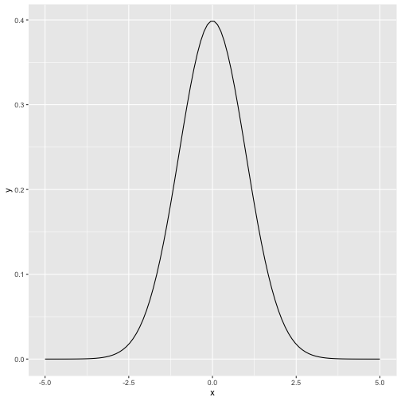
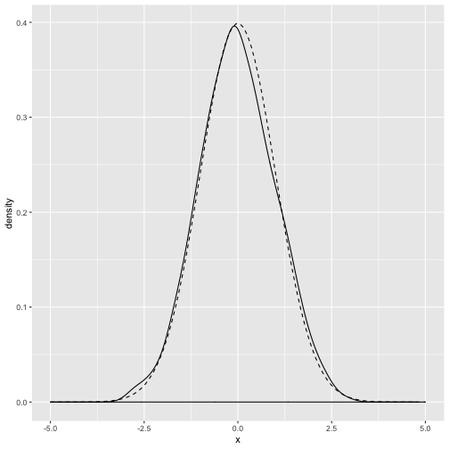
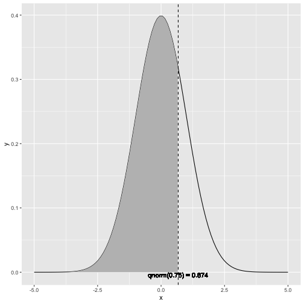
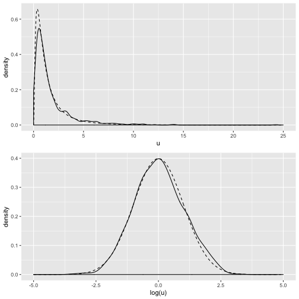
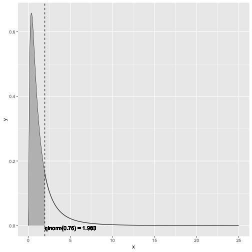
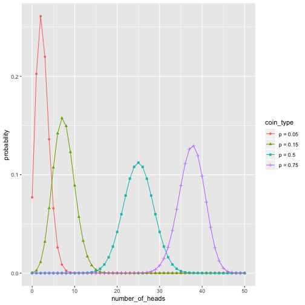
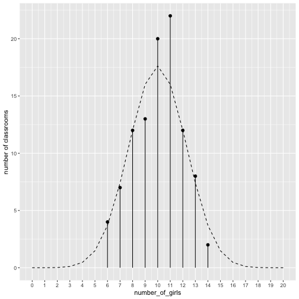
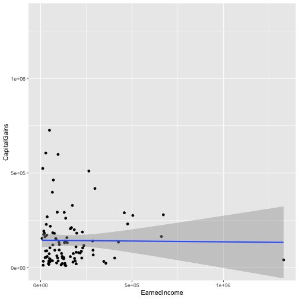
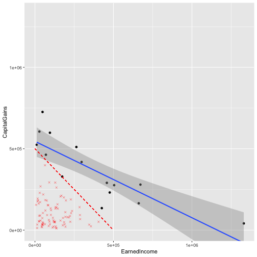

00397_example_B.1_of_section_B.1.1.R


```r
# example B.1 of section B.1.1 
# (example B.1 of section B.1.1)  : Important statistical concepts : Distributions : Normal distribution 
# Title: Plotting the theoretical normal density 

library(ggplot2)

x <- seq(from=-5, to=5, length.out=100) # the interval [-5 5]
f <- dnorm(x)                           # normal with mean 0 and sd 1
ggplot(data.frame(x=x,y=f), aes(x=x,y=y)) + geom_line()
```




00398_example_B.2_of_section_B.1.1.R


```r
# example B.2 of section B.1.1 
# (example B.2 of section B.1.1)  : Important statistical concepts : Distributions : Normal distribution 
# Title: Plotting an empirical normal density 

library(ggplot2)

# draw 1000 points from a normal with mean 0, sd 1
u <- rnorm(1000)

# plot the distribution of points,
# compared to normal curve as computed by dnorm() (dashed line)
ggplot(data.frame(x=u), aes(x=x)) + geom_density() +
   geom_line(data=data.frame(x=x,y=f), aes(x=x,y=y), linetype=2)
```




00399_example_B.3_of_section_B.1.1.R


```r
# example B.3 of section B.1.1 
# (example B.3 of section B.1.1)  : Important statistical concepts : Distributions : Normal distribution 
# Title: Working with the normal cdf 

# --- estimate probabilities (areas) under the curve ---

# 50% of the observations will be less than the mean
pnorm(0)
```

```
## [1] 0.5
```

```r
# [1] 0.5

# about 2.3% of all observations are more than 2 standard
# deviations below the mean
pnorm(-2)
```

```
## [1] 0.02275013
```

```r
# [1] 0.02275013

# about 95.4% of all observations are within 2 standard deviations
# from the mean
pnorm(2) - pnorm(-2)
```

```
## [1] 0.9544997
```

```r
# [1] 0.9544997
```


00400_example_B.4_of_section_B.1.1.R


```r
# example B.4 of section B.1.1 
# (example B.4 of section B.1.1)  : Important statistical concepts : Distributions : Normal distribution 
# Title: Plotting x < qnorm(0.75) 

# --- return the quantiles corresponding to specific probabilities ---

# the median (50th percentile) of a normal is also the mean
qnorm(0.5)
```

```
## [1] 0
```

```r
# [1] 0

# calculate the 75th percentile
qnorm(0.75)
```

```
## [1] 0.6744898
```

```r
# [1] 0.6744898
pnorm(0.6744898)
```

```
## [1] 0.75
```

```r
# [1] 0.75

# --- Illustrate the 75th percentile ---

# create a graph of the normal distribution with mean 0, sd 1
x <- seq(from=-5, to=5, length.out=100)
f <- dnorm(x)
nframe <- data.frame(x=x,y=f) 

# calculate the 75th percentile
line <- qnorm(0.75)
xstr <- sprintf("qnorm(0.75) = %1.3f", line)

# the part of the normal distribution to the left
# of the 75th percentile
nframe75 <- subset(nframe, nframe$x < line)

# Plot it. 
# The shaded area is 75% of the area under the normal curve
ggplot(nframe, aes(x=x,y=y)) + geom_line() +
  geom_area(data=nframe75, aes(x=x,y=y), fill="gray") + 
  geom_vline(aes(xintercept=line), linetype=2) +
  geom_text(x=line, y=0, label=xstr, vjust=1)
```




00401_example_B.5_of_section_B.1.3.R


```r
# example B.5 of section B.1.3 
# (example B.5 of section B.1.3)  : Important statistical concepts : Distributions : Lognormal distribution 
# Title: Demonstrating some properties of the lognormal distribution 

# draw 1001 samples from a lognormal with meanlog 0, sdlog 1
u <- rlnorm(1001)

# the mean of u is higher than the median
mean(u)
```

```
## [1] 1.580035
```

```r
# [1] 1.638628
median(u)
```

```
## [1] 0.9984654
```

```r
# [1] 1.001051

# the mean of log(u) is approx meanlog=0
mean(log(u))
```

```
## [1] -0.01634669
```

```r
# [1] -0.002942916

# the sd of log(u) is approx sdlog=1
sd(log(u))
```

```
## [1] 0.9729913
```

```r
# [1] 0.9820357

# generate the lognormal with meanlog = 0, sdlog = 1
x <- seq(from = 0, to = 25, length.out = 500)
f <- dlnorm(x)

# generate a normal with mean = 0, sd = 1
x2 <- seq(from = -5, to = 5, length.out = 500)
f2 <- dnorm(x2)

# make data frames
lnormframe <- data.frame(x = x, y = f)
normframe <- data.frame(x = x2, y = f2)
dframe <- data.frame(u=u)

# plot densityplots with theoretical curves superimposed
p1 <- ggplot(dframe, aes(x = u)) + geom_density() +
  geom_line(data = lnormframe, aes(x = x, y = y), linetype = 2)

p2 <- ggplot(dframe, aes(x = log(u))) + geom_density() +
  geom_line(data = normframe, aes(x = x,y = y), linetype = 2)

# functions to plot multiple plots on one page
library(grid)
nplot <- function(plist) {
  n <- length(plist)
  grid.newpage()
  pushViewport(viewport(layout=grid.layout(n, 1)))
  vplayout<-function(x,y) { viewport(layout.pos.row = x, layout.pos.col = y) }
  for(i in 1:n) {
    print(plist[[i]], vp = vplayout(i, 1))
  }
}

# this is the plot that leads this section.
nplot(list(p1, p2))
```




00402_example_B.6_of_section_B.1.3.R


```r
# example B.6 of section B.1.3 
# (example B.6 of section B.1.3)  : Important statistical concepts : Distributions : Lognormal distribution 
# Title: Plotting the lognormal distribution 

# the 50th percentile (or median) of the lognormal with
# meanlog=0 and sdlog=10
qlnorm(0.5)
```

```
## [1] 1
```

```r
# [1] 1
# the probability of seeing a value x less than 1
plnorm(1)
```

```
## [1] 0.5
```

```r
# [1] 0.5

# the probability of observing a value x less than 10:
plnorm(10)
```

```
## [1] 0.9893489
```

```r
# [1] 0.9893489

# -- show the 75th percentile of the lognormal 

# use lnormframe from previous example: the 
# theoretical lognormal curve

line <- qlnorm(0.75)
xstr <- sprintf("qlnorm(0.75) = %1.3f", line)

lnormframe75 <- subset(lnormframe, lnormframe$x < line)

# Plot it 
# The shaded area is 75% of the area under the lognormal curve
ggplot(lnormframe, aes(x = x, y = y)) + geom_line() +
  geom_area(data=lnormframe75, aes(x = x, y = y), fill = "gray") + 
  geom_vline(aes(xintercept = line), linetype = 2) +
  geom_text(x = line, y = 0, label = xstr, hjust = 0, vjust = 1)
```




00403_example_B.7_of_section_B.1.4.R


```r
# example B.7 of section B.1.4 
# (example B.7 of section B.1.4)  : Important statistical concepts : Distributions : Binomial distribution 
# Title: Plotting the binomial distribution 

library(ggplot2)
#
# use dbinom to produce the theoretical curves
#

numflips <- 50
# x is the number of heads that we see
x <- 0:numflips

# probability of heads for several different coins
p <- c(0.05, 0.15, 0.5, 0.75)
plabels <- paste("p =", p)

# calculate the probability of seeing x heads in numflips flips
# for all the coins. This probably isn't the most elegant
# way to do this, but at least it's easy to read

flips <- NULL
for(i in 1:length(p)) {
  coin <- p[i]
  label <- plabels[i]
  tmp <- data.frame(number_of_heads=x,
                    probability = dbinom(x, numflips, coin),
                    coin_type = label)
  flips <- rbind(flips, tmp)
}


# plot it
# this is the plot that leads this section
ggplot(flips, aes(x = number_of_heads, y = probability)) +
  geom_point(aes(color = coin_type, shape = coin_type)) +
  geom_line(aes(color = coin_type))
```




00404_example_B.8_of_section_B.1.4.R


```r
# example B.8 of section B.1.4 
# (example B.8 of section B.1.4)  : Important statistical concepts : Distributions : Binomial distribution 
# Title: Working with the theoretical binomial distribution 

p = 0.5 # the percentage of females in this student population
class_size <- 20 # size of a classroom
numclasses <- 100 # how many classrooms we observe

# what might a typical outcome look like?
numFemales <- rbinom(numclasses, class_size, p) 	# Note: 1 

# the theoretical counts (not necessarily integral)
probs <- dbinom(0:class_size, class_size, p)
tcount <- numclasses*probs

# the obvious way to plot this is with histogram or geom_bar
# but this might just look better

zero <- function(x) {0} # a dummy function that returns only 0

ggplot(data.frame(number_of_girls = numFemales, dummy = 1),
  aes(x = number_of_girls, y = dummy)) + 
  # count the number of times you see x heads
  stat_summary(fun.y = "sum", geom = "point", size=2) + 	# Note: 2 
  stat_summary(fun.ymax = "sum", fun.ymin = "zero", geom = "linerange") + 
  # superimpose the theoretical number of times you see x heads
  geom_line(data = data.frame(x = 0:class_size, y = tcount),
            aes(x = x, y = y), linetype = 2) +
  scale_x_continuous(breaks = 0:class_size, labels = 0:class_size) +
  scale_y_continuous("number of classrooms")
```



```r
# Note 1: 
#   Because we didn’t call set.seed, we 
#   expect different results each time we run this line. 

# Note 2: 
#   stat_summary is one of the ways to 
#   control data aggregation during plotting. In this case, we’re using it to 
#   place the dot and bar measured from the empirical data in with the 
#   theoretical density curve. 
```


00405_example_B.9_of_section_B.1.4.R


```r
# example B.9 of section B.1.4 
# (example B.9 of section B.1.4)  : Important statistical concepts : Distributions : Binomial distribution 
# Title: Simulating a binomial distribution 

# use rbinom to simulate flipping a coin of probability p N times

p75 <- 0.75 # a very unfair coin (mostly heads)
N <- 1000  # flip it several times
flips_v1 <- rbinom(N, 1, p75)

# Another way to generate unfair flips is to use runif:
# the probability that a uniform random number from [0 1)
# is less than p is exactly p. So "less than p" is "heads".
flips_v2 <- as.numeric(runif(N) < p75) 

prettyprint_flips <- function(flips) {
  outcome <- ifelse(flips==1, "heads", "tails")
  table(outcome)
}

prettyprint_flips(flips_v1)
```

```
## outcome
## heads tails 
##   737   263
```

```r
# outcome
# heads tails 
# 756   244 
prettyprint_flips(flips_v2)
```

```
## outcome
## heads tails 
##   754   246
```

```r
# outcome
# heads tails 
# 743   257
```


00406_example_B.10_of_section_B.1.4.R


```r
# example B.10 of section B.1.4 
# (example B.10 of section B.1.4)  : Important statistical concepts : Distributions : Binomial distribution 
# Title: Working with the binomial distribution 

# pbinom example

nflips <- 100
nheads <- c(25, 45, 50, 60)  # number of heads

# what are the probabilities of observing at most that 
# number of heads on a fair coin?
left.tail <- pbinom(nheads, nflips, 0.5)
sprintf("%2.2f", left.tail)
```

```
## [1] "0.00" "0.18" "0.54" "0.98"
```

```r
# [1] "0.00" "0.18" "0.54" "0.98"

# the probabilities of observing more than that
# number of heads on a fair coin?
right.tail <- pbinom(nheads, nflips, 0.5, lower.tail = FALSE)
sprintf("%2.2f", right.tail)
```

```
## [1] "1.00" "0.82" "0.46" "0.02"
```

```r
# [1] "1.00" "0.82" "0.46" "0.02"

# as expected:
left.tail+right.tail
```

```
## [1] 1 1 1 1
```

```r
#  [1] 1 1 1 1 

# so if you flip a fair coin 100 times,
# you are guaranteed to see more than 10 heads, 
# almost guaranteed to see fewer than 60, and
# probably more than 45.

# qbinom example

nflips <- 100

# what's the 95% "central" interval of heads that you
# would expect to observe on 100 flips of a fair coin?

left.edge <- qbinom(0.025, nflips, 0.5)
right.edge <- qbinom(0.025, nflips, 0.5, lower.tail = FALSE)
c(left.edge, right.edge)
```

```
## [1] 40 60
```

```r
# [1] 40 60

# so with 95% probability you should see between 40 and 60 heads
```


00407_example_B.11_of_section_B.1.4.R


```r
# example B.11 of section B.1.4 
# (example B.11 of section B.1.4)  : Important statistical concepts : Distributions : Binomial distribution 
# Title: Working with the binomial CDF 

# because this is a discrete probability distribution, 
# pbinom and qbinom are not exact inverses of each other

# this direction works
pbinom(45, nflips, 0.5)
```

```
## [1] 0.1841008
```

```r
# [1] 0.1841008
qbinom(0.1841008, nflips, 0.5)
```

```
## [1] 45
```

```r
# [1] 45

# this direction won't be exact
qbinom(0.75, nflips, 0.5)
```

```
## [1] 53
```

```r
# [1] 53
pbinom(53, nflips, 0.5)
```

```
## [1] 0.7579408
```

```r
# [1] 0.7579408
```


00409_example_B.12_of_section_B.2.2.R


```r
# example B.12 of section B.2.2 
# (example B.12 of section B.2.2)  : Important statistical concepts : Statistical theory : A/B tests 
# Title: Building simulated A/B test data 

set.seed(123515)
d <- rbind(                               	# Note: 1 
   data.frame(group = 'A', converted = rbinom(100000, size = 1, p = 0.05)),           	# Note: 2 
   data.frame(group = 'B', converted = rbinom(10000, size = 1, p = 0.055))            	# Note: 3 
)

# Note 1: 
#   Build a data frame to store simulated 
#   examples. 

# Note 2: 
#   Add 100,000 examples from the A group 
#   simulating a conversion rate of 5%. 

# Note 3: 
#   Add 10,000 examples from the B group 
#   simulating a conversion rate of 5.5%. 
```


00410_example_B.13_of_section_B.2.2.R


```r
# example B.13 of section B.2.2 
# (example B.13 of section B.2.2)  : Important statistical concepts : Statistical theory : A/B tests 
# Title: Summarizing the A/B test into a contingency table 

tab <- table(d)
print(tab)
```

```
##      converted
## group     0     1
##     A 94979  5021
##     B  9398   602
```

```r
##      converted
## group     0     1
##     A 94979  5021
##     B  9398   602
```


00411_example_B.14_of_section_B.2.2.R


```r
# example B.14 of section B.2.2 
# (example B.14 of section B.2.2)  : Important statistical concepts : Statistical theory : A/B tests 
# Title: Calculating the observed A and B rates 

aConversionRate <- tab['A','1']/sum(tab['A',])
print(aConversionRate)
```

```
## [1] 0.05021
```

```r
## [1] 0.05021

bConversionRate <- tab['B', '1'] / sum(tab['B', ])
print(bConversionRate)
```

```
## [1] 0.0602
```

```r
## [1] 0.0602

commonRate <- sum(tab[, '1']) / sum(tab)
print(commonRate)
```

```
## [1] 0.05111818
```

```r
## [1] 0.05111818
```


00412_example_B.15_of_section_B.2.2.R


```r
# example B.15 of section B.2.2 
# (example B.15 of section B.2.2)  : Important statistical concepts : Statistical theory : A/B tests 
# Title: Calculating the significance of the observed difference in rates 

fisher.test(tab)
```

```
## 
## 	Fisher's Exact Test for Count Data
## 
## data:  tab
## p-value = 2.469e-05
## alternative hypothesis: true odds ratio is not equal to 1
## 95 percent confidence interval:
##  1.108716 1.322464
## sample estimates:
## odds ratio 
##   1.211706
```

```r
## 	Fisher's Exact Test for Count Data
##
## data:  tab
## p-value = 2.469e-05
## alternative hypothesis: true odds ratio is not equal to 1
## 95 percent confidence interval:
##  1.108716 1.322464
## sample estimates:
## odds ratio 
##   1.211706
```


00413_example_B.16_of_section_B.2.2.R


```r
# example B.16 of section B.2.2 
# (example B.16 of section B.2.2)  : Important statistical concepts : Statistical theory : A/B tests 
# Title: Computing frequentist significance 

print(pbinom(                       	# Note: 1 
   lower.tail = FALSE,              	# Note: 2 
   q = tab['B', '1'] - 1,           	# Note: 3 
   size = sum(tab['B', ]),          	# Note: 4 
   prob = commonRate                	# Note: 5 
   )) 
```

```
## [1] 3.153319e-05
```

```r
## [1] 3.153319e-05

# Note 1: 
#   Use the pbinom() call to calculate how 
#   likely different observed counts are. 

# Note 2: 
#   Signal we want the probability of being 
#   greater than a given q. 

# Note 3: 
#   Ask for the probability of seeing at least as many conversions as our observed B groups 
#   did. We subtract one to make the comparison inclusive (greater or equal to tab['B', '1']). 

# Note 4: 
#   Specify the total number of trials as 
#   equal to what we saw in our B group. 

# Note 5: 
#   Specify the conversion probability at the 
#   estimated common rate. 
```


00414_informalexample_B.2_of_section_B.2.3.R


```r
# informalexample B.2 of section B.2.3 
# (informalexample B.2 of section B.2.3)  : Important statistical concepts : Statistical theory : Power of tests 

library(pwr)
pwr.p.test(h = ES.h(p1 = 0.045, p2 = 0.04), 
           sig.level = 0.05, 
           power = 0.8, 
           alternative = "greater")
```

```
## 
##      proportion power calculation for binomial distribution (arcsine transformation) 
## 
##               h = 0.02479642
##               n = 10055.18
##       sig.level = 0.05
##           power = 0.8
##     alternative = greater
```

```r
#     proportion power calculation for binomial distribution (arcsine transformation) 
#
#              h = 0.02479642
#              n = 10055.18
#      sig.level = 0.05
#          power = 0.8
#    alternative = greater
```


00415_example_B.17_of_section_B.2.4.R


```r
# example B.17 of section B.2.4 
# (example B.17 of section B.2.4)  : Important statistical concepts : Statistical theory : Specialized statistical tests 
# Title: Building synthetic uncorrelated income example 

set.seed(235236)                                         	# Note: 1 
d <- data.frame(EarnedIncome = 100000 * rlnorm(100),
                 CapitalGains = 100000 * rlnorm(100))    	# Note: 2 
print(with(d, cor(EarnedIncome, CapitalGains)))
```

```
## [1] -0.01066116
```

```r
# [1] -0.01066116                                        	# Note: 3

# Note 1: 
#   Set the pseudo-random seed to a known 
#   value so the demonstration is repeatable. 

# Note 2: 
#   Generate our synthetic data. 

# Note 3: 
#   The correlation is -0.01, which is very near 0—indicating (as designed) no relation. 
```


00416_example_B.18_of_section_B.2.4.R


```r
# example B.18 of section B.2.4 
# (example B.18 of section B.2.4)  : Important statistical concepts : Statistical theory : Specialized statistical tests 
# Title: Calculating the (non)significance of the observed correlation 

with(d, cor(EarnedIncome, CapitalGains, method = 'spearman'))
```

```
## [1] 0.03083108
```

```r
# [1] 0.03083108

(ctest <- with(d, cor.test(EarnedIncome, CapitalGains, method = 'spearman')))
```

```
## 
## 	Spearman's rank correlation rho
## 
## data:  EarnedIncome and CapitalGains
## S = 161512, p-value = 0.7604
## alternative hypothesis: true rho is not equal to 0
## sample estimates:
##        rho 
## 0.03083108
```

```r
#
#       Spearman's rank correlation rho
#
#data:  EarnedIncome and CapitalGains
#S = 161512, p-value = 0.7604
#alternative hypothesis: true rho is not equal to 0
#sample estimates:
#       rho
#0.03083108
```


00417_informalexample_B.3_of_section_B.2.4.R


```r
# informalexample B.3 of section B.2.4 
# (informalexample B.3 of section B.2.4)  : Important statistical concepts : Statistical theory : Specialized statistical tests 

sigr::wrapCorTest(ctest)
```

```
## [1] "Spearman's rank correlation rho: (r=0.03083, p=n.s.)."
```

```r
# [1] "Spearman's rank correlation rho: (r=0.03083, p=n.s.)."
```


00418_example_B.19_of_section_B.3.1.R


```r
# example B.19 of section B.3.1 
# (example B.19 of section B.3.1)  : Important statistical concepts : Examples of the statistical view of data : Sampling bias 
# Title: Misleading significance result from biased observations 

veryHighIncome <- subset(d, EarnedIncome+CapitalGains>=500000)
print(with(veryHighIncome,cor.test(EarnedIncome,CapitalGains,
    method='spearman')))
```

```
## 
## 	Spearman's rank correlation rho
## 
## data:  EarnedIncome and CapitalGains
## S = 1046, p-value < 2.2e-16
## alternative hypothesis: true rho is not equal to 0
## sample estimates:
##        rho 
## -0.8678571
```

```r
#
#       Spearman's rank correlation rho
#
#data:  EarnedIncome and CapitalGains
#S = 1046, p-value < 2.2e-16
#alternative hypothesis: true rho is not equal to 0
#sample estimates:
#       rho
#-0.8678571
```


00419_example_B.20_of_section_B.3.1.R


```r
# example B.20 of section B.3.1 
# (example B.20 of section B.3.1)  : Important statistical concepts : Examples of the statistical view of data : Sampling bias 
# Title: Plotting biased view of income and capital gains 

library(ggplot2)
ggplot(data=d,aes(x=EarnedIncome,y=CapitalGains)) +
   geom_point() + geom_smooth(method='lm') +
   coord_cartesian(xlim=c(0,max(d)),ylim=c(0,max(d)))                   	# Note: 1 
```



```r
ggplot(data=veryHighIncome,aes(x=EarnedIncome,y=CapitalGains)) +
   geom_point() + geom_smooth(method='lm') +
   geom_point(data=subset(d,EarnedIncome+CapitalGains<500000),
         aes(x=EarnedIncome,y=CapitalGains),
      shape=4,alpha=0.5,color='red') +
   geom_segment(x=0,xend=500000,y=500000,yend=0,
      linetype=2,alpha=0.5,color='red') +
   coord_cartesian(xlim=c(0,max(d)),ylim=c(0,max(d)))                   	# Note: 2 
```



```r
print(with(subset(d,EarnedIncome+CapitalGains<500000),
    cor.test(EarnedIncome,CapitalGains,method='spearman')))              	# Note: 3 
```

```
## 
## 	Spearman's rank correlation rho
## 
## data:  EarnedIncome and CapitalGains
## S = 107664, p-value = 0.6357
## alternative hypothesis: true rho is not equal to 0
## sample estimates:
##         rho 
## -0.05202267
```

```r
#
#        Spearman's rank correlation rho
#
#data:  EarnedIncome and CapitalGains
#S = 107664, p-value = 0.6357
#alternative hypothesis: true rho is not equal to 0
#sample estimates:
#        rho
#-0.05202267

# Note 1: 
#   Plot all of the income data with linear 
#   trend line (and uncertainty band). 

# Note 2: 
#   Plot the very high income data and linear 
#   trend line (also include cut-off and portrayal of suppressed data). 

# Note 3: 
#   Compute correlation of suppressed 
#   data. 
```


00420_example_B.21_of_section_B.3.2.R


```r
# example B.21 of section B.3.2 
# (example B.21 of section B.3.2)  : Important statistical concepts : Examples of the statistical view of data : Omitted variable bias 
# Title: Summarizing our synthetic biological data 

load('../bioavailability/synth.RData')
print(summary(s))
```

```
##       week         Caco2A2BPapp       FractionHumanAbsorption
##  Min.   :  1.00   Min.   :6.994e-08   Min.   :0.09347        
##  1st Qu.: 25.75   1st Qu.:7.312e-07   1st Qu.:0.50343        
##  Median : 50.50   Median :1.378e-05   Median :0.86937        
##  Mean   : 50.50   Mean   :2.006e-05   Mean   :0.71492        
##  3rd Qu.: 75.25   3rd Qu.:4.238e-05   3rd Qu.:0.93908        
##  Max.   :100.00   Max.   :6.062e-05   Max.   :0.99170
```

```r
##       week         Caco2A2BPapp       FractionHumanAbsorption
##  Min.   :  1.00   Min.   :6.994e-08   Min.   :0.09347        
##  1st Qu.: 25.75   1st Qu.:7.312e-07   1st Qu.:0.50343        
##  Median : 50.50   Median :1.378e-05   Median :0.86937        
##  Mean   : 50.50   Mean   :2.006e-05   Mean   :0.71492        
##  3rd Qu.: 75.25   3rd Qu.:4.238e-05   3rd Qu.:0.93908        
##  Max.   :100.00   Max.   :6.062e-05   Max.   :0.99170
head(s)
```

```
##   week Caco2A2BPapp FractionHumanAbsorption
## 1    1 6.061924e-05              0.11568186
## 2    2 6.061924e-05              0.11732401
## 3    3 6.061924e-05              0.09347046
## 4    4 6.061924e-05              0.12893540
## 5    5 5.461941e-05              0.19021858
## 6    6 5.370623e-05              0.14892154
```

```r
##   week Caco2A2BPapp FractionHumanAbsorption
## 1    1 6.061924e-05              0.11568186
## 2    2 6.061924e-05              0.11732401
## 3    3 6.061924e-05              0.09347046
## 4    4 6.061924e-05              0.12893540
## 5    5 5.461941e-05              0.19021858
## 6    6 5.370623e-05              0.14892154
# View(s) 	# Note: 1

# Note 1: 
#   Display a date in spreadsheet like 
#   window. View is one of the commands that has a much better implementation in 
#   RStudio than in basic R. 
```


00421_example_B.22_of_section_B.3.2.R


```r
# example B.22 of section B.3.2 
# (example B.22 of section B.3.2)  : Important statistical concepts : Examples of the statistical view of data : Omitted variable bias 
# Title: Building data that improves over time 

set.seed(2535251)
s <- data.frame(week = 1:100)
s$Caco2A2BPapp <- sort(sample(d$Caco2A2BPapp,100,replace=T),
   decreasing=T)
sigmoid <- function(x) {1/(1 + exp(-x))}
s$FractionHumanAbsorption <-                      	# Note: 1 
 sigmoid(
   7.5 + 0.5 * log(s$Caco2A2BPapp) +              	# Note: 2 
   s$week / 10 - mean(s$week / 10) +              	# Note: 3 
   rnorm(100) / 3                                 	# Note: 4 
   )
write.table(s, 'synth.csv', sep=',',
   quote = FALSE, row.names = FALSE)

# Note 1: 
#   Build synthetic examples. 

# Note 2: 
#   Add in Caco2 to absorption relation learned from original dataset. Note the relation is 
#   positive: better Caco2 always drives better absorption in our 
#   synthetic dataset. We’re log transforming Caco2, as it has over 3 
#   decades of range. 

# Note 3: 
#   Add in a mean-0 term that depends on time to simulate the effects of improvements as the 
#   project moves forward. 

# Note 4: 
#   Add in a mean-0 noise term. 
```


00422_example_B.23_of_section_B.3.2.R


```r
# example B.23 of section B.3.2 
# (example B.23 of section B.3.2)  : Important statistical concepts : Examples of the statistical view of data : Omitted variable bias 
# Title: A bad model (due to omitted variable bias) 

print(summary(glm(data = s,
   FractionHumanAbsorption ~ log(Caco2A2BPapp),
   family = binomial(link = 'logit'))))
```

```
## Warning in eval(family$initialize): non-integer #successes in a binomial
## glm!
```

```
## 
## Call:
## glm(formula = FractionHumanAbsorption ~ log(Caco2A2BPapp), family = binomial(link = "logit"), 
##     data = s)
## 
## Deviance Residuals: 
##      Min        1Q    Median        3Q       Max  
## -0.74715  -0.31727  -0.08233   0.18796   0.55508  
## 
## Coefficients:
##                   Estimate Std. Error z value Pr(>|z|)    
## (Intercept)       -12.1943     3.7474  -3.254 0.001137 ** 
## log(Caco2A2BPapp)  -1.2003     0.3584  -3.349 0.000811 ***
## ---
## Signif. codes:  0 '***' 0.001 '**' 0.01 '*' 0.05 '.' 0.1 ' ' 1
## 
## (Dispersion parameter for binomial family taken to be 1)
## 
##     Null deviance: 44.724  on 99  degrees of freedom
## Residual deviance: 10.992  on 98  degrees of freedom
## AIC: 63.696
## 
## Number of Fisher Scoring iterations: 7
```

```r
## Warning: non-integer #successes in a binomial glm!
## 
## Call:
## glm(formula = FractionHumanAbsorption ~ log(Caco2A2BPapp), 
##    family = binomial(link = "logit"), 
##     data = s)
## 
## Deviance Residuals: 
##    Min      1Q  Median      3Q     Max  
## -0.609  -0.246  -0.118   0.202   0.557  
## 
## Coefficients:
##                   Estimate Std. Error z value Pr(>|z|)    
## (Intercept)        -10.003      2.752   -3.64  0.00028 ***
## log(Caco2A2BPapp)   -0.969      0.257   -3.77  0.00016 ***
## ---
## Signif. codes:  0 '***' 0.001 '**' 0.01 '*' 0.05 '.' 0.1 ' ' 1
## 
## (Dispersion parameter for binomial family taken to be 1)
## 
##     Null deviance: 43.7821  on 99  degrees of freedom
## Residual deviance:  9.4621  on 98  degrees of freedom
## AIC: 64.7
## 
## Number of Fisher Scoring iterations: 6
```


00423_example_B.24_of_section_B.3.2.R


```r
# example B.24 of section B.3.2 
# (example B.24 of section B.3.2)  : Important statistical concepts : Examples of the statistical view of data : Omitted variable bias 
# Title: A better model 

print(summary(glm(data=s,
   FractionHumanAbsorption~week+log(Caco2A2BPapp),
   family=binomial(link='logit'))))
```

```
## Warning in eval(family$initialize): non-integer #successes in a binomial
## glm!
```

```
## 
## Call:
## glm(formula = FractionHumanAbsorption ~ week + log(Caco2A2BPapp), 
##     family = binomial(link = "logit"), data = s)
## 
## Deviance Residuals: 
##       Min         1Q     Median         3Q        Max  
## -0.301846  -0.045904   0.001117   0.068913   0.210135  
## 
## Coefficients:
##                   Estimate Std. Error z value Pr(>|z|)   
## (Intercept)        2.09969    4.23979   0.495  0.62043   
## week               0.09474    0.03172   2.987  0.00282 **
## log(Caco2A2BPapp)  0.44930    0.48425   0.928  0.35350   
## ---
## Signif. codes:  0 '***' 0.001 '**' 0.01 '*' 0.05 '.' 0.1 ' ' 1
## 
## (Dispersion parameter for binomial family taken to be 1)
## 
##     Null deviance: 44.7243  on 99  degrees of freedom
## Residual deviance:  1.0652  on 97  degrees of freedom
## AIC: 46.18
## 
## Number of Fisher Scoring iterations: 6
```

```r
## Warning: non-integer #successes in a binomial glm!
## 
## Call:
## glm(formula = FractionHumanAbsorption ~ week + log(Caco2A2BPapp), 
##     family = binomial(link = "logit"), data = s)
## 
## Deviance Residuals: 
##     Min       1Q   Median       3Q      Max  
## -0.3474  -0.0568  -0.0010   0.0709   0.3038  
## 
## Coefficients:
##                   Estimate Std. Error z value Pr(>|z|)   
## (Intercept)         3.1413     4.6837    0.67   0.5024   
## week                0.1033     0.0386    2.68   0.0074 **
## log(Caco2A2BPapp)   0.5689     0.5419    1.05   0.2938   
## ---
## Signif. codes:  0 '***' 0.001 '**' 0.01 '*' 0.05 '.' 0.1 ' ' 1
## 
## (Dispersion parameter for binomial family taken to be 1)
## 
##     Null deviance: 43.7821  on 99  degrees of freedom
## Residual deviance:  1.2595  on 97  degrees of freedom
## AIC: 47.82
## 
## Number of Fisher Scoring iterations: 6
```


