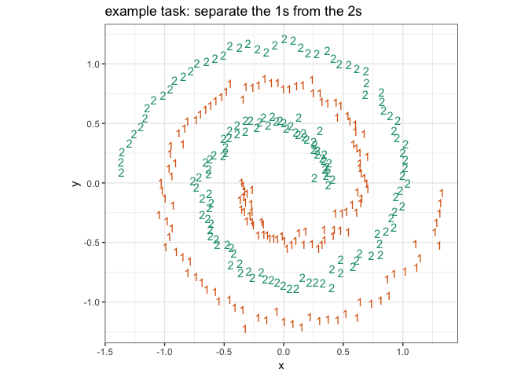
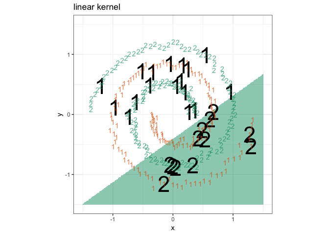
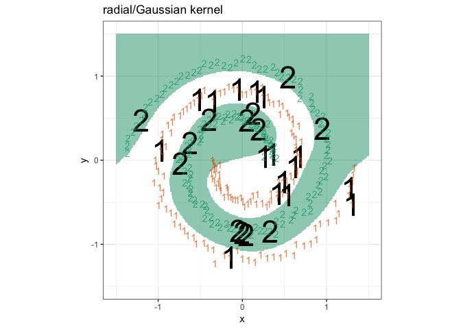
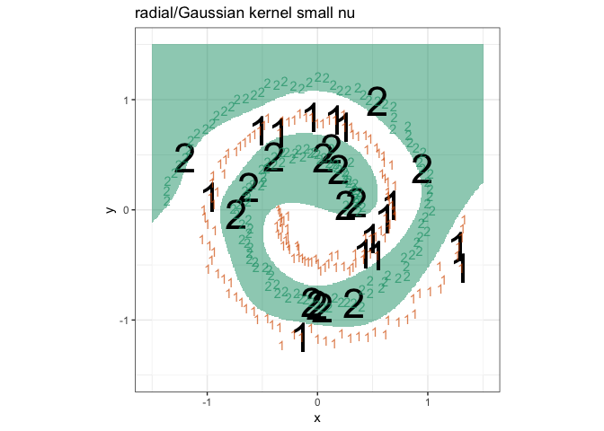
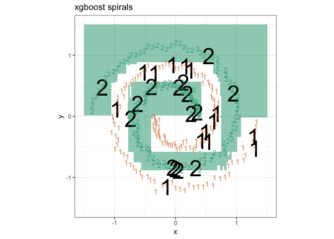

ch10 SVM
================

Spirals example as from:

> K. J. Lang and M. J. Witbrock, “Learning to tell two spirals apart.” In Proceedings of the 1988 Connectionist Models Summer School, D. Touretzky, G. Hinton, and T. Sejnowski (eds), Morgan Kaufmann, 1988 (pp. 52-59).

Solutions as worked in Chapter 10 of [*Practical Data Science with R* 2nd Edition, Zumel, Mount; Manning 2019](http://www.practicaldatascience.com).

00433\_example\_10.22\_of\_section\_10.3.1.R

``` r
# example 10.22 of section 10.3.1 
# (example 10.22 of section 10.3.1)  : Exploring advanced methods : Solving "Inseparable" Problems Using Support Vector Machines : Using SVM to solve a problem 
# Title: Setting up the spirals data as an example classification problem 

library('kernlab')
data('spirals')     # Note: 1 
sc <- specc(spirals, centers = 2)   # Note: 2 
s <- data.frame(x=spirals[,1],y=spirals[,2],
   class=as.factor(sc))     # Note: 3 

library('ggplot2')
```

    ## Warning: package 'ggplot2' was built under R version 3.5.2

    ## 
    ## Attaching package: 'ggplot2'

    ## The following object is masked from 'package:kernlab':
    ## 
    ##     alpha

``` r
ggplot(data=s) +
  geom_text(aes(x = x, y = y,
                label = class, color = class)) +
  scale_color_manual(values = c("#d95f02", "#1b9e77")) +
  coord_fixed() + 
  theme_bw() + 
  theme(legend.position  ='none') +
  ggtitle("example task: separate the 1s from the 2s")
```



``` r
# Note 1: 
#   Load the kernlab kernel and support vector 
#   machine package and then ask that the included example "spirals" be made 
#   available. 

# Note 2: 
#   Use kernlab’s spectral clustering routine 
#   to identify the two different spirals in the example dataset. 

# Note 3: 
#   Combine the spiral coordinates and the 
#   spiral label into a data frame. 

# Note 4: 
#   Plot the spirals with class labels. 
```

00434\_example\_10.23\_of\_section\_10.3.1.R

``` r
# example 10.23 of section 10.3.1 
# (example 10.23 of section 10.3.1)  : Exploring advanced methods : Solving "Inseparable" Problems Using Support Vector Machines : Using SVM to solve a problem 
# Title: SVM with a poor choice of kernel 

set.seed(2335246L)
s$group <- sample.int(100, size = dim(s)[[1]], replace = TRUE)
sTrain <- subset(s, group > 10)
sTest <- subset(s,group <= 10)  # Note: 1 

library('e1071')
```

    ## Warning: package 'e1071' was built under R version 3.5.2

``` r
mSVMV <- svm(class~x+y,data=sTrain,kernel='linear',type='nu-classification')    # Note: 2 
sTest$predSVMV <- predict(mSVMV,newdata=sTest,type='response')  # Note: 3 

shading <- expand.grid(
  x = seq(-1.5, 1.5, by = 0.01),
  y = seq(-1.5, 1.5, by = 0.01))
shading$predSVMV <- predict(mSVMV, newdata = shading, type = 'response')

ggplot(mapping = aes(x = x, y = y)) +
  geom_tile(data = shading, aes(fill = predSVMV),
            show.legend = FALSE, alpha = 0.5) +
  scale_color_manual(values = c("#d95f02", "#1b9e77")) +
  scale_fill_manual(values = c("white", "#1b9e77")) +
  geom_text(data = sTest, aes(label = predSVMV), 
            size=12) +
  geom_text(data = s,aes(label = class, color = class),
            alpha=0.7) +
  coord_fixed() + 
  theme_bw() + 
  theme(legend.position='none') +
  ggtitle("linear kernel")
```



``` r
# Note 1: 
#   Prepare to try to learn spiral class label 
#   from coordinates using a support vector machine. 

# Note 2: 
#   Build the support vector model using a 
#   vanilladot kernel (not a very good kernel). 

# Note 3: 
#   Use the model to predict class on held-out 
#   data. 

# Note 4: 
#   Plot the predictions on top of a grey copy 
#   of all the data so we can see if predictions agree with the original 
#   markings. 
```

00435\_example\_10.24\_of\_section\_10.3.1.R

``` r
# example 10.24 of section 10.3.1 
# (example 10.24 of section 10.3.1)  : Exploring advanced methods : Solving "Inseparable" Problems Using Support Vector Machines : Using SVM to solve a problem 
# Title: SVM with a good choice of kernel 

mSVMG <- svm(class~x+y,data=sTrain,kernel='radial',type='nu-classification')    # Note: 1 
sTest$predSVMG <- predict(mSVMG,newdata=sTest,type='response')

shading <- expand.grid(
  x = seq(-1.5, 1.5, by = 0.01),
  y = seq(-1.5, 1.5, by = 0.01))
shading$predSVMG <- predict(mSVMG, newdata = shading, type = 'response')

ggplot(mapping = aes(x = x, y = y)) +
  geom_tile(data = shading, aes(fill = predSVMG),
            show.legend = FALSE, alpha = 0.5) +
  scale_color_manual(values = c("#d95f02", "#1b9e77")) +
  scale_fill_manual(values = c("white", "#1b9e77")) +
  geom_text(data = sTest, aes(label = predSVMG), 
            size=12) +
  geom_text(data = s,aes(label = class, color = class),
            alpha=0.7) +
  coord_fixed() + 
  theme_bw() + 
  theme(legend.position='none') +
  ggtitle("radial/Gaussian kernel")
```



``` r
# Note 1: 
#   This time use the "radial" or 
#   Gaussian kernel, which is a nice geometric similarity measure. 
```

``` r
mSVMG <- svm(class~x+y,data=sTrain,kernel='radial',type='nu-classification',
                          nu = 0.05) 

sTest$predSVMG <- predict(mSVMG,newdata=sTest,type='response')

shading <- expand.grid(
  x = seq(-1.5, 1.5, by = 0.01),
  y = seq(-1.5, 1.5, by = 0.01))
shading$predSVMG <- predict(mSVMG, newdata = shading, type = 'response')

ggplot(mapping = aes(x = x, y = y)) +
  geom_tile(data = shading, aes(fill = predSVMG),
            show.legend = FALSE, alpha = 0.5) +
  scale_color_manual(values = c("#d95f02", "#1b9e77")) +
  scale_fill_manual(values = c("white", "#1b9e77")) +
  geom_text(data = sTest, aes(label = predSVMG), 
            size=12) +
  geom_text(data = s,aes(label = class, color = class),
            alpha=0.7) +
  coord_fixed() + 
  theme_bw() + 
  theme(legend.position='none') +
  ggtitle("radial/Gaussian kernel small nu")
```



``` r
mSVMG <- svm(class~x+y,data=sTrain,kernel='radial',type='nu-classification',
                          nu = 0.8)

sTest$predSVMG <- predict(mSVMG,newdata=sTest,type='response')

shading <- expand.grid(
  x = seq(-1.5, 1.5, by = 0.01),
  y = seq(-1.5, 1.5, by = 0.01))
shading$predSVMG <- predict(mSVMG, newdata = shading, type = 'response')

ggplot(mapping = aes(x = x, y = y)) +
  geom_tile(data = shading, aes(fill = predSVMG),
            show.legend = FALSE, alpha = 0.5) +
  scale_color_manual(values = c("#d95f02", "#1b9e77")) +
  scale_fill_manual(values = c("white", "#1b9e77")) +
  geom_text(data = sTest, aes(label = predSVMG), 
            size=12) +
  geom_text(data = s,aes(label = class, color = class),
            alpha=0.7) +
  coord_fixed() + 
  theme_bw() + 
  theme(legend.position='none') +
  ggtitle("radial/Gaussian kernel large nu")
```


`xgboost` attempt.

Worked version of exercise from Chapter 10 of [*Practical Data Science with R* 2nd Edition, Zumel, Mount; Manning 2019](http://www.practicaldatascience.com).

``` r
library("xgboost")
```

    ## Warning: package 'xgboost' was built under R version 3.5.2

``` r
sTrain$xg_class <- ifelse(sTrain$class=="2", TRUE, FALSE)
mxgb <- xgboost(as.matrix(sTrain[, c("x", "y")]), 
                label = sTrain$xg_class,
                params=list(
                  objective="binary:logistic"
                ),
                nrounds = 100,
                verbose = FALSE)
sTest$predxgb <- predict(mxgb, newdata = as.matrix(sTest[, c("x", "y")]))
sTest$predxgb <- ifelse(sTest$predxgb>0.5, "2", "1")

shading <- expand.grid(
  x = seq(-1.5, 1.5, by = 0.01),
  y = seq(-1.5, 1.5, by = 0.01))
shading$predxgb <- predict(mxgb, newdata = as.matrix(shading))
shading$predxgb <- shading$predxgb > 0.5

ggplot(mapping = aes(x = x, y = y)) +
  geom_tile(data = shading, aes(fill = predxgb),
            show.legend = FALSE, alpha = 0.5) +
  scale_color_manual(values = c("#d95f02", "#1b9e77")) +
  scale_fill_manual(values = c("white", "#1b9e77")) +
  geom_text(data = sTest, aes(label = predxgb), 
            size=12) +
  geom_text(data = s,aes(label = class, color = class),
            alpha=0.7) +
  coord_fixed() + 
  theme_bw() + 
  theme(legend.position='none') +
  ggtitle("xgboost spirals")
```


