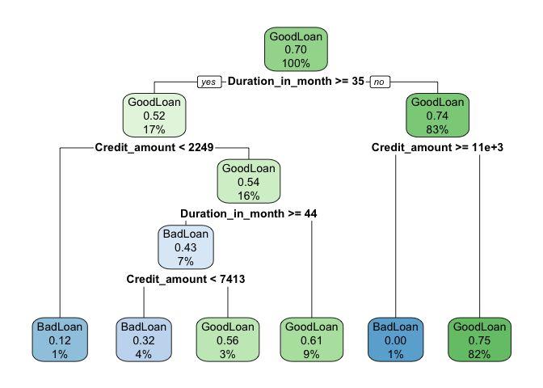

Chapter\_1\_Example
================

``` r
library("rpart")

load("GCDData.RData")

model <- rpart(Good_Loan ~ 
                 Duration_in_month +
                 Installment_rate_in_percentage_of_disposable_income +
                 Credit_amount +
                 Other_installment_plans,
               data = d,
               control = rpart.control(maxdept = 4),
               method = "class")
```

``` r
library("rpart.plot")

print(model)
```

    ## n= 1000 
    ## 
    ## node), split, n, loss, yval, (yprob)
    ##       * denotes terminal node
    ## 
    ##  1) root 1000 300 GoodLoan (0.3000000 0.7000000)  
    ##    2) Duration_in_month>=34.5 170  82 GoodLoan (0.4823529 0.5176471)  
    ##      4) Credit_amount< 2249 8   1 BadLoan (0.8750000 0.1250000) *
    ##      5) Credit_amount>=2249 162  75 GoodLoan (0.4629630 0.5370370)  
    ##       10) Duration_in_month>=43.5 69  30 BadLoan (0.5652174 0.4347826)  
    ##         20) Credit_amount< 7413 37  12 BadLoan (0.6756757 0.3243243) *
    ##         21) Credit_amount>=7413 32  14 GoodLoan (0.4375000 0.5625000) *
    ##       11) Duration_in_month< 43.5 93  36 GoodLoan (0.3870968 0.6129032) *
    ##    3) Duration_in_month< 34.5 830 218 GoodLoan (0.2626506 0.7373494)  
    ##      6) Credit_amount>=10975.5 9   0 BadLoan (1.0000000 0.0000000) *
    ##      7) Credit_amount< 10975.5 821 209 GoodLoan (0.2545676 0.7454324) *

``` r
rpart.plot(model)
```



``` r
d$Loan.status <- d$Good_Loan
```

``` r
# example 1.1 of section 1.2.4 
# (example 1.1 of section 1.2.4)  : The data science process : Stages of a data science project : Model evaluation and critique 
# Title: Calculating the confusion matrix 

conf_mat <- table(actual = d$Loan.status, pred = predict(model, type = 'class'))    # Note: 1 
conf_mat
```

    ##           pred
    ## actual     BadLoan GoodLoan
    ##   BadLoan       41      259
    ##   GoodLoan      13      687

``` r
(accuracy <- sum(diag(conf_mat)) / sum(conf_mat))       # Note: 2 
```

    ## [1] 0.728

``` r
(precision <- conf_mat["BadLoan", "BadLoan"] / sum(conf_mat[, "BadLoan"]))  # Note: 3 
```

    ## [1] 0.7592593

``` r
(recall <- conf_mat["BadLoan", "BadLoan"] / sum(conf_mat["BadLoan", ]))     # Note: 4 
```

    ## [1] 0.1366667

``` r
(fpr <- conf_mat["GoodLoan","BadLoan"] / sum(conf_mat["GoodLoan", ]))   # Note: 5 
```

    ## [1] 0.01857143

``` r
# Note 1: 
#   Create the confusion matrix. 

# Note 2: 
#   accuracy 
#   confusion matrix 
#   Overall model accuracy: 73% of the 
#   predictions were correct. 

# Note 3: 
#   precision 
#   confusion matrix 
#   Model precision: 76% of the 
#   applicants predicted as bad really did 
#   default. 

# Note 4: 
#   recall 
#   confusion matrix 
#   Model recall: the model found 14% of 
#   the defaulting loans. 

# Note 5: 
#   false positive rate 
#   confusion matrix 
#   False positive rate: 2% of the good 
#   applicants were mistakenly identified as 
#   bad. 
```
